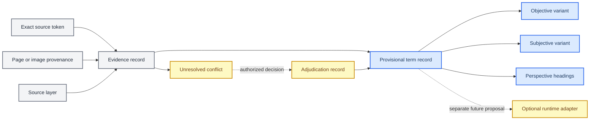

# Provisional T0–T9 term specification

_Version 0.1 — terminology, provenance, validation, and future registry contract; authored by Manus AI on 2026-09-19._

---

## Status and scope

This document consolidates the provisional `T0`–`T9` schemes found in _Sys 5 - Dan Explorations - v7_ into one reviewable technical contract. Its immediate purpose is to make the terminology machine-representable without claiming that the source defines executable behavior.[1]

> **Specification status:** Draft. This document standardizes registry identifiers, source variants, provenance, confidence, and conflict handling. It does **not** standardize cognitive, biological, organizational, mathematical, or runtime behavior.

The key words **MUST**, **MUST NOT**, **SHOULD**, **SHOULD NOT**, and **MAY** describe requirements for a future terminology registry. They do not convert the historical source claims into facts or application behavior.

### Objective

The specification gives maintainers and researchers a stable way to record ten provisional term families while preserving the source's uncertainty. A conforming registry can answer four questions without silently reconciling the corpus:

1. Which provisional family does a record discuss?
2. Which exact source token, mode label, perspective heading, page, and source layer support the record?
3. Which mappings conflict or remain unresolved?
4. Has an authorized adjudication explicitly changed the record's status?

### Assumptions

This version proceeds with the following explicit assumptions:

- The deliverable is a **terminology and provenance registry specification**, not a behavioral System 5 model.
- `T0` through `T9` are stable registry keys. Their names remain provisional.
- Objective/subjective and passive/active are independent source dimensions whose semantics are undefined.
- Numbered tokens such as `T01` and compounds such as `T1-2` are evidence-bearing source labels, not automatically normalized identifiers.
- The current JavaScript model remains authoritative for executable topology and flow behavior. No term in this document maps automatically to an Rn, Pk, service, vertex, face, cell, or cycle phase.[2]
- No new API, user interface, persistence layer, dependency, or runtime behavior is approved by this specification.

### Non-goals

This specification does not resolve the source's cosmological, neurological, perceptual, organizational, or spiritual claims. It does not decode the parenthesis strings, number sequences, glyphs, or uncaptioned diagrams. It does not choose among incompatible `T01`–`T20` descriptions. It also does not merge the T-9 hierarchy, the T1-1/T1-2/T1-3 documents, or the current pentachoron into one model.[2] [3] [4] [5] [6]

## Model and terminology

### Separate dimensions

A registry record MUST keep the following dimensions separate:

| Dimension | Required representation | Prohibited inference |
| --- | --- | --- |
| Registry family | One of `T0` through `T9` | A family ID does not define behavior |
| Source mode | `objective`, `subjective`, or `unresolved` | O/S does not imply viewpoint, direction, state, or access control |
| Perspective heading | `passive`, `active`, or `unresolved` | Passive/active does not imply a transition, inverse, command, or lifecycle state |
| Exact source token | Verbatim token such as `T2O`, `T02`, or `T1-2` | Zero-padding and hyphens MUST NOT be normalized away |
| Source layer | Inventory, crosswalk, atlas, interpretive prose, contextual lineage, or correspondence | A later layer does not silently supersede an earlier layer |
| Provenance | Source file, printed page, extraction heading, and image reference when applicable | Visual proximity does not prove a relationship |
| Confidence | `low`, `medium`, or `high` for the lexical mapping | Confidence does not authorize behavior |
| Conflict status | `none`, `unresolved`, or `adjudicated` | An unresolved collision MUST NOT produce a canonical alias |



### Naming rules

Registry keys MUST use exactly `T0`, `T1`, `T2`, `T3`, `T4`, `T5`, `T6`, `T7`, `T8`, and `T9`, in numeric order. Cross-module identifiers SHOULD use a namespace such as `sys5-term:T1` because the current pentachoron already uses `T1` through `T4` as short cell labels with unrelated meanings.[2]

The form `TnO` or `TnS` MAY be recorded only where the source explicitly supplies it. A zero-padded token is distinct from its unpadded appearance: `T09` is not `T9`, `T08` is not `T8`, and `T06` is not `T6`. A hyphenated token is atomic: `T1-2` MUST NOT be parsed as a relation between `T1` and `T2` unless a later approved specification defines such a grammar.

The source guide uses _alias_ informally for variants that need indexing.[1] This specification uses **cross-reference** for those index entries because an alias would imply interchangeability. A cross-reference records an explicit source association without declaring identity.

### Consolidated registry

| ID | Provisional name | Objective evidence | Subjective evidence | Confidence |
| --- | --- | --- | --- | --- |
| `T0` | Unknown | `T0O`; no numbered or compound cross-reference accepted | `T0S`; no numbered or compound cross-reference accepted | Low |
| `T1` | Need Perception | `T1O`, `T12`, `T1-1` | `T1S`, `T01` or conflicting `T02`, `T0-1` | Medium |
| `T2` | Idea Creation | `T2O`, `T13`, `T2-1` | `T2S`, `T02`, `T1-2` | Medium |
| `T3` | Idea Transfer | `T3O`, `T14`, `T3-1` | `T3S`, `T03`, `T1-3` | Medium |
| `T4` | Organized Input | `T4O`, `T15`, `T4-1` | `T4S`, `T04`, `T1-4` | Medium |
| `T5` | Physical Action | `T5O`, `T16`, `T5-1` | `T5S`, `T06`, `T1-5` | Medium |
| `T6` | Corporeal Body | `T6O`, `T17`, `T6-1` | `T6S`, `T08`, `T1-6` | Medium |
| `T7` | Quantized Memory | `T7O`, `T18`, `T7-1` | `T7S`, `T09`, `T1-7` | Medium |
| `T8` | Balanced Response | `T8O`, `T19`, `T8-1` | `T8S`, `T10`, `T1-8` | Medium |
| `T9` | Universal Discretion | `T9O`, `T20`, `T9-1` | `T9S`, `T11`, `T1-9` | Medium |

Every row is a lexical consolidation of provisional source evidence. None defines inputs, outputs, invariants, transitions, effects, or runtime semantics.[1]

### Normative evidence matrix

Every mapping in the consolidated registry is backed by the following evidence records. The source column identifies the guided corpus; the page numbers refer to its printed-page headings. Quoted text is normalized only for surrounding whitespace.[1]

| Evidence ID | Family | Exact source tokens | Source | Page and layer | Source statement | Conflict |
| --- | --- | --- | --- | --- | --- | --- |
| `E-T0-O` | `T0` | `T0O` | [Corpus][1] | p. 5, O/S crosswalk | `T0O – Unknown – Objective Mode` | `C-002`, `C-003` |
| `E-T0-S` | `T0` | `T0S` | [Corpus][1] | p. 5, O/S crosswalk | `T0S – Unknown – Subjective Mode` | `C-002`, `C-003` |
| `E-T1-O` | `T1` | `T1O`, `T12`, `T1-1` | [Corpus][1] | pp. 2, 5, 17; inventory and passive crosswalk | `T12 – 1O – Need Perception`; `T1-1: T1O – Need Perception` | `C-003`, `C-005` |
| `E-T1-S` | `T1` | `T1S`, `T01`, `T02`, `T0-1` | [Corpus][1] | pp. 2, 5, 17; inventory and passive crosswalk | `T02 – 1S – Need Perception`; `T01 ... T1S`; `T0-1: T1S` | `C-001`, `C-003`, `C-006` |
| `E-T2-O` | `T2` | `T2O`, `T13`, `T2-1` | [Corpus][1] | pp. 2, 5, 17; inventory and passive crosswalk | `T13 – 2O – Idea Creation`; `T2-1: T2O` | `C-003`, `C-004`, `C-005` |
| `E-T2-S` | `T2` | `T2S`, `T02`, `T1-2` | [Corpus][1] | pp. 2, 5, 17; inventory and passive crosswalk | `T02 – 2S – Idea Creation`; `T1-2: T2S` | `C-001`, `C-003`, `C-004`, `C-006` |
| `E-T3-O` | `T3` | `T3O`, `T14`, `T3-1` | [Corpus][1] | pp. 2, 5, 17; inventory and passive crosswalk | `T14 – 3O – Idea Transfer`; `T3-1: T3O` | `C-003`, `C-004`, `C-005` |
| `E-T3-S` | `T3` | `T3S`, `T03`, `T1-3` | [Corpus][1] | pp. 2, 5, 17; inventory and passive crosswalk | `T03 – 3S – Idea Transfer`; `T1-3: T3S` | `C-003`, `C-004`, `C-006` |
| `E-T4-O` | `T4` | `T4O`, `T15`, `T4-1` | [Corpus][1] | pp. 2, 5, 17; inventory and passive crosswalk | `T15 – 4O – Organized Input`; `T4-1: T4O` | `C-003`, `C-004`, `C-005` |
| `E-T4-S` | `T4` | `T4S`, `T04`, `T1-4` | [Corpus][1] | pp. 2, 5, 17; inventory and passive crosswalk | `T04 – 4S – Organized Input`; `T1-4: T4S` | `C-003`, `C-004`, `C-005` |
| `E-T5-O` | `T5` | `T5O`, `T16`, `T5-1` | [Corpus][1] | pp. 2, 5, 18; inventory and passive crosswalk | `T16 – 5O – Physical Action`; `T5-1: T5O` | `C-003`, `C-004`, `C-005` |
| `E-T5-S` | `T5` | `T5S`, `T06`, `T1-5` | [Corpus][1] | pp. 2, 5, 18; inventory and passive crosswalk | `T06 – 5S – Physical Action`; `T1-5: T5S` | `C-003`, `C-004`, `C-005` |
| `E-T6-O` | `T6` | `T6O`, `T17`, `T6-1` | [Corpus][1] | pp. 2, 5, 18; inventory and passive crosswalk | `T17 – 6O – Corporeal Body`; `T6-1: T6O` | `C-003`, `C-004`, `C-005` |
| `E-T6-S` | `T6` | `T6S`, `T08`, `T1-6` | [Corpus][1] | pp. 2, 5, 18; inventory and passive crosswalk | `T08 – 6S – Corporeal Body`; `T1-6: T6S` | `C-003`, `C-004`, `C-005` |
| `E-T7-O` | `T7` | `T7O`, `T18`, `T7-1` | [Corpus][1] | pp. 2, 5, 18; inventory and passive crosswalk | `T18 – 7O – Quantized Memory`; `T7-1: T7O` | `C-003`, `C-004`, `C-005` |
| `E-T7-S` | `T7` | `T7S`, `T09`, `T1-7` | [Corpus][1] | pp. 2, 5, 18; inventory and passive crosswalk | `T09 – 7S – Quantized Memory`; `T1-7: T7S` | `C-003`, `C-004`, `C-005` |
| `E-T8-O` | `T8` | `T8O`, `T19`, `T8-1` | [Corpus][1] | pp. 2, 5, 18; inventory and passive crosswalk | `T19 – 8O – Balanced Response`; `T8-1: T8O` | `C-003`, `C-004`, `C-005` |
| `E-T8-S` | `T8` | `T8S`, `T10`, `T1-8` | [Corpus][1] | pp. 2, 5, 18; inventory and passive crosswalk | `T10 – 8S – Balanced Response`; `T1-8: T8S` | `C-003`, `C-004`, `C-005` |
| `E-T9-O` | `T9` | `T9O`, `T20`, `T9-1` | [Corpus][1] | pp. 2, 5, 18; inventory and passive crosswalk | `T20 – 9O – Universal Discretion`; `T9-1: T9O` | `C-003`, `C-004`, `C-005` |
| `E-T9-S` | `T9` | `T9S`, `T11`, `T1-9` | [Corpus][1] | pp. 2, 5, 18; inventory and passive crosswalk | `T11 – 9S – Universal Discretion`; `T1-9: T9S` | `C-003`, `C-004`, `C-005` |

The active-atlas headings appear on pages 19–28, and the unfinished passive/active expansion appears on pages 29–48. Those pages confirm that headings exist; they do not add definitions. This absence is recorded as conflict `C-007`.[1]

### Conflict register

| Conflict ID | Evidence | Required treatment |
| --- | --- | --- |
| `C-001` | p. 2 uses `T02` for both T1S Need Perception and T2S Idea Creation; p. 5 uses `T01` for T1S and `T02` for T2S | Preserve both records; choose neither without terminology adjudication |
| `C-002` | pp. 2, 17, and 18 disagree on the `T05`/`T07` Goal Transfer and Discretion Transfer pair, while p. 5 places those tokens near `T0S`/`T0O` without an equivalence rule | Keep `T0` free of numbered or compound cross-references; store these as unresolved source-token records |
| `C-003` | p. 5 labels numbered `T01`–`T20` records `Unknown` while pairing them with named O/S variants | Store numbered mappings as cross-references, not aliases |
| `C-004` | pp. 10–13 assign later interpretive names to `T01`–`T20`; notably `T20` becomes `Proprioceptive Sensory Field` instead of p. 2's `9O – Universal Discretion` | Store the later titles as interpretive evidence with no canonical priority |
| `C-005` | p. 3 reuses System 4 slots with triad-specific labels such as Conscious/Emotive/Somatic Perception, Memory Resources/Evolutionary Heritage, and Cerebral Mentation/Limbic System/Basal System | Retain as System 4 contextual lineage, not System 5 family aliases |
| `C-006` | Hyphenated compounds map asymmetrically: for example, `T0-1` maps to T1S, `T1-2` maps to T2S, and `T1-3` maps to T3S | Treat every compound as an atomic token linked only through its explicit source relation |
| `C-007` | Passive and active sections are headings, diagrams, or unfinished `To Add Detail` slots | Record `heading-only` or `unresolved`; generate no behavior |

### Confidence rubric

Confidence applies only to a lexical family mapping. **Low** means that the mode labels exist but the family has no semantic definition and its neighboring crosswalks are unresolved; this applies to T0. **Medium** means that the family name and O/S variants recur in multiple inventory or atlas layers, while numbered, contextual, or interpretive labels still conflict; this applies to T1–T9. No version 0.1 record has high behavioral confidence because no term has a behavioral contract.

## Terms T0 through T4

### T0 — Unknown

`T0` is a first-class unresolved registry record. Its source variants are `T0O — Unknown — Objective Mode` and `T0S — Unknown — Subjective Mode`. The corpus provides headings and diagrams but no semantic definition for either variant.[1]

The source places `T0S` near `T05` and `T0O` near `T07`, while other pages use `T0-5` and `T0-7` with reversed Goal Transfer and Discretion Transfer associations. It also maps the atomic token `T0-1` to T1S Need Perception, not to T0. A conforming registry MUST preserve these records in an unresolved source-token index. It MUST NOT assign any of them to the T0 family merely because the spelling begins with `T0`.

### T1 — Need Perception

`T1` has the provisional family name **Need Perception**. The objective record is supported by `T1O`, numbered cross-reference `T12`, and compound label `T1-1`. The subjective record is supported by `T1S`, compound label `T0-1`, and inconsistent numbered references: one inventory prints `T02`, while a later crosswalk uses `T01`.[1]

The registry MUST preserve the `T01`/`T02` collision. It MUST keep the compound source documents T1-1, T1-2, and T1-3 distinct from registry families `T1`, `T2`, and `T3`. The curated T1-1 note may provide contextual interpretation, but it does not define this registry's runtime behavior.[4]

### T2 — Idea Creation

`T2` has the provisional family name **Idea Creation**. The objective record uses `T2O`, `T13`, and `T2-1`. The subjective record uses `T2S`, `T02`, and `T1-2`.[1]

Later prose labels `T02` as _Sympathetic Ideation Dynamics_ and `T13` as _Intuitive Vision Synthesis_. Those descriptions MUST remain secondary, provenance-qualified labels because the corpus does not declare them replacements for Idea Creation. The T1-2 curated note describes a separate compound source artifact and MUST NOT be normalized to `T2` merely because the source crosswalk associates `T1-2` with `T2S`.[5]

### T3 — Idea Transfer

`T3` has the provisional family name **Idea Transfer**. The objective record uses `T3O`, `T14`, and `T3-1`. The subjective record uses `T3S`, `T03`, and `T1-3`.[1]

The source also uses _Idea Transference_, _Emotional Knowledge Exchange_, and _Right Hemisphere Insight Connectivity_ in different layers. A registry MAY store these exact labels as evidence but MUST NOT promote them to canonical aliases without adjudication. The T1-3 curated note's 3+2 closure proposal is a separate compound-source model, not the behavior of `T3`.[6]

### T4 — Organized Input

`T4` has the provisional family name **Organized Input**. The objective record uses `T4O`, `T15`, and `T4-1`. The subjective record uses `T4S`, `T04`, and `T1-4`.[1]

Later prose assigns `T04` the name _Parasympathetic Action Restraint_. System 4 tables also reuse `4T4 P` with different contextual names. These conflicts MUST remain attached to their source layers. The term name does not define an input schema, organization rule, transformation, or output.

## Terms T5 through T9

### T5 — Physical Action

`T5` has the provisional family name **Physical Action**. The objective record uses `T5O`, `T16`, and `T5-1`. The subjective record uses `T5S`, `T06`, and `T1-5`.[1]

Later prose calls `T06` _Somatic Response Initiation_ and `T16` _Language-Driven Behavioral Formulation_. These are competing descriptions, not executable definitions. The registry MUST NOT confuse `T0-5` or `T05` with `T5`.

### T6 — Corporeal Body

`T6` has the provisional family name **Corporeal Body**. The objective record uses `T6O`, `T17`, and `T6-1`. The subjective record uses `T6S`, `T08`, and `T1-6`.[1]

`T06` belongs to the T5 source mapping and MUST NOT be normalized to `T6`. Later prose calls `T08` _Corporeal Autonomy Framework_ and `T17` _Left Hemisphere Technique Application_. Those labels remain unresolved secondary evidence. The term name does not define a body model, entity, state, or component.

### T7 — Quantized Memory

`T7` has the provisional family name **Quantized Memory**. The objective record uses `T7O`, `T18`, and `T7-1`. The subjective record uses `T7S`, `T09`, and `T1-7`.[1]

The source's System 4 layers use _Memory Resources_, _Evolutionary Heritage_, and `T7E`, while later prose names `T09` _Memory Quantization Network_ and `T18` _Integrated Memory Resource System_. These records MUST retain their source context. The registry MUST NOT infer storage, retrieval, encoding, persistence, or quantization behavior.

### T8 — Balanced Response

`T8` has the provisional family name **Balanced Response**. The objective record uses `T8O`, `T19`, and `T8-1`. The subjective record uses `T8S`, `T10`, and `T1-8`.[1]

`T08` belongs to the T6 source mapping and MUST remain distinct from `T8`. Later prose calls `T10` _Emotional Equilibrium Mechanism_ and `T19` _Balanced Response Coordination_. These descriptions do not establish a balancing criterion, response algorithm, input, or output.

### T9 — Universal Discretion

`T9` has the provisional family name **Universal Discretion**. The objective record uses `T9O`, `T20`, and `T9-1`. The subjective record uses `T9S`, `T11`, and `T1-9`.[1]

System 4 material separately uses `T9` for a _Discretionary Hierarchy_, and later correspondence develops a five-level hierarchy from Host Idea to Form.[1] [3] Those records MAY be cross-referenced as lineage but MUST NOT define decision logic, precedence, authority, or runtime discretion for this registry. `T09` belongs to the T7 mapping and MUST remain distinct from `T9`.

The numbered cross-reference `T20` is itself conflicted: the early inventory assigns it to `9O – Universal Discretion`, while later interpretive prose calls it _Proprioceptive Sensory Field_. Both records MUST remain queryable under `C-004`; neither title supersedes the other.[1]

## Validation and conflict handling

### Required record fields

A future registry implementation MUST represent the following fields independently:

| Field | Type | Requirement |
| --- | --- | --- |
| `registryId` | Namespaced string | One of `sys5-term:T0` through `sys5-term:T9` |
| `termId` | String enum | One of `T0` through `T9` |
| `provisionalName` | String | Exact consolidated family name from this specification |
| `status` | String enum | `provisional` or `adjudicated` |
| `semanticStatus` | String enum | Initially `undefined` for all ten records |
| `confidence` | String enum | `low`, `medium`, or `high`; lexical mapping only |
| `confidenceRationale` | String | Evidence-layer and conflict-based justification using the rubric above |
| `variants` | Object | Separate `objective` and `subjective` records |
| `perspectives` | Object | Separate nullable passive and active evidence summaries |
| `evidence` | Array | Exact token, source layer, source file, printed page, extraction heading, optional image, quotation or summary, and confidence |
| `conflicts` | Array | Stable conflict ID, involved evidence IDs, description, and state |
| `adjudications` | Array | Decision ID, decision maker, date, rationale, superseded evidence, and replacement rule |
| `runtimeMappings` | Array | Empty in version 0.1 |

Each evidence record SHOULD use an immutable ID such as `sys5-v7:p005:T01`. Repeated evidence from the same page MUST use deterministic suffixes rather than overwriting a previous record.

### Proposed JavaScript shape

The following example defines the intended separation of concerns. It is illustrative and is not yet application code.

```js
const provisionalTerm = {
  registryId: 'sys5-term:T2',
  termId: 'T2',
  provisionalName: 'Idea Creation',
  status: 'provisional',
  semanticStatus: 'undefined',
  confidence: 'medium',
  confidenceRationale: 'Repeated O/S family label with unresolved numbered cross-references',
  variants: {
    objective: {
      token: 'T2O',
      crossReferences: ['T13', 'T2-1'],
    },
    subjective: {
      token: 'T2S',
      crossReferences: ['T02', 'T1-2'],
    },
  },
  perspectives: {
    passive: { status: 'heading-only' },
    active: { status: 'heading-only' },
  },
  evidence: [],
  conflicts: [],
  adjudications: [],
  runtimeMappings: [],
};
```

### Validation rules

A conforming validator MUST enforce all of the following rules:

1. The registry contains exactly ten ordered family records.
2. Every family contains one objective variant and one subjective variant, even when the source meaning is unknown.
3. Every cross-reference points to at least one evidence record with file and page provenance.
4. Zero-padding is significant. The validator MUST reject implicit conversions such as `T09 → T9`.
5. Hyphenated compounds are atomic. The validator MUST reject inferred conversions such as `T1-3 → T3` unless an adjudication explicitly creates that mapping.
6. A source token MAY resolve to multiple evidence records. Lookup MUST return the complete set rather than selecting the first match.
7. Conflicting labels MUST coexist until an adjudication identifies the evidence it supersedes.
8. A perspective with no explanatory content MUST use `heading-only` or `unresolved`; it MUST NOT receive generated behavior.
9. Diagram-derived semantics require a source-specific caption or legend. An uncaptioned image reference is not sufficient.
10. `runtimeMappings` MUST remain empty unless a separate approved behavioral specification defines inputs, outputs, invariants, and transitions.

### Adjudication requirements

An adjudication may establish a canonical terminology cross-reference or resolve a registry collision. It MUST identify a responsible decision maker, cite the evidence considered, explain the chosen rule, and list superseded interpretations. An adjudication defined by this document **cannot introduce behavior**. Any behavioral change requires a separately approved behavioral specification, implementation change, and behavior tests.

Historical evidence MUST remain queryable after adjudication. Corrections append decisions; they do not rewrite the source record.

## Proposed implementation contract

### Module boundary

If approved for implementation, the registry SHOULD live in `src/concepts/system5Terms.js`. It SHOULD NOT be added to `src/core/constants.js`, because that file defines executable services, flows, topology, and phase scheduling.[2]

The initial public module MAY expose these read-only operations:

```js
listProvisionalTerms();
getProvisionalTerm(termId);
resolveSourceToken(sourceToken);
listTermConflicts(termId);
validateProvisionalTermRegistry(registry);
```

`getProvisionalTerm` MUST accept only unpadded registry IDs `T0` through `T9`. `resolveSourceToken` MUST perform exact-token lookup and return all matching evidence. No function in version 0.1 may execute a term, advance a term state, infer an O/S mode, transform passive to active, or mutate the current `TriadicSystem`.

### Namespace boundary with the current application

The existing application uses `T1`, `T2`, `T3`, and `T4` as short labels for pentachoron cells. Those labels mean Cognitive Core, Embodied Exchange, Deliberate Action, and Reflexive Regulation.[2] They are not the provisional terms Need Perception, Idea Creation, Idea Transfer, and Organized Input.

Any future code that contains both models MUST use namespaced identifiers at the boundary:

| Model | Safe external identifier example |
| --- | --- |
| Provisional term registry | `sys5-term:T3` |
| Pentachoron cell | `pentachoron-cell:T3` |
| Exact source token | `source-token:T03` |
| Compound source label | `source-compound:T1-3` |

A mapping between these namespaces requires a separate, approved adapter specification. Name equality is not evidence of semantic equality.

### Behavioral extension gate

Before any term receives executable behavior, a follow-on specification MUST define:

- The triggering input and valid preconditions
- The output and observable effects
- State, invariants, and failure conditions
- Objective/subjective semantics, if those modes affect behavior
- Passive/active semantics, if those perspectives affect behavior
- Its relationship, if any, to Rn, Pk, the pentachoron, or the five-phase cycle
- Tests that fail before implementation and pass afterward
- The adjudication that authorizes the interpretation

## Repository and commands

### Proposed file layout

```text
docs/
└── 13 - Provisional T0-T9 Term Specification.md  # This specification
src/
└── concepts/
    └── system5Terms.js                           # Future registry; not yet implemented
test/
├── documentation.test.js                         # Documentation and link contract
└── system5Terms.test.js                          # Future registry validation tests
extracted/
└── sys-5-dan-explorations-v7/                    # Preserved source corpus and images
```

The implementation files shown under `src/concepts/` and `test/system5Terms.test.js` are proposed locations, not delivered files.

### Commands

The repository uses the following existing commands:[7]

```bash
npm ci
npm test
npm run build
npm run dev
npm run server
npm run preview
```

No dependency is required to implement an immutable JavaScript registry and validator. Adding a schema library, database, API route, or UI requires separate approval.

### Code style and boundaries

A future implementation MUST use ECMAScript modules and follow the repository's existing plain-JavaScript style. Registry objects SHOULD be immutable or returned as defensive copies. Validation errors SHOULD name the record, field, rejected value, and violated rule.

Maintainers MUST run tests and validate local Markdown links before committing. They MUST preserve source spellings and provenance. They MUST ask before adding dependencies, persistence, network endpoints, or mappings into the executable topology. They MUST NOT remove conflict evidence, overwrite source artifacts, commit secrets, or represent speculative source claims as established runtime facts.

## Testing and acceptance

### Registry test strategy

Future registry tests SHOULD use Node's built-in test runner, matching the current project.[7] Unit tests should cover record shape, exact-token lookup, ordering, zero-padding, compound labels, conflict preservation, and immutable access. Integration tests are required only if a later change adds an API, persistence, or UI.

### Specification acceptance criteria

This specification is complete for review when all of the following conditions hold:

- The registry table contains exactly ten rows ordered `T0` through `T9`.
- The ten provisional names are Unknown, Need Perception, Idea Creation, Idea Transfer, Organized Input, Physical Action, Corporeal Body, Quantized Memory, Balanced Response, and Universal Discretion.
- Every term records distinct objective and subjective variants.
- The `T01`/`T02`, `T05`/`T07`, and `T20` conflicts are explicit.
- `T06`, `T08`, and `T09` remain distinct from `T6`, `T8`, and `T9`.
- Compound labels such as `T0-1`, `T1-1`, `T1-2`, and `T1-3` are explicitly atomic and linked only through explicit source relations.
- Passive and active headings remain non-behavioral metadata.
- The normative evidence matrix supplies a source layer, page, source statement, and conflict state for every O/S mapping.
- The current pentachoron namespace is explicitly separate.
- Documentation tests verify the registry order, names, boundary statements, and local links.
- `npm test`, `npm run build`, Markdown structural lint, and Mermaid rendering succeed.

A future registry implementation is conformant only when it also satisfies the validation rules and exposes no behavior beyond exact, read-only terminology queries.

## Open decisions

| ID | Unresolved question | Version 0.1 default |
| --- | --- | --- |
| `OD-01` | Is `T0` a real term, a placeholder, or an indexing device? | Preserve it as a first-class unresolved record |
| `OD-02` | What do objective and subjective mean operationally? | Undefined metadata only |
| `OD-03` | What do passive and active mean operationally? | Heading evidence only |
| `OD-04` | Which numbered record is the subjective T1 cross-reference: `T01` or `T02`? | Preserve both as a conflict |
| `OD-05` | How should the `T05`/`T07` Goal Transfer and Discretion Transfer reversal be resolved? | Preserve all evidence; choose neither |
| `OD-06` | Are later hyperedge titles aliases, refinements, or unrelated interpretations? | Secondary labels with interpretive source status |
| `OD-07` | Do the diagrams define relationships or transformations? | No, unless a caption or authoritative legend is supplied |
| `OD-08` | Does T-9's hierarchy define T9 behavior? | No; lineage cross-reference only |
| `OD-09` | Is there any intended mapping to pentachoron cells, Rn, Pk, or cycle phases? | None |
| `OD-10` | Who may adjudicate source conflicts? | Unassigned; implementation must not invent an owner |

Approval of this document should confirm the registry boundaries and defaults above. It should not be interpreted as approval to implement term behavior.

## References

[1]: ../extracted/sys-5-dan-explorations-v7/sys-5-dan-explorations-v7.md "Sys 5 - Dan Explorations - v7 guided source corpus"
[2]: ../src/core/constants.js "Current Cosmos System service, topology, and cycle constants"
[3]: ../extracted/t-9-primary-universal-term/t-9-primary-universal-term.md "Curated T-9 Primary Universal Term source note"
[4]: ../extracted/t1-1-perception-of-need/t1-1-perception-of-need.md "Curated T1-1 Perception of Need source note"
[5]: ../extracted/t1-2-assessment-of-need/t1-2-assessment-of-need.md "Curated T1-2 Virtual Assessment of Need source note"
[6]: ../extracted/t1-3-virtual-image-triad-system-5-bob-re-back-in-thailand/t1-3-virtual-image-triad-system-5-bob-re-back-in-thailand.md "Curated T1-3 Virtual Image Triad source note"
[7]: ../package.json "Cosmos System Interface package commands and dependencies"
