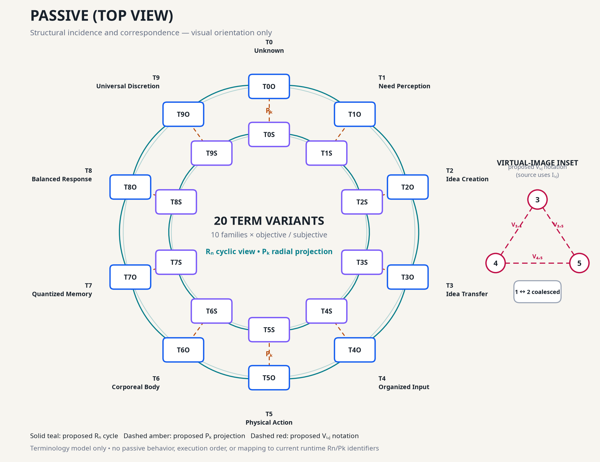
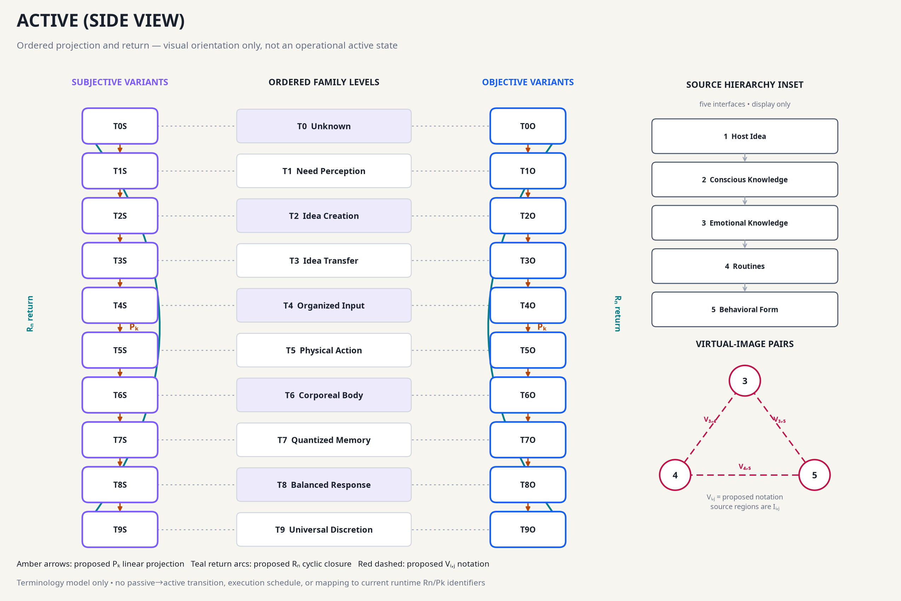

# Twenty-term Passive and Active views

_Source-controlled visual projections of the provisional T0–T9 registry._

---

## Status and scope

> **Status:** Proposed visualization grammar. These diagrams organize twenty objective/subjective term variants. They do not define passive or active behavior, execution order, state transitions, or mappings to current runtime Rn/Pk identifiers.

The diagrams are generated from the [twenty-term view model](diagrams/system5-term-view-model.json). The model contains ten ordered families and two source-mode variants per family:

- Subjective: `T0S` through `T9S`
- Objective: `T0O` through `T9O`

The model also declares source paths, locations, source layers, confidence, and evidence IDs. Every family, relation, interface, and view record cites one or more of those evidence IDs, and the renderer fails if a source or reference is missing.

The names and variants follow the [Provisional T0–T9 term specification](<13 - Provisional T0-T9 Term Specification.md>). The [conflict analysis](<15 - T0-T9 Conflict Resolution Analysis.md>) explains why exact source tokens, compound labels, perspectives, and runtime identifiers remain separate.

## Visual grammar

| Notation | Diagram use | Status |
| --- | --- | --- |
| `R_n` | Cyclic closure over the ordered family view | Proposed visualization grammar |
| `P_k` | Projection through or across corresponding family positions | Proposed visualization grammar |
| `V_i,j` | Virtual-image relation between interfaces `i` and `j` | Proposed notation for source `I_i,j` pairs |
| `TnS`, `TnO` | Subjective and objective term-variant records | Source-backed registry variants |

The current application already uses Rn and Pk identifiers for executable relational circuits and accounting paths. Name similarity is not evidence of equivalence. These diagrams do not use or modify those runtime objects.

## Passive (Top view)



The top view emphasizes structural incidence:

- The outer ring contains ten objective variants.
- The inner ring contains ten subjective variants.
- Teal `R_n` arcs present cyclic family order on each ring.
- Amber `P_k` spokes connect corresponding objective and subjective positions.
- The inset preserves the `(3,4,5)` virtual-image triad and the coalesced `(1,2)` pair as a separate source structure.

This is a passive **visual orientation**, not a declaration that the displayed records are passive states.

[Open the editable passive SVG](images/system5-passive-top-view.svg).

## Active (Side view)



The side view emphasizes ordered projection:

- Ten family levels run from `T0` through `T9`.
- Subjective and objective variants remain in separate columns.
- Amber `P_k` arrows show a proposed linear projection through the ordered view.
- Teal `R_n` arcs return from the final position to the first to show cyclic closure.
- A separate inset shows the five-interface hierarchy from Host Idea to Behavioral Form.
- The virtual-image inset repeats the proposed `V_3,4`, `V_4,5`, and `V_3,5` notation without merging it into the family order.

This is an active **visual orientation**, not an operational active state. There is no passive-to-active transition or transformation.

[Open the editable active SVG](images/system5-active-side-view.svg).

## Source and proposal boundary

The source corpus supports several distinct structures:

1. Objective and subjective term variants
2. Passive and active headings with incomplete semantics
3. A five-interface conceptual hierarchy
4. A coalesced `(1,2)` pair and closed `(3,4,5)` virtual-image triad
5. Existing JavaScript Rn/Pk runtime structures

The diagrams do not collapse these structures. The twenty term records form the main visual population. The hierarchy and virtual-image triad appear only as separate insets. Runtime structures remain outside the view model.

The source's exact virtual-image notation is `I_3,4`, `I_4,5`, and `I_3,5`. The user-requested `V_i,j` notation is declared as proposed in the model and legends. No `V_i,j` runtime object exists.

## Conflict constraints

The diagrams preserve the automated conflict-analysis conclusions:

- `C-001`: no visual preference between conflicting `T02` records
- `C-002`: no placement of disputed transfer tokens in T0
- `C-003`: numbered tokens are cross-references, not aliases
- `C-004`: later titles do not replace provisional family labels
- `C-005`: System 4 contextual labels remain outside the diagram population
- `C-006`: compound labels remain atomic and are not parsed into positions
- `C-007`: passive/active are visual headings, not generated behavior

## Regeneration

Run from the repository root:

```bash
python3 scripts/generate-system5-term-views.py
node --test test/system5DiagramModel.test.js
```

The generator validates the ten-family order, twenty-variant count, empty runtime mappings, and output files before completing. It writes PNG and accessible SVG artifacts under `docs/images/`.

## Files

| File | Purpose |
| --- | --- |
| [`system5-term-view-model.json`](diagrams/system5-term-view-model.json) | Declarative term, relation, interface, and view data |
| [`generate-system5-term-views.py`](../scripts/generate-system5-term-views.py) | Deterministic renderer |
| [`system5DiagramModel.test.js`](../test/system5DiagramModel.test.js) | Population, relation-boundary, and artifact tests |
| [`system5-passive-top-view.png`](images/system5-passive-top-view.png) | Shareable passive raster image |
| [`system5-passive-top-view.svg`](images/system5-passive-top-view.svg) | Editable accessible passive vector image |
| [`system5-active-side-view.png`](images/system5-active-side-view.png) | Shareable active raster image |
| [`system5-active-side-view.svg`](images/system5-active-side-view.svg) | Editable accessible active vector image |

## References

- [Provisional T0–T9 term specification](<13 - Provisional T0-T9 Term Specification.md>)
- [T0–T9 conflict-resolution analysis](<15 - T0-T9 Conflict Resolution Analysis.md>)
- [T1-1 perception-of-need source note](../extracted/t1-1-perception-of-need/t1-1-perception-of-need.md)
- [T1-2 assessment-of-need source note](../extracted/t1-2-assessment-of-need/t1-2-assessment-of-need.md)
- [T1-3 virtual-image correspondence](../extracted/t1-3-virtual-image-triad-system-5-bob-re-back-in-thailand/t1-3-virtual-image-triad-system-5-bob-re-back-in-thailand.md)
- [T-9 primary universal term](../extracted/t-9-primary-universal-term/t-9-primary-universal-term.md)
- [Current runtime constants](../src/core/constants.js)
