# Term R_n, P_k, and I_i,j technical documentation

**Status: proposed interpretive documentation.** This document gives each of the twenty
System 5 Terms a technical description of its **Cyclic Relations (`R_n`)**, **Linear
Projections (`P_k`)** and **Virtual Images (`I_i,j`)**, with a diagram per Term and three
generated atlas sheets. It consolidates source-attested statements with clearly marked
interpretive elaboration. It does **not** define runtime behavior and does **not** map any
`R_n`/`P_k`/`I_i,j` record to the executable `Rn`/`Pk` identifiers in `src/core`
(see the runtime boundary in [docs/15](15%20-%20T0-T9%20Conflict%20Resolution%20Analysis.md)).
Registry conflicts are preserved, not resolved (C-001, C-002, C-003, C-004, C-007 in
[docs/13](13%20-%20Provisional%20T0-T9%20Term%20Specification.md)).

Machine-readable model: [`docs/diagrams/system5-term-relation-model.json`](diagrams/system5-term-relation-model.json)
· Generator: [`scripts/generate-system5-term-relation-diagrams.py`](../scripts/generate-system5-term-relation-diagrams.py)
· Tests: [`test/system5TermRelationModel.test.js`](../test/system5TermRelationModel.test.js)

---

## 1. Scope and epistemic stance

- **Primary prose source** is [`system5-term-descriptions.md`](../system5-term-descriptions.md),
  which completes the twenty Term descriptions around the four Terms fully described in the
  original PDFs (T1-1, T1-2, T1-3, T9 — see [`extracted/`](../extracted/README.md)).
- Statements marked **source-attested** quote or closely track the source corpus; everything
  else is **interpretive**: a proposed reading that keeps the documentation grammar of
  [docs/16](16%20-%20Twenty-Term%20Passive%20and%20Active%20Views.md) consistent across all
  twenty Terms. The per-record status is carried in the model JSON and echoed with a dagger
  (`†`) in the atlas sheets.
- `I_i,j` is the **source notation** for virtual images (T1-3 letter). The `V_i,j` labels in
  docs/16 are the same objects under the passive/active-view alias; this document uses the
  source form.

### The five interfaces

Every Term configures the same five interfaces of System 5, stacked (1) inside (2) inside
(3) inside (4) inside (5) per the Primary Universal Hierarchy
([`T-9 Primary Universal Term`](../extracted/t-9-primary-universal-term/t-9-primary-universal-term.md),
Dan Explorations pp. 68–69):

| # | Interface |
|---|---|
| 1 | Host |
| 2 | Conscious Knowledge |
| 3 | Emotional Knowledge |
| 4 | Routines |
| 5 | Behavioral Form |

Each Term has an **expressive mode** and a **regenerative mode** in which interfaces (1)
and (2) change places across the perceptual axis; each per-Term section below records the
regenerative reading of its relations.

## 2. Notation

### 2.1 `R_n` — Cyclic Relations (Relational Wholes)

A cyclic relation is a directed arc of a **closed counter-current circuit** between
interfaces. The source defines two Relational Wholes per Term — an efferent `R1` and its
counter-current partner `R2` — whose feedback balance constitutes the Term as one
Relational Whole (Dan Explorations p. 66; System 3 Universal Term 2). T1-2 additionally
attests a **bipolar** `R3` created by the coalesced Host(1)–Consciousness(2) pair (OCR
leaves the source subscripts partly illegible; `R1`, `R2`, `R3` are reconstructed).
Documentation rules:

- `R_n` records carry a `direction` (`efferent`, `afferent`, `bipolar`) and an ordered
  interface `path`, written `1→2→3→4` etc.
- The first two records of every Term are always the counter-current pair `R1`/`R2`.
- The T5 description attests the pattern explicitly: *"the counter-current balance of R1
  and R2 operating across the Routine(4) interface."*

### 2.2 `P_k` — Linear Projections

A linear projection is an **open unidirectional path** through interfaces that does not
return to its source. Projections come in pairs that form a **double-entry account** of
what is *received* (`role: input`) and what is *expended* (`role: output`):

- The T1-1 source attests projections that *"relate to the physical social market place in
  the expressive mode"* and *"project to the body's muscle spindles that generate
  proprioceptive sensory input in the Term 4R that follows"* (the `P` subscript is
  illegible in the OCR).
- The T8 description attests the accounting role: *"the projections (Pk) account what was
  received and what was expended, while the Relational Wholes (Rn) hold the counter-current
  balance of R1 and R2."*

### 2.3 `I_i,j` — Virtual Images

When Emotional Knowledge(3), Routines(4) and Behavioral Form(5) form a **mutually closed
triad** while Host(1) and Conscious Knowledge(2) coalesce as one, the triadic double
identity generates **three mutually closed virtual images** (T1-3 letter):

| Notation | Between | Reading |
|---|---|---|
| `I_3,4` | Emotional Knowledge(3) ↔ Routines(4) | emotional/spiritual virtual identity related to virtual routines |
| `I_4,5` | Routines(4) ↔ Behavioral Form(5) | virtual routines related to virtual form |
| `I_3,5` | Emotional Knowledge(3) ↔ Behavioral Form(5) | emotional/spiritual virtual identity related to virtual form |

The corpus states that **three of the twenty Terms have virtual images** and names only
T1-2 (Dan Explorations p. 51). This document records `I_i,j` as **source-attested** for
T1-2 and T1-3, as **structural** (configuration-implied) for the closed-triad transjective
Terms T2-5 and T2-7, and as `none-recorded` elsewhere — leaving the identity of the
attested trio open (see [Open questions](#open-questions), OQ-001).

### 2.4 Reading the structural signature

Each Term carries the parenthesis structure and number assigned by the corpus p. 5
crosswalk (Dan Explorations). The encoding is the **Matula–Goebel correspondence** between
rooted trees and natural numbers:

- A parenthesis string is a rooted tree of interface enclosures; every Term's string
  contains exactly five `(` — one per interface.
- `M(empty) = 1`, and `M(tree) = ∏ p_M(child)` over the top-level groups, where `p_m` is the
  *m*-th prime. So `()` = p₁ = 2, `(())` = p₂ = 3, `()()()()()` = 2⁵ = 32,
  `((((())))))`… etc.
- The source's decimal shorthand `a.b` denotes the product `a × b` of subterm values, and
  `(m)` denotes prime indexing p_m — e.g. `(16)` = p₁₆ = 53.

Signatures are verified programmatically in
[`test/system5TermRelationModel.test.js`](../test/system5TermRelationModel.test.js).

## 3. Relation atlas sheets

Generated from the model JSON. Solid teal = `R_n`, dashed amber = `P_k`, dotted crimson =
`I_i,j`; shaded capsules mark coalesced interfaces, the dotted crimson box marks the closed
(3,4,5) triad, a dashed outline marks the full hierarchy; `†` = source-attested.

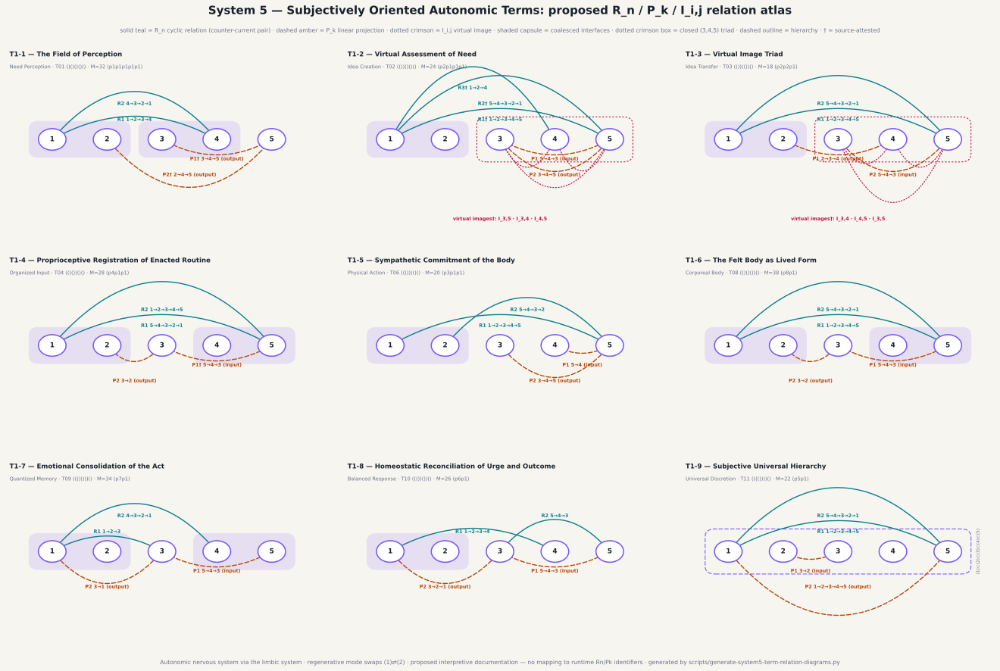

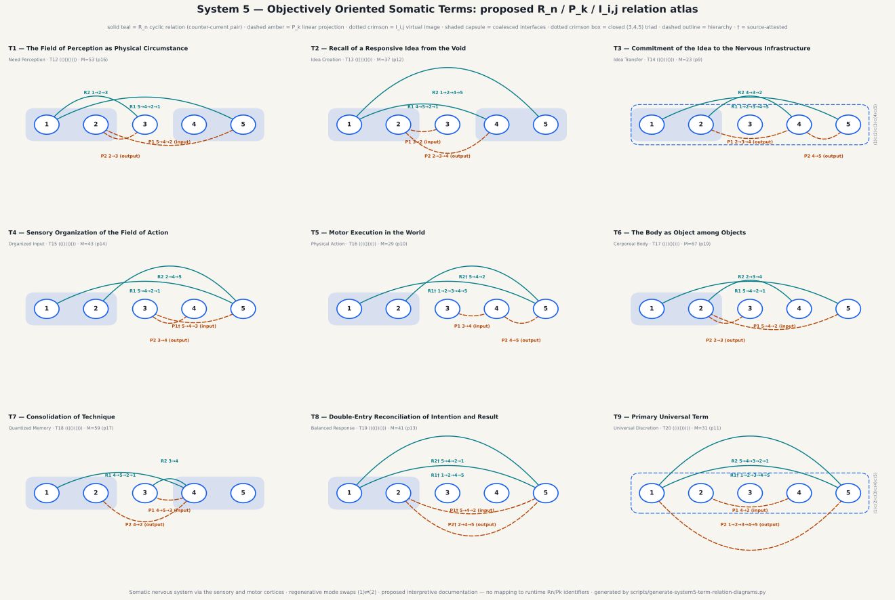

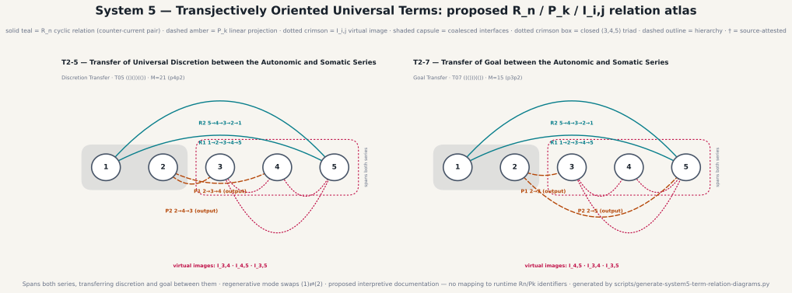

Regeneration:

```bash
pip install matplotlib
python3 scripts/generate-system5-term-relation-diagrams.py
npm test
```

---

## 4. Subjectively Oriented Autonomic Terms

Working through the autonomic nervous system via the limbic system.

### T1-1 — The Field of Perception

| | |
|---|---|
| Function | Need Perception |
| Registry crosswalk | family `T1`, variant `T1S` (conflict C-001 on numbering style) |
| Structural signature | `T01` · `()()()()()` · M = 32 = p1·p1·p1·p1·p1 |
| Configuration | (1,2) coalesced; (3,4) coalesced via the limbic system; within the context of Form(5) |

**Cyclic relations.**
- `R1` (efferent, `1→2→3→4`) — the Host Knows(2) Emotional(3) Routines(4): a subjective
  urge to express an act recalled from the Void within the context of Form(5).
- `R2` (afferent, `4→3→2→1`) — Routines(4) objectively aligned back to the Host as limbic
  emotional patterns project to the primary sensory cortex.

**Linear projections.**
- `P1` (output, `3→4→5`, **source-attested**) — expressive projections relate the felt urge
  to the physical social marketplace (Form 5).
- `P2` (output, `2→4→5`, **source-attested**) — regenerative projections to the body's
  muscle spindles, priming the proprioceptive input registered in T1-4R.

**Virtual images.** None recorded — perception is itself a virtual reconstruction by the
nervous system, but no `I_i,j` pair is attested for this Term.

**Regenerative mode.** (1) and (2) change places: the Host aligns with limbic Emotions(3)
relating objectively to Routines(4) aligned with Consciousness(2) — a gamma-motor
simulation initiated from the reticular formation.

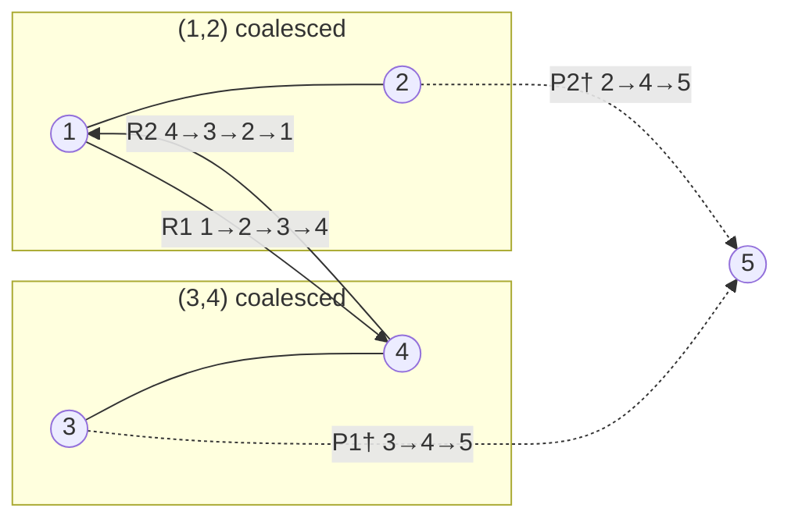
```mermaid
flowchart LR
  subgraph C12["(1,2) coalesced"]
    I1((1)) --- I2((2))
  end
  subgraph C34["(3,4) coalesced"]
    I3((3)) --- I4((4))
  end
  I5((5))
  I1 -->|"R1 1→2→3→4"| I4
  I4 -->|"R2 4→3→2→1"| I1
  I3 -.->|"P1† 3→4→5"| I5
  I2 -.->|"P2† 2→4→5"| I5
```

### T1-2 — Virtual Assessment of Need

| | |
|---|---|
| Function | Idea Creation |
| Registry crosswalk | family `T2`, variant `T2S` (conflict C-001) |
| Structural signature | `T02` · `(())()()()` · M = 24 = p2·p1·p1·p1 |
| Configuration | (1,2) coalesced; bipolar closed triad (3,4,5) |

**Cyclic relations.**
- `R1` (efferent, `1→2→3→4→5`, **source-attested**) — the coalesced Host Emotionally
  Knows(3) Routines(4) of Behavioral Form(5) as a virtual vision of action possible — a
  coherent sympathetic urge.
- `R2` (afferent, `5→4→3→2→1`, **source-attested**) — Consciousness in the other direction
  knows the physical resources available within Routines(4) as a virtual vision relating to
  Known Emotions(3).
- `R3` (bipolar, `1→2→4`, **source-attested**) — the coalesced (1,2) pair creates the
  bipolar relation that generates the coalescence of limbic Emotion(3) with Behavioral
  Form(5) as a virtual Routine(4). (OCR subscripts reconstructed.)

**Linear projections.**
- `P1` (input, `5→4→3`) — chemical resources within the body's Routines reported as
  available response capacity.
- `P2` (output, `3→4→5`) — sympathetic readiness to express the felt need in behavior,
  pending the parasympathetic restraint of T1-3.

**Virtual images (source-attested).** T1-2 is the one Term the corpus names among the three
Terms of System 5 that have virtual images (p. 51):
- `I_3,5` — bipolar coalescence of limbic Emotion(3) with Behavioral Form(5) as a virtual
  Routine(4); the subjective-to-objective disparity across the Routine(4) interface is felt
  as a specific urge.
- `I_3,4`, `I_4,5` — emotional virtual identity related to virtual routines and virtual
  routines related to virtual form, within the closed triad.

**Regenerative mode.** (1) and (2) change places so the Host Knows(2) that Resources(5)
implicit in Routines(4) are limited as they relate to Known Emotions(3) — assessment of the
capacity to respond.

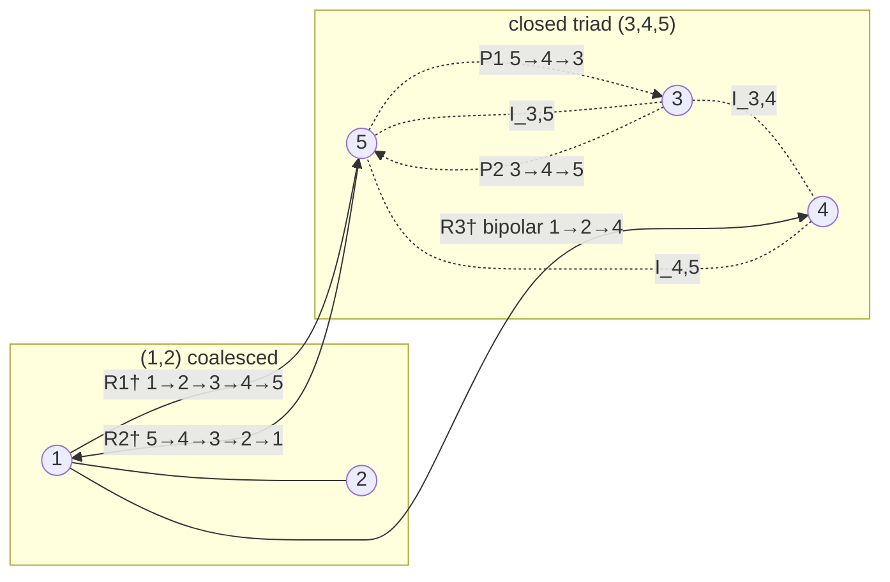
```mermaid
flowchart LR
  subgraph C12["(1,2) coalesced"]
    I1((1)) --- I2((2))
  end
  subgraph T345["closed triad (3,4,5)"]
    I3((3))
    I4((4))
    I5((5))
    I3 -. "I_3,4" .- I4
    I4 -. "I_4,5" .- I5
    I3 -. "I_3,5" .- I5
  end
  I1 -->|"R1† 1→2→3→4→5"| I5
  I5 -->|"R2† 5→4→3→2→1"| I1
  I1 -->|"R3† bipolar 1→2→4"| I4
  I5 -.->|"P1 5→4→3"| I3
  I3 -.->|"P2 3→4→5"| I5
```

### T1-3 — Virtual Image Triad

| | |
|---|---|
| Function | Idea Transfer |
| Registry crosswalk | family `T3`, variant `T3S` |
| Structural signature | `T03` · `(())(())()` · M = 18 = p2·p2·p1 |
| Configuration | (1,2) coalesced; mutually closed triad (3,4,5) |

**Cyclic relations.**
- `R1` (efferent, `1→2→3→4→5`) — the coalesced (1,2) pair relates from within each closed
  interface, restraining potential action sequences (the parasympathetic function the T1-2
  source assigns to this Term).
- `R2` (afferent, `5→4→3→2→1`) — restrained readiness of the virtual triad feeds back to
  the coalesced Host as a coherent virtual image of action withheld.

**Linear projections.**
- `P1` (output, `2→3→4`) — parasympathetic restraint projected onto potential action
  sequences.
- `P2` (input, `5→4→3`) — virtual reconstruction of circumstance registered emotionally as
  the restrained context of action.

**Virtual images (source-attested).** The Term *is* the triad: triadic double identity
generates the three mutually closed virtual images `I_3,4`, `I_4,5`, `I_3,5` — a virtual
reality perceived distinct from physical reality.

**Regenerative mode.** (1) and (2) change places across the perceptual axis; the drafted
restraint is read back to Consciousness(2) as the settled virtual image that the following
Terms enact.

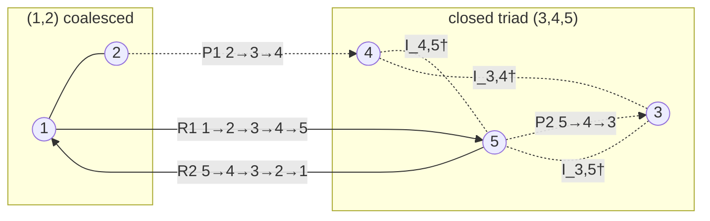
```mermaid
flowchart LR
  subgraph C12["(1,2) coalesced"]
    I1((1)) --- I2((2))
  end
  subgraph T345["closed triad (3,4,5)"]
    I3((3))
    I4((4))
    I5((5))
    I3 -. "I_3,4†" .- I4
    I4 -. "I_4,5†" .- I5
    I3 -. "I_3,5†" .- I5
  end
  I1 -->|"R1 1→2→3→4→5"| I5
  I5 -->|"R2 5→4→3→2→1"| I1
  I2 -.->|"P1 2→3→4"| I4
  I5 -.->|"P2 5→4→3"| I3
```

### T1-4 — Proprioceptive Registration of Enacted Routine

| | |
|---|---|
| Function | Organized Input |
| Registry crosswalk | family `T4`, variant `T4S` |
| Structural signature | `T04` · `(()())()()` · M = 28 = p4·p1·p1 |
| Configuration | (1,2) coalesced; (4,5) coalesced |

**Cyclic relations.**
- `R1` (afferent, `5→4→3→2→1`) — chemical and postural resources report back through the
  autonomic afferents to Emotional Knowledge(3) and thence to the coalesced Host.
- `R2` (efferent, `1→2→3→4→5`) — the felt need is confirmed, corrected or denied against
  the actual disposition of the body: counter-current confirmation.

**Linear projections.**
- `P1` (input, `5→4→3`, **source-attested**) — proprioceptive input returned by the muscle
  spindles primed by the gamma-motor simulation of T1-1.
- `P2` (output, `3→2`) — organized input forwarded as the settled basis on which Physical
  Action (T1-5) can proceed.

**Virtual images.** None recorded.

**Regenerative mode.** (1) and (2) change places: the Host aligns with Emotions(3) as they
relate objectively to the organized Routines(4) held in Consciousness(2), consolidating a
settled emotional context for action.

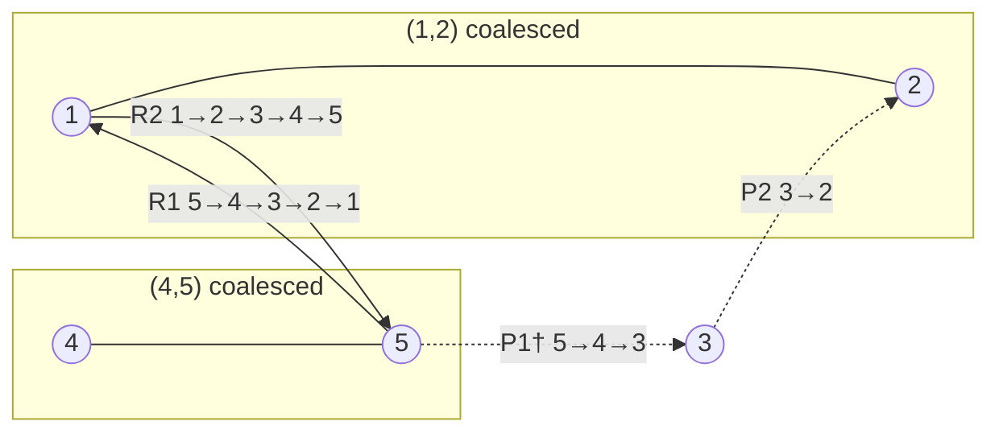
```mermaid
flowchart LR
  subgraph C12["(1,2) coalesced"]
    I1((1)) --- I2((2))
  end
  I3((3))
  subgraph C45["(4,5) coalesced"]
    I4((4)) --- I5((5))
  end
  I5 -->|"R1 5→4→3→2→1"| I1
  I1 -->|"R2 1→2→3→4→5"| I5
  I5 -.->|"P1† 5→4→3"| I3
  I3 -.->|"P2 3→2"| I2
```

### T1-5 — Sympathetic Commitment of the Body

| | |
|---|---|
| Function | Physical Action |
| Registry crosswalk | family `T5`, variant `T5S` |
| Structural signature | `T06` · `((()))()()` · M = 20 = p3·p1·p1 |
| Configuration | (1,2) coalesced |

**Cyclic relations.**
- `R1` (efferent, `1→2→3→4→5`) — sympathetic mobilization: heart rate, respiration and
  visceral tone recruited in support of the behavioral routine.
- `R2` (afferent, `5→4→3→2`) — Consciousness monitors the expenditure against the virtual
  image; the parasympathetic restraint of T1-3 is relaxed only to the degree the image
  allows.

**Linear projections.**
- `P1` (input, `5→4`) — chemical resources assessed in T1-2 drawn as fuel for the act
  (received).
- `P2` (output, `3→4→5`) — energy spent through patterned routines into physical behavior,
  committed only as far as the assessed capacity permits (expended).

**Virtual images.** None recorded — the act is governed by the virtual image struck in
T1-2 and restrained in T1-3 (cross-reference, not its own image).

**Regenerative mode.** (1) and (2) change places so the Host is aligned with limbic
Emotions(3) as they relate objectively to the Routines(4) being spent.

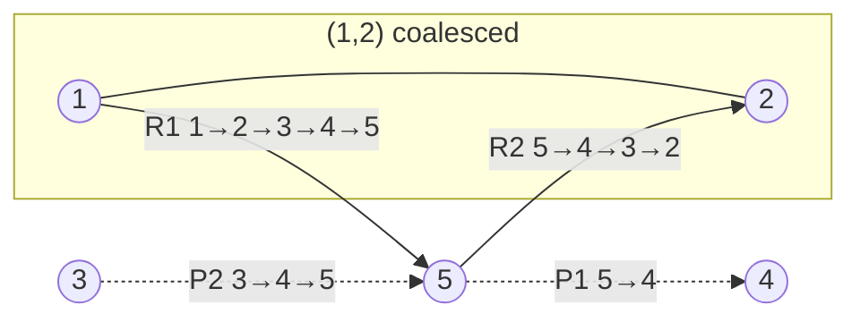
```mermaid
flowchart LR
  subgraph C12["(1,2) coalesced"]
    I1((1)) --- I2((2))
  end
  I3((3))
  I4((4))
  I5((5))
  I1 -->|"R1 1→2→3→4→5"| I5
  I5 -->|"R2 5→4→3→2"| I2
  I5 -.->|"P1 5→4"| I4
  I3 -.->|"P2 3→4→5"| I5
```

### T1-6 — The Felt Body as Lived Form

| | |
|---|---|
| Function | Corporeal Body |
| Registry crosswalk | family `T6`, variant `T6S` |
| Structural signature | `T08` · `(()()())()` · M = 38 = p8·p1 |
| Configuration | (1,2) coalesced; (4,5) coalesced as one lived body with (3) immersed |

**Cyclic relations.**
- `R1` (efferent, `1→2→3→4→5`) — subjective inhabitation: the body felt from within as the
  seat of the urge that acts, not perceived as an object among objects.
- `R2` (afferent, `5→4→3→2→1`) — visceral, hormonal and postural states integrated by the
  limbic system into a single felt sense of the body in its circumstance.

**Linear projections.**
- `P1` (input, `5→4→3`) — visceral, hormonal and postural streams entering limbic
  integration.
- `P2` (output, `3→2`) — the standing felt-body condition supplied to Quantized Memory
  (T1-7) and Balanced Response (T1-8).

**Virtual images.** None recorded.

**Regenerative mode.** (1) and (2) change places: the Host aligned with Emotions(3)
objectively registers the body's Routines(4) and Form(5) as altered by T1-5, and
Consciousness(2) receives the alteration as a change in the felt body.

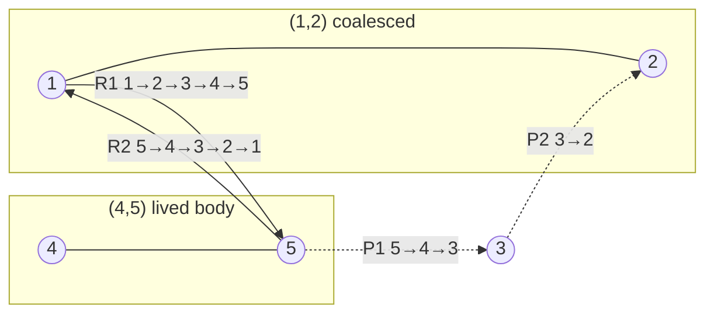
```mermaid
flowchart LR
  subgraph C12["(1,2) coalesced"]
    I1((1)) --- I2((2))
  end
  I3((3))
  subgraph C45["(4,5) lived body"]
    I4((4)) --- I5((5))
  end
  I1 -->|"R1 1→2→3→4→5"| I5
  I5 -->|"R2 5→4→3→2→1"| I1
  I5 -.->|"P1 5→4→3"| I3
  I3 -.->|"P2 3→2"| I2
```

### T1-7 — Emotional Consolidation of the Act

| | |
|---|---|
| Function | Quantized Memory |
| Registry crosswalk | family `T7`, variant `T7S` |
| Structural signature | `T09` · `((()()))()` · M = 34 = p7·p1 |
| Configuration | (1,2) coalesced; (4,5) closed face to face, belonging to (3) |

**Cyclic relations.**
- `R1` (efferent, `1→2→3`) — the coalesced Host subjectively Knows the emotional
  consolidation: felt success or failure bound into the limbic pattern.
- `R2` (afferent, `4→3→2→1`) — the consolidated technique registered back to the coalesced
  Host, available for recall in a future T1-1 field of perception.

**Linear projections.**
- `P1` (input, `5→4→3`) — the lived episode of T1-5 and T1-6 entering emotional
  consolidation.
- `P2` (output, `3→1`) — the quantized element deposited to the Void, holistically
  integrated with all others; nothing of the emotional history is lost.

**Virtual images.** None recorded — the (4,5) coalescence is quantized and *actual*, as in
Particular Term 3 of System 3, not virtual.

**Regenerative mode.** (1) and (2) change places so the Host, aligned with Emotions(3),
objectively deposits the consolidated Routine(4) in relation to Consciousness(2).

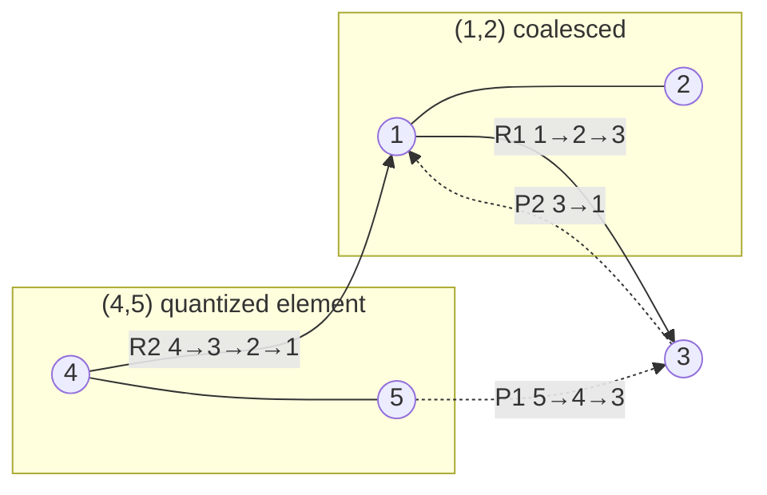
```mermaid
flowchart LR
  subgraph C12["(1,2) coalesced"]
    I1((1)) --- I2((2))
  end
  I3((3))
  subgraph C45["(4,5) quantized element"]
    I4((4)) --- I5((5))
  end
  I1 -->|"R1 1→2→3"| I3
  I4 -->|"R2 4→3→2→1"| I1
  I5 -.->|"P1 5→4→3"| I3
  I3 -.->|"P2 3→1"| I1
```

### T1-8 — Homeostatic Reconciliation of Urge and Outcome

| | |
|---|---|
| Function | Balanced Response |
| Registry crosswalk | family `T8`, variant `T8S` |
| Structural signature | `T10` · `((())())()` · M = 26 = p6·p1 |
| Configuration | (1,2) coalesced; (3) compares (4) as enacted with (5) as altered |

**Cyclic relations.**
- `R1` (efferent, `1→2→3→4`) — the sympathetic expenditure account of the Routines as
  enacted: the R1 pole of the bipolar balance generated in T1-2, now checked in fact.
- `R2` (afferent, `5→4→3`) — the parasympathetic restraint account of the Form as altered;
  visceral tone, chemical resources and emotional charge returned toward equilibrium.

**Linear projections.**
- `P1` (input, `5→4→3`) — discharge of the urge to the degree the need was met (received).
- `P2` (output, `3→2→1`) — unbalanced residue re-armed and carried forward as a renewed
  perception of need in the next cycle (expended).

**Virtual images.** None recorded — checks in fact the bipolar balance that generated the
virtual image in T1-2 (cross-reference).

**Regenerative mode.** (1) and (2) change places: the Host aligned with Emotions(3)
objectively accepts the balance struck in Routines(4) as it is registered by
Consciousness(2).

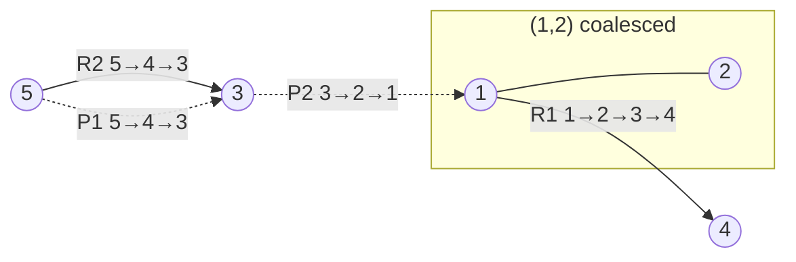
```mermaid
flowchart LR
  subgraph C12["(1,2) coalesced"]
    I1((1)) --- I2((2))
  end
  I3((3))
  I4((4))
  I5((5))
  I1 -->|"R1 1→2→3→4"| I4
  I5 -->|"R2 5→4→3"| I3
  I5 -.->|"P1 5→4→3"| I3
  I3 -.->|"P2 3→2→1"| I1
```

### T1-9 — Subjective Universal Hierarchy

| | |
|---|---|
| Function | Universal Discretion |
| Registry crosswalk | family `T9`, variant `T9S` |
| Structural signature | `T11` · `(((())))()` · M = 22 = p5·p1 |
| Configuration | full discretionary hierarchy (1)⊂(2)⊂(3)⊂(4)⊂(5), felt from within; archetypal |

**Cyclic relations.**
- `R1` (efferent, `1→2→3→4→5`) — discretionary direction down the hierarchy: which urges
  are owned; associated with the archetype of the person.
- `R2` (afferent, `5→4→3→2→1`) — regenerative traversal in return: Form informs Routines
  inform Emotional Knowledge informs Consciousness in relation to the Host — felt as
  conscience.

**Linear projections.**
- `P1` (input, `3→2`) — selection from the quantized emotional memory of T1-7 and the
  balance of T1-8 of which urges are admitted into the next field of perception (T1-1).
- `P2` (output, `1→2→3→4→5`) — prescription, with the Primary Universal Term, of the five
  successive Steps of each System 5 Cycle as lived subjectively.

**Virtual images.** None recorded — universal and archetypal; does not exist as a thing in
space and time.

**Regenerative mode.** The hierarchy is traversed in return; the Term is primary to the
recall process on the subjective side, with implicit discretionary characteristics.

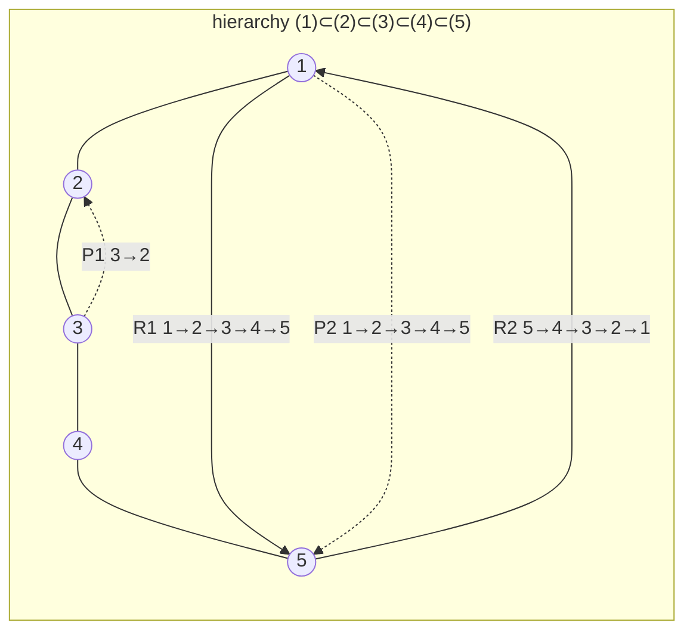
```mermaid
flowchart LR
  subgraph H["hierarchy (1)⊂(2)⊂(3)⊂(4)⊂(5)"]
    I1((1)) --- I2((2)) --- I3((3)) --- I4((4)) --- I5((5))
  end
  I1 -->|"R1 1→2→3→4→5"| I5
  I5 -->|"R2 5→4→3→2→1"| I1
  I3 -.->|"P1 3→2"| I2
  I1 -.->|"P2 1→2→3→4→5"| I5
```

---

## 5. Objectively Oriented Somatic Terms

Working through the somatic nervous system via the sensory and motor cortices.

### T1 — The Field of Perception as Physical Circumstance

| | |
|---|---|
| Function | Need Perception |
| Registry crosswalk | family `T1`, variant `T1O` |
| Structural signature | `T12` · `(()()()())` · M = 53 = p16 |
| Configuration | (1,2) coalesced; (4,5) coalesced via the sensory cortex |

**Cyclic relations.**
- `R1` (afferent, `5→4→2→1`) — the world's Formed(5) Routines(4) — objects, persons and
  events as patterned appearances — constructed into a virtual mirror from the person's
  unique perspective.
- `R2` (efferent, `1→2→3`) — the perception subjectively referred back to Emotional
  Knowledge(3) for its felt significance.

**Linear projections.**
- `P1` (input, `5→4→2`) — exteroceptive input from eyes, ears and skin organized by the
  nervous system.
- `P2` (output, `2→3`) — delivery of the objective field within which need can be
  recognized.

**Virtual images.** None recorded — the constructed "virtual mirror" of the outside world
is a virtual reconstruction, but no `I_i,j` pair is attested for this Term.

**Regenerative mode.** (1) and (2) change places: the Host stands on the objective side of
the axis, aligned with the world's Forms(5) as they relate back through Routines(4) to
Consciousness(2), scanning the scene for what answers to need.

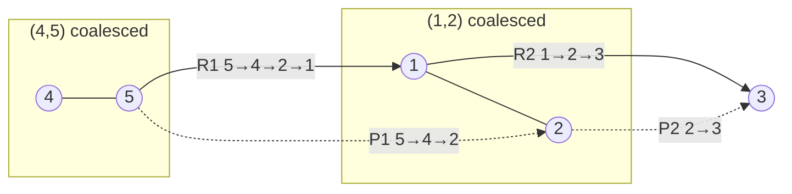
```mermaid
flowchart LR
  subgraph C12["(1,2) coalesced"]
    I1((1)) --- I2((2))
  end
  I3((3))
  subgraph C45["(4,5) coalesced"]
    I4((4)) --- I5((5))
  end
  I5 -->|"R1 5→4→2→1"| I1
  I1 -->|"R2 1→2→3"| I3
  I5 -.->|"P1 5→4→2"| I2
  I2 -.->|"P2 2→3"| I3
```

### T2 — Recall of a Responsive Idea from the Void

| | |
|---|---|
| Function | Idea Creation |
| Registry crosswalk | family `T2`, variant `T2O` |
| Structural signature | `T13` · `((())()())` · M = 37 = p12 |
| Configuration | (1,2) coalesced; (4,5) eternally married as technique in memory |

**Cyclic relations.**
- `R1` (afferent, `4→5→2→1`) — recall from the Void of a candidate shape of action in the
  world — not yet an urge of the body.
- `R2` (efferent, `1→2→4→5`) — fit-testing of the idea against the perceived Forms(5) and
  available Routines(4); many ideas are created and dismissed within a single cycle.

**Linear projections.**
- `P1` (input, `3→2`) — Emotional Knowledge(3) attends the recalled idea as interest,
  coloring it with felt relevance.
- `P2` (output, `2→3→4`) — only an idea that survives the fit is carried forward to
  transfer (T3).

**Virtual images.** None recorded.

**Regenerative mode.** (1) and (2) change places so that Consciousness(2) holds the idea
against the Host's(1) situation.

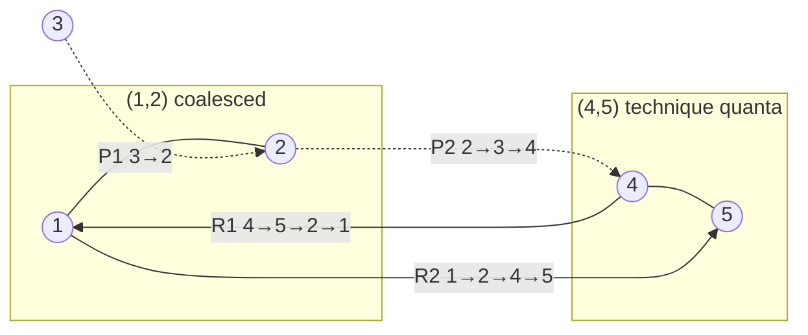
```mermaid
flowchart LR
  subgraph C12["(1,2) coalesced"]
    I1((1)) --- I2((2))
  end
  I3((3))
  subgraph C45["(4,5) technique quanta"]
    I4((4)) --- I5((5))
  end
  I4 -->|"R1 4→5→2→1"| I1
  I1 -->|"R2 1→2→4→5"| I5
  I3 -.->|"P1 3→2"| I2
  I2 -.->|"P2 2→3→4"| I4
```

### T3 — Commitment of the Idea to the Nervous Infrastructure

| | |
|---|---|
| Function | Idea Transfer |
| Registry crosswalk | family `T3`, variant `T3O` |
| Structural signature | `T14` · `((())(()))` · M = 23 = p9 |
| Configuration | (1,2) coalesced; hierarchical transfer per the Primary Universal Term — (1)⊂(2)⊂(3)⊂(4)⊂(5) |

**Cyclic relations.**
- `R1` (efferent, `1→2→3→4→5`) — the Host directs Consciousness to commit the idea
  downward through Emotional Knowledge(3) into premotor Routines(4) addressed to the
  Form(5) of the body and its instruments.
- `R2` (afferent, `4→3→2`) — the drafted program read back to Consciousness(2) for
  confirmation against the idea before release.

**Linear projections.**
- `P1` (output, `2→3→4`) — the formed intention handed through its felt sanction(3) to the
  routines(4) that will body it forth.
- `P2` (output, `4→5`) — the sequenced program of neuro-muscular activity standing ready as
  organized input to action, with no further conscious rehearsal needed.

**Virtual images.** None recorded — the objective analogue of the virtual image triad of
T1-3: the subjective series restrains the urge, the objective series programs the act.

**Regenerative mode.** (1) and (2) change places, and the drafted program is read back to
Consciousness(2) for confirmation before release.

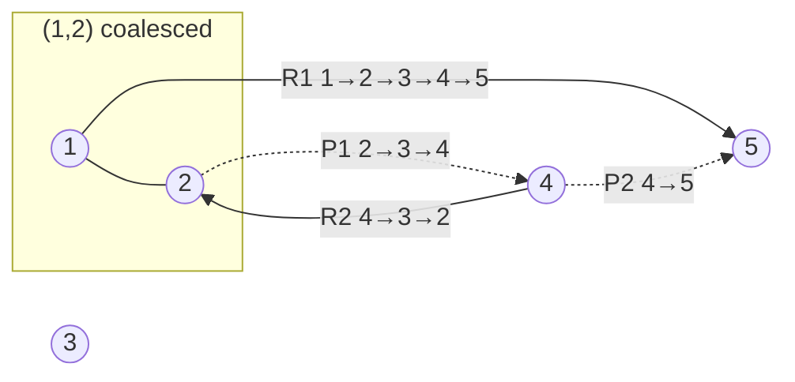
```mermaid
flowchart LR
  subgraph C12["(1,2) coalesced"]
    I1((1)) --- I2((2))
  end
  I3((3))
  I4((4))
  I5((5))
  I1 -->|"R1 1→2→3→4→5"| I5
  I4 -->|"R2 4→3→2"| I2
  I2 -.->|"P1 2→3→4"| I4
  I4 -.->|"P2 4→5"| I5
```

### T4 — Sensory Organization of the Field of Action

| | |
|---|---|
| Function | Organized Input |
| Registry crosswalk | family `T4`, variant `T4O` |
| Structural signature | `T15` · `((()())())` · M = 43 = p14 |
| Configuration | (1,2) coalesced; Form(5) organized within the frame of the intended Routines(4) |

**Cyclic relations.**
- `R1` (afferent, `5→4→2→1`) — the world's Forms(5) Known as organized within the frame of
  the intended Routines(4): distances, weights, positions and timings given as parameters
  of action.
- `R2` (efferent, `2→4→5`) — the organized input checked against the idea held in
  Consciousness(2); discrepancies re-enter T2 as occasions for revised ideas.

**Linear projections.**
- `P1` (input, `5→4→3`, **source-attested**) — exteroceptive and proprioceptive channels,
  including the muscle-spindle report primed in T1-1, closing the loop between the
  autonomic and somatic orientations.
- `P2` (output, `3→4`) — organized parameters delivered as readiness to the patterned
  response (T5).

**Virtual images.** None recorded.

**Regenerative mode.** (1) and (2) change places so that the organized input is checked
against the idea held in Consciousness(2).

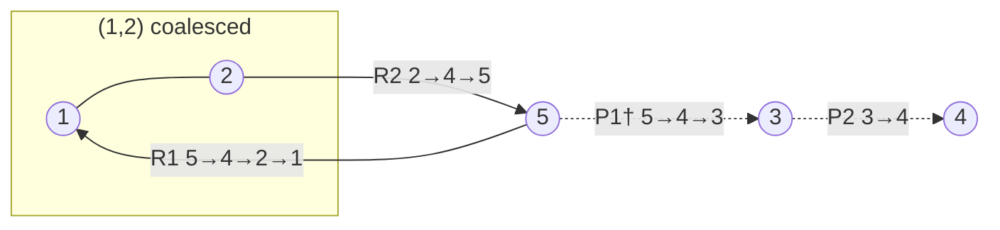
```mermaid
flowchart LR
  subgraph C12["(1,2) coalesced"]
    I1((1)) --- I2((2))
  end
  I3((3))
  I4((4))
  I5((5))
  I5 -->|"R1 5→4→2→1"| I1
  I2 -->|"R2 2→4→5"| I5
  I5 -.->|"P1† 5→4→3"| I3
  I3 -.->|"P2 3→4"| I4
```

### T5 — Motor Execution in the World

| | |
|---|---|
| Function | Physical Action |
| Registry crosswalk | family `T5`, variant `T5O` |
| Structural signature | `T16` · `(((()))())` · M = 29 = p10 |
| Configuration | (1,2) coalesced; Routines(4) executed through the motor cortex, altering Form(5) |

**Cyclic relations.**
- `R1` (efferent, `1→2→3→4→5`, **source-attested**) — the coalesced Host directs the act;
  Emotional Knowledge(3) fuels it with the commitment struck in T1-5; Routines(4) sequence
  it; Form(5) realizes it.
- `R2` (afferent, `5→4→2`, **source-attested**) — continuous feedback: each phase of
  movement returns proprioceptive and exteroceptive input (T4) steering the next phase —
  *"the counter-current balance of R1 and R2 operating across the Routine(4) interface."*

**Linear projections.**
- `P1` (input, `3→4`) — felt commitment from the subjective series (T1-5) sustaining the
  act.
- `P2` (output, `4→5`) — the measurable change worked in the world: the objective measure
  of the action.

**Virtual images.** None recorded.

**Regenerative mode.** (1) and (2) change places: the Host stands with the world's response
while Consciousness(2) compares the unfolding Form(5) with the transferred idea (T3),
correcting the Routines(4) in flight.

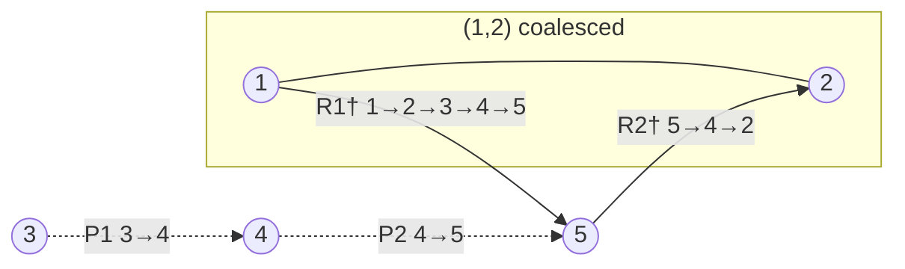
```mermaid
flowchart LR
  subgraph C12["(1,2) coalesced"]
    I1((1)) --- I2((2))
  end
  I3((3))
  I4((4))
  I5((5))
  I1 -->|"R1† 1→2→3→4→5"| I5
  I5 -->|"R2† 5→4→2"| I2
  I3 -.->|"P1 3→4"| I4
  I4 -.->|"P2 4→5"| I5
```

### T6 — The Body as Object among Objects

| | |
|---|---|
| Function | Corporeal Body |
| Registry crosswalk | family `T6`, variant `T6O` |
| Structural signature | `T17` · `((()()()))` · M = 67 = p19 |
| Configuration | (1,2) coalesced; (4,5) mutually closed as the particular thing the body is |

**Cyclic relations.**
- `R1` (afferent, `5→4→2→1`) — the coalesced Host objectively Knows its own body as it is
  seen, weighed and handled — the same body T1-6 knows from within.
- `R2` (efferent, `2→3→4`) — Emotional Knowledge(3) mediates between the objective
  body-image and the felt body.

**Linear projections.**
- `P1` (input, `5→4→2`) — posture, capacity and appearance updated in Consciousness(2)
  from the outcome of action (T5).
- `P2` (output, `2→3`) — the objective body-image supplied as the reference against which
  memory and balance are struck in T7 and T8.

**Virtual images.** None recorded — intimately bound as One yet spatially separate from
other bodies of the same kind, as every hydrogen atom is separate though intimately bound
within.

**Regenerative mode.** (1) and (2) change places, and the objective body-image is
reconciled with the felt body.

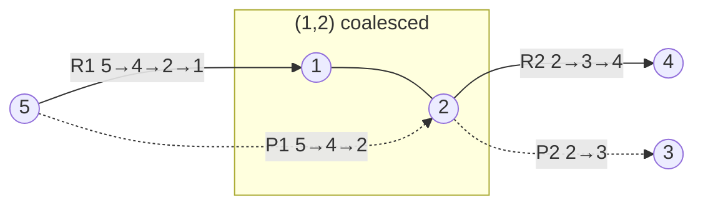
```mermaid
flowchart LR
  subgraph C12["(1,2) coalesced"]
    I1((1)) --- I2((2))
  end
  I3((3))
  I4((4))
  I5((5))
  I5 -->|"R1 5→4→2→1"| I1
  I2 -->|"R2 2→3→4"| I4
  I5 -.->|"P1 5→4→2"| I2
  I2 -.->|"P2 2→3"| I3
```

### T7 — Consolidation of Technique

| | |
|---|---|
| Function | Quantized Memory |
| Registry crosswalk | family `T7`, variant `T7O` |
| Structural signature | `T18` · `(((()())))` · M = 59 = p17 |
| Configuration | (1,2) coalesced; (4,5) closed face to face as a quantized element in the Void |

**Cyclic relations.**
- `R1` (afferent, `4→5→2→1`) — the consolidation Known as acquired skill: what worked bound
  into the repertoire from which T2 will recall future ideas.
- `R2` (efferent, `3→4`) — Emotional Knowledge(3) tags the quantum with its felt worth,
  joining it to the emotional consolidation of T1-7.

**Linear projections.**
- `P1` (input, `4→5→3`) — the executed act and its formed result entering consolidation as
  one discrete element of technique.
- `P2` (output, `4→2`) — the repertoire of quanta available to recall: the person's
  practical knowledge of the world.

**Virtual images.** None recorded — the (4,5) coalescence is quantized and *actual*,
holistically integrated as in Particular Term 3 of System 3.

**Regenerative mode.** (1) and (2) change places so that the stored technique is registered
to the Host(1) as a settled capacity rather than an event remembered.

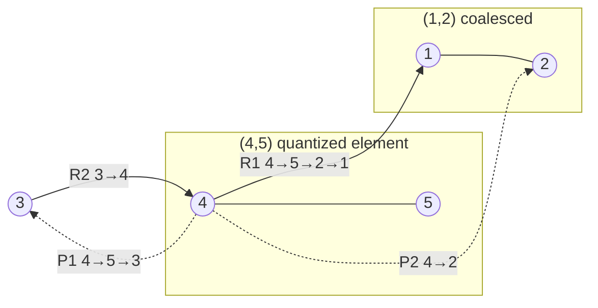
```mermaid
flowchart LR
  subgraph C12["(1,2) coalesced"]
    I1((1)) --- I2((2))
  end
  I3((3))
  subgraph C45["(4,5) quantized element"]
    I4((4)) --- I5((5))
  end
  I4 -->|"R1 4→5→2→1"| I1
  I3 -->|"R2 3→4"| I4
  I4 -.->|"P1 4→5→3"| I3
  I4 -.->|"P2 4→2"| I2
```

### T8 — Double-Entry Reconciliation of Intention and Result

| | |
|---|---|
| Function | Balanced Response |
| Registry crosswalk | family `T8`, variant `T8O` |
| Structural signature | `T19` · `(((())()))` · M = 41 = p13 |
| Configuration | (1,2) coalesced; Form(5) achieved compared with Form intended across Routines(4) spent |

**Cyclic relations.**
- `R1` (efferent, `1→2→4→5`, **source-attested**) — the intention account: the Form
  intended across the Routines committed — one side of the counter-current balance the
  Relational Wholes (Rn) hold.
- `R2` (afferent, `5→4→2→1`, **source-attested**) — the result account: the Form achieved
  across the Routines spent — the counter-current side of the R1/R2 balance.

**Linear projections.**
- `P1` (input, `5→4→2`, **source-attested**) — what was received: the projections (Pk)
  accounting of revenue in the double-entry reconciliation.
- `P2` (output, `2→4→5`, **source-attested**) — what was expended: the matching expenditure
  column; Emotional Knowledge(3) contributes the reconciled homeostatic balance from T1-8.

**Virtual images.** None recorded.

**Regenerative mode.** (1) and (2) change places and the residue of the account — need
unmet, error uncorrected, technique unproven — is posted back to Consciousness(2) as the
opening condition of the next cycle.

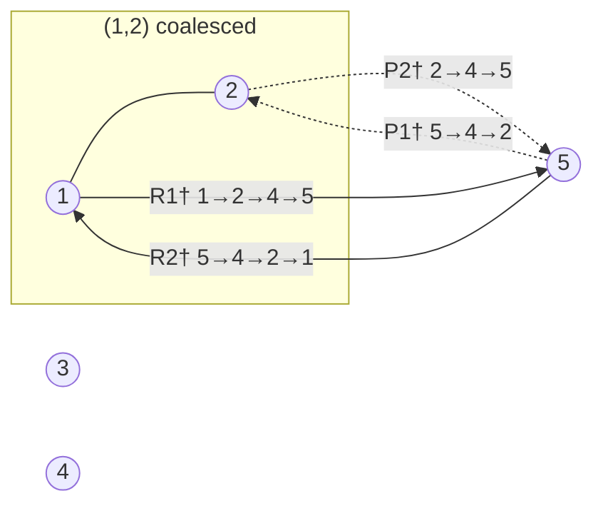
```mermaid
flowchart LR
  subgraph C12["(1,2) coalesced"]
    I1((1)) --- I2((2))
  end
  I3((3))
  I4((4))
  I5((5))
  I1 -->|"R1† 1→2→4→5"| I5
  I5 -->|"R2† 5→4→2→1"| I1
  I5 -.->|"P1† 5→4→2"| I2
  I2 -.->|"P2† 2→4→5"| I5
```

### T9 — Primary Universal Term

| | |
|---|---|
| Function | Universal Discretion |
| Registry crosswalk | family `T9`, variant `T9O` (conflict C-004 on hierarchy vs. cycle placement) |
| Structural signature | `T20` · `((((()))))` · M = 31 = p11 |
| Configuration | full hierarchy (1)⊂(2)⊂(3)⊂(4)⊂(5); archetypal |

**Cyclic relations.**
- `R1` (efferent, `1→2→3→4→5`, **source-attested**) — the hierarchy that specifies the
  relationship of all five interfaces in all 20+ Terms, including Expressive and
  Regenerative Modes.
- `R2` (afferent, `5→4→3→2→1`) — regenerative traversal in return through the stacked
  interfaces.

**Linear projections.**
- `P1` (input, `4→2`) — discretionary access to relevant quantized elements for recall from
  the Void.
- `P2` (output, `1→2→3→4→5`) — prescription of the five successive Steps of each System 5
  Cycle: the archetype of the species working with the Secondary Universal Term of the
  person (T1-9).

**Virtual images.** None recorded — universal and archetypal; transcends space and time.

**Regenerative mode.** Expressive and regenerative modes traverse the same stacked
hierarchy in opposite senses, (1) and (2) changing places across the perceptual axis.

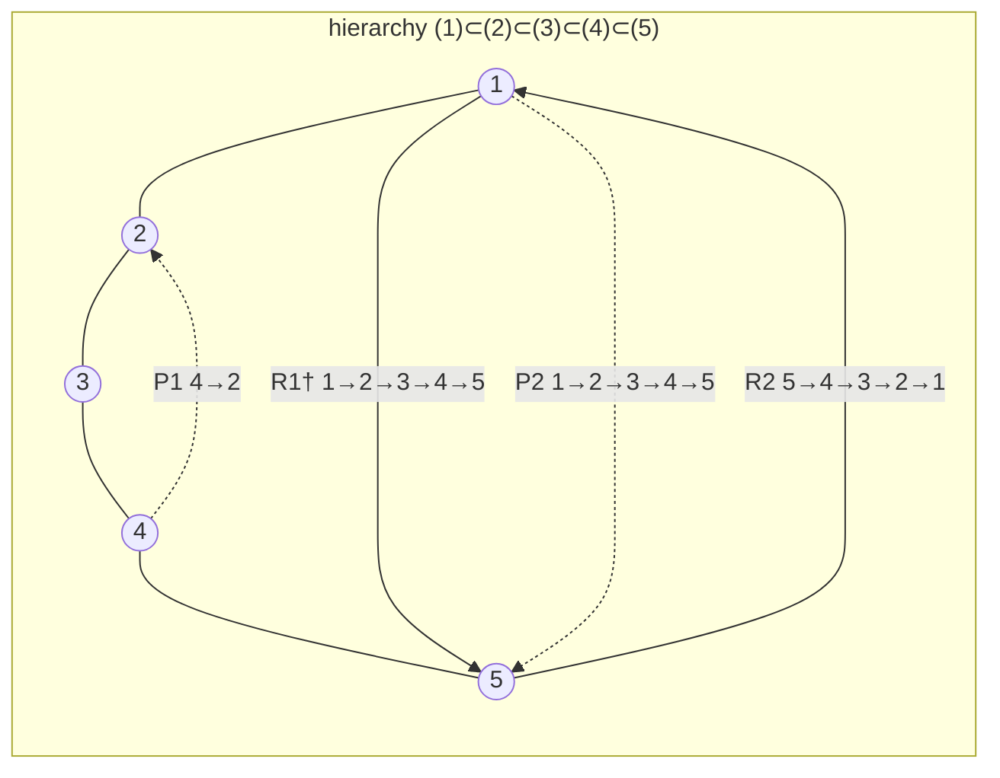
```mermaid
flowchart LR
  subgraph H["hierarchy (1)⊂(2)⊂(3)⊂(4)⊂(5)"]
    I1((1)) --- I2((2)) --- I3((3)) --- I4((4)) --- I5((5))
  end
  I1 -->|"R1† 1→2→3→4→5"| I5
  I5 -->|"R2 5→4→3→2→1"| I1
  I4 -.->|"P1 4→2"| I2
  I1 -.->|"P2 1→2→3→4→5"| I5
```

---

## 6. Transjectively Oriented Universal Terms

Spanning both series, transferring discretion and goal between them. Registry note: the
p. 5 crosswalk places the transfer tokens `T05`/`T07` near the `T0` family without an
equivalence rule, and p. 2 reverses the pair, so their registry crosswalk is **unresolved**
(conflict C-002); the registry keeps `T0` free of transfer tokens.

### T2-5 — Transfer of Universal Discretion between the Autonomic and Somatic Series

| | |
|---|---|
| Function | Discretion Transfer |
| Registry crosswalk | unresolved (C-002) |
| Structural signature | `T05` · `(()())(())` · M = 21 = p4·p2 (association per pp. 17–18; p. 2 reverses the T05/T07 pair — not adjudicated) |
| Configuration | (1,2) coalesced as one **across both series**; closed triad (3,4,5) on each side |

**Cyclic relations.**
- `R1` (efferent, `1→2→3→4→5`) — expressive: discretion passes from the subjective
  hierarchy (T1-9) to sanction objective action (T9) — one discretionary authority relating
  from within each closed interface of either series, as in System 2 the universal Centre 1
  relates from within each particular Centre 2.
- `R2` (afferent, `5→4→3→2→1`) — regenerative: discretion returns from the objective
  account (T8) to re-order the subjective priorities (T1-8, T1-9).

**Linear projections.**
- `P1` (output, `2→3→4`) — license for which autonomic urges may recruit somatic routines.
- `P2` (output, `2→4→3`) — license for which somatic programs may draw on autonomic fuel.

**Virtual images (structural).** The closed (3,4,5) triad with coalesced (1,2) is exactly
the configuration that generates the three virtual images `I_3,4`, `I_4,5`, `I_3,5` — here
read as the one discretionary authority relating from within each closed pair. T2-5 is a
candidate for the unnamed members of the attested virtual-image trio (OQ-001).

**Mode.** Interjective in the manner of Term 3 of System 4: it does not itself perceive,
act or remember. Being universal it does not exist as a thing in space and time; it is
archetypal, confined within and linking the particular Terms of both series.

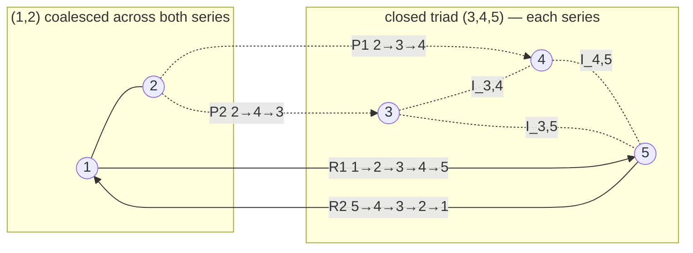
```mermaid
flowchart LR
  subgraph C12["(1,2) coalesced across both series"]
    I1((1)) --- I2((2))
  end
  subgraph T345["closed triad (3,4,5) — each series"]
    I3((3))
    I4((4))
    I5((5))
    I3 -. "I_3,4" .- I4
    I4 -. "I_4,5" .- I5
    I3 -. "I_3,5" .- I5
  end
  I1 -->|"R1 1→2→3→4→5"| I5
  I5 -->|"R2 5→4→3→2→1"| I1
  I2 -.->|"P1 2→3→4"| I4
  I2 -.->|"P2 2→4→3"| I3
```

### T2-7 — Transfer of Goal between the Autonomic and Somatic Series

| | |
|---|---|
| Function | Goal Transfer |
| Registry crosswalk | unresolved (C-002) |
| Structural signature | `T07` · `((()))(())` · M = 15 = p3·p2 (association per p. 17; p. 2 reverses the T05/T07 pair — not adjudicated) |
| Configuration | (1,2) coalesced holding one goal for both hierarchies; closed triad (3,4,5) presents the goal on each side in its own register |

**Cyclic relations.**
- `R1` (efferent, `1→2→3→4→5`) — expressive: the goal passes from felt need (T1-1, T1-2)
  to enacted aim (T2, T3).
- `R2` (afferent, `5→4→3→2→1`) — regenerative: the achieved form (T5–T8) is transferred
  back as the measure of the need's satisfaction, closing the Cycle that Universal
  Discretion (T2-5) opened.

**Linear projections.**
- `P1` (output, `2→3`) — the goal presented in the autonomic register: a felt urge to be
  discharged.
- `P2` (output, `2→5`) — the goal presented in the somatic register: a form to be realized
  in the world.

**Virtual images (structural).** Corresponds to the Goal Term of System 3 (3T3,
Idea=(Routine=Form)) elaborated to five interfaces: the goal is a **virtual coincidence of
routine and form held inside the idea** — `I_4,5` emphasized, with `I_3,4` and `I_3,5`
relating the felt urge to routines and form within the closed triad. T2-7 is a candidate
for the unnamed members of the attested virtual-image trio (OQ-001).

**Mode.** Like all universal Terms it is unique and archetypal: many acts, one goal
structure, prescribing with T2-5 the coherence of the five successive Steps of each
System 5 Cycle.

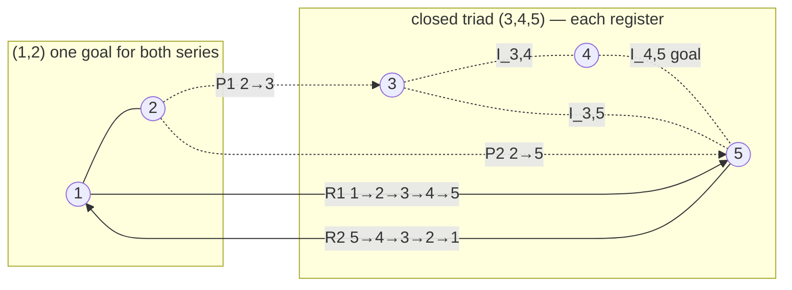
```mermaid
flowchart LR
  subgraph C12["(1,2) one goal for both series"]
    I1((1)) --- I2((2))
  end
  subgraph T345["closed triad (3,4,5) — each register"]
    I3((3))
    I4((4))
    I5((5))
    I4 -. "I_4,5 goal" .- I5
    I3 -. "I_3,4" .- I4
    I3 -. "I_3,5" .- I5
  end
  I1 -->|"R1 1→2→3→4→5"| I5
  I5 -->|"R2 5→4→3→2→1"| I1
  I2 -.->|"P1 2→3"| I3
  I2 -.->|"P2 2→5"| I5
```

---

## 7. Coverage and correspondence

| Subjective (Autonomic) | Objective (Somatic) | Function |
|---|---|---|
| T1-1 — Field of Perception ✅ | T1 — Need Perception | Perception of need |
| T1-2 — Virtual Assessment of Need ✅ | T2 — Idea Creation | Idea creation / assessment |
| T1-3 — Virtual Image Triad ✅ | T3 — Idea Transfer | Idea transfer / restraint |
| T1-4 — Organized Input | T4 — Organized Input | Organized input |
| T1-5 — Physical Action | T5 — Physical Action | Physical action |
| T1-6 — Corporeal Body | T6 — Corporeal Body | Corporeal body |
| T1-7 — Quantized Memory | T7 — Quantized Memory | Quantized memory |
| T1-8 — Balanced Response | T8 — Balanced Response | Balanced response |
| T1-9 — Universal Discretion | T9 — Primary Universal Term ✅ | Universal discretion / hierarchy |

Transjective Universal Terms spanning both series: **T2-5 — Discretion Transfer** and
**T2-7 — Goal Transfer**. ✅ = full description present in the original source PDFs
(`sources/`) and their extractions (`extracted/`).

## Appendix A — Corpus p. 5 structural crosswalk

Source-attested pairing of numbered tokens with parenthesis structures and named variants
(Dan Explorations p. 5; registry variant tokens per
[docs/13](13%20-%20Provisional%20T0-T9%20Term%20Specification.md)).

| Token | Structure | M | Primes | Term | Registry variant |
|---|---|---|---|---|---|
| `T01` | `()()()()()` | 32 | p1·p1·p1·p1·p1 | T1-1 Field of Perception | `T1S` (C-001) |
| `T02` | `(())()()()` | 24 | p2·p1·p1·p1 | T1-2 Virtual Assessment of Need | `T2S` (C-001) |
| `T03` | `(())(())()` | 18 | p2·p2·p1 | T1-3 Virtual Image Triad | `T3S` |
| `T04` | `(()())()()` | 28 | p4·p1·p1 | T1-4 Organized Input | `T4S` |
| `T05` | `(()())(())` | 21 | p4·p2 | T2-5 Discretion Transfer | unresolved (C-002) |
| `T06` | `((()))()()` | 20 | p3·p1·p1 | T1-5 Physical Action | `T5S` |
| `T07` | `((()))(())` | 15 | p3·p2 | T2-7 Goal Transfer | unresolved (C-002) |
| `T08` | `(()()())()` | 38 | p8·p1 | T1-6 Corporeal Body | `T6S` |
| `T09` | `((()()))()` | 34 | p7·p1 | T1-7 Quantized Memory | `T7S` |
| `T10` | `((())())()` | 26 | p6·p1 | T1-8 Balanced Response | `T8S` |
| `T11` | `(((())))()` | 22 | p5·p1 | T1-9 Universal Discretion | `T9S` |
| `T12` | `(()()()())` | 53 | p16 | T1 Need Perception | `T1O` |
| `T13` | `((())()())` | 37 | p12 | T2 Idea Creation | `T2O` |
| `T14` | `((())(()))` | 23 | p9 | T3 Idea Transfer | `T3O` |
| `T15` | `((()())())` | 43 | p14 | T4 Organized Input | `T4O` |
| `T16` | `(((()))())` | 29 | p10 | T5 Physical Action | `T5O` |
| `T17` | `((()()()))` | 67 | p19 | T6 Corporeal Body | `T6O` |
| `T18` | `(((()())))` | 59 | p17 | T7 Quantized Memory | `T7O` |
| `T19` | `(((())()))` | 41 | p13 | T8 Balanced Response | `T8O` |
| `T20` | `((((()))))` | 31 | p11 | T9 Universal Discretion | `T9O` (C-004) |

## Appendix B — Issue-supplied 5T01–5T20 inventory (transcribed, not adjudicated)

The originating issue supplies a `5T01`–`5T20` inventory with the caveat *"numbering of
terms may need revision!"*. Every row's Matula number is internally consistent with its
parenthesis form, but several token↔structure and token↔name pairings diverge from the
corpus p. 5 crosswalk above. The divergence is recorded here as **OQ-002** and left
unresolved.

| Issue row | Issue name | vs. corpus |
|---|---|---|
| 32 · `5T01` · `()()()()()` = p1p1p1p1p1 | Virtual Image Triad as Intuitive Vision | structure matches `T01`; corpus pairs `T01` with T1S *Need Perception* — name diverges |
| 24 · `5T02` · `(())()()()` = p2p1p1p1 | Virtual Assessment of Need | matches |
| 18 · `5T03` · `(())(())()` = p2p2p1 | Parasympathetic Restraint of Action | matches (paraphrase of the T1-3 triad's restraining function) |
| 28 · `5T04` · `(()())()()` = p4p1p1 | Sympathetic Commitment of the Body | structure matches `T04`; corpus pairs `T04` with T4S *Organized Input* — name diverges (corpus places Sympathetic Commitment at `T06`) |
| 20 · `5T05` · `((()))()()` = p3p1p1 | Transfer of Goal between Autonomic and Somatic Series | structure is corpus `T06`; corpus `T05` = `(()())(())` p4p2 *Discretion Transfer* — structure and name diverge |
| 21 · `5T06` · `(()())(())` = p4p2 | Proprioceptive Registration of Enacted Routine | structure is corpus `T05`; corpus `T06` = `((()))()()` p3p1p1 *Physical Action* — structure and name diverge |
| 15 · `5T07` · `((()))(())` = p3p2 | Transfer of Discretion between Autonomic and Somatic Series | structure matches `T07`; corpus pp. 17–18 pair `T07` with *Goal Transfer* (p. 2 reverses the pair — C-002) |
| 38 · `5T08` · `(()()())()` = p8p1 | The Felt Body as Lived Form | matches |
| 26 · `5T09` · `((())())()` = p6p1 | Emotional Consolidation of the Act | structure is corpus `T10`; corpus `T09` = `((()()))()` p7p1 — forms swapped with `5T10`, names in corpus positions |
| 34 · `5T10` · `((()()))()` = p7p1 | Homeostatic Reconciliation of Urge and Outcome | structure is corpus `T09` — forms swapped with `5T09`, names in corpus positions |
| 22 · `5T11` · `(((())))()` = p5p1 | Experiential Hierarchy of Values | matches (paraphrase of Subjective Universal Hierarchy) |
| 53 · `5T12` · `(()()()())` = p16 | Field of Perception as Physical Circumstance | matches |
| 37 · `5T13` · `((())()())` = p12 | Recall of a Responsive Idea from the Void | matches |
| 23 · `5T14` · `((())(()))` = p9 | Commitment of Idea to Nervous Infrastructure | matches |
| 43 · `5T15` · `((()())())` = p14 | Sensory Organization of the Field of Action | matches |
| 29 · `5T16` · `(((()))())` = p10 | Motor Execution in the World | matches |
| 67 · `5T17` · `((()()()))` = p19 | The Body as Object among Objects | matches |
| 41 · `5T18` · `(((())()))` = p13 | Consolidation of Technique | structure is corpus `T19`; corpus `T18` = `(((()())))` p17 — forms swapped with `5T19`, names in corpus positions |
| 59 · `5T19` · `(((()())))` = p17 | Balanced Evaluation of Intent and Result | structure is corpus `T18` — forms swapped with `5T18`, names in corpus positions |
| 31 · `5T20` · `((((()))))` = p11 | Discretionary Hierarchy of Priorities | matches (paraphrase of Primary Universal Term) |

The issue also sketches the lower systems for context (4T1–4T9, 3T1–3T4, 2T1–2T2, 1T1);
System 5's `R_n`/`P_k`/`I_i,j` grammar specializes the System 3 Relational Wholes (p. 66)
and the System 4 interjective Term 3 referenced by T2-5.

## Open questions

- **OQ-001 — the virtual-image trio.** The corpus states three of the twenty Terms have
  virtual images and names only T1-2. T1-3 (the Virtual Image Triad itself) and the
  closed-triad transjective Terms T2-5/T2-7 are structural candidates; this document marks
  T1-2 and T1-3 `source-attested` and T2-5/T2-7 `structural` without resolving the trio.
- **OQ-002 — issue-inventory numbering.** The `5T01–5T20` inventory reorders several
  token↔structure pairings relative to the corpus p. 5 crosswalk (05/06, 09/10 and 18/19
  swaps, plus name divergences at 01 and 04–07) and itself flags that the numbering may
  need revision. Transcribed in Appendix B; not adjudicated.

## Conflicts referenced

C-001 (T1-1/T01 numbering style), C-002 (transfer-token association reversed between p. 2
and pp. 17–18), C-003 (registry family naming), C-004 (T9 hierarchy vs. cycle placement),
C-007 (crosswalk completeness) — all tracked in
[docs/13](13%20-%20Provisional%20T0-T9%20Term%20Specification.md) and analyzed in
[docs/15](15%20-%20T0-T9%20Conflict%20Resolution%20Analysis.md); none are resolved here.

## References

- [`system5-term-descriptions.md`](../system5-term-descriptions.md) — full Term
  descriptions (primary prose source)
- [`extracted/t1-1-perception-of-need/`](../extracted/t1-1-perception-of-need/t1-1-perception-of-need.md),
  [`extracted/t1-2-assessment-of-need/`](../extracted/t1-2-assessment-of-need/t1-2-assessment-of-need.md),
  [`extracted/t1-3-virtual-image-triad-…/`](../extracted/t1-3-virtual-image-triad-system-5-bob-re-back-in-thailand/t1-3-virtual-image-triad-system-5-bob-re-back-in-thailand.md),
  [`extracted/t-9-primary-universal-term/`](../extracted/t-9-primary-universal-term/t-9-primary-universal-term.md)
- [`extracted/sys-5-dan-explorations-v7/`](../extracted/sys-5-dan-explorations-v7/sys-5-dan-explorations-v7.md)
  — p. 5 crosswalk, p. 51 virtual-image count, p. 66 R1/R2, pp. 68–69 hierarchy
- [docs/13](13%20-%20Provisional%20T0-T9%20Term%20Specification.md),
  [docs/15](15%20-%20T0-T9%20Conflict%20Resolution%20Analysis.md),
  [docs/16](16%20-%20Twenty-Term%20Passive%20and%20Active%20Views.md)

