# Connecting The Many Awesomes! (Integral, Pattern D and More)

> Source: `sources/Connecting The Many Awesomes! (Integral, Pattern D and More).pdf` | Pages: 26 | Extraction: embedded text layer, with Tesseract OCR fallback for image-only pages.

---

## Page 1 (OCR)

t_)
Kayla Pretorius.

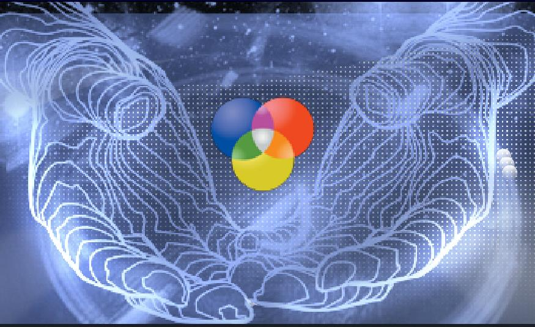
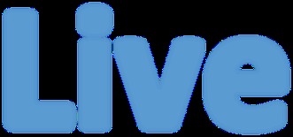
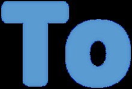
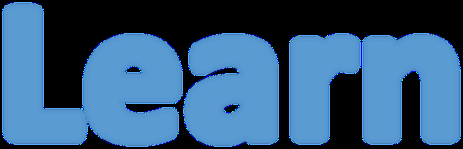
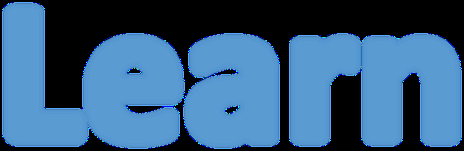
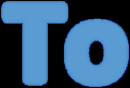
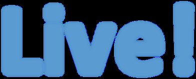

---

## Page 2

Hello Team  
 
I thought that it’ll be a really cool idea to share with you a few things that I have learnt 
throughout this year, working close to Dan gives me the opportunity to see the different 
things he’s doing and the roots he wants to take for the future. Of cause, nothing is set 
in stone yet, but looking at all these amazing things people have discovered and created 
sparks that creative thought in all of us, just this brief explanation might spring up and 
idea, share it with us…. even if you might think it’s silly…. We want to hear it! I cannot 
say that I have a full understanding of these things but I will explain best I can!  
 
What I have Learnt:  
1. Integral Theory & Tetra Dynamics  
2. Spiral Dynamics  
3. Semiotic Triad  
4. Pattern Dynamics

---

## Page 3

Integral Theory & Tetra Dynamics 
 
A little History of Integral 
In 1970 Ken Wilber started Integral Theory with the publication of the spectrum of consciousness. Models of 
psychology developed that describe human development as following a set course of stages of 
development. In 1995 Wilber first began using the word “Integral” in his book “Sex, Ecology, spirituality” this 
is where he first introduced the Quadrant Model, which is now iconic of his work which is also known as 
AQAL Model (All Quadrants, All Levels, All Lines, All States and all Types). These signify some of the most 
basic repeating patterns of reality, so by including these patterns you cover the bases well ensuring that no 
major part of any solution is left out or neglected. These 5 elements can be used to “Look At” reality and at 
the same time they represent the basic aspects of your own awareness in this and every moment.  
 
What is Integral Theory?  
Integral means comprehensive, inclusive, non-marginalizing, embracing. The integral approaches to any 
field attempt to be exactly that, to include as many perspectives, styles and methodologies as possible 
within a coherent view of the topic. In a sense, it’s a meta-paradigm OR ways to draw together an already 
existing number of separate paradigms into an interrelated network of approaches that are mutually 
enriching.  
 
What is the purpose of Integral Theory? 
The world has never been so complex as it is right now, it is mind boggling and at times emotionally 
overwhelming. Not to mention, the world only seems to get more complex and cacophonous as we confront 
the major problems of our day: extreme religious fundamentalism, environmental degradation, failing 
education systems, existential alienation, and volatile financial markets. There’s never have there been so 
many disciplines and worldviews to consider and consult in addressing these issues, a cornucopia of 
perspectives. But without a way of linking, leveraging, correlating, and aligning these perspectives, their 
contribution to the problems we face are largely lost or compromised. We are now part of a global 
community and we need a framework, global in vision yet also anchored in the minutiae of our daily lives, 
that can hold the variety of valid perspectives that have something to offer our individual efforts and 
collective solution building.  
 
What is it used for?  
Integral Theory has a comprehensive nature and because of this it is used in 35 distinct academic and 
professional fields, such as:  
 art  
 healthcare  
 organizational management  
 ecology  
 congregational ministry  
 economics  
 psychotherapy  
 law  
 feminism

---

## Page 4

Integral weaves together the significant insights from all the major human disciplines of knowledge, 
including the natural and social sciences as well as the arts and humanities, as mentioned above.  
It can be used to develop an approach to personal transformation and integration called Integral Life 
Practice (ILP), this allows you to systematically explore and develop multiple aspects of themselves, like 
your emotional intelligence, cognitive awareness, interpersonal relationships and spiritual wisdom. Integral 
theory systematically includes more of reality and interrelates it more thoroughly than any other current 
approach to assessment and solution building, it has the potential to be successful in dealing with the 
complex problems we face today.  
Integral Theory provides individuals and organisations with a powerful framework that’s suitable to virtually 
any context and can be used at any scale, not only because it organizes all existing approaches and 
disciplines of analysis and action but because it also allows a practitioner to select the most relevant and 
important tools, techniques and insights.  
 
Understanding the Quadrants.  
There’s at least 4 irreducible perspectives (Subject, intersubjective, objective and interobjective) that must 
be consulted when attempting to fully understand any issue or aspect of reality. Therefore, the quadrants 
express the simple recognition that everything can be viewed from 2 fundamental distinctions: 
1. An inside and an outside perspective 
2. From a singular and plural perspective.  
 
The 4 quadrants also represent dimensions of reality, they’re actual aspects of the world that are always 
present in each moment. For instance, all individual creatures (including animals) have some form of 
subjective experience and intentionality, or interiors, as well as various observable behaviours and 
physiological components, or exteriors.  
Individuals are never just alone but are members of groups or collectives. The interiors of collectives are 
known generally as intersubjective cultural realities whereas their exteriors are known as ecological and 
social systems, which are characterized by interobjective dynamics. These four dimensions are represented 
by four basic pronouns: “I”, “we”, “it”, and “its.” Each pronoun represents one of the domains in the quadrant 
model: “I” represents the Upper Left (UL), “We” represents the Lower Left (LL), “It” represents the Upper 
Right (UR), and “Its” represents the Lower Right (LR).

---

## Page 5

Integral embraces the complexity of reality, each quadrant simultaneously arising. 
Example:  
I decide I need to buy some flowers for the garden and I have the thought, “I want to go to the nursery.” The 
integral framework demonstrates that this thought and its associated action (e.g., driving to the garden store 
and purchasing roses) has at least four dimensions, none of which can be separated because they co-arise 
(or tetra-mesh) and inform each other. First, there is the individual thought and how I experience it (e.g., 
mentally calculating travel time, the experience of joy in shopping, or the financial anxiety over how I will pay 
for my purchase). These experiences are informed by psychological structures and somatic feelings 
associated with the UL quadrant. At the same time, there is the unique combination of neuronal activity, 
brain chemistry, and bodily states that accompany this thought, as well as any behaviour that occurs (e.g., 
putting on a coat, getting in the car). These behaviours are associated with various activities of our brain 
and physiological activity of the body, which are associated with the UR quadrant. Likewise, there are 
ecological, economic, political, and social systems that supply the nursery with items to sell, determine the 
price of flowers.  
These systems are interconnected through global markets, national laws, and the ecologies associated with 
the LR quadrant. There is also a cultural context that determines whether I associate “nursery” with an 
open-air market, a big shopping mall, or a small stall in an alley, as well as determining the various 
meanings and culturally appropriate interactions that occur between people at the nursery. These cultural 
aspects are associated with worldviews in the LL quadrant. 
 
 
Therefore, to have a full understanding of and appreciation for the occurrence of the thought, “I’m going to the 
nursery,” one cannot explain it fully through just the terms of either psychology (UL), or neurobiology and physiology 
(UR), or social and economic dynamics (LR), or cultural meaning (LL). For the most complete view, as we will see, 
one should take into consideration these domains (and their respective levels of complexity).

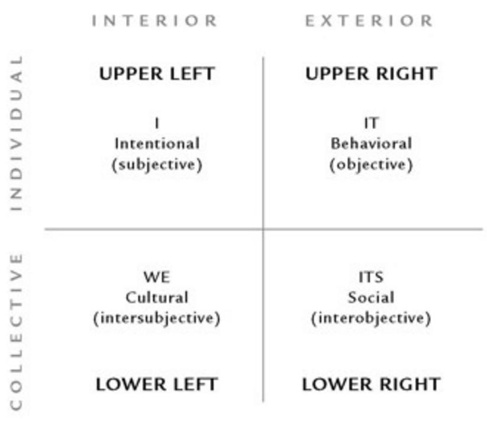

---

## Page 6

Why is this practical?  
Well if we tried to summarize this simple situation by leaving out one or more perspectives, a fundamental aspect of 
the integral whole would be lost and our ability to understand it and address it would be compromised. Often people 
use the quadrants as their first move to scan a situation or issue and bring multiple perspectives to bear on the inquiry 
at hand. 
 
Fig1.  
 
 
As mentioned before, there’s at least two ways to depict and use the quadrant model: as dimensions or 
as perspectives. The first, a quadratic approach, depicts an individual situated in the center of the quadrants (see Fig. 
3). The arrows point from the individual toward the various realities that he can perceive because of his own 
embodied awareness. Through his use of different aspects of his own awareness, or through formal methods based 
on these dimensions of awareness, he can encounter these different realities in a direct and knowable fashion. 
Basically, he has direct access to experiential, behavioural, cultural, and social/systemic aspects of reality because 
these are actual dimensions of his own existence. This is useful to him because it empowers him to notice, 
acknowledge, and interact more effectively with his world. In short, the more of these “channels” he has open the 
more information he will be obtaining about what is happening around him and he will be able to feel and act in ways 
that are timely and insightful. Notice right now how you are engaged in all three perspectives: first-person (e.g., 
noticing your own thoughts as you read this), second-person (e.g., reading my words and interpreting what I am trying 
to convey), and third-person (e.g., sitting there aware of the light, sounds, and air temperature around you). Do you 
see how you are always experiencing the world from all four quadrants—right here, right now? It is that simple 

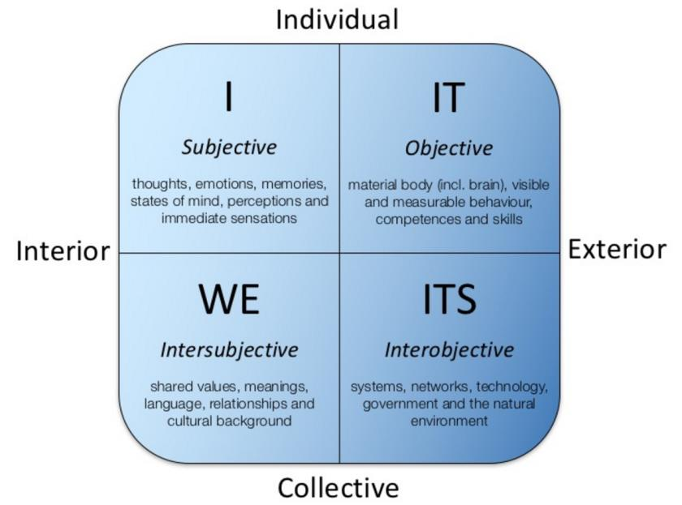
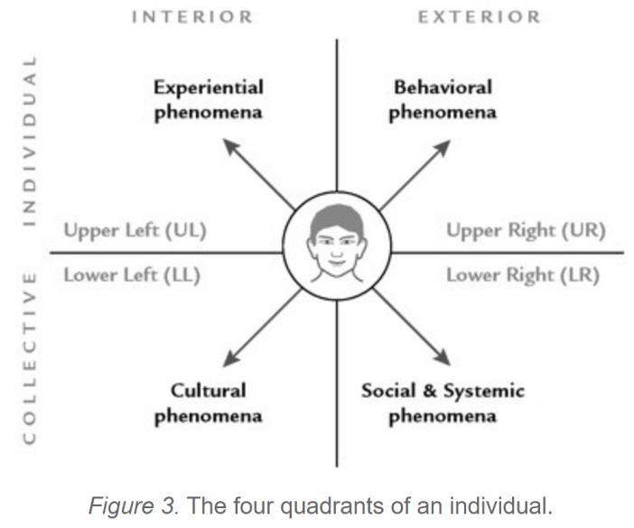

---

## Page 7

Within each quadrant there are levels of development. Within the interior, Left-Hand quadrants there are 
levels of depth and within the exterior, Right-Hand quadrants there are levels of complexity. The levels 
within each quadrant are best understood as probability waves that represent the dynamic nature of reality 
and the ways different realities show up under certain conditions. Additionally, each quadrant’s levels are 
correlated with levels in the other quadrants. For example, a goal-driven executive (UL) who has high blood 
pressure (UR) will most likely be found in a scientific-rational culture or subculture (LL), which usually occurs 
in industrial corporate organizations (LR).  
 
Examples:

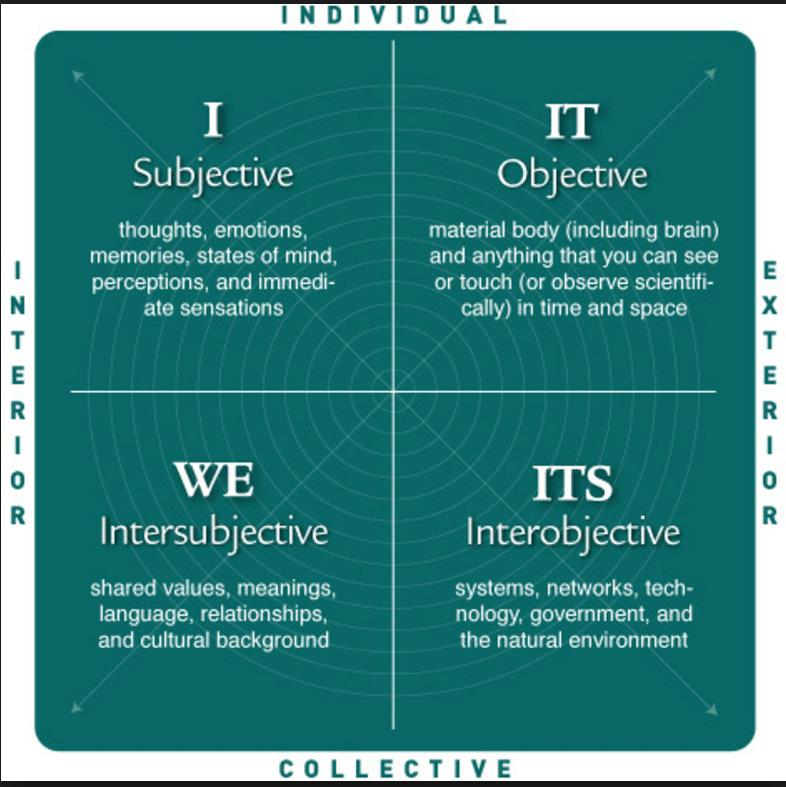

---

## Page 8

Below are 2 examples of Malnutritioned Children in Africa, one is looking AT the people and the second one 
is looking AS the Malnutritioned Children.

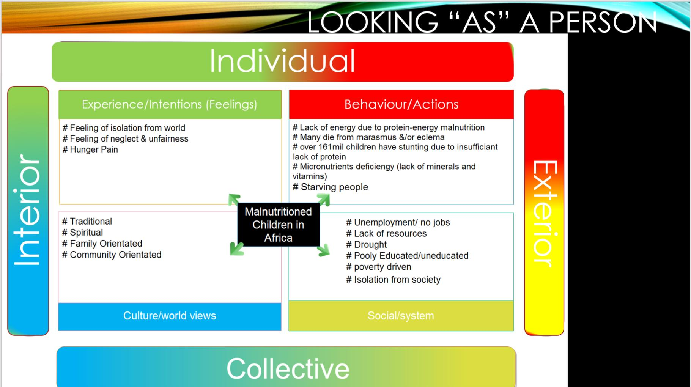
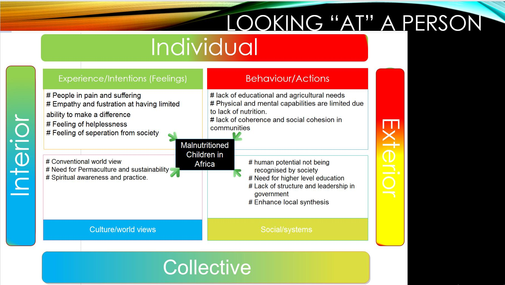

---

## Page 9

Spiral Dynamics 
 
 A little History… 
Dr Clare W Graves was a US psychologist and is the originator of human development (1950-60s), 
otherwise known as Gravesian Theory/Spiral Dynamics/ Emergent Cyclical Levels of Existence Theory 
(ECLET). Graves was seeking to understand human nature, and questions like: 
why are people different? 
why do some people change but others do not? 
how does the mind respond to a world that becomes increasingly complex? 
 
Graves began looking for patterns of human development and how they related to other theories, and spent 
over 20 years gathering primary data from thousands of sources. He was originally seeking to validate his 
contemporary and friend Abraham Maslow’s Hierarchy of Needs, but Graves’s data revealed that the 
hierarchy does not work universally. Graves’s research revealed eight kinds of responses (so far in human 
experience) or ‘levels’, tinted with variations as people entered and exited the eight levels. Graves’s health 
declined and he died in 1986 before he could finish and publish his research, which is perhaps why his work 
is not as well-known as Maslow’s, or as recognised as Myers-Briggs. 
Graves’s work, also known as ‘Gravesian Theory’, was taken up and developed by two of his students, 
Christopher Cowan and Don Beck, who coined the term ‘spiral dynamics’. Beck later went on to work with 
Ken Wilber, the latter of whom is best known for Integral Theory. Cowan now works with Natasha 
Todorovic, and their Spiral Dynamics teaching remains closest to Graves’s original work, with the 
pair documenting Graves’s research in The Never ending Quest. 
Graves’s research resulted in a theory he called the ‘Emergent Cyclical Levels of Existence Theory’, 
that humans evolve not just physically but also socially and psychologically, which he summarised as 
follows:

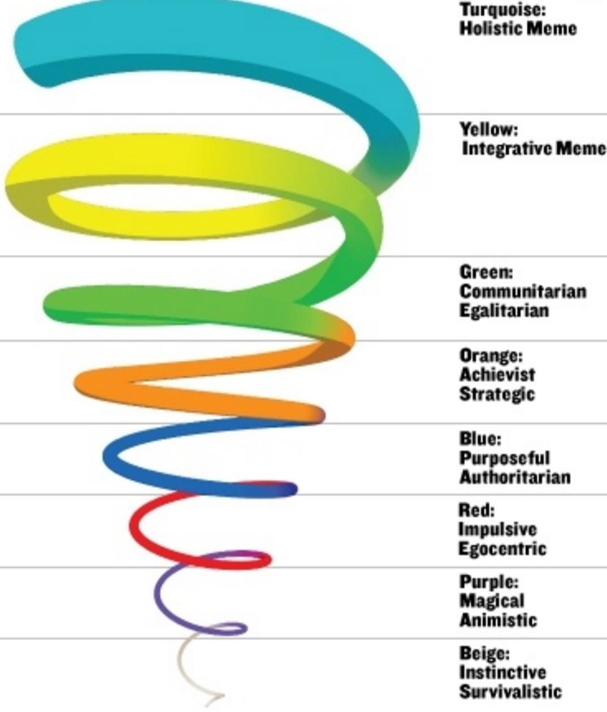

---

## Page 10

“The psychology of the mature human being is an unfolding, emergent, oscillating, spiralling process, 
marked by progressive subordination of older, lower-order behaviour systems to newer, higher-order 
systems as man’s existential problems change” 
He observed that as certain levels of complexity were reached, the minds ability to make sense of the world 
became overburdened, and to cop, the mind must create more complex models of reality to deal with the 
new problems of existence. 
 
Understanding Spiral Dynamics.  
Grave’s Double Helix System describes interplay between the world and the human response to it 
(Structure/Environment and Behaviour/Actions).  
 
Helix 1 (life conditions, reality):  
o 
what’s the world like for this person or group?  
o 
What are the times like, the physical place, the problems of existence, where is it necessary to put 
attention and energy? 
o 
commencing with ‘A’ (image below) 
 Helix 2 (mind capacities, neurobiological response):  
o 
what’s the toolkit that person or group has for dealing with that world?  
o 
What is the ‘coping system’ an individual, group or society develops to cope with those life conditions? 
o 
commencing with ‘N’ (image below)  
 
The combinations of Helix 1 and Helix 2 represent the eight levels identified by Graves. 
 
Levels of Psychological Existence 
These levels represent a conceptual space, or systems in people.  
 
Graves used a two-letter system to represent the eight levels he identified: 
o 
The first letter (commencing with ‘A’) denotes the Helix 1 ‘life conditions’  
o 
The second (commencing with ‘N’), the Helix 2 ‘mind capacities’

---

## Page 11

Ken Wilber used Spiral Dynamics to simplify and communicate the essence of a developmental model in a way that 
not only explains but also illuminates are one of his most important contributions to the popular understanding of both 
the existence and importance of Stages in Human Development.

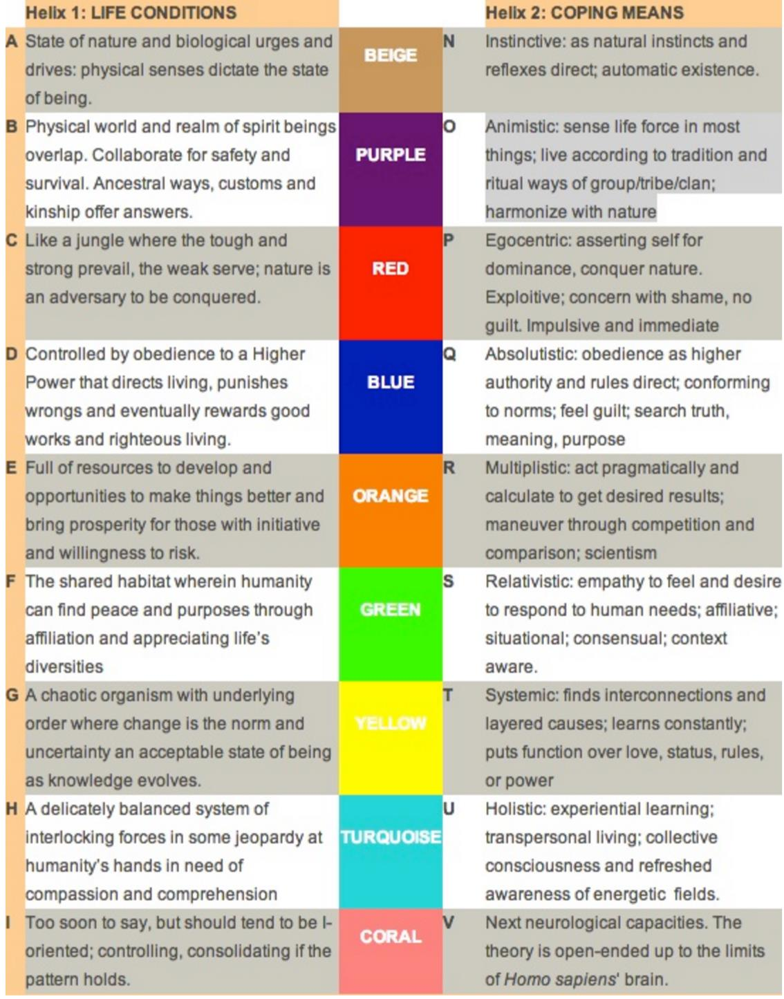

---

## Page 12

Spiral Dynamics and the Waves of Existence 
The First 6 Levels – Subsistence Levels Marked by “first-tier thinking”.  
Then there occurs a revolutionary shift in consciousness… 
The Last 2 Levels – Being Levels “Second-tier thinking”  
Below is a brief description of the 8 waves. 
Level 1 BEIGE (A-N) existential: survival, biogenic needs satisfaction, reproduction, satisfy instinctive urges 
Reactive, biologically driven, living in a state of nature, limited sense of cause and effect; there is very little of this 
level remaining, although people can regress into it (eg. Alzheimers). 
 
Level 2 PURPLE (B-O) animistic: placate spirit realm; honour ancestors; protection from harm; family bonds 
Subsumed in the group, no separate identity of ‘I’ – the focus is on co-operation, sharing, ritual; conflict will endanger 
the tribe, who have the forces of nature to contend with. 
 
Level 3 RED (C-P) egocentric: power/action, asserting self to dominate others, control, sensory pleasure 
Breaking away from the tribe, impulsive, seeking respect, honour and avoiding shame and establishing the self, might 
is right; the world is adversarial, uncaring, only raw power will let me prevail. 
 
Level 4 BLUE (D-Q) absolutistic: stability/order, obedience to earn reward later, meaning, purpose, certainty 
Emerges from the chaos of C-P – obedience to rightful authority, binary thinking, categorising, deny self for ‘the one 
right way’, stability and security is achieved through sacrifice and submission, doing things by the book/manual; 
bringing in new norms undermines control/authority. 
 
Level 5 ORANGE (E-R) multiplistic: opportunity/success, competing to achieve results, influence, autonomy 
Emerges from the rigidity of D-Q, how to manouver rather than comply, many ways and criteria rather than one right 
way or set of standards, goal directed, independent, self-sufficient, confident, experiment to find the best among many 
possible choices, future oriented and competitive; work for the good life and abundance, the winners deserve their 
rewards. 
 
Level 6 GREEN (F-S) relativistic: harmony/love, joining together for mutual growth, awareness, belonging 
Emerges in response to the excesses of E-R, can’t do it on my own and need to collaborate with others, group 
membership highly valued, tolerates ambiguity through encountering diverse perspectives, requires trust, doesn’t 
want to hurt others; high empathy and sensitivity to others – everybody counts. 
 
Level 7 YELLOW (G-T) systemic: independence/self-worth, fitting a living system, knowing, good questions 
Demands flexibility, autonomy, accepts paradoxes and uncertainties, self interest without harm to others, curiosity, 
learns from a variety of sources, contextual thinkers, can see things but not always be able to explain them, great 
awareness of what they do and don’t understand, punished by conventional education and corporate structures; not 
motivated by fear of survival, God or social approval, guilt and reward motivators don’t work – seeks to do well without 
compulsive drives and ambitiousness. 
 
Level 8 TURQUOISE (H-U) still developing global community/life force; survival of life on a fragile Earth; 
consciousness 
 
What can we use it for?  
 
Spiral Dynamics introduces a new model for plotting the enormous economic and commercial shifts that are making 
contemporary business practice so complex and apparently fragmented.  
 
Focusing on:  
 
 
cutting-edge leadership  
 
management systems  
 
processes  
 
procedures and techniques

---

## Page 13

 
the authors synthesize changes  
 
Benefits? 
 
Increasing cultural diversity.  
 
Powerful new social responsibility initiatives.  
 
The arrival of a truly global marketplace. 
 
Spiral Dynamics has been used with individuals; governments; and in marketing, and has been beneficial in 
these settings; 
 
This psycho-social-spiritual theory has been referred to as the “The Theory that Explains Everything”.  It was 
later clarified by Dr Beck and Dr. Christopher Cowan in their seminal book, Spiral Dynamics, Mastering Values 
Leadership and Change. 
 
The theory combines biology, psychology, and sociology in trying to describe differences in human thinking 
and behaviour. 
The key things to remember when learning about these value systems and stages are: 
 
There is no “right” or “wrong” way of thinking; 
 
That the world needs people who think at different levels along the “spiral” to survive; 
 
When we move on to the next “stage” we integrate the values of the previous “stages” so that we can utilize them 
if needed; 
 
A person, culture, or society can “spiral” back to a previous stage in certain circumstances, and may become 
“stuck” at an earlier way of thinking; 
 
Lower levels are not aware of the existence of the higher levels; 
 
Individuals and Societies are best served by leaders, including coaches, who are thinking at the higher levels, 
who can recognize others at different stages along the “continuum”, and use this knowledge to help solve issues 
according to the applicable ways of thinking, or value systems. 
How is learning about this going to benefit us in terms of our interactions with, and understanding 
of others? 
 
Reminds us that we are all individuals, with different value systems, ways of thinking, and different ways of interacting 
with the world.  It therefore follows that we cannot assume that any individual does, or should think the same way we 
do.  
 
Knowledge of this theory can also help us in coaching and communicating with others, whether it is on an individual 
level; through professional coaching, via marketing; or in a more global sense.  If we can understand where another 
person is coming from in term of their values and thinking, then we can tailor our communications to that person, 
audience, or community to foster a stronger connection. 
 
If we can understand where our Clients are coming from in terms of their values and thinking, we can help them find 
solutions that are appropriate for them, and that will resonate with them much better! 
 
Integrate the body, mind, soul and spirit in enriching the human experience 
 
Many of our dysfunctional actions and social breakdowns stem from our own personal fragmentation. While the Age 
of Enlightenment brought us many benefits of a material nature, we are now aware that such "progress" came with a 
price. We found ourselves separated from our spiritual sense, from the deeper values that resonate in our individual 
and cultural cores. Yet, it does no good to reject totally any of our senses of self. The key to health and well-being, 
within both a short-term context and the longer flow, is to search for ways to mesh these attributes in an integral 
whole. 
 
There are plenty of opportunities to access some of these intangible but powerful practices. They should be 
developed in our youth while they are open to the inner life and welcome experiences designed to expand conceptual 
horizons. And adults, who are growing weary of the fast-track, technology-rich and digitized world around them, often 
search for ways to express a spiritual sense, or bond themselves with a transcendent cause, or renew their souls by 
reconnecting with nature's wonder.

---

## Page 14

Semiotic Triad 
 
 
A little history of Semiotics… 
Charles Sanders Peirce (1839–1914) began writing on semeiotic, also known as the theory of sign, 
relations in the 1860s, around the time that he devised his system of three categories. He eventually 
defined semiosis as an action, or influence, which is, or involves, a cooperation of three subjects, such as a 
sign, its object, and its interpretant, this tri-relative influence not being in any way resolvable into actions 
between pairs. This specific type of triadic relation is fundamental to Peirce's understanding of "logic as 
formal semiotic". By "logic" he meant philosophical logic. He eventually divided (philosophical) logic, or 
formal semiotic, into speculative grammar, on the elements of semiosis (sign, object, interpretant), how 
signs can signify and, in relation to that, what kinds of signs, objects, and interpretants there are, how signs 
combine, and how some signs embody or incorporate others, logical critic, or logic proper, on the modes of 
inference, and speculative rhetoric, or metrocentric, the philosophical theory of inquiry, including his form of 
pragmatism. 
Across the course of his intellectual life, Peirce continually returned to and developed his ideas about signs 
and semiotic and there are three broadly delineable accounts: a concise Early Account from the 1860s, a 
complete and relatively neat Interim Account developed through the 1880s and 1890s and presented in 
1903, and his speculative, rambling, and incomplete Final Account developed between 1906 and 1910. 
These three accounts, and traces the changes that led Peirce to develop earlier accounts and generate 
new, more complex, sign theories. However, despite these changes, Peirce's ideas on the basic structure of 
signs and signification remain largely uniform throughout his developments. Consequently, it is useful to 
begin with an account of the basic structure of signs according to Peirce. 
 
 
What is Semiotics?  
 
The study of meaning-making, the study of sign processes and meaningful communication. This includes 
the  
Study of:  
o signs and sign processes (semiosis)

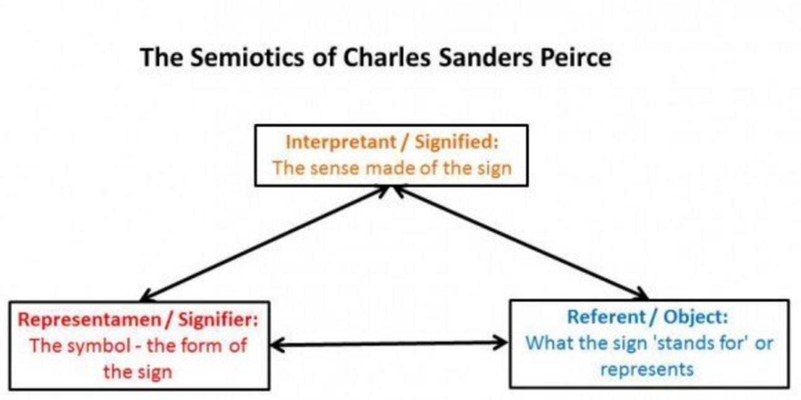

---

## Page 15

o Indication  
o Designation  
o Analogy  
o Allegory  
o Metonymy  
o Metaphor  
o Symbolism  
o Signification  
o Communication.  
Semiotics is closely related to the field of linguistics, which studies the structure and meaning 
of language more specifically. The semiotic tradition explores the study of signs and symbols as a 
significant part of communications. As different from linguistics, however, semiotics also studies non-
linguistic sign systems. 
Semiotics is frequently seen as having important anthropological dimensions; for example, the late Italian 
semiotician and novelist Umberto Eco proposed that every cultural phenomenon may be studied as 
communication. Some semioticians focus on the logical dimensions of the science, however. They examine 
areas belonging also to the life sciences—such as how organisms make predictions about, and adapt to, 
their semiotic niche in the world (see semiosis). In general, semiotic theories take signs or sign systems as 
their object of study: the communication of information in living organisms is covered in biosemiotics  
Semiotics is the study of works of art signs and symbols, either individually or grouped in sign systems that 
can give us more insight from the work source and meaning. All painters work in a pictorial language by 
following a set of standards, basics and rules of picture-making. There is a big resemblance between 
pictorial image making and the creation of written language, the study of this nature of what consists and the 
individual components of pictorial and written language is known as Semiotics. 
Semiotics can translate a picture from an image into words. Visual communication terms and theories come 
from linguistics, the study of language, and from semiotics, the science of signs. Signs take the form of 
words, images, sounds, odours, flavours, acts or objects, but such things have no natural meaning and 
become signs only when we provide them with meaning. 
 
 
How It All Works? 
Peirce conceives of and discusses things like representations, interpretations, and assertions broadly and in 
terms of philosophical logic, rather than in terms of psychology, linguistics, or social studies. He places 
philosophy at a level of generality between mathematics and the special sciences of nature and mind, such 
that it draws principles from mathematics and supplies principles to special sciences. On one hand, his 
semiotic does not resort to special experiences or special experiments to settle its questions. On the other 
hand, he draws continually on examples from common experience, and his semiotic is not contained in a 
mathematical or deductive system and does not proceed chiefly by drawing necessary conclusions about 
purely hypothetical objects or cases. As philosophical logic, it is about the drawing of conclusions deductive, 
inductive, or hypothetically explanatory. Peirce's semiotic, in its classifications, its critical analysis of kinds of 
inference, and its theory of inquiry, is philosophical logic studied in terms of signs and their triadic relations 
as positive phenomena in general. 
 
Peirce's Sign Theory is an account of signification, representation, reference and meaning. Although sign 
theories have a long history, Peirce's accounts are distinctive and innovative for their breadth and 
complexity, and for capturing the importance of interpretation to signification. For Peirce, developing a 
thoroughgoing theory of signs was a central philosophical and intellectual preoccupation. The importance of 
semiotic for Peirce is wide ranging. As he himself said “it has never been in my power to study anything, 
mathematics, ethics, metaphysics, gravitation, thermodynamics, optics, chemistry, comparative anatomy, 
astronomy, psychology, phonetics, economics, the history of science, whist, men and women, wine, 
metrology, except as a study of semiotic”. Peirce also treated sign theory as central to his work on logic, as

---

## Page 16

the medium for inquiry and the process of scientific discovery, and even as one possible means for 'proving' 
his pragmatism. Its importance in Peirce's philosophy, then, cannot be overestimated. 
 
Going Through the elements- Basic Sign Structure 
In one of his many definitions of a sign, Peirce writes: 
I define a sign as anything which is so determined by something else, called its Object, and so determines 
an effect upon a person, which effect I call its interpretant, that the latter is thereby mediately determined by 
the former.  
Peirce's basic claim that signs consist of three inter-related parts, a sign, an object, and an interpretant. We 
can think of the sign as the signifier, for example, a written word, an utterance, smoke as a sign for fire etc. 
The object, on the other hand, is best thought of as whatever is signified, for example, the object to which 
the written or uttered word attaches, or the fire signified by the smoke. The interpretant, the most innovative 
and distinctive feature of Peirce's account, is best thought of as the understanding that we have of the 
sign/object relation. The importance of the interpretant for Peirce is that signification is not a simple dyadic 
relationship between sign and object: a sign signifies only in being interpreted. This makes the interpretant 
central to the content of the sign, in that, the meaning of a sign is manifest in the interpretation that it 
generates in sign users. Things are, however, slightly more complex than this and we shall look at these 
three elements in more detail. 
 
The Signifying Element of Signs 
The very first thing to note is that there are some potential terminological difficulties here. We appear to 
be saying that there are three elements of a sign, one of which is the sign. This is confusing and does not 
fully capture Peirce's idea. Strictly speaking, for Peirce, we are interested in the signifying element, and it is 
not the sign that signifies. In speaking of the sign as the signifying element, then, he is more properly 
speaking of the sign refined to those elements most crucial to its functioning as a signifier. Peirce uses 
numerous terms for the signifying element including “sign”, “representamen”, “representation”, and “ground”. 
Here we shall refer to that element of the sign responsible for signification as the “sign-vehicle”. 
Peirce's idea that a sign does not signify in all respects and has some particular signifying element is 
perhaps best made clear with an example. Consider, for instance, a molehill in my lawn taken as a sign of 
moles. Not every characteristic of the molehill plays a part in signifying the presence of moles. The colour of 
the molehill plays a secondary role since it will vary according to the soil from which it is composed. 
Similarly, the sizes of molehills vary according to the size of the mole that makes them, so again, this 
feature is not primary in the molehill's ability to signify. What is central here is the causal connection that 
exists between the type of mound in my lawn and moles: since moles make molehills, molehills signify 
moles. Consequently, primary to the molehill's ability to signify the mole is the brute physical connection 
between it and a mole. This is the sign-vehicle of the sign. For Peirce, then, it is only some element of a sign 
that enables it to signify its object, and when speaking of the signifying element of the sign, or rather, the 
sign-vehicle, it is this qualified sign that he means. 
The Object 
Just as with the sign, not every characteristic of the object is relevant to signification: only certain features of 
an object enable a sign to signify it. For Peirce, the relationship between the object of a sign and the sign 
that represents it is one of determination: the object determines the sign. It’s perhaps best understood as 
the placing of constraints or conditions on successful signification by the object, rather than the 
object causing or generating the sign. The idea is that the object imposes certain parameters that a sign 
must fall within if it is to represent that object. However, only certain characteristics of an object are relevant 
to this process of determination. To see this in terms of an example, consider again the case of the molehill. 
The sign is the molehill, and the object of this sign is the mole. The mole determines the sign, in as much 
as, if the molehill is to succeed as a sign for the mole it must show the physical presence of the mole. If it 
fails to do this, it fails to be a sign of that object. Other signs for this object, apart from the molehill, might 
include the presence of mole droppings, or a pattern of ground subsidence on my lawns, but all such signs

---

## Page 17

are constrained by the need to show the physical presence of the mole. Clearly, not everything about the 
mole is relevant to this constraining process: the mole might be a conventional black colour/an albino, it 
might be male/female, it might be young/old. None of these features, however, are essential to the 
constraints placed upon the sign. Rather, the causal connection between it and the mole is the 
characteristic that it imposes upon its sign, and it is this connection that the sign must represent if it is to 
succeed in signifying the mole. 
The Interpretant 
Although there are many features of the interpretant, here we shall mention just two.  
First, although we have characterized the interpretant as the understanding we reach of some sign/object 
relation, it is perhaps more properly thought of as the translation or development of the original sign. The 
idea is that the interpretant provides a translation of the sign, allowing us a more complex understanding of 
the sign's object.  
Second, just as with the sign/object relation, Peirce believes the sign/interpretant relation to be one of 
determination: the sign determines an interpretant. Further, this determination is not determination in any 
causal sense, rather, the sign determines an interpretant by using certain features of the way the sign 
signifies its object to generate and shape our understanding. So, the way that smoke generates or 
determines an interpretant sign of its object, fire, is by focusing our attention upon the physical connection 
between smoke and fire. 
Any instance of signification contains a sign-vehicle, an object and interpretant. Moreover, the object 
determines the sign by placing constraints which any sign must meet if it is to signify the object. 
Consequently, the sign signifies its object only in virtue of some of its features. The sign determines an 
interpretant by focusing our understanding on certain features of the signifying relation between sign and 
object. This enables us to understand the object of the sign more fully. 
Although this is a general picture of Peirce's ideas about sign structure, and certain features are present, or 
given greater or lesser emphasis at various points in Peirce's development of his theory of signs, this triadic 
structure and the relation between the elements is present in all of Peirce's accounts. The corresponding 
sign typologies, look at the transitions between these accounts, and examine some of the issues that arise 
from them. 
 
 
Understanding Semiotics… 
We seem as a species to be driven by a desire to make meanings. Distinctively, we make meanings 
through our creation and interpretation of 'signs'. Indeed, according to Peirce, 'we think only in signs'. Signs 
take the form of words, images, sounds, odours, flavours, acts or objects, but such things have no intrinsic 
meaning and become signs only when we invest them with meaning. 'Nothing is a sign unless it is 
interpreted as a sign', declares Peirce. Anything can be a sign as long as someone interprets it as 
'signifying' something - referring to or standing for something other than itself. We interpret things as signs 
largely unconsciously by relating them to familiar systems of conventions. It is this meaningful use of signs 
which is at the heart of the concerns of semiotics. 
The sign is the whole that results from the association of the signifier with the signified. The relationship 
between the signifier and the signified is referred to as 'signification'. The horizontal line marking the two 
elements of the sign is referred to as 'the bar'. 
If we take a linguistic example, the word 'Open' (when it is invested with meaning by someone who 
encounters it on a shop doorway) is a sign consisting of: 
a signifier: the word open; 
a signified concept: that the shop is open for business.

---

## Page 18

A sign must have both a signifier and a signified. You cannot have a totally meaningless signifier or a 
completely formless signified. A sign is a recognizable combination of a signifier with a particular signified. 
The same signifier (the word 'open') could stand for a different signified (and thus be a different sign) if it 
were on a push-button inside a lift ('push to open door'). Similarly, many signifiers could stand for the 
concept 'open' (for instance, on top of a packing carton, a small outline of a box with an open flap for 'open 
this end') - again, with each unique pairing constituting a different sign. 
Nowadays, whilst the basic 'Saussurean' model is commonly adopted, 
it tends to be a more materialistic model than that of Saussure himself. 
The signifier is now commonly interpreted as the material (or physical) 
form of the sign - it is something which can be seen, heard, touched, 
smelt or tasted.  
A linguistic sign is not a link between a thing and a name, but between 
a concept and a sound pattern. The sound pattern is not actually a 
sound; for a sound is something physical. A sound pattern is the 
hearer's psychological impression of a sound, as given to him by the 
evidence of his senses. This sound pattern may be called a 'material' element only in that it is the 
representation of our sensory impressions. The sound pattern may thus be distinguished from the other 
element associated with it in a linguistic sign. This other element is generally of a more abstract kind: the 
concept.  
Saussure was focusing on the linguistic sign (such as a word) and he 'phonocentrically' privileged 
the spoken word, referring specifically to the image acoustique ('sound-image' or 'sound pattern'), seeing 
writing as a separate, secondary, dependent but comparable sign system. Within the ('separate') system of 
written signs, a signifier such as the written letter 't' signified a sound in the primary sign system of language 
(and thus a written word would also signify a sound rather than a concept). Thus for Saussure, writing 
relates to speech as signifier to signified. Most subsequent theorists who have adopted Saussure's model 
are content to refer to the form of linguistic signs as either spoken or written. We will return later to the issue 
of the post-Saussurean 'rematerialization' of the sign. 
At around the same time as Saussure was formulating his model of the sign, of 'semiology' and of a 
structuralist methodology, across the Atlantic independent work was also in progress as the pragmatist 
philosopher and logician Charles Sanders Peirce formulated his own model of the sign, of 'semiotic' and of 
the taxonomies of signs. In contrast to Saussure's model of the sign in the form of a 'self-contained dyad', 
Peirce offered a triadic model: 
The Sign: the form which the sign takes (not necessarily material); 
An Interpretant: not an interpreter but rather the sense made of the sign; 
An Object: to which the sign refers.

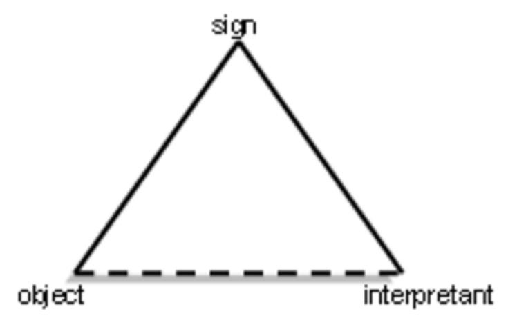
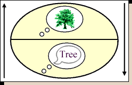

---

## Page 19

Just a couple examples:  
Based upon how they convey meaning (i.e., the relationship between the representamen and 
the object), Peirce classified signs as icons, indices, and symbols (note that like "sign", these terms do not 
refer to their common usage). 
 
An icon is a sign in which the representamen is perceived as resembling (i.e., having some of the 
qualities of) the object. In Peirce's words, such a sign "refers to the Object that it denotes merely by 
virtue of characters of its own ... such as a lead-pencil streak as representing a geometrical line." 
For example, the trashcan "icon" (in computer-speak) is iconic of an actual trashcan, and the 
action of moving a file "icon" into the trashcan "icon" is iconic of the actual action of putting something 
in the trash. Also, the sound effects (usually) played when buddies sign on and off of a chat client are 
iconic of the actual sounds of a door opening and closing respectively. 
A diagrammatic icon is a type of icon that preserves the geometric properties of the object; in this 
sense, the resemblance is not necessarily based on their similarity in appearance, but on the 
relationships between their parts. For example, the trashcan "icon" discussed previously would be 
better described as being diagrammatic iconic. 
 
An index is a sign in which the representamen is in some way (i.e., physically or causally) directly 
connected to the object. Unlike an icon, an index has no significant resemblance to the object. 
Instead, there exists a law-like relationship between the representamen x and the object y: if x, there 
always or usually is a y (it is for this reason that unedited photographs and video--which are indexical 
of the effect of light on the film--are often admissible as evidence). 
 The earlier mentioned trashcan "icon" is indexical of the process of deletion; similarly, a diskette 
"icon" is indexical of the process of saving. The "Blue Screen of Death" is indexical of the computer 
having crashed. Also, a person's username and password are together indexical of that person (and 
hence can be used for authentication). 
 
A symbol is a sign in which the relationship between the representamen and the object is arbitrary or 
conventional (i.e., it must be learnt). According to Peirce, such a sign "is constituted a sign merely or 
mainly by the fact that it is used and understood as such." 
 Language is generally considered to be symbolic. Logos (such as AOL's Running Man) are 
symbolic of the corresponding company. Also, using colours (red, yellow, and green) to represent the 
quality of connection (poor, fair, and excellent respectively) in a network status "icon" is symbolic.

---

## Page 20

Pattern Dynamics 
 
History 
Pattern Dynamics is the brainchild of Tim Winton, who developed the concept over a period of 20 years 
working in sustainability. His background is in Permaculture, Integral Theory, and Natural Systems Design. 
Working closely with ecologically-designed agriculture and forestry systems in Australia, he could see 
clearly “how things are organized as holarchies where there is a fine balance between the role of the unique 
parts and the integrative whole system.” – Tim.  
 
What is Pattern Dynamics? 
Pattern Dynamics is a language of visual Patterns, a ‘Sustainability Pattern Language’, that will help you 
understand, communicate and design solutions at the systems level. By learning Pattern Dynamics you will 
gain a powerful new capacity as a ‘systems thinker’, a skill that is often thought to be unteachable. 
 
Benefits: 
With this skill, you will learn to create:

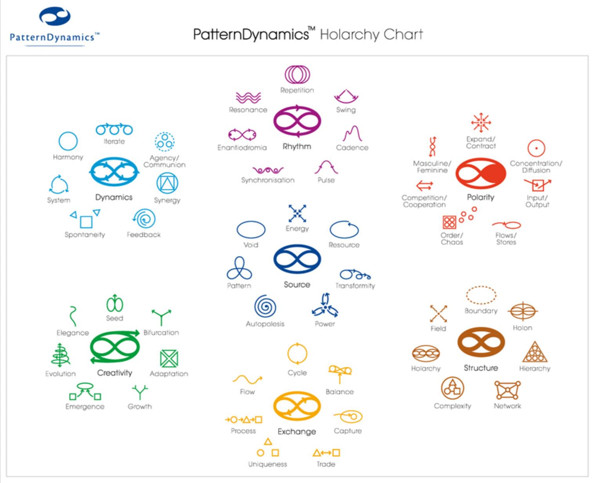

---

## Page 21

- 
Cultures of Sustainability and to facilitate Deep Sustainability Design  
- 
Sustainability strategies that help resolve complex challenges at any level of organisation 
- 
From the community to the planetary and in any domain  
- 
From business to governance to institutional. 
 
Understanding Pattern Dynamics and Why it was Created… 
The tagline of Pattern Dynamics has recently been changed from “Learning the principles of sustainability 
through the patterns of nature” to “Collaborative systems thinking for thriving in a complex world.” This is 
partly due to finding the demand for this work so far to be primarily in organizational settings. 
The major problem was not in finding technical solutions, but rather in working with the social dimension. 
“Our challenge is complexity,” Tim says, “how we come to terms as humans with organizing ourselves so 
that we can actually steward this planet and have a sustainable civilization.” 
Pattern Dynamics grew out of what he calls “perspectival systems thinking:” self, culture, and nature. Things 
get very interesting when we begin to look at the “integrative systems view that can be applied to at least 
those three perspectives.” We’re talking about a broader level of systems thinking than is usually presented, 
which tends to focus on the biosphere and neglect the noosphere. 
 
Pattern Dynamics and Natures Patterns…. 
Nature has sustained thriving systems for hundreds of millions of years, and has demonstrated that 
integrating multiple patterns of organization is the key to sustaining those systems. Borrowing patterns from 
nature and applying those principles to human organizations, and then learning to balance and integrate 
them, can contribute significantly to the enduring health of those organizations. Tim has created pattern 
diagrams that represent those principles to create a language that can be used to communicate systems 
thinking. This language can then be used to facilitate organizational sustainability. 
Tim sees complexity as the major challenge in human living, and he observes that living systems handle 
complexity really, well. “The key to complexity is systems thinking, and the key to systems thinking is 
patterns. The key to patterns is using them as a language – an idea I borrowed from architect and 
mathematician Christopher Alexander’s book Notes on the Synthesis of Form.” 
“Language is really important for helping us to see things,” Tim tells his workshop participants. 
If we don’t have a symbol for something, it does not become enacted in our reality. Language and 
symbolling are profoundly important, and patterns are profoundly important in how parts come together into 
wholes. To have a thriving planetary civilization, there needs to be organizations at all scales and in all 
domains, that are sustainable to support that. Just like in ecology, each scale, and level of that ecology – all 
those scales of organization in nature need to be sustainable at their level and participate in the 
sustainability of the overall system. So, that’s the strategy behind Pattern Dynamics, its orientation with 
organizational settings, and trying to get traction there.

---

## Page 22

In terms of Integral Theory 
This approach is about horizontal health. It’s a typology, a set of types. These are horizontal distinctions – 
more about how the health functions at any level of the system… Developmentalism is a critical aspect of a 
more integral world, but I also think we can fixate on it, and maybe there needs to be a balancing – more of 
a horizontal-health-oriented approach, especially in organizational settings. 
Tim further explains that ultimately, Pattern Dynamics… 
Is a meaning-making tool. That’s why it’s a language.  Values, culture, and meaning are at the heart of how 
Pattern Dynamics works … So rather than having a cultural warfare between people who either fixate on or 
reject some patterns other groups crusade on, we can create a higher-order value system that values the 
health of the whole, where all the patterns are discussed, and how to balance and integrate them. 
Systems-thinking disciplines are often very complex, theoretical, hard to remember, and difficult to apply. 
Tim says “I love theory, but it’s only really meaningful to me when you can get traction through an 
application in the real world.” So, he has put great effort (along with help from collaborator Kamya O’Keeffe) 
1.61803398875 (Image 2 +3)

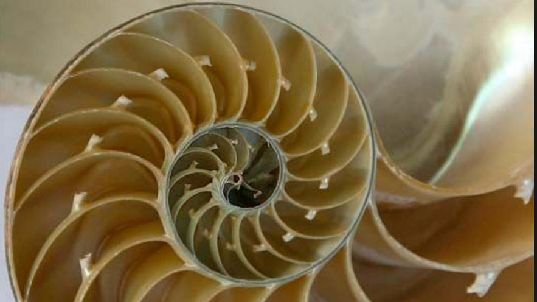
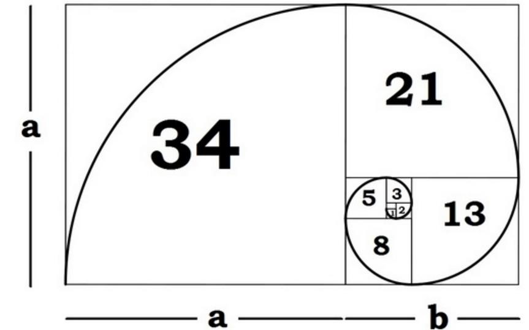

---

## Page 23

into making Pattern Dynamics “simple, sticky, and scalable.” The pattern diagrams work as a set of symbols 
that communicate how “wholes” work and whether they are healthy or not. Once you’ve made it visible, 
you’ve made it important, and valuable. This is how cultures work, and Pattern Dynamics is designed to 
create cultures of sustainability. 
Our strategies are:  
1) Trying to help people understand in their first-person environment  
2) Try and help people learn to communicate and establish a culture or set of values around how whole 
systems work to make them healthy. 
3) Then, and only then, do we move on to this work we call ‘deep sustainability design,’ creating cultures of 
sustainability where we develop strategies for intervening or changing something. 
The organizational development world with Pattern Dynamics as a tool is that you can go ahead and 
introduce strategies for development, but if cultures don’t value the strategy, then forget it. You can spend 
lots of money trying to force it and make it happen, but it won’t stick. But if you can establish the culture, and 
get agreement that it is of value, and people buy into it, your strategy will stick and be effective.

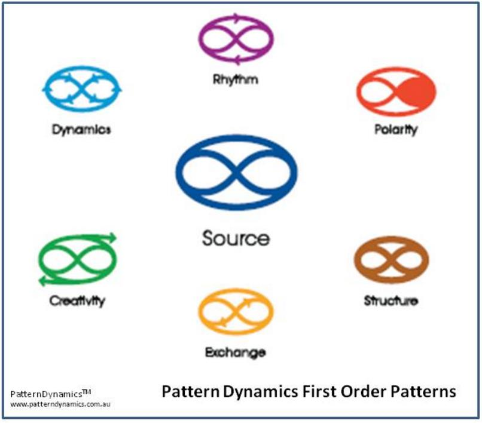

---

## Page 24

Source represents the fundamental pattern of organization at the heart of all systems, and that the Source 
of any organization is its identity and purpose. “If the identity and purpose is strong, there’s a strong sense 
of self-organization.” So, he asked for agreement, and for the group to read aloud together a “Source 
Commitment” statement that identified the identity and purpose of the temporary learning organization we 
were creating. 
Pattern Dynamics is bringing three major innovations to integral theory and practice. The first is to 
demonstrate that there are actually a whole range of foundational integrative perspectives and that these 
can be understood as  ‘meta-types’ or ‘meta-patterns’ that are useful from an integrative viewpoint (not just 
the five meta-types identified as the elements of the AQAL Integral framework–although this is an 
excellent starting place;) the second is that these can be collectively discovered through a second-person 
approach of ‘language’, as a complement to a prescribed first-person theoretical framework (a more 
semiotic approach as opposed to a more theoretical approach;) and, the third innovation is to bring a more 
dynamic approach where the ability to ‘shift’ patterns and perspectives (meta-types) and to balance and 
integrate them in service of health and evolution becomes at least as important as recognising and 
inhabiting the perspectives themselves. 
The analogy sometimes when describing this difference is that the AQAL Integral approach is like a deer 
and the Pattern Dynamics approach is like a kangaroo. They both inhabit analogous ecological niches, but 
they represent species of thought and practice that have evolved in different places from different grounding 
fields– theory vs semiotic, first-person orientation vs second-person orientation, pan-psychism vs pan-
semioticist, focus on individual practice vs focus on second-person enactment, individual 
enlightenment/emancipation vs social emancipation/enlightenment.

---

## Page 25

References 
http://www.spiraldynamics.ua/Graves/colors.htm 
http://www.cruxcatalyst.com/2013/09/26/spiral-dynamics-a-way-of-understanding-human-nature/ 
http://www.spiraldynamics.com/book/SDreview_Dinan.htm 
https://en.wikipedia.org/wiki/Don_Edward_Beck 
http://www.schoolofcoachingmastery.com/coaching-blog/bid/86888/What-is-Spiral-Dynamics-Coaching-and-
why-haven-t-we-heard-of-it 
http://rationalspirituality.com/articles/Ken_Wilber_Spiral_Dynamics.htm 
https://en.wikipedia.org/wiki/Semiotics 
http://visual-memory.co.uk/daniel/Documents/S4B/sem02.html 
http://artandperception.com/2007/02/how-useful-is-semiotics-as-a-method-for-analysing-works-of-art.html 
http://boards.straightdope.com/sdmb/showthread.php?t=194001 
http://integralcity.com/2013/02/05/systems-patterns-a-language-for-living/ 
https://conference.imp.fu-berlin.de/patterns-of-dynamics/home 
https://patterndynamics.net/ 
https://en.wikipedia.org/wiki/Integral_theory_(Ken_Wilber)

---

## Page 26 (OCR)

learn how fo see.

| Realize Ghat ever thin

> |
fic)

| connects fo evers thing ere.
~ Leonardo F mies

Learn more at
SpiritualGleansing.Org

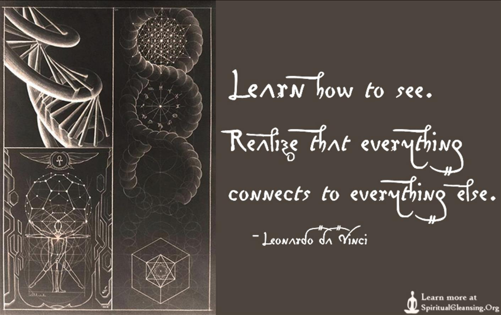

