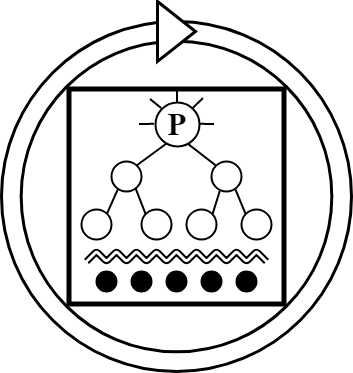
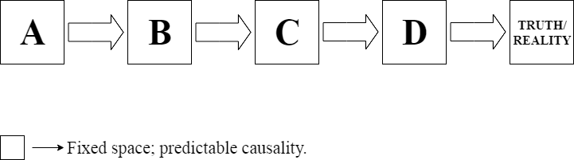
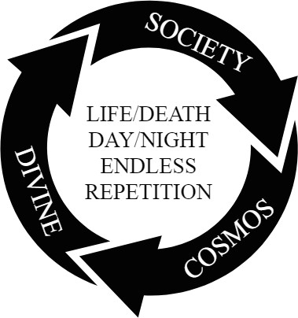
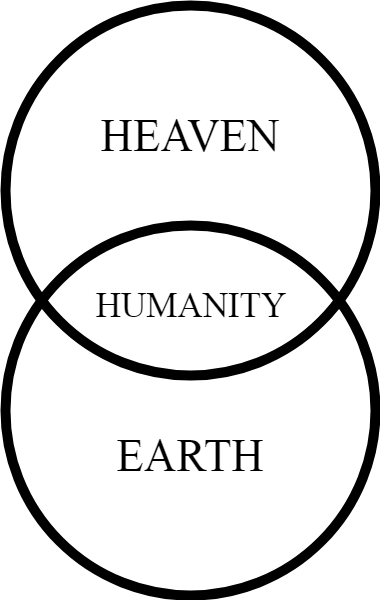
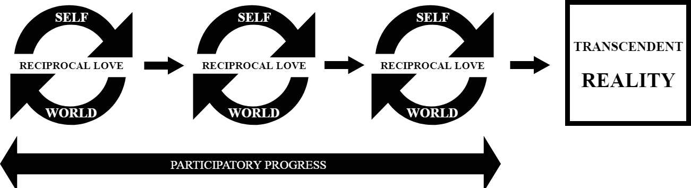
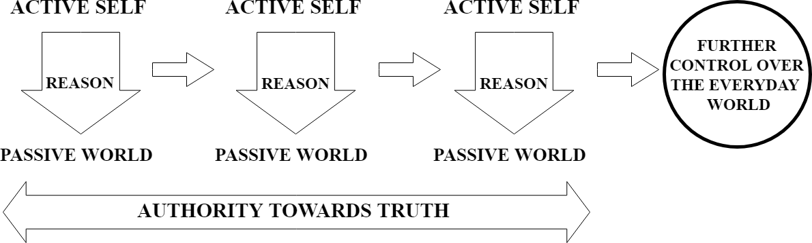
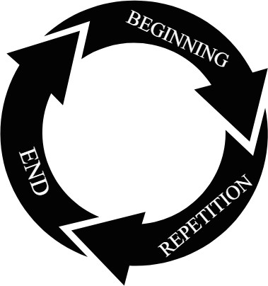
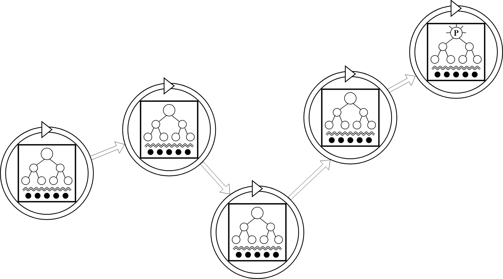
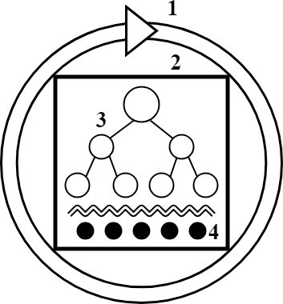

# Reconstructing the Narrative - A Literary Antidote to the Meaning Crisis - XD3 Xz RGB 2gY3

> Source: `sources/Reconstructing the Narrative - A Literary Antidote to the Meaning Crisis - XD3 Xz RGB 2gY3.pdf` | Pages: 36 | Extraction: embedded text layer, with Tesseract OCR fallback for image-only pages.

---

## Page 1

Reconstructing the Narrative 
A Literary Antidote to the Meaning Crisis 
 
STUDENT: Eric Bravo Górriz 
TUTOR: Dr. Rodrigo Andrés 
Barcelona, 11 de juny de 2019

---

## Page 2

ACKNOWLEDGEMENTS 
This is where people thank others for what they have done themselves. 
Themselves or, rather, who they call "I", which, ultimately, is nothing but the creation of those 
who cared; of those who once upon a time, maybe forever, loved – without question. 
God, agape, 神性: for many names only one; eternal, universal, yet so close, so deep. 
To you: thank you.

---

## Page 3

ABSTRACT 
The Meaning Crisis is the state we are currently living in, a time of great disagreement, 
confusion, and suffering, where the mechanisms we used to employ in order to properly extract 
meaning and progress towards wisdom are failing us. 
This project aims to be a literary response (and, hopefully, antidote) to the Meaning Crisis. 
In order to do so, I explore how the Meaning Crisis expresses itself in the stories we read 
through a historical analysis of the development of narratological models. 
Firstly, I delve into the teleological narrative and how it was transformed by the 
Enlightenment. 
Secondly, I analyze how the cyclical narrative of Modernism and Postmodernism was a 
critical response to the pitfalls of the teleological narrative. 
Finally, taking into account the strong and weak points of both the teleological and the cyclical 
narrative, I propose my own narratological model, called the narrative of traditional cosmology, 
which aims to be a bridge between the two, combining them together into a single model of 
production, analysis and consumption of literature. 
To conclude, I suggest that a model like the narrative of traditional cosmology could be a 
potentially successful antidote to the Meaning Crisis in the realm of literature, while also 
stressing the importance of practice and communion with the art of the word. 
Keywords: Meaning Crisis, Re-embedding, Narratology, Meaning, Wisdom

---

## Page 4

TABLE OF CONTENTS 
1. INTRODUCTION 
1.1. Motivations Behind this Study 
1.2. Introduction to The Meaning Crisis 
1.2.1. What do we Mean by Meaning? 
1.2.2. Definition & Project Thesis 
1.3. Procedure 
2. THE TELEOLOGICAL NARRATIVE 
2.1. Definition 
2.2. Two-World Mythology 
2.3. The Enlightenment: From Belief to Reason – From Participation to Authority 
3. THE CYCLICAL NARRATIVE 
3.1. Definition 
3.2. Emergence and Development – Modernism and Postmodernism 
3.3. The Re-Embedding 
4. THE NARRATIVE OF TRADITIONAL COSMOLOGY 
4.1. Introduction 
4.2. Definition 
4.3. Explanation of Terms and Concepts 
4.4. Function and Reasoning 
4.5. The Importance of Purpose, Communion and Practice 
5. EXAMPLES 
5.1. Teleological Narrative 
5.2. Cyclical Narrative 
5.3. The Narrative of Traditional Cosmology 
5. CONCLUSIONS 
REFERENCES

---

## Page 5

1. 
INTRODUCTION 
1.1. Motivations Behind this Study 
"And thou shalt remember all the way which the Lord thy God led thee these forty years in the 
wilderness, to humble thee, and to prove thee, to know what was in thine heart, whether thou 
wouldest keep his commandments, or no." (Deuteronomy 8:2, KJV) 
I started attending university in 2015. At the time, I had no great expectations, I was just hoping 
to live some new experiences, meet new people and learn some things along the way. 
However, the last four years I have been set on an adventure that has far surpassed my wildest 
dreams, although not precisely because of university itself, but rather due to my exposure to a 
greater phenomenon around it that has shaken my view of the world. In 2016, after the 
infamous Donald Trump got elected as president of the United States, I had the opportunity to 
witness a rather bizarre and yet fascinating event: I was in class, the day after the election. We 
were discussing the topic with our professor at the time, and the atmosphere of the classroom 
was not precisely joyful. Among the student’s facial expressions there was confusion, disbelief 
and even anger. Suddenly, the door opened; an unknown student poked his head in from the 
door and shouted: "Trump 2016, deal with it!" and ran away. In among the puzzlement of some 
and the laughter of others, a small group of female students ran towards the door to persecute 
the anonymous student; they were not happy at all. They felt personally attacked and 
responded furiously to the whole incident. This completely surreal situation seemed to me quite 
funny at first, but upon further examination, it made me feel worried and occasionally 
depressed. What was going on exactly? Why was there a feeling of tension and hostility all 
around the world? As this issue became more salient to me, I began to notice even more weird 
phenomena and behavior all around me: a significant number of parents started to doubt the 
effectiveness or even necessity of vaccines; more and more people, especially young men, 
suddenly became obsessed with Buddhism and Mindfulness; sexual promiscuity became the 
default sexual conduct among women close to me, my male friends periodically asked me for 
advise because they felt insecure as men, and many other phenomena. Meanwhile, in the 
social network I personally frequent, people were "comically" implying that they wished to die, 
while simultaneously in the UK the first cause of death among men between 20 and 40 is 
suicide (Office for National Statistics, 2015). In general, people complained about feeling 
isolated, disconnected from the world around them, while messaging from the slim yet thick 
screen of their smartphones. Even I would find myself entangled in a mixture of all of the 
previous, which paradoxically concluded in my rediscovery of my Christian faith. Something 
strange was going on, and I desperately needed answers. Consequently, a bit over a year ago, 
I began a quest to nail down and understand the roots and implications of these complex social 
and cultural phenomena that are persistently affecting the Western world in an unpredictable 
and dramatic manner. My Treball de Fi de Grau is all about my findings regarding this issue, 
what I will be referring to as the Meaning Crisis, a term suggested by John Vervaeke and his 
colleagues (Vervaeke, Mastropietro, Miscevic, 2017). 
Nevertheless, I am not a sociologist, nor a psychologist or a cognitive scientist; I have been 
trained in the arts of the word, I am indeed a philologist. Therefore, my point of view is always 
going to be from the word up; from the story to the individual and beyond. As a result, in my 
TFG I am going to craft an argument for the existence of the Meaning Crisis from the 
perspective of narratology, followed by a suggested literary antidote to said crisis: a pragmatic 
solution in the form of a narratological model of literary practice and analysis. My premise is the 
following: lives are stories, and therefore lives are informed by stories. If we could change the 
way in which we approach stories, in theory and practice, that could greatly help us change the 
way in which we approach life itself. This whole project is an attempt to shake and revive the 
mythological "grammar" (Nietzsche, 1982/1889) coded in our thought, to hopefully reactivate it 
and enhance it, so it can serve as a stepping stone in order to escape from the Meaning Crisis 
that is tearing apart the Western world as we know it.

---

## Page 6

1.2. Introduction to The Meaning Crisis 
The Meaning Crisis is an extremely complicated phenomenon to point to and define. There are 
compelling reasons as to why it remains a relatively obscure issue. 
First and foremost, it is a very recent phenomenon, it is in fact taking place right now, 
nowadays, everywhere. 
Second of all, there is very few academic / scientific research on the topic, although it is slowly 
becoming a priority, especially in the Cognitive Science departments around the world (for 
instance, Ferrari, Weststrate, 2013). This is partially due to its novelty, but also because some 
researchers either do not understand the importance of it, or are not aware of the concept. This 
note is not precisely a criticism towards the academic world, it is simply meant to show how 
entangled we are in this jumble of disbelief, skepticism and confirmation-bias. 
The Meaning Crisis is best identified in its consequences, in its effect on the real world. People 
are completely aware that there is something wrong with the way things are going, but find 
themselves so immersed in the whole mess that end up unable to actually act against it; the 
current is too strong for some to swim against it. 
Regardless, for the purpose of this study I do have to define what exactly the Meaning Crisis is. 
The main challenge is that the Meaning Crisis is an incredibly extensive and dense topic, it 
ranges in all sorts of branches: from philosophy to psychology, from psychology to sociology, 
etc. However, in order to put the issue into words and synthesize it as much as possible, I do 
need to take a particular approach: the literary point of view. I am going to focus on how the 
Meaning Crisis lays itself out in the literary sphere, in the narratives, in the stories that inform 
us.

---

## Page 7

1.2.1. What do we Mean by Meaning? 
To start with, it is important to address the words that form the concept itself. In the modern 
world, we are perfectly aware of what a crisis is, we feel it, we are conscious of being in a state 
crisis as if it was an instinct. A crisis is a "time of great disagreement, confusion, or suffering" 
("crisis", 2019), where the mechanisms to act against suffering either fail us or have been lost. 
To us, crisis is not a troublesome term at all, we breath it continually. 
However, what does meaning mean exactly? When someone says: "my life has no meaning", 
or "this experience was extremely meaningful to me", what is that meaning? To put it simply, 
we could think of meaning as "what we extract out of wisdom". But then again, we hit another 
wall. What is wisdom? In our currently hyper-connected world, if we seek information, we look 
things up on the internet; if we seek knowledge, we go to university; but where do we go when 
we seek wisdom? We have lost our connection with this ancient term, to the point where not 
only defining it is a complex task, obtaining it is a true ordeal. The Cambridge Dictionary defines 
wisdom as: "the ability to use your knowledge and experience to make good decisions and 
judgments" ("wisdom", 2019). Therefore, it is related to action (to make good decisions and 
judgments), to knowledge, and to the good. 
In this instance, "good" is referring to meaning; "what is good to us in a profound way" is 
precisely what we mean by meaning. 
However, we first need to determine what is good, and distinguish it from what is not; we are 
after that distinction. Therefore, the process of realizing what is good to us in a profound manner 
[i.e. meaning] using our knowledge is wisdom. 
In the words of John Vervaeke, professor at the University of Toronto in the departments of 
psychology, cognitive science and Buddhist psychology, "wisdom is about realizing, in both 
senses of the word, ('becoming aware' and 'making real'), meaning in life [i.e. "what is good to 
us"] in a profound way" (Vervaeke, 2019a). 
Importantly, the realization of that "good" is not a trivial intellectual or spiritual reward, but rather 
the very essence of what makes life rewarding; it is the fruit of properly aimed purpose.

---

## Page 8

1.2.2. Definition & Project Thesis 
If we bring together what we have explored so far, we can assert that the Meaning Crisis is the 
state we are currently living in, a time of great disagreement, confusion, and suffering, where 
the mechanisms we used to utilize in order to properly extract meaning (the engines of 
wisdom) are failing us. This definition constitutes a theoretical base for all academic disciplines 
to research on the Meaning Crisis. Nevertheless, for the purposes of this study, we need to 
explore how this affects literature. How is the Meaning Crisis represented in the way in which 
we read, write and analyze stories? This is one of the main questions I am going to be 
addressing throughout the paper; we are going to come back to this issue repeatedly, but to 
start with, the thesis of this project is going to be the following: 
Postmodernism has been "re-embedding" literature (Taylor, 2012) into the cyclical 
narratological model, the literary model of the continuous cosmos [terminology developed and 
explained in section 3], and that has created a gap between the stories we read and the 
cognitive grammar we actually utilize to extract meaning, which is not cyclical in nature. As a 
consequence, the stories we largely consume nowadays do not match our grammatical 
structure responsible for the extraction of meaning, which corresponds to the model of 
traditional cosmology: a two-world mythological cosmos [terminology developed and explained 
in section 2.2]. This has created a situation where we cannot make communion with texts at a 
profound level, they do not inform the meaning in our lives, nor do they train our wisdom. We 
are stuck in a superficial state of shallow meaning and shattering distrust. On the one hand, 
recently produced contemporary texts do not satisfy our necessity for meaning due to the 
nature of the cyclical narratological model they largely follow. On the other hand, the way in 
which we approach and read classic texts is incomplete, confirmation-biased, and 
fundamentally fragmented at the mythological level. Consequently, because lives are stories, 
and therefore, lives are informed by stories, the way in which we act and think has become 
confused, fragmented, biased, and ultimately devoid of meaning; a perfect environment for 
"bullshit" (Frankfurt, 2005). My argument is that there is no distinction between the way in which 
we treat our stories, and the way in which we treat our lives. A possible solution to this situation 
could be a re-conceptualization of the narrative, which I am going to propose in this project; a 
novel narratological model I called "the narrative of traditional cosmology". Primarily, it attempts 
to revive the forgotten meaning-extracting mechanisms of wisdom, while simultaneously 
remaining conscious of the world we currently live in, as well as the literary theories that form 
our contemporaneous perspective. Its main emphasis are purpose, communion and practice in 
the narrative realm.

---

## Page 9

1.3. Procedure 
The Meaning Crisis is present in the way in which we write and read stories, they both feed 
upon each other. 
To better understand the current situation and find reasonable solutions, I will analyze the 
structure of the following narratological models, in order to gain a greater historical perspective: 
• The teleological narrative; which although it is sometimes labeled as the "traditional 
narratological model", I will mainly relate to the Enlightenment. The main goal of this 
analysis will be to understand how this model came to be, and what its strong points and 
weaknesses are. The question that needs a crucial answer is: why was this model rejected 
by (Post)modernism? 
• The cyclical narrative; which is mainly attributed to (Post)modernism. It stands as a critical 
response to the linear nature of the teleological narrative. The main themes of this analysis 
will be: What important problems is this model addressing? Why is it so relevant and 
intellectually seducing for the current academic world? Which are its major pitfalls? How does 
this model relate to the Meaning Crisis? 
Finally, I will argue in favor of a 'new' narratological model, which is in essence a re- 
conceptualization of the narrative as understood in traditional Biblical cosmology. This model is 
meant to be a response to the Meaning Crisis, an antidote to its catastrophic symptoms from 
the realm of literature. I will define its complete and complex structure, aimed at addressing all 
major flaws presented in the previously mentioned models, as well as enhancing the strong 
points of both. 
Lastly, I will illustrate how each narratological model lays itself out in texts by providing 
prototypical examples of each. Moreover, I will be continually providing schematic diagrams 
throughout the project, depicting each and every structure, as to furnish my reasoning with 
clear visual representations that will hopefully ease comprehension.

---

## Page 10

2. 
THE TELEOLOGICAL NARRATIVE 
2.1. Definition 
The word "teleological" derives from the Greek telos (end, goal, purpose) 
 
and logos (reason, explanation). 
From the teleological point of view, 
things are defined and explained in function of its end and purpose. 
Consequently, we could define the teleological narrative as: 
• a story 
• where every step points to a final destination or goal; 
• where the narrative course is always directed by a natural and intrinsic purpose. 
It also relies heavily on cause and effect, 
as each narrative step causes the effect of the following step, 
gradually driving the story towards an inevitable truth. 
It is therefore often associated with reason, realism, and the Enlightenment. 
 
The fundamental structure of the teleological narrative.

---

## Page 11

2.2. Two-World Mythology 
The origin of what we now understand as teleology is to be found in ancient Greek mythology, 
more specifically in the writings of Plato and Aristotle. Both philosophers are key for Western 
civilization, especially Plato, as, together with Jesus Christ, they are the most influential figures 
in history, responsible for the cognitive grammar structures we utilize in order to think and 
create meaning. The main difference between the Greek philosophers and Jesus of Nazareth is 
that, while the greatest minds of the Greek ancient world usually depicted their reasoning by 
means of matter (for instance, Aristotle explaining teleology in terms of an acorn having the 
purpose to become an oak tree) (Aristotle, 1981, 1050a9–17)1 or brief myths, the Christian 
tradition dramatizes the notion of purpose and progress in the form of a historical fiction. In both 
instances, however, there is a great insistence on purpose, goals and progression. Why do 
these crucial historical figures insist so much on these concepts? More importantly, where do 
these ideas come from? 
1 Ancient Greek philosophers provided material explanations which are to be read as both 
physical examples and analogies. The concept of purpose also applied to non-material 
realities, such as politics, philosophy and life itself. 
The root of the notions of purpose and progress is the Axial Revolution. Before the Axial Age 
(8th-3rd century BCE), religious narratives embedded people together in a continuous cosmos, 
an inescapable natural cycle. In the words of Charles Taylor, in the continuous cosmos 
"human agents [were] embedded in society, society in the cosmos, and the cosmos 
incorporated the divine" (Taylor, 2012, p. 34). It was a conceptualization of the world where 
everything was interconnected in a single reality, where the natural laws constituted the world: 
day and night, life and death, continually repeating themselves endlessly. We are going to come 
back to this idea of the continuous cosmos later; for now, I just want to make the following 
point: The Axial Revolution disembedded us from the continuous cosmos and brought forth an 
incredibly novel way of understanding the world: a two-world mythology (Taylor, 2012. 
Vervaeke, 2019b). 
 
 
 
The fundamental structures of 
the continuous cosmos (left) and the two-world mythology (right).

---

## Page 12

The two-world mythology emerged from the Axial Age as a response to the Bronze Age 
collapse, a dark period of history where an innumerable amount of cities and civilizations go out 
of existence. 
In order to survive and overcome this crisis, human beings had to create new and powerful 
psycho-technologies, which resulted in the genesis of the religions we now embody 
(Christianity, Buddhism, etc.), as well as philosophy, as Karl Jaspers and Michael Bullock argue 
in Origin and Goal of History (1953). 
The two-world mythology is essentially the bases of all these psycho-technologies, and is 
responsible for the cognitive grammar we now utilize to generate meaning. 
Its crucial innovation is that it is based on the idea that there are two worlds, as opposed to one. 
Due to the huge influence of the scientific world view in our modern understanding, these 
concept may be misunderstood as a claim only about material reality, or simply as a metaphor, 
but for ancient people it was a transcendental truth. 
This new narrative symbolically dramatized a conceptualization of reality that would bring forth 
civilization as we now know it. 
If we were to distill the two-world mythology and explain it plainly, it would read: 
Human beings are living in the material world, 
in "the everyday world; 
the world of the untrained mind" (Vervaeke, 2019b), 
a realm of suffering and self-deception, or sin if you will. 
However, by means of training their wisdom, their mind and body, human beings can 
overcome, or transcend this world and come into contact with the world of the gods, a world of 
truth, were everything becomes clear and real. 
Notice this crucially important distinction: 
While 
in the world of the continuous cosmos the aim of wisdom is to control the world you embody, 
the reality you already posses, and make it great and prosper, 
in the two-world mythology the goal is to transcend the current state 
and move into a higher and more real actuality. 
In other words, 
the two-world mythology incorporates progress as the main mechanism of wisdom. 
Meaning is no longer a connectedness to the everyday world, 
but "a special kind of connectedness" to the real world, the transcendent world. 
(Vervaeke, 2019b) 
This is the origin of the teleological narrative: 
from one superficial state, into a higher reality; from the everyday world, into the real world; 
moving forth towards a final destination or goal. It is the beginning of the narrative of telos.

---

## Page 13

2.3. The Enlightenment: from Belief to Reason – from Participation to Authority 
The teleological narrative has been commonly attributed to either 'traditional literature' or the 
Enlightenment, although I have already argued for its ancient genesis. However, there are 
good reasons as to why I exclusively associate the concept "teleological" to the 
Enlightenment. The difference-maker is the way in which the Enlightenment transformed the 
two-world mythological worldview, mutating it and simplifying it due to the influence of the 
scientific worldview, which was powerfully emerging during the period. What the 
Enlightenment did was substitute belief for reason as the main pathway towards the real 
world. Belief slowly became a sort of synonym for "superstitious false knowledge", and was 
dismissed as a proper mechanism to acquire wisdom and therefore transcend the everyday 
world. 
Originally, the way in which human beings were called to transcend the everyday world and 
advance towards the "Promise Land" of the trained mind was belief. Unfortunately, this word 
has become absurdly useless in our modern conception, as it now does not hold any of the 
meaning that it previously had. What is belief? According to the Christian tradition, belief is 
nothing other than love. However, that is again another word which no longer holds any real 
meaning for us nowadays. John Vervaeke and his colleagues have been arguing for a re-
conceptualization of terms such as meaning and belief from a cognitive perspective (Vervaeke, 
Mastropietro, Miscevic, 2017), in an attempt to make sense of them as they truly reveal 
themselves to us. 
To phrase it simply, belief and love are forms of participatory knowledge: 
you change who you love, 
and they change you, 
and when you change, 
it transforms the way in which you love, 
and as you continue to love, 
you transform more who or what you love, 
and that again makes you develop further. 
There is solid scientific literature supporting this argument: numerous studies on the flow state 
show this exact same process and reliably relate it to love and belief towards a specific task 
(Csikszentmihalyi, 1990). There is also substantial religious evidence to support that this is 
precisely how ancient people thought of these terms. In the gospel of John it is written: "God is 
love, and whoever abides in love abides in God, and God abides in him" (John 4:16b, KJV). 
Furthermore, the Bible also links together notions such as love and wisdom through 
participatory knowledge: "And Adam knew Eve his wife" (Genesis 4:1, KJV). 
 
The teleological narrative before the Enlightenment.

---

## Page 14

Nevertheless, during the Enlightenment the scientific worldview that was predominantly 
emerging transformed this conceptualization of the world. The materialist view of the world 
that is paired together with the scientific method made believe and love no longer reliable 
sources for wisdom. The symbolic language of the religious narratives was interpreted purely 
rationally through material causality, and much of the meaning that previously disembedded 
us from the everyday world was lost. As a substitute, reason emerged as the default vehicle 
towards the real world. Nevertheless, the cognitive grammar utilized in science is still that of the 
two-world mythology: scientist want to progress from the everyday world towards a more real 
world, where they are more in touch with reality and truth; they aim to decrease self-deception. 
However, even though we still use it, that language does not match our current materialistic 
conceptualization of the world. Consequently, as people disassociated themselves from the true 
meaning of the language of the two-world mythological narratives, the world we aspired to 
reach through progress slowly became more akin to the one we already inhabit. 
More importantly, another crucial shift in conceptualization began to develop. As the ideas of 
love or believe were dismissed, we slowly lost the sense of participatory knowledge (which is 
precisely why nowadays we find verses such as "And Adam knew Eve his wife" kind of 
amusing, we cannot connect with them). 
The worldview that took over our model of reality is not only driven by reason, but also by 
another notion embedded within rationality: authority. There is an enormous difference 
between participating in the act of knowing something (believe / love) and conquering or 
forcefully revealing the truth (reason). The former implies a dance of thought, an engagement 
with the world; you are not just looking and discovering, you are in a flow of revelation where, as 
you uncover more truth, you also reveal your true self to the world; it is participation. The later, 
however, implies a certain distance: we do not talk about "scientific relationships with the 
truth", but rather about "scientific observation of the truth". As a consequence, we create a 
subject/agent distinction; it is the emergence of the passive and the active entities of 
knowledge, where the role of the active agent is to impose its authority over the passive 
subject through reason. 
This development leads directly to Nietzsche's Will to Power, not only for the rational scientific 
person, but also for the artist. Beauty is no longer conceived as a harmonious participation 
with everything, but rather as a form of powerful authority towards the chaotic nature of the 
world: 
"Beauty is for the artist something outside all orders of rank, because in beauty opposites are 
tamed; the highest sign of power, namely power over opposites; moreover, without tension: – 
that violence is no longer needed: that everything follows, obeys, so easily and so pleasantly – 
that is what delights the artist’s WILL TO POWER" (Nietzsche, 1968). 
 
The teleological narrative after the Enlightenment.

---

## Page 15

3. 
THE CYCLICAL NARRATIVE 
3.1. Definition 
In a cyclical narrative, the beginning of the story is the end, or the end is the beginning; 
the start and the end of the narrative meet. 
Crucially, there is typically a conscious sense of repetition during the narrative itself, both for 
readers and characters, which most commonly serves a function in and of itself and provides 
narratological tools that linear narratives cannot offer to the same degree. 
Paradoxically, it is precisely in the repetitions where the narrative develops, and every loop 
brings forth new elements which transform the meaning of the text. 
Although some classic stories and even myths utilize a kind of "cyclical narrative" (Alice in 
Wonderland, by Carroll, 1865/2000, for instance), it is currently most well-known as a narrative 
style developed by Modernism and Postmodernism, and I am going to be referring to the 
cyclical narratives of this period specifically (late 19th century until today). 
 
The fundamental structure of the cyclical narrative.

---

## Page 16

3.2. Emergence and Development – Modernism and Postmodernism 
We should understand the emergence of the cyclical narrative as a critical response to the 
teleological model of the Enlightenment. 
As reason, causality and authority over truth became more prominent in literature, a set of 
writers became aware of many of its pitfalls (which I will describe in this section). 
Among those writers, we should list names such as James Joyce, Virginia Woolf, Fyodor 
Dostoyevsky, Walt Whitman, and others. 
All of them were heavily influenced by Nietzschean-like ideas (or those of similar thinkers or 
authors), not in the emphasis of power, but rather in one of the most crucial concepts of 
Modernism: 
the idea that psychological drives were somehow more important than facts (reason / truth). 
Indeed, something that characterizes the pioneers of the modern cyclical narrative is a heavy 
emphasis on the psychology of characters and the multiplicity of the mind. 
This collection of writers aimed to reject the modern understanding of human experience as a 
mere cause and effect chain that could be predicted by reason. 
Hence, the Modernist period was characterized by heavy literary experimentation, often utilizing 
the stream of consciousness methodology. 
The cyclical narrative was revived as a result of this experimentation. 
Most likely, it developed from the psychology characters, to the narrator, into the narrative form 
itself. 
A perfect Modernist example of a cyclical narrative would be James Joyce’s Finnegans Wake 
(1939/2012), where the last sentence of the book is linked together with the first line in an 
endless cycle.

---

## Page 17

Later on, Postmodernism fully embraced the cyclical narrative in some of the most iconic 
works of the movement, such as Samuel Beckett's Waiting for Godot (2011), or other popular 
works of contemporary literature such as Stephen King's The Dark Tower (1998-2004) series. 
Crucially, Postmodernism more clearly and neatly defined the critique towards the teleological 
narrative of the Enlightenment, which, for the sake of simplicity I am going to nail down to 
some points: 
• The Enlightenment rejected the metaphysical transcendence of the two-world mythological 
narratives, reducing the notion of progress to material progress in the everyday world 
through reason. Postmodernists reject their teleology because they consider reason and 
the human mind to be too unreliable, as well as multiplicitous, simultaneous and complex for 
us to control or understand. This is what I call "the Postmodern distrust". 
• Before the Enlightenment, the two-world mythology called forth humanity to transcend the 
everyday world by acting upon it, training wisdom, and joining it with the world of the gods. 
However, as a result of the scientific worldview, our understanding was reduced back to a 
one-world view where authority over truth through reason was paramount. The 
Postmodernists critique this: if there is only one world and we are supposed to control it with 
reason, we have failed the task.2 Therefore, if we are incapable of ruling the world with our 
unreliable tools, it is the world who rules us (e.g. The Crying of Lot 49, by Thomas Pynchon, 
1966). 
2 In other words, "the Postmodern distrust" leads them to believe that control over the 
everyday world is futile/impossible. Arguably, this doubt sees its origins in some decades 
of skeptic thought throughout the Modernist period and the psychological aftershock of 
WWII. 
• Postmodernists reject the idea that our minds can rule the world, therefore, knowledge of it 
is not possible (Hall, 2001), as a consequence, many Postmodern authors play with the 
idea that wisdom and progress are an illusion.3 
3 Hence Zygmunt Bauman's term "liquid modernity", as opposed to "Postmodernity" 
(2000). 
• Postmodernists claim through their literature and theory that the world rules us in a cyclical 
manner; that certain patterns repeat endlessly throughout history and that we are condemned 
to play along (similarly to Marx's and Engels' The Communist Manifesto, 1967). In other 
words, it is the narrative who rules over us, not us who rule over the narrative. As a 
consequence, one of the most key Postmodern concerns will be to identify what that 
narrative is, which they typically recognize as power over the economy, the "oppressed", 
minority groups, different identities, morality standards, voices, etc.

---

## Page 18

Another crucial innovation of Postmodern literary theory is to claim that we find change (as 
opposed to progress) in the repetitions of the cyclical narrative. 
This relates to Postmodern ideas of paranoia (Bersani, 1989), where the repetitions cause a 
transformation in the consciousness of characters and readers alike, who struggle towards a 
truth that ultimately does not exist. 
For Postmodernists, the goal of repetitions is essentially a transformation of identity and a 
redistribution of power. 
As the repetitions go on, paranoid tendencies augment and therefore maintain "the polarity of 
self and non self" (Bersani, 1989), defining the identity of all conscious entities, both inside and 
outside of the text. 
The notion of power, however, has less to do with Postmodern theory and more to do with the 
nature of cyclical narratives themselves. 
I argue that the Postmodern emphasis on power and their usage of cyclical narrative forms is 
no accident, but actually a natural link. 
As John Vervaeke argues (Vervaeke, 2019b), the meaning and wisdom mechanisms of 
cyclical or one-world mythological narratives is power oriented. 
The goal is not to transcend, but rather "to live prosperous and long lives", which has nothing to 
do with virtue, but rather with power. 
We can see this clearly in the ancient Greek myths, where the gods are no different from 
humans or animals: 
they fall for their desires, seek ultimate power, lie, self-deceive themselves, kill out of rage 
instead of justice, etc. 
The Greek gods have nothing to do with the Axial God of the Israelites, they are like day and 
night, because in one-world mythology, deities, humans and other sub-consciousnesses all 
coexist in the same world. 
Therefore, what is the ultimate difference between humans and gods? 
Power. 
The gods are more powerful than us. 
In cyclical narratives: 
• the world is viewed as a huge cycle where power is being delivered and distributed; 
• where the final goal is to identify where the power lies and take control of it, 
• maybe even "redistribute it in an egalitarian fashion". 
In other words, the Postmodern agenda.

---

## Page 19

3.3. The Re-Embedding 
The re-embedding, a term created by Charles Taylor (2012) which I introduced in the thesis of 
this paper, is the process by which our narratives have been reinserted into a one-world 
mythological worldview; mainly through the reinvention of the cyclical narrative, as I have been 
discussing this far. I am now going to address the argument that this Modernist and especially 
Postmodernist re-embedding is greatly responsible for the Meaning Crisis we are now 
suffering. In the same manner the Enlightenment critiqued two-world mythology and later 
Modernism and Postmodernism critiqued teleology, an academic movement to counter the 
Meaning Crisis seems to be an inevitable and necessary step, beginning with the critique of 
Postmodern cyclical narratives. 
The cyclical narrative gave writers a powerful tool to formally trespass the boundaries of cause 
and effect. Together with its circular nature, which challenged the idea of progress, this 
narratological model also enhanced concepts such as simultaneity (within characters and the 
story itself), "thrownness" (Heidegger, 1996) as a narratological technique, etc. Fortunately, this 
brought forth rich literature, but simultaneously played dangerous games with the meaning 
extracting mechanisms that we had cultivated for thousands of years in the form of two-world 
mythological narratives. The huge problem with the cyclical narrative is that it is fundamentally 
a one-world mythological structure. Consequently, it re-embeds us into the everyday world, 
where the only intrinsic realities are material and power. It is a worldview which downplays 
truth, progress, development, knowledge, wisdom, morality and virtue, and that gets reflected 
in the literature it produces. The goal of cyclical narratives is ultimately to alter "relevance 
realization" (Vervaeke and Ferraro, 2013) (to alter what we find relevant), create saliency 
towards specific realities, and maneuver power, typically following a specific political agenda (as 
Hicks, 2004, suggests). 
If we want to overcome the Meaning Crisis, it is paramount to revive the two-world mythological 
narratives and return to wisdom cultivation, progress, and practice, especially in literature. 
However, it is not as simple as going back to those narratives, partially because we no longer 
trust them, even though we operate with them. We do not belong in the scientific world, nor in 
the cyclical world, yet we no longer believe in transcendence. It is therefore necessary to learn 
from our own critiques, to fix the mistakes of the past, and find our new contemporaneous 
narratological model. In order to do so, we must re-conceptualize the narrative including every 
progression, every development, and create a narratological model where our modern 
understanding of the world can still operate in a two-world mythological realm of progress and 
transcendent wisdom.

---

## Page 20

4. 
THE NARRATIVE OF TRADITIONAL COSMOLOGY 
4.1. Introduction 
This view of the narrative is intended to be fresh and novel, but has been simultaneously 
informed by a variety of different thinkers, most of which I have been citing along the way: 
Jonathan Pageau, Matthieu Pageau, John Vervaeke, Jordan Peterson, Paul Vander Klay, 
among others, as well as various courses I took throughout my degree. 
The model I propose in order to overcome the Meaning Crisis in the realm of literature is a 
narratological model akin to traditional cosmology. 
I would like to revive and reintroduce concepts such as time and space as understood in the 
ancient cosmologies. 
The reason why I join cosmology and narratology in my model is because I want to unite 
ancient and contemporaneous views of the world into a single frame. 
We must make the conscious effort to understand the past because our meaning-making 
mechanisms depend on it, but at the same time we must take into account our present reality. 
By means of utilizing traditional cosmological terminology, my aim is that the mind of the reader 
will expand and open itself to new possibilities. 
There is great scientific evidence depicting how the best way to solve a problem in which you 
are stuck is to break your current frame in order to provoke an insight (Vervaeke and Ferraro, 
25-29, 2013). 
Hopefully, the joining of traditional cosmological terms and current day narratological terms will 
facilitate a much needed reformulation, and open the doors of participatory knowledge.

---

## Page 21

4.2. Definition 
What I would like to call the narrative of traditional cosmology is: 
a narratological model in which every story development is predicated on 
a re-structuralization of the hierarchy of consciousness 
caused by time and outside remainders, 
therefore altering a fixed predictable space, 
which has to be rebuilt. 
This process repeats itself in search of a hidden meaning. 
Thus, the story progresses, 
gradually revealing a pattern of meaning and ultimately reaching a purpose of potential.4 
4 Words in single inverted comas are not to be read in terms of the current scientific 
understanding, but rather in the original ancient understanding part of traditional cosmology. 
This terms will be re-defined and developed further in the following sections. 
 
The fundamental structure of the narrative of traditional cosmology.

---

## Page 22

4.3. Explanation of Terms and Concepts 
 
1. Time: 
In the meaning of traditional cosmology it is associated with "the cosmic cause of change" 
(Pageau, 116). 
In other words, "it is the influence that carries reality from one point to another". 
It does not point to specific changes, 
but rather to cyclical transformation, 
like the transition of the seasons. 
It brings forth unexpected, contradictory or ironic events. 
2. Space: 
In traditional cosmology, it is the opposite of time; 
"the stabilizing force against transformative forces" (Pageau, 116). 
A relatively stable place where events are quite predictable and reasonable, 
where causality works. 
3. Hierarchy of Consciousness: 
It is the hierarchical structure that consciousness naturally produces 
when interacting with the world, and, in this case, the story. 
All conscious entities which establish a relationship with the text 
produce a hierarchical filter towards the reality presented in the narrative, 
that includes authors, readers and characters alike. 
To the Lighthouse, by Virginia Woolf (1927) brilliantly experiments with the hierarchy of 
consciousness, providing the easiest gateway to understanding how it functions and the role 
it plays in literature. 
4. Remainders: 
They are "anomalous facts" (Pageau, 132) or entities within the story 
which question the supremacy of the first principle in the hierarchy of consciousness. 
They are left-overs outside the hierarchy which, together with time, 
bring about the disintegration of space. 
They make identity within space unstable 
by pointing to unaccounted realities outside of the hierarchical framing, 
thus triggering a transformation towards a new hierarchy.

---

## Page 23

4.4. Function and Reasoning 
The whole point of the narrative of traditional cosmology is to account for all positive aspects of 
both the teleological narrative and the cyclical narrative, while simultaneously covering their 
pitfalls (covered in the respective sections). 
In order to do so, I revive traditional terms and concepts which have been overlooked and 
downplayed in the modern age, such as time, space, remainder, etc. 
Originally, these used to be common words to describe the way in which narratives relate to the 
world and produce meaning, especially in religious traditions. 
However, as we adopted the scientific worldview, the words story and reality became false-
antonyms, and we lost communion with the narratives that informed our lives. 
Consequently, it is now time to rediscover this terminology and incorporate it into modern 
thinking and literary theory, as to revitalize and enhance the meaning-making mechanisms of 
our narratives. 
The narrative of traditional cosmology incorporates 
time as the cyclical element which constitutes cyclical narratives. 
It is the transformative force that dismantles space and triggers its rebuilding. 
In this case, 
space functions as the stable and solid canvas typical of the narratological model of teleology, 
where reason and causality work in a quite predictable manner. 
As we have covered so far, 
by themselves these two models are largely flawed, 
and they can go wrong and turn to weird places with ease, 
either because of their excess of order and rationality (teleological), 
or due to the lack of it (cyclical). 
Fortunately, this dilemma can be solved by combining them together into a single model. 
As space becomes too rigid, too predictable, 
and the narrative becomes stale and unimaginative, 
time can overturn it and act as a source of renewal. 
Similarly, 
as time becomes too chaotic, 
and all the laws by which we operate in the world meaningfully fall apart, 
consciousness naturally sets a space through its hierarchical filtering 
and builds a reasonable frame where reality becomes manageable. 
We could therefore think about 
the hierarchy of consciousness as the natural causer of space, 
and remainders as the natural consequence of time.

---

## Page 24

The way in which a space is established is, primarily, by a foundation stone or a first principle. 
(Pageau, 132) 
The first principle is the element of the narrative that captures all attention and becomes a pillar 
by which everything else gains its identity in relationship to it. 
The result is a hierarchical structure with the first principle in its head. 
By establishing this hierarchical structure with the reality of the story, 
a network of agent-arena relations is built, 
which enables proper interaction with meaning, 
as it facilitates a participatory integration with the world of the narrative. 
(Vervaeke, Mastropietro, Miscevic, 2017, sec. 3.4.3) 
The aim of space is not necessarily predictability or the enabling of reasoning and causality, 
but rather the creation of a world frame in which participation and communion with the story is 
possible, as that is the main pathway towards wisdom and meaning-making. 
To visually represent this intention, 
the diagram shows how different spaces may rise or fall in relation to the purpose of potential, 
hinting that not all changes are going to be predictable, causal, or even desirable, 
but that they ultimately play a role in the whole. 
This conceptualization of space, 
which is highly aware of consciousness as the main vehicle of human experience, 
is the response to rigid teleological narratives. 
However, this conceptualization of space alone is not enough, 
because the hierarchy of consciousness is incapable of encompassing everything; 
we cannot account for the whole picture, 
as the amount of information and detail would overwhelm us. 
As a result, remainders are created, unaccounted facts, 
which we could think of as the natural consequence of time; 
cyclical repetitions naturally accumulate outsider realities which are not incorporated into the 
hierarchy of consciousness. 
Once there are too many remainders, to the point where their existence is no longer negligible, 
the hierarchy has to account for them and incorporate them, 
thus triggering a rebuilding of the whole. 
This transformation makes the story progress, 
and with each transformation the worldview of the story becomes richer and more complete, 
thus gradually revealing a 'hidden' purpose of potential. 
Consequently, when paired with space, 
the cyclical element of cyclical narratives becomes way more meaningful and insightful, 
not only because they counterbalance each other, 
but also because there is a purpose to the chaotic element of time: renewal. 
As a result, the main pitfalls of cyclical narratives, 
which could be described as something akin to nihilism, 
a lack of a moral structure, meaninglessness, inversion, etc, are surpassed. 
Moreover, time is directly linked to progress and growth, similarly to the Aristotelian model 
(Aristotle, 1981).

---

## Page 25

4.5. The Importance of Purpose, Communion and Practice 
The only element left to elaborate on would be what I labeled as the purpose of potential, the 
closure point of the narrative of traditional cosmology. 
It is quite an abstract idea, but it boils down to the following premise: according to this model, all 
narratives move towards a purpose. 
This does not mean that all stories should be moralistic tales, or fairy tale-like narratives; we 
must disassociate the concept of purpose with a certain sense of narrow originality or 
predictability, as it has now become a trend in some circles of literary theory and critique, 
hence the name "purpose of potential". 
It does not refer to grand conclusive finales either; the sort of ending where all truths are 
unveiled and everything becomes crystal clear, where everything is seemingly "in the right 
place". 
The building towards a purpose of potential leaves appropriate room and distance for 
unexplored mysteries to be left untouched: remainders, if you will (as shown in the final section 
of the diagram in 4.2). 
The purpose of potential is not completely an ends, but rather a means. 
The narrative of traditional cosmology flows towards a purpose, building it in each step. 
That purpose is not only realized at the end of the text, but rather manifests itself in various 
forms all throughout it. 
It is a symbolic structure that extends itself in the whole of reality, manifesting repeating patters 
that hint towards a greater potential. 
The only reason why the conclusion of the narrative expresses more fully that purpose of 
potential is because the whole text has provided enough experience, enough opportunities for 
participation with the reality of the narrative, for it to finally be revealed in a way where it can 
be grasped.

---

## Page 26

Often, when discussing Postmodern texts with university colleagues and other academics, the 
most frequent critique or complaint I hear is that they cannot "connect with the text". 
The way in which we consume and produce literature nowadays has undermined two very 
important concepts: communion and practice. 
Literature was never meant to be an intellectual exercise of wit, morality and politics; it is meant 
to be practiced, it is meant to be lived and shared. 
There is no point to stories which cannot be dwelled, where walls are built around meaning, 
where there is no meaning, where wisdom is mistaken for expedience, where human 
relationships are nothing more than power games. 
As human beings, we need purpose, we need potential, we need an underling structure, we 
need a solid ground, as well as renewal; we require wisdom, we search for a story to practice, 
a story that grants and facilitates communion. 
That is what the narrative of traditional cosmology offers; that is the literary antidote I propose 
for the Meaning Crisis.

---

## Page 27

5. 
EXAMPLES 
5.1. Teleological Narrative 
• Hansel and Gretel (German fairy tale recorded by the Brothers Grimm, 1812): One of the 
most well-known fairy tales of all time, a classic moral tale, and also a perfect example of a 
teleological narrative. Hansel and Gretel's parents decide to abandon them in the woods 
because they are too poor to maintain them. The despair that the kids feel once they realize 
they have been cast away gets mixed in with their desire to be nurtured and loved. 
Consequently, they magically meet a paradise-like space where everything they ever wished 
for is fulfilled. However, that same desire eventually turns against them in the form of self- 
absorbing greed and self-destructive over-protection, represented by the witch. Eventually, 
they manage to escape out of the situation making use of their reason and wit, and they 
evade death by becoming self-sufficient, independent and awake individuals. In this classic 
short tale, we can observe both the influence of the Enlightenment (in the stress of reason 
and individual autonomy), as well as the influence of traditional teleological narratives, 
because they awake from their false world of desires and self-deception, ultimately 
transcending it and rising into the higher reality of their poor family, with whom they finally 
reunite. 
• Robinson Crusoe (1719) by Daniel Defoe: Considered to be the first English novel and a 
symbol of colonialism, Robinson Crusoe is a perfect example of the influence of the 
Enlightenment in literature, especially in teleological narratives, as well as how the 
movement of rationality produced the extreme consequence of colonialism. Crusoe 
believes in his supreme justice, has unbreakable religious beliefs, is never tempted by his 
sexual desires, and always tries to maintain maximum efficiency in everything he does. When 
he acknowledges that he will have to live in the island as a castaway, he immediately 
recognizes his authority over the land, his authority over the everyday world, and he acts 
as if the island was his own territory. When he rescues his native "friend", he chooses to 
name him, which usually would be considered a form of love and affection, however, he 
names him "Friday", which only reveals a logical connection indicating the day of the week he 
met him. Crusoe remains rigid and authoritarian, and his attitude towards the world is one of 
dominance through reason, rather than a self-disclosing love. Although Crusoe's resilience 
is admirable, his purpose is non other than to increase his control over his everyday world, to 
accumulate power, which given his circumstances one may consider appropriate to an 
extend, but his degree of imposition, absolute rationality and slight lack of feelings perfectly 
exemplifies what Romanticism and later Modernism would critique.

---

## Page 28

5.2. Cyclical Narrative 
• Waiting for Godot (1953) by Samuel Beckett: The structure of this play perfectly exemplifies 
the contemporaneous cyclical narrative. It is divided in two acts, and Act II is a repetition of 
Act I, but with slight changes. According to Postmodern theory, it is precisely in those small 
differences in each cycle where development is found, which seems to be supported by the 
attention to detail and nuances, as well as the effect that those have in the overall play. 
Furthermore, one of the most impactful differences we see in the repetition of Act I in Act II 
is the redistribution of power reflected in Pozzo and Lucky. In Act I, Pozzo is the dominant 
one, while Lucky is apparently powerless; meanwhile, in Act II, it is Pozzo who appears blind 
and vulnerable, while Lucky is the one who has a bit more agency. This re-distribution of 
power perfectly illustrates my arguments regarding the relationship between cyclical 
narratives and one-world mythology (see 3.2 and 3.3). 
• The Homecoming (1965) by Harold Pinter: This is once more a Postmodern play divided in 
two acts that mirror each other, although not as plainly as in Waiting for Godot. Via the use of 
irony, another major resource of Postmodern art, the title would seemingly make reference 
to Teddy's homecoming, but that gets flipped around in Act II. While in Act I we are 
introduced to Teddy's family, a woman-less family with no mother, sister-in-law or wife 
(because Jessie is dead), as the play unfolds and reaches its conclusion, Ruth ends up filling 
all the female roles of the house (mother, wife and whore), and it is instead Teddy who is 
forced to return to America with his kids with no mother or wife. Thus, via this inversion, the 
cycle is completed and the family situation is reversed. Essentially, the end point of the play 
draws a parallel with the beginning, but with the familial situation flipped around.

---

## Page 29

5.3. The Narrative of Traditional Cosmology 
• 『また、同じ夢を見ていた』[I Saw The Same Dream Again (approx. trans.)] (2016) by 
Sumino Yoru: Japanese literature is one of my biggest influences when it comes to my view 
of literature and life in general. Consequently, the model of the narrative of traditional 
cosmology was partially shaped by contemporaneous Japanese literature. Therefore, I 
thought it would be appropriate to present a Japanese novel as an example for the 
narratological model I propose in this paper. 
I Saw The Same Dream Again (approx. trans.) is a slice of life novel following a little primary 
school girl, who despite being quite intelligent and mature for her age, does not have many 
friends. In fact, when she is at school she barely talks to anyone (except for her homeroom 
teacher). However, once classes are over she goes to meet three other women, who she 
considers to be her only true friends. One is a high school girl, the other is a young adult who 
"works at night", and the third is an elderly woman who lives by herself. It is all well and good 
until a series of problems start to occur to the little girl, who is faced with a chain of existential 
dilemmas, followed by some mysterious phenomenons. The reason why it is a perfect example 
of a narrative of traditional cosmology (or one that could be read according to its model) is that, 
as the girl uncovers more about herself, the world around her also reveals answers to her 
questions. At the beginning of the novel, we could consider the three women she meets 
everyday after school to be remainders, slowly piling unaccounted facts into the hierarchy of 
her worldview. As she incorporates said remainders, the world around her becomes more clear 
and complete, and an ultimate purpose of potential gets unveiled. Eventually, the narrative 
reveals how the three women where in fact phantoms of her own self in the future, who had 
taken different paths and committed various different mistakes. Once they help the little girl 
reorient herself and aim properly in life, they one by one disappear, because they are 
remainders that have been incorporated into the hierarchy of consciousness. When the three 
women have been assimilated into the hierarchy, the purpose of the story gets slowly revealed: 
the little girl is able to participate in reciprocal love with her loved ones. Furthermore, there is 
of course a cyclical element to the narrative, represented by intermediate sections between 
each conversation the girl has with the three women. This sections, where the protagonist walks 
from one place to another with the company of her cat, are literally repetitions; almost identical 
paragraphs where she sings the same song every time. This intermediate sections are 
obviously time which does not have a chaotic function (its purpose is not the set the narrative 
upsite down or any other function it may have in Postmodern works), rather, its end is renewal; 
it is the cycle that separates events and delimits the space that each conversation sets.

---

## Page 30

• The Lion King (1994) directed by Roger Allers and Rob Minkoff: Another great example of a 
story that fits very nicely in the model of the narrative of traditional cosmology. At the 
beginning of the film, Scar is the obvious remainder of the story; he not only is plotting the 
unaccounted fact of the murder of Mufasa, he is also literally not part of the social hierarchy 
of the animals; he is an outcast which as not been integrated into the whole. The eventual 
murder of Mufasa is an example of how changes in the hierarchy of consciousness may not 
be desirable (Scar must be reintegrated into the hierarchy for the murder to happen in the 
first place, therefore, he reestablishes space in a negative fashion). When the murder of his 
father occurs and Simba is exiled from his people, he sets a space in the jungle where he 
avoids taking into account any of the responsibilities of his life (remainders). Later on, when 
Nala comes to speak with him, she is playing the function of a remainder as well, she 
reminds Simba that he has to reincorporate all of the unaccounted facts he has been ignoring 
up until that point. When later Simba encounters the spirit of his father in a vision, he 
reestablishes his hierarchy to be properly oriented and sets a space that takes into account 
the events from the past, the circumstances of the present, and the possible path towards a 
brighter future (purpose of potential). As a consequence, his purpose becomes more clear, 
revealing what his next step should be, and he once again presents himself to his people. 
Throughout the film, the musical sections are the representation of time. This may be a bit 
complex to understand, but, essentially, music is a form of renewal, where seemingly chaotic 
sounds are ordered into a melody that creates play, entertainment and pleasure, while 
delimiting the order of space. For instance, the opening and the ending sequences of a TV 
show delimit the content of the show within the greater context of the TV channel. Similarly, 
the musicals in The Lion King serve as a form of renewal and also delimit space, creating a 
distinction between the different sections of the movie, as well as the different stages of 
maturity of Simba.

---

## Page 31

5. CONCLUSIONS 
The Meaning Crisis is present everywhere around the globe in many subtle and noticeable 
forms, spreading in all aspects of human experience like a virus, threatening the possibilities of 
meaningful engagement with life. 
Literature is one of the realms that has been endangered by our current state of confusion, 
disagreement and suffering. 
This project has aimed to explain as briefly, concisely and clearly as possible how the Meaning 
Crisis developed in the narrative and what its current form is. 
The pages of this paper have explored how the teleological narrative got transformed by the 
Enlightenment, as well as how the cyclical narrative of (Post)modernism was a critical 
response to it. 
By analyzing the strong points of both models, as well as their respective pitfalls, I have finally 
presented the reader with a new alternative narratological model, called the narrative of 
traditional cosmology, which purpose is ultimately to be a bridge between the two. 
That is the potential antidote to the Meaning Crisis I developed after all of my research. To 
conclude, I would like to present my philosophy going forward, as well as why I decided to write 
such a project. 
First and foremost, when writing a research paper there is, broadly speaking, two main 
approaches an academic can take. 
The first would be to research about a particular topic from scratch with a hypothesis in mind, 
not knowing what the final result is going to be, nor if there is going to be a result to begin with; it 
is a trial and error. 
The second method would be something akin to what I decided to go for, which is essentially 
the academically supported presentation of an already established idea, which is only modified 
slightly throughout the research process up until the very end. 
While I have enjoyed the first approach a few times during my undergraduate years, in this 
particular instance 
I felt the need to go for the second kind, as my ideas regarding the topic were not only 
extremely strong and prominent in my mind, but also quite unique and creative. 
Nevertheless, and despite what the final result may appear to be, I wish to express that my eyes 
were open the whole way; I tried to be as open-minded and broad as I could. 
Despite the fact, I found my complete argument to be rather solid, and therefore I thought it was 
appropriate to be bold and present it as a worth-discussing perspective.

---

## Page 32

This brings me to my next point, which is the format of my argument. 
Originally, I wanted to write a critique of Postmodernism as what in my mind was the "main 
causer" of the Meaning Crisis in the literary front. 
However, I decided not to take said angle for two main reasons. 
Firstly, because I would be ignoring how Postmodernism came to be, failing to understand its 
motivations and reasons for existence as well as its distinction among academics. 
I did not consider that to be fair or just, especially taking into account the complex nature of the 
Meaning Crisis. 
Secondly, and perhaps even more importantly, I did not want to make a pure critique. 
I truly believe the Meaning Crisis is a serious problem we are dealing with. 
Consequently, spending the span of 20-30 pages explaining how bad or wrong 
Postmodernism is simply because I may personally slightly dislike it seemed not only futile, but 
extremely counterproductive; 
it would create another vicious cycle where nothing gets resolved and more salty contempt gets 
added into the mix. 
If I have realized something over the past four years is that I do not wish for any more conflict. 
As a result, I instead decided to research and write about a full historical analysis, as complete 
and concise as I possibly could manage, only to close it out with the proposal of a potential 
solution to the problem. 
The narrative of traditional cosmology is my answer to the Meaning Crisis in the realm of 
literature, but that does not mean that it has to be the unique and definitive response. 
There may be counterarguments to it, maybe the argument itself is full of holes I did not notice, 
but even so, I present it to you as part of a bigger, overarching discussion. 
I wish to be constructive, not destructive; 
I wish to be truly inclusive, not pretend that I am. 
In order to do so, I had to make the first step; the cards had to be set on the table. 
If I ask anything out of the reader, 
is for them to open their arms as well, and cooperate in the debate. 
That too could possibly be an antidote to the Meaning Crisis.

---

## Page 33

REFERENCES 
Allers, R., Minkoff, R. (Directors). (1994). The Lion King. California: Walt Disney Pictures. 
Aristotle, (1981). Metaphysics. (Ross, W. D, Trans.). Oxford, England: Clarendon. 
Bauman, Z. (2000). Liquid Modernity. Cambridge: Polity. 
Beckett, S. (2011). Waiting for Godot: A Tragicomedy in Two Acts. GROVE ATLANTIC. 
Bersani, 
L. 
(1989). 
Pynchon, 
Paranoia, 
and 
Literature. 
Representations 
25, 
99-
118.doi:10.2307/2928469 
Brothers Grimm. (1982). Selected Tales. UK: Penguin. 
Carroll, L. (2000). Alice's Adventures in Wonderland. (Kelly, R., Ed.). Peterborough, Ont: 
Broadview. (Original work published 1865). 
Crisis. (2019). In Cambridge Business English Dictionary. Cambridge UP. 
Csikszentmihalyi, M. (1990). Flow: The psychology of optimal experience. New York: Harper & 
Row. 
Defoe, D., Davis, E. R. (2010). Robinson Crusoe. Peterborough, Ont: Broadview Press. 
Ferrari M., Weststrate N (Eds.). (2013). The Scientific Study of Personal Wisdom: From 
Contemplative Traditions to Neuroscience. Toronto: Springer. 
Frankfurt, H. G. (2005). On bullshit. Princeton, NJ, US: Princeton UP. 
Hall, S. (2001). Foucault: Power, knowledge and discourse. In Discourse Theory and Practice 
(pp.72-81). London: Open University. 
Heidegger, M. (1996). Being and Time. (Stambaugh, J., Trans.). Albany, NY: State New York 
UP. Hicks, R. C. S. (2004). Explaining Postmodernism: Skepticism and Socialism from 
Rousseau to 
Foucault. Ockham’s Razor. 
Jaspers, K., Bullock, M. (1953). The Origin and Goal of History. New Haven: Yale UP. 
Joyce, J. (2012). Finnegans Wake. (Henkes, R. J., Bindervoet, E., Fordham, F., Eds.). Oxford: 
Oxford UP. (Original work published 1939). 
Marx, K., & Engels, F. (1967). The Communist Manifesto. New York, Penguin. 
Nietzsche, F. W. (1968). The Will to Power. (Kaufmann, W., Hollingdale R. J, Trans.). New 
York: Vintage. 
Nietzsche, F. W. (1982). Twilight of the Idols. In Kaufmann, W (Ed.) The Portable Nietzsche. US 
Ed. Penguin Classics. (Original work published 1889). 
Office for National Statistics. (2015). Suicides in the United Kingdom, 2013 Registrations. ONS. 
Retrieved from https://www.ons.gov.uk 
Pageau, M. (2018). The Language of Creation: Cosmic Symbolism in Genesis. Toronto: 
CreateSpace.

---

## Page 34

Pinter, H. (1966). The Homecoming. New York: Grove. 
Pynchon, T. (1966). The Crying of Lot 49. Philadelphia: Lippincott. 
Stephen K. (1998-2004) The Dark Tower. New Hampshire: Donald M. Grant. Sumino, Y. 
(2016).『また、同じ夢を見ていた』東京、双葉社。 
Taylor, C. (2012). What Was the Axial Revolution? In Bellah R. & Joas H. (Eds.), The Axial Age 
and Its Consequences (pp. 30-46). Cambridge, Massachusetts; London, England: Harvard UP. 
Retrieved from http://www.jstor.org/stable/j.ctt2jbs61.5 
The Bible. (1998). Authorized King James Version, Oxford UP. 
Vervaeke, J., Lillicrap, P. T., Richards, A. B. (2009). Relevance Realization and the Emerging 
Framework in Cognitive Science. In D. M. G. (Ed.), Journal of Logic and Computation 22, 79-
99. 
Vervaeke, J., Ferraro, L. (2013) Relevance, Meaning and the Cognitive Science of Wisdom. In 
Michael F., Nic M., W. (Eds.), The Scientific Study of Personal Wisdom: From Contemplative 
Traditions to Neuroscience (pp. 21-51). Toronto: Springer. 
Vervaeke J., Mastropietro Ch., Miscevic F. (2017). Zombies in Western Culture: A Twenty-First 
Century Crisis. Cambridge: Open Book. 
Vervaeke, J. (2019a). Ep. 1 - Awakening from the Meaning Crisis – Introduction [Video file]. 
Retrieved from https://www.youtube.com/watch?v=54l8_ewcOlY 
Vervaeke, J. (2019b). Ep. 3 - Awakening from the Meaning Crisis - Continuous Cosmos and 
Modern World Grammar [Video file]. Retrieved from https://www.youtube.com/watch? 
v=C1AaqD8t3pk 
Wisdom. (2019). In Cambridge Advanced Learner's Dictionary & Thesaurus. Cambridge UP. 
Woolf, 
V. 
(1927). 
To 
the 
Lighthouse. 
New 
York 
: 
Harcourt 
& 
Brace.

---

## Page 35

The fundamental structure of the teleological narrative. 
 
 
The fundamental structures of 
the continuous cosmos (left) and the two-world mythology (right). 
 
 
The teleological narrative before the Enlightenment. 
 
 
The teleological narrative after the Enlightenment.

---

## Page 36

The fundamental structure of the cyclical narrative. 
 
The fundamental structure of the narrative of traditional cosmology.

