# Sys 5 - Dan Explorations - v7

> Source: `sources/Sys 5 - Dan Explorations - v7.pdf` | Pages: 69 | Extraction: embedded text layer, with Tesseract OCR fallback for image-only pages.

---

## Page 1

Hi Bob, 
  
Hope you are well 😊 
  
I started delineating the System 5 Terms to the best of my ability. I managed to do 
what seem to me to be the 20 unique passive perspectives and attempted a rough 
translation of those into the active perspective (with the exception of those 3 you 
previously sent me). 
  
Before I continue refining the active perspective and trying to figure out descriptions 
for the terms, I just wanted to make sure I’m on the right track. If you have a chance I 
would appreciate if you can take a look and let me know if I have made any critical 
errors at this initial stage. The first 2 Terms marked T2O and T2S are “interjective” 
kind of like Term 3 of System 4. I have pasted them below with descriptions. 
  
Warm Regards, 
Dan 
 
System 1 
 
9 
 
9 
 
1. 
1T1 U – Distinction 
()  
| 
2 = (1)  
0x1: |1| – X 
 
 
System 2 
 
9 
-8 
 
9 
-8 
3 
-2 
 
3 
-2 
 
1. 
2T1 U – Disjunction 
(())  
|| 
3 = (2)  
1o1: |2| – O 
2. 
2T2 P – Conjunction 
()()  
·· 
4 = 2·2  
1s1: 2-2 – S 
 
 
System 3 
 
9 
9 
-8 
 
9 
9 
-8 
9 
9 
-8 
4 
2 
-5 
 
3 
6 
-5 
-7 
-1 
-2 
8 
5 
1 
 
8 
5 
1 
4 
2 
-5 
 
1. 
3T1 U – Discretion 
((())) 
||| 
5 = (3) 
2o1: |3| – O2 
2. 
3T2 U – Means  
(())() 
||· 
6 = 3·2 
2s1: 3-2 – SO 
3. 
3T3 P – Goal  
(()()) 
|·| 
7 = (4) 
2o2: |4| – OS 
4. 
3T4 P – Consequence  
()()() 
···  
8 = 4·2 
2s2: 4-2 – S2

---

## Page 2

System 4 
 
9 
9 
-8 
-8 
 
9 
9 
-8 
-8 
9 
9 
-8 
-8 
9 
9 
-8 
-8 
3 
6 
6 
-2 
 
3 
6 
6 
-2 
3 
6 
6 
-2 
3 
6 
6 
-2 
4 
2 
8 
-5 
 
4 
2 
8 
-5 
-7 
-1 
-4 
-2 
8 
5 
7 
1 
-7 
-1 
-4 
-2 
 
-7 
-1 
-4 
-2 
8 
5 
7 
1 
4 
2 
8 
-5 
8 
5 
7 
1 
 
8 
5 
7 
1 
4 
2 
8 
-5 
-7 
-1 
-4 
-2 
 
1. 
4T1 P – Need Perception 
()()()() 
···· 
16 = 8·2 
3s4: 8-2 – S3 
2. 
4T2 P – Idea Creation  
(())()() 
||·· 
12 = 6·2 
3s2: 6-2 – S2O 
3. 
4T3 U – Idea Transfer  
(())(()) 
·||| 
  9 = 3·3 
2x1: 3-3 – XO 
4. 
4T4 P – Organized Input  
(()())() 
|·|· 
14 = 7·2 
3s3: 7-2 – SOS 
5. 
4T5 P – Physical Action  
((()))() 
|||· 
10 = 5·2 
3s1: 5-2 – SO2 
6. 
4T6 U – Corporeal Body  
(()()()) 
|··· 
19 = (8) 
3o4: |8| – OS2 
7. 
4T7 P – Quantized Memory  
((()())) 
||·| 
17 = (7) 
3o3: |7| – O2S 
8. 
4T8 P – Balanced Response  
((())()) 
|||· 
13 = (6) 
3o2: |6| – OSO 
9. 
4T9 U – Universal Discretion  
(((()))) 
|||| 
11 = (5) 
3o1: |5| – O3 
 
 
System 5 
 
9 
9 
8 
8 
 
3 
6 
6 
2 
 
4 
2 
8 
5 
 
 
 
 
 
 
 
 
 
 
 
 
 
 
 
 
 
 
 
 
 
 
01. 
T02 – 1S – Need Perception 
()()()()() *v ····· 
32 = 16·2 4s1: 16-2 – S4 
02. 
T02 – 2S – Idea Creation 
(())()()() *v ||··· 
24 = 12·2 4s2: 12-2 – S3O 
03. 
T03 – 3S – Idea Transfer 
(())(())() 
·|||· 
18 = 9·2 
4s3: 9-2 – SXO 
04. 
T04 – 4S – Organized Input 
(()())()() *v |·|·· 
28 = 14·2 4s4: 14-2 – S2OS 
05. 
T05 – 07 – Goal Transfer 
(()())(()) 
·|·|| 
21 = 7·3 
3x3: 7-3 – XOS 
06. 
T06 – 5S – Physical Action 
((()))()() 
|||·· 
20 = 10·2 4s5: 10-2 – S2O2 
07. 
T07 – 05 – Discretion Transfer 
((()))(()) 
·|||| 
15 = 5·3 
3x1: 5-3 – XOS 
08. 
T08 – 6S – Corporeal Body 
(()()())() 
|··· 
38 = 19·2 4s6: 19-2 – SOS2 
09. 
T09 – 7S – Quantized Memory 
((()()))() 
||·| 
34 = 17·2 4s7: 17-2 – SO2S 
10. 
T10 – 8S – Balanced Response ((())())() 
|||·· 
26 = 13·2 4s8: 13-2 – SOSO 
11. 
T11 – 9S – Universal Discretion (((())))() 
||||· 
22 = 11·2 4s9: 11-2 – SO3 
12. 
T12 – 1O – Need Perception 
(()()()()) * 
|···· 
53 = (16) 
4o1: |16| – OS3 
13. 
T13 – 2O – Idea Creation 
((())()()) 
|||·· 
37 = (12) 
4o2: |12| – OS2O 
14. 
T14 – 3O – Idea Transfer 
((())(())) 
|·||| 
23 = (9) 
4o3: |9| – OXO 
15. 
T15 – 4O – Organized Input 
((()())()) 
||·|· 
43 = (14) 
4o4: |14| – OSOS 
16. 
T16 – 5O – Physical Action 
(((()))()) 
||||· 
29 = (10) 
4o5: |10| – SO2 
17. 
T17 – 6O – Corporeal Body 
((()()())) 
||··· 
67 = (19) 
4o6: |19| – O2S2 
18. 
T18 – 7O – Quantized Memory 
(((()()))) 
|||·| 
59 = (17) 
4o7: |17| – O3S 
19. 
T19 – 8O – Balanced Response (((())())) 
||||· 
41 = (13) 
4o8: |13| – O2SO 
20. 
T20 – 9O – Universal Discretion ((((())))) * 
||||| 
31 = (11) 
4o9: |11| – O4

---

## Page 3

System 5 
 
9 
9 
-8 
-8 
 
9 
9 
-8 
-8 
9 
9 
-8 
-8 
9 
9 
-8 
-8 
3 
6 
6 
-2 
 
3 
6 
6 
-2 
3 
6 
6 
-2 
3 
6 
6 
-2 
4 
2 
8 
-5 
 
4 
2 
8 
-5 
-7 
-1 
-4 
-2 
8 
5 
7 
1 
-7 
-1 
-4 
-2 
 
-7 
-1 
-4 
-2 
8 
5 
7 
1 
4 
2 
8 
-5 
8 
5 
7 
1 
 
8 
5 
7 
1 
4 
2 
8 
-5 
-7 
-1 
-4 
-2 
 
Cerebral Triad 
 
01. 4T1 P – Conscious Perception 
()()()() * 
···· 16 = 8·2 
3s4: 8-2 – S3 
02. 4T2 P – Intuitive Integrating Idea  
((())()()) 
||·· 12 = 6·2 
3s2: 6-2 – S2O 
03. 4T3 U – Right Hemisphere – Intuitive Vision  
((())(())) 
·|||   9 = 3·3 
2x1: 3-3 – XO 
04. 4T4 P – Social Organization  
((()())()) 
|·|· 14 = 7·2 
3s3: 7-2 – SOS 
05. 4T5 P – Language Formulates Behaviour  
(((()))()) 
|||· 10 = 5·2 
3s1: 5-2 – SO2 
06. 4T6 U – Left Hemisphere – Applied Technique  
(()()()) 
|··· 19 = (8) 
3o4: |8| – OS2 
07. 4T7 P – Memory Resources 
(((()()))) 
||·| 17 = (7) 
3o3: |7| – O2S 
08. 4T8 P – Conscious Balance  
((())()) * 
|||· 13 = (6) 
3o2: |6| – OSO 
09. 4T9 U – Cerebral Mentation  
((((())))) * |||| 11 = (5) 
3o1: |5| – O3 
 
Autonomic Triad ~ s4() 
 
08. 4T1 P – Emotive Perception 
()()()()() * ···· 16 = 8·2 
3s4: 8-2 – S3 
10. 4T2 P – Need to Be – Intuitive Feeling  
(())()()() 
||·· 12 = 6·2 
3s2: 6-2 – S2O 
11. 4T3 U – Parasympathetic – Patterned Restraint  (())(())() 
·|||   9 = 3·3 
2x1: 3-3 – XO 
12. 4T4 P – Natural Heritage  
(()())()() 
|·|· 14 = 7·2 
3s3: 7-2 – SOS 
13. 4T5 P – Urge to Act – Emotive Technique  
((()))()() 
|||· 10 = 5·2 
3s1: 5-2 – SO2 
14. 4T6 U – Sympathetic – Patterned Expression  
(()()())() 
|··· 19 = (8) 
3o4: |8| – OS2 
15. 4T7 P – Evolutionary Heritage  
((()()))() 
||·| 17 = (7) 
3o3: |7| – O2S 
01. 4T8 P – Emotive Balance  
((())())() * |||· 13 = (6) 
3o2: |6| – OSO 
16. 4T9 U – Limbic System  
(((())))() * |||| 11 = (5) 
3o1: |5| – O3 
 
Somatic Triad ~ (s4) 
 
08. 4T1 P – Somatic Perception 
(()()()()) * ···· 16 = 8·2 
3s4: 8-2 – S3 
10. 4T2 P – Need to Be – Intuitive Feeling  
(())()()() 
||·· 12 = 6·2 
3s2: 6-2 – S2O 
11. 4T3 U – Parasympathetic Patterned Restraint  
(())(())() 
·|||   9 = 3·3 
2x1: 3-3 – XO 
17. 4T4 P – Organized Input  
((()())()) 
|·|· 14 = 7·2 
3s3: 7-2 – SOS 
18. 4T5 P – Physical Action – Behaviour Technique  (((()))()) 
|||· 10 = 5·2 
3s1: 5-2 – SO2 
19. 4T6 U – Somatic – Patterned Expression 
((()()())) 
|··· 19 = (8) 
3o4: |8| – OS2 
15. 4T7 P – Evolutionary Heritage  
((()()))() 
||·| 17 = (7) 
3o3: |7| – O2S 
01. 4T8 P – Somatic Balance  
(((())())) * |||· 13 = (6) 
3o2: |6| – OSO 
20. 4T9 U – Basal System  
((((())))) * |||| 11 = (5) 
3o1: |5| – O3

---

## Page 4 (OCR)

(Adapted from Scrnee and Cosmic Order)

Intuitive kdea

Parential Applied Technique

Comumminmnent

Somatic Balance
Performance

Basal System
|

rane © Balance
»

Somatic Triad
Somatic Polarity f
Behavior Technique =~
Conmninnent | i ;

Parallel Sympathetic Polarity
Organization Pola rity Intuitive Feeling

ra =e . Emotive Technique Potential
Spam Soe (4) Comvnitnient

COMPANY & NERVOUS SYSTEM INTEGRATION

The same symbols can be used to illustrate the integration of a business organization and
the integration of the human nervous system. They are both expressions of the creative
process. a business organization being an extension of how we ourselves integrate
experience. Thus the nght brain PD «—+T polarity focuses on Product Development (PD)
within the context of the Treasury (T). The treasury is the resource capacity necessary to
make the idea a reality. In a company the treasury mirrors the facilities. resources and
crealive potential, while in a human it is a treasury of memory. both physical and mental
capacities. that determine the person's creative potential. Practical ideas must relate to the
resources essential to translate them into form. Left brain technique then Produces the
ideas in behavioural form in relation to our social Organization. as in the P «—+ O
polarity, In a company the Production effort works in the context of the Organization
structure. The third $<«—* M polarity relates Sales to the Market. In a human it balances
one's emotional and physical performance to appropriateness in the social and natural
environment. The Basal System that parallels the Limbic System concerns the somatic
balance of ideation and behavior, which complements the emotive balance. The Basal
System is made up of the basal ganglia. most of the thalamus. the cerebellum. and much
of the brain stem. Note that the Autonomic and Somatic triads are the Market for cerebral
mentation and vice versa, The limbic and basal polarities thus mediate tentative balances
between thought. fecling and behavior. to the extent that there is accurate insight into
potential, commitment and performance. Learning from experience takes place on this
basis. often through trial and error. System 4+ Term numbers are shown in color cicles.

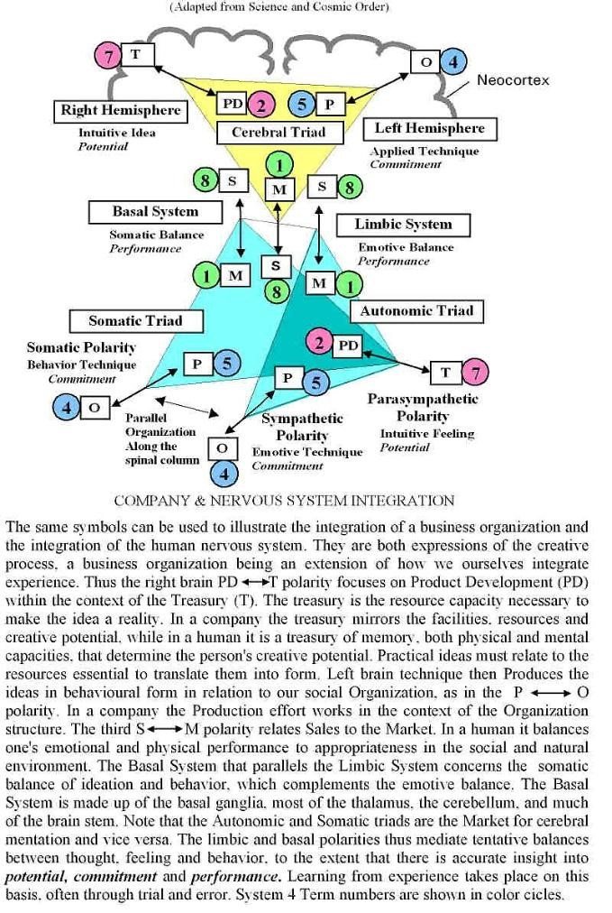

---

## Page 5

System 4 
 
9 
9 
-8 
-8 
 
9 
9 
-8 
-8 
9 
9 
-8 
-8 
9 
9 
-8 
-8 
3 
6 
6 
-2 
 
3 
6 
6 
-2 
3 
6 
6 
-2 
3 
6 
6 
-2 
4 
2 
8 
-5 
 
4 
2 
8 
-5 
-7 
-1 
-4 
-2 
8 
5 
7 
1 
-7 
-1 
-4 
-2 
 
-7 
-1 
-4 
-2 
8 
5 
7 
1 
4 
2 
8 
-5 
8 
5 
7 
1 
 
8 
5 
7 
1 
4 
2 
8 
-5 
-7 
-1 
-4 
-2 
 
1. 
4T1 – Need Perception 
()()()() 
3T1O –  – Objective Mode 
2. 
4T2 – Idea Creation  
() 3T1O –  – Objective Mode 
3. 
4UT3 – Idea Transfer  
(())(()) 
2UT1⦁2T2 –  – Objective Mode 
4. 
4T4 – Organized Input  
() 3T1O –  – Objective Mode 
5. 
4T5 – Physical Action  
() 3T1O –  – Objective Mode 
6. 
4UT6 – Corporeal Body  
() 3T1O –  – Objective Mode 
7. 
4T7 – Quantized Memory  
() 3T1O –  – Objective Mode 
8. 
4T8 – Balanced Response  
() 3T1O –  – Objective Mode 
9. 
4UT9 – Universal Discretion  
(((()))) 
3UT1O –  – Objective Mode 
 
 
 
System 5 
 
9 
9 
8 
8 
 
3 
6 
6 
2 
 
4 
2 
8 
5 
 
 
 
 
 
 
 
 
 
 
 
 
 
 
 
 
 
 
 
 
 
 
01. 
T01 – Unknown ()()()()() 
T1S – Need Perception – Subjective Mode 
02. 
T02 – Unknown (())()()() 
T2S – Idea Creation – Subjective Mode 
03. 
T03 – Unknown (())(())() 
T3S – Idea Transfer – Subjective Mode 
04. 
T04 – Unknown (()())()() 
T4S – Organized Input – Subjective Mode 
05. 
T05 – Unknown (()())(()) 
T0S – Unknown – Subjective Mode 
06. 
T06 – Unknown ((()))()() 
T5S – Physical Action – Subjective Mode 
07. 
T07 – Unknown ((()))(()) 
T0O – Unknown – Objective Mode 
08. 
T08 – Unknown (()()())() 
T6S – Corporeal Body – Subjective Mode 
09. 
T09 – Unknown ((()()))() 
T7S – Quantized Memory – Subjective Mode 
10. 
T10 – Unknown ((())())() 
T8S – Balanced Response – Subjective Mode 
11. 
T11 – Unknown (((())))() 
T9S – Universal Discretion – Subjective Mode 
12. 
T12 – Unknown (()()()()) 
T1O – Need Perception – Objective Mode 
13. 
T13 – Unknown ((())()()) 
T2O – Idea Creation – Objective Mode 
14. 
T14 – Unknown ((())(())) 
T3O – Idea Transfer – Objective Mode 
15. 
T15 – Unknown ((()())()) 
T4O – Organized Input – Objective Mode 
16. 
T16 – Unknown (((()))()) 
T5O – Physical Action – Objective Mode 
17. 
T17 – Unknown ((()()())) 
T6O – Corporeal Body – Objective Mode 
18. 
T18 – Unknown (((()()))) 
T7O – Quantized Memory – Objective Mode 
19. 
T19 – Unknown (((())())) 
T8O – Balanced Response – Objective Mode 
20. 
T20 – Unknown ((((())))) 
T9O – Universal Discretion – Objective Mode

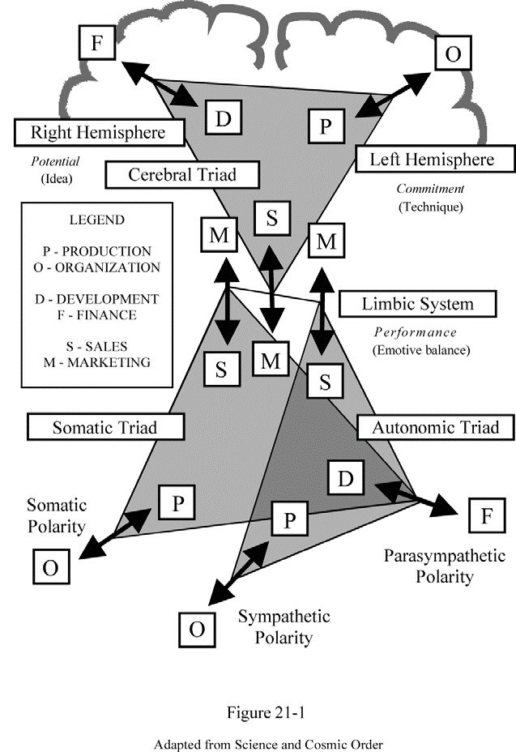

---

## Page 6

Electrons functions 
Photons derivatives of functions

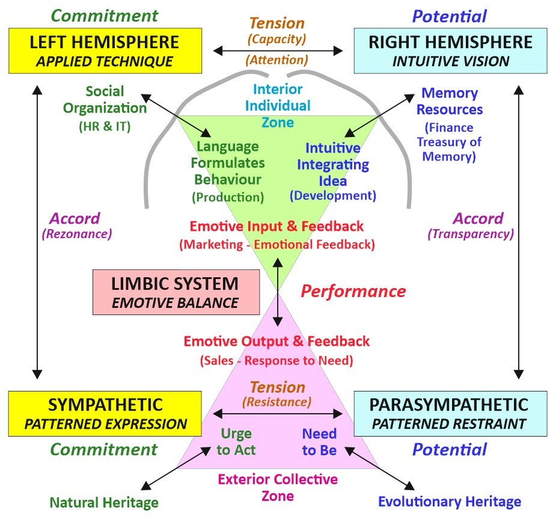

---

## Page 7

11 = 1  
21 = 2  
31 = 3 
⚊ 
 
⚊⚋ 
 
⚊⚋𝌀 
 
22 = 4 
⚌⚎ 
⚍⚏ 
 
32 = 9 
⚌⚎𝌁 
⚍⚏𝌂 
𝌃𝌄𝌅 
 
23 = 8 
☰☱☲☳ 
☴☵☶☷ 
 
 
24 = 16 
𝌆𝌇𝌉𝌊 
𝌏𝌐𝌒𝌓 
𝌡𝌢𝌤𝌥 
𝌪𝌫𝌭𝌮 
 
26 = 64 
䷀䷁䷂䷃䷄䷅䷆䷇ 
䷈䷉䷊䷋䷌䷍䷎䷏ 
䷐䷑䷒䷓䷔䷕䷖䷗ 
䷘䷙䷚䷛䷜䷝䷞䷟ 
䷠䷡䷢䷣䷤䷥䷦䷧ 
䷨䷩䷪䷫䷬䷭䷮䷯ 
䷰䷱䷲䷳䷴䷵䷶䷷ 
䷸䷹䷺䷻䷼䷽䷾䷿ 
 
34 = 81 
𝌆𝌇𝌈𝌉𝌊𝌋𝌌𝌍𝌎 
𝌏𝌐𝌑𝌒𝌓𝌔𝌕𝌖𝌗 
𝌘𝌙𝌚𝌛𝌜𝌝𝌞𝌟𝌠 
𝌡𝌢𝌣𝌤𝌥𝌦𝌧𝌨𝌩 
𝌪𝌫𝌬𝌭𝌮𝌯𝌰𝌱𝌲 
𝌳𝌴𝌵𝌶𝌷𝌸𝌹𝌺𝌻 
𝌼𝌽𝌾𝌿𝍀𝍁𝍂𝍃𝍄 
𝍅𝍆𝍇𝍈𝍉𝍊𝍋𝍌𝍍 
𝍎𝍏𝍐𝍑𝍒𝍓𝍔𝍕𝍖

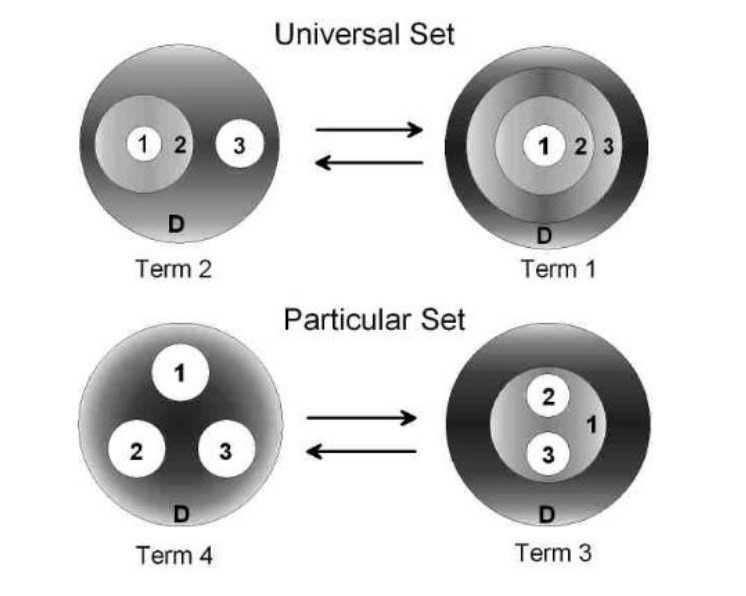
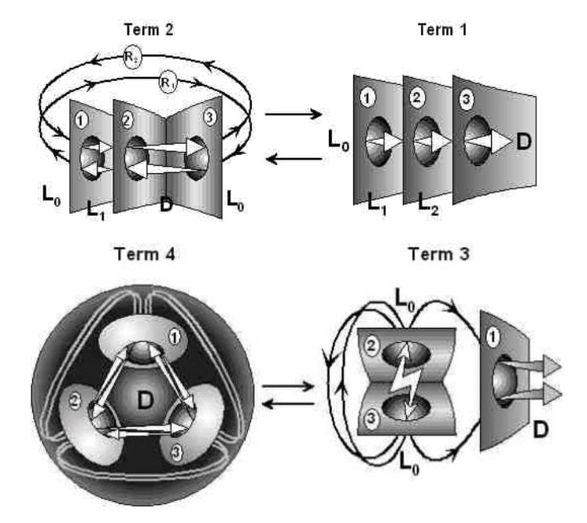
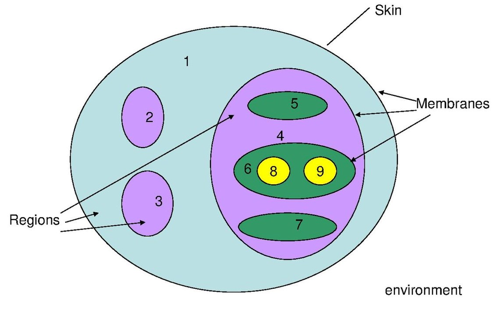

---

## Page 8

⚊ 
⚋ 
 
 
𝌀 
⚌ 
⚍⚎⚏  
 
𝌁𝌂𝌃𝌄𝌅 
☰ 
☱☲☳☴☵☶☷ 
𝌆𝌇𝌈𝌉𝌊 
A B C D E F G H I J K L M N O P Q R S T U V W X Y Z [ \ ] ^ _ ` 
┄ ┅ ┈ ┉ ⁞⁞⁞⁞ ⸽⸽⸽ 𐄇 𐄈 𐄉 𐄊 𐄋 𐄌 𐄍 𐄎 𐄏  
𝍖𝍖 
 
ABCDEFGHIJKLMNOPQRSTUVWXYZ[\]^_` 
A B CG KDHQ [EINRLTW FJMSOUX\ VYZP]^_  
 
AAAAA AABAA ABABA AACAA AAGAA ABCBA ACACA ACBCA AGAGA AADAA AADAA AADAA AADAA 
 
𐄐𐄑𐄒 
𝍠𝍡𝍢𝍣𝍤𝍥𝍦𝍧𝍨𝍩𝍪𝍫𝍬𝍭𝍮𝍯𝍰𝍱 
𝌁𝌂𝌃𝌄𝌅𐄫𐄬𐄮𐄳⚯⚇ ☰ 
☱☲☳☴☵☶☷ 
 
𝍠𝍡𝍢𝍣𝍤 ⑆⑇⑈⑉⏃⊶⊷⊸⊸⊹⍥⊙[\]{|}~º⁐⅏∗∙ 
⓪①②③④ ⓿ 
⑴⑵⑶⑷⑸⑹⑺⑻⑼⑽⑾⑿⒀⒁⒂⒃⒄⒅⒆⒇ 
☤─╌┄┈☯⟅⟆⭤⭢ 
 
🌐🌍🌎🌏🏢🏫🏬🏭🏠🖧🠞🠊🠦🡘🡒 
 
11 = 1 
21 = 2 
22 = 4 
23 = 8 
24 = 16 
25 = 32 
26 = 64 
27 = 128 
28 = 256 
31 = 3 
32 = 9 
33 = 27 
34 = 81 
35 = 243 
36 = 729 
41 = 4 
42 = 16 
43 = 64 
44 = 256 
51 = 5 
52 = 25 
53 = 125 
54 = 625 
61 = 6 
62 = 36 
63 = 216 
71 = 7 
72 = 49 
73 = 343 
81 = 8 
82 = 64 
83 = 343 
91 = 9 
92 = 81 
93 = 729 
 
11 = 1  
21 = 2  
31 = 3  
41 = 3  
51 = 3  
61 = 3 
⚊ 
 
⚊⚋ 
 
⚊⚋𝌀  
⚊⚊ ⚊⚋  ⚋⚋ ⚋⚋ 
 
 
 
 
 
 
⚋⚊ 
⚋ 
22 = 4 
⚌⚎ 
⚍⚏ 
 
32 = 9  
 1     2  3  4    5  6  7  8  9 
⚌⚎𝌁  
⚌ | ⚎⚍⚏ | 𝌁𝌂𝌃𝌄𝌅 
⚍⚏𝌂 
𝌃𝌄𝌅 
 
23 = 8 
☰☱☲☳ 
☴☵☶☷ 
 
 
24 = 42 = 16 
𝌆𝌇𝌉𝌊 
𝌏𝌐𝌒𝌓 
𝌡𝌢𝌤𝌥 
𝌪𝌫𝌭𝌮 
 
 
33 = 27 
𝌆𝌇𝌈𝌉𝌊𝌋𝌌𝌍𝌎 
𝌏𝌐𝌑𝌒𝌓𝌔𝌕𝌖𝌗 
𝌘𝌙𝌚𝌛𝌜𝌝𝌞𝌟𝌠

---

## Page 9

36 = 272 = 729 
𝌆  𝌆𝌆𝌆𝌆𝌆𝌆𝌆𝌆  𝌆𝌆𝌆𝌆𝌆𝌆𝌆𝌆𝌆  𝌆𝌆𝌆𝌆𝌆𝌆𝌆𝌆𝌆 
𝌆  𝌇𝌈𝌉𝌊𝌋𝌌𝌍𝌎  𝌏𝌐𝌑𝌒𝌓𝌔𝌕𝌖𝌗  𝌘𝌙𝌚𝌛𝌜𝌝𝌞𝌟𝌠 
𝌇  𝌇𝌇𝌇𝌇𝌇𝌇𝌇𝌇  𝌇𝌇𝌇𝌇𝌇𝌇𝌇𝌇𝌇  𝌇𝌇𝌇𝌇𝌇𝌇𝌇𝌇𝌇 
𝌆  𝌇𝌈𝌉𝌊𝌋𝌌𝌍𝌎  𝌏𝌐𝌑𝌒𝌓𝌔𝌕𝌖𝌗  𝌘𝌙𝌚𝌛𝌜𝌝𝌞𝌟𝌠 
𝌆  𝌇𝌈𝌉𝌊𝌋𝌌𝌍𝌎  𝌏𝌐𝌑𝌒𝌓𝌔𝌕𝌖𝌗  𝌘𝌙𝌚𝌛𝌜𝌝𝌞𝌟𝌠 
𝌈  𝌈𝌈𝌈𝌈𝌈𝌈𝌈𝌈  𝌈𝌈𝌈𝌈𝌈𝌈𝌈𝌈𝌈  𝌈𝌈𝌈𝌈 
𝌆  𝌇𝌈𝌉𝌊𝌋𝌌𝌍𝌎  𝌏𝌐𝌑𝌒𝌓𝌔𝌕𝌖𝌗  𝌘𝌙𝌚𝌛𝌜𝌝𝌞𝌟𝌠 
𝌉  𝌉𝌉𝌉𝌉𝌉𝌉𝌉𝌉  𝌉𝌉𝌉𝌉𝌉𝌉𝌉𝌉𝌉  𝌉𝌉𝌉𝌉 
𝌆  𝌇𝌈𝌉𝌊𝌋𝌌𝌍𝌎  𝌏𝌐𝌑𝌒𝌓𝌔𝌕𝌖𝌗  𝌘𝌙𝌚𝌛𝌜𝌝𝌞𝌟𝌠 
𝌊  𝌊𝌊𝌊𝌊𝌊𝌊𝌊𝌊 
𝌆  𝌇𝌈𝌉𝌊𝌋𝌌𝌍𝌎  𝌏𝌐𝌑𝌒𝌓𝌔𝌕𝌖𝌗  𝌘𝌙𝌚𝌛𝌜𝌝𝌞𝌟𝌠 
𝌋  𝌋𝌋𝌋𝌋𝌋𝌋𝌋𝌋 
𝌆  𝌇𝌈𝌉𝌊𝌋𝌌𝌍𝌎  𝌏𝌐𝌑𝌒𝌓𝌔𝌕𝌖𝌗  𝌘𝌙𝌚𝌛𝌜𝌝𝌞𝌟𝌠 
𝌌  𝌌𝌌𝌌𝌌𝌌𝌌𝌌𝌌 
𝌆  𝌇𝌈𝌉𝌊𝌋𝌌𝌍𝌎  𝌏𝌐𝌑𝌒𝌓𝌔𝌕𝌖𝌗  𝌘𝌙𝌚𝌛𝌜𝌝𝌞𝌟𝌠 
𝌍 
𝌆  𝌇𝌈𝌉𝌊𝌋𝌌𝌍𝌎  𝌏𝌐𝌑𝌒𝌓𝌔𝌕𝌖𝌗  𝌘𝌙𝌚𝌛𝌜𝌝𝌞𝌟𝌠 
𝌎 
𝌆  𝌇𝌈𝌉𝌊𝌋𝌌𝌍𝌎  𝌏𝌐𝌑𝌒𝌓𝌔𝌕𝌖𝌗  𝌘𝌙𝌚𝌛𝌜𝌝𝌞𝌟𝌠 
𝌏 
𝌆  𝌇𝌈𝌉𝌊𝌋𝌌𝌍𝌎  𝌏𝌐𝌑𝌒𝌓𝌔𝌕𝌖𝌗  𝌘𝌙𝌚𝌛𝌜𝌝𝌞𝌟𝌠 
𝌐 
𝌆  𝌇𝌈𝌉𝌊𝌋𝌌𝌍𝌎  𝌏𝌐𝌑𝌒𝌓𝌔𝌕𝌖𝌗  𝌘𝌙𝌚𝌛𝌜𝌝𝌞𝌟𝌠 
𝌑 
𝌆  𝌇𝌈𝌉𝌊𝌋𝌌𝌍𝌎  𝌏𝌐𝌑𝌒𝌓𝌔𝌕𝌖𝌗  𝌘𝌙𝌚𝌛𝌜𝌝𝌞𝌟𝌠 
𝌒 
𝌆  𝌇𝌈𝌉𝌊𝌋𝌌𝌍𝌎  𝌏𝌐𝌑𝌒𝌓𝌔𝌕𝌖𝌗  𝌘𝌙𝌚𝌛𝌜𝌝𝌞𝌟𝌠 
𝌓 
𝌆  𝌇𝌈𝌉𝌊𝌋𝌌𝌍𝌎  𝌏𝌐𝌑𝌒𝌓𝌔𝌕𝌖𝌗  𝌘𝌙𝌚𝌛𝌜𝌝𝌞𝌟𝌠 
𝌔 
𝌆  𝌇𝌈𝌉𝌊𝌋𝌌𝌍𝌎  𝌏𝌐𝌑𝌒𝌓𝌔𝌕𝌖𝌗  𝌘𝌙𝌚𝌛𝌜𝌝𝌞𝌟𝌠 
𝌕 
𝌆  𝌇𝌈𝌉𝌊𝌋𝌌𝌍𝌎  𝌏𝌐𝌑𝌒𝌓𝌔𝌕𝌖𝌗  𝌘𝌙𝌚𝌛𝌜𝌝𝌞𝌟𝌠 
𝌖 
𝌆  𝌇𝌈𝌉𝌊𝌋𝌌𝌍𝌎  𝌏𝌐𝌑𝌒𝌓𝌔𝌕𝌖𝌗  𝌘𝌙𝌚𝌛𝌜𝌝𝌞𝌟𝌠 
𝌗 
𝌆  𝌇𝌈𝌉𝌊𝌋𝌌𝌍𝌎  𝌏𝌐𝌑𝌒𝌓𝌔𝌕𝌖𝌗  𝌘𝌙𝌚𝌛𝌜𝌝𝌞𝌟𝌠 
𝌘 
𝌆  𝌇𝌈𝌉𝌊𝌋𝌌𝌍𝌎  𝌏𝌐𝌑𝌒𝌓𝌔𝌕𝌖𝌗  𝌘𝌙𝌚𝌛𝌜𝌝𝌞𝌟𝌠 
𝌙 
𝌆  𝌇𝌈𝌉𝌊𝌋𝌌𝌍𝌎  𝌏𝌐𝌑𝌒𝌓𝌔𝌕𝌖𝌗  𝌘𝌙𝌚𝌛𝌜𝌝𝌞𝌟𝌠 
𝌚 
𝌆  𝌇𝌈𝌉𝌊𝌋𝌌𝌍𝌎  𝌏𝌐𝌑𝌒𝌓𝌔𝌕𝌖𝌗  𝌘𝌙𝌚𝌛𝌜𝌝𝌞𝌟𝌠 
𝌛 
𝌆  𝌇𝌈𝌉𝌊𝌋𝌌𝌍𝌎  𝌏𝌐𝌑𝌒𝌓𝌔𝌕𝌖𝌗  𝌘𝌙𝌚𝌛𝌜𝌝𝌞𝌟𝌠 
𝌜 
𝌆  𝌇𝌈𝌉𝌊𝌋𝌌𝌍𝌎  𝌏𝌐𝌑𝌒𝌓𝌔𝌕𝌖𝌗  𝌘𝌙𝌚𝌛𝌜𝌝𝌞𝌟𝌠 
𝌝 
𝌆  𝌇𝌈𝌉𝌊𝌋𝌌𝌍𝌎  𝌏𝌐𝌑𝌒𝌓𝌔𝌕𝌖𝌗  𝌘𝌙𝌚𝌛𝌜𝌝𝌞𝌟𝌠 
𝌞 
𝌆  𝌇𝌈𝌉𝌊𝌋𝌌𝌍𝌎  𝌏𝌐𝌑𝌒𝌓𝌔𝌕𝌖𝌗  𝌘𝌙𝌚𝌛𝌜𝌝𝌞𝌟𝌠 
𝌟  𝌟𝌟𝌟𝌟𝌟𝌟𝌟𝌟  𝌟 
𝌆  𝌇𝌈𝌉𝌊𝌋𝌌𝌍𝌎  𝌏𝌐𝌑𝌒𝌓𝌔𝌕𝌖𝌗  𝌘𝌙𝌚𝌛𝌜𝌝𝌞𝌟𝌠 
𝌠  𝌠𝌠𝌠𝌠𝌠𝌠𝌠𝌠  𝌠𝌠𝌠𝌠𝌠𝌠𝌠𝌠𝌠  𝌠𝌠𝌠𝌠𝌠𝌠𝌠𝌠𝌠

---

## Page 10

Here’s a brief description of each hyperedge and how they interact with the vertices ( 
C1 ) to ( C5 ), based on the structures you’ve provided: 
• 
T01: Universal Cognitive Hierarchy 
Structure: ((((())))) 
Interaction: Represents a fully nested hierarchy, where each vertex influences 
the next in a linear sequence, symbolizing a universal cognitive process. 
• 
T02: Sympathetic Ideation Dynamics 
Structure: (())()()() 
Interaction: Suggests independent connections, reflecting the creation and 
assessment of ideas within the sympathetic framework of cognition. 
• 
T03: Emotional Knowledge Exchange 
Structure: (())(())() 
Interaction: Indicates two pairs of connected vertices, representing the 
exchange and transfer of emotional knowledge. 
• 
T04: Parasympathetic Action Restraint 
Structure: (()())()() 
Interaction: Shows a nested pair followed by two independent vertices, 
symbolizing the parasympathetic system’s role in restraining potential 
actions. 
• 
T05: Goal-Oriented Interaction Flow 
Structure: (()())(()) 
Interaction: Depicts a nested pair and another pair, highlighting the interactive 
flow of goal-oriented processes. 
• 
T06: Somatic Response Initiation 
Structure: ((()))()() 
Interaction: Features a triple nested structure with one independent vertex, 
indicating the initiation of physical responses. 
• 
T07: Discretionary Process Integration 
Structure: ((()))(()) 
Interaction: Has a triple nested structure and a pair, denoting the integration 
of discretionary processes. 
• 
T08: Corporeal Autonomy Framework 
Structure: (()()())() 
Interaction: Suggests a nested pair, an independent vertex, and another pair, 
representing the framework of corporeal autonomy. 
• 
T09: Memory Quantization Network 
Structure: ((()()))() 
Interaction: Features a triple nested pair followed by an independent vertex, 
symbolizing the network of quantized memory. 
• 
T10: Emotional Equilibrium Mechanism 
Structure: ((())())() 
Interaction: Indicates a nested pair within another pair, followed by an 
independent vertex, reflecting the mechanism of emotional equilibrium. 
• 
T11: Universal Discretion Matrix 
Structure: (((())))() 
Interaction: Shows a quadruple nested structure with one independent vertex, 
representing the matrix of universal discretion.

---

## Page 11

• 
T12: Social Perception Marketplace 
Structure: (()()()()) 
Interaction: Represents three independent vertices and a pair, symbolizing the 
social marketplace of perception. 
• 
T13: Intuitive Vision Synthesis 
Structure: ((())()()) 
Interaction: Has a nested pair, an independent vertex, and another pair, 
denoting the synthesis of intuitive vision. 
• 
T14: Right Hemisphere Insight Connectivity 
Structure: ((())(())) 
Interaction: Suggests two pairs of connected vertices, representing the 
connectivity of insights associated with the right hemisphere. 
• 
T15: Social Technique Organization 
Structure: ((()())()) 
Interaction: Features a nested pair followed by another pair, highlighting the 
organization of social techniques. 
• 
T16: Language-Driven Behavioral Formulation 
Structure: (((()))()) 
Interaction: Represents a quadruple nested structure followed by an 
independent vertex, indicating the formulation of behavior driven by language. 
• 
T17: Left Hemisphere Technique Application 
Structure: ((()()())) 
Interaction: Indicates a nested pair, two independent vertices, and another 
pair, symbolizing the application of techniques associated with the left 
hemisphere. 
• 
T18: Integrated Memory Resource System 
Structure: (((()()))) 
Interaction: Shows a quadruple nested structure, suggesting the system of 
integrated memory resources. 
• 
T19: Balanced Response Coordination 
Structure: (((())())) 
Interaction: Features a triple nested pair, indicating the coordination of 
balanced responses. 
• 
T20: Proprioceptive Sensory Field 
Structure: ()()()()() 
Interaction: Represents five independent vertices, reflecting the 
proprioceptive field of sensory perception. 
Each hyperedge’s interaction with the vertices provides insight into different 
cognitive and behavioral processes, from hierarchical organization to the integration 
of sensory input and the balancing of emotional responses. The hypergraph model 
encapsulates a wide range of human experiences, illustrating the complex network 
of influences that shape our thoughts, feelings, and actions.

---

## Page 12

Based on the images, descriptions, and additional information you’ve provided, here 
are the updated and refined names and descriptions for the hyperedges: 
1. T01 - Universal Cognitive Hierarchy: 
Description: Represents the foundational cognitive structure from the core 
“Host Idea” to the outward “Behavioral Form,” reflecting a universal sequence 
of cognitive influence. 
2. T02 - Sympathetic Ideation Dynamics: 
Description: Illustrates the dynamic formation and evolution of ideas 
influenced by emotional and physiological states, leading to tangible actions 
or behaviors. 
3. T03 - Emotional Knowledge Exchange: 
Description: Symbolizes the transfer and exchange of emotional knowledge, 
highlighting the interconnectedness of emotional experiences. 
4. T04 - Parasympathetic Action Restraint: 
Description: Depicts the moderation and control of actions by the 
parasympathetic nervous system, emphasizing the balance between activity 
and relaxation. 
5. T05 - Goal-Oriented Interaction Flow: 
Description: Represents the interactive flow of goal-oriented processes, 
where objectives are pursued through coordinated cognitive and behavioral 
efforts. 
6. T06 - Somatic Response Initiation: 
Description: Captures the initiation of physical responses, illustrating the 
connection between internal states and external actions. 
7. T07 - Discretionary Process Integration: 
Description: Reflects the integration of discretionary processes, where 
decision-making is informed by a hierarchy of cognitive and emotional 
factors. 
8. T08 - Corporeal Autonomy Framework: 
Description: Highlights the framework of corporeal autonomy, where the 
body’s independent functions are orchestrated into coherent actions. 
9. T09 - Memory Quantization Network: 
Description: Emphasizes the network of quantized memory, where 
experiences are stored and retrieved in a structured manner. 
10. T10 - Emotional Equilibrium Mechanism: 
Description: Focuses on the mechanism of emotional equilibrium, balancing 
various emotional states to maintain psychological stability. 
11. T11 - Universal Discretion Matrix: 
Description: Encompasses the matrix of universal discretion, representing the 
cognitive structure that underlies individual decision-making. 
12. T12 - Social Perception Marketplace: 
Description: Envisions the social environment as a marketplace of perception, 
where individual cognition and emotions interact with societal influences. 
13. T13 - Intuitive Vision Synthesis: 
Description: Combines intuitive insights with conscious ideas, synthesizing a 
holistic understanding of complex concepts.

---

## Page 13

14. T14 - Right Hemisphere Insight Connectivity: 
Description: Connects the holistic and creative thought processes associated 
with the right hemisphere, integrating insights into a coherent framework. 
15. T15 - Social Technique Organization: 
Description: Organizes social interactions and techniques, structuring the way 
individuals engage with their social environment. 
16. T16 - Language-Driven Behavioral Formulation: 
Description: Illustrates how language influences behavior, shaping actions 
through linguistic structures and expressions. 
17. T17 - Left Hemisphere Technique Application: 
Description: Applies logical and analytical processes associated with the left 
hemisphere to practical and technical tasks. 
18. T18 - Integrated Memory Resource System: 
Description: Integrates memory resources, consolidating knowledge and 
experiences for efficient retrieval and application. 
19. T19 - Balanced Response Coordination: 
Description: Coordinates balanced responses, ensuring that actions are 
proportionate and appropriate to the stimuli or situations encountered. 
20. T20 - Proprioceptive Sensory Field: 
Description: Maps the proprioceptive field of sensory perception, allowing for 
the awareness of body position and movement necessary for coordinated 
action. 
These refined names and descriptions aim to capture the essence of each 
hyperedge’s role within the hypergraph, reflecting the complex interplay of cognitive, 
emotional, and behavioral factors that define human experience and action. The 
hypergraph model serves as a theoretical framework for understanding the 
multifaceted nature of these interactions. 
Consider the following transformation matrix with 6 cycles of 5 steps, 3 universal sets and 6 
particular sets: 
 
Cycle | - - -  Cycle 1  - - - | - - -  Cycle 2 - - - | - - -  Cycle 3 - - - | - - -  Cycle 4  - - - | - - -  Cycle 5 - - - | - - -  Cycle 6  - - - | 
Steps | 01-02-03-04-05 | 06-07-08-09-10 | 11-12-13-14-15 | 16-17-18-19-20 | 21-22-23-24-25 | 26-27-28-29-30 | 
__________________________________________________________________________________________________________ 
Set1U | 09-09-08-08-09 | 09-08-08-09-09 | 08-08-09-09-08 | 08-09-09-08-08 | 09-09-08-08-09 | 09-08-08-09-09 | 
Mode |--E---E---R---R---E--|--E---R---R---E---E--|-R---R---E---E---R--|--R---E---E---R---R--|-E---E---R---R---E--|--E---R---R---E---E--| 
Set2U | 18-18-19-19-18 | 18-19-19-18-18 | 19-19-18-18-19 | 19-18-18-19-19 | 19-19-18-18-19 | 19-18-18-19-19 | 
Mode |-R---R---E---E---R--|--R---E---E---R---R--|-E---E---R---R---E--|--E---R---R---E---E--|--E---E---R---R---E--|--E---R---R---E---E--| 
Set3U | 10-20-20-10-10 | 20-20-10-10-20 | 20-10-10-20-20 | 10-10-20-20-10 | 10-20-20-10-10 | 20-20-10-10-20 | 
Mode |--R---E---E---R---R--|-E---E---R---R---E--|--E---R---R---E---E--|--E---E---R---R---E--|--E---R---R---E---E--|-R---R---E---E---R--| 
__________________________________________________________________________________________________________ 
Set1A | 01-04-02-08-05 | 07-11-14-12-18 | 15-17-01-04-02 | 08-05-07-11-14 | 12-18-15-17-01 | 04-02-08-05-07 | 
Mode |--E---E---E---E---R--|--R---R---R---R---E--|-E---E---E---E---E--|--E---R---R---R---R--|-R---E---E---E---E--|--E---E---E---R---R--| 
Set1B | 07-11-14-12-18 | 15-17-01-04-02 | 08-05-07-11-14 | 12-18-15-17-01 | 04-02-08-05-07 | 01-04-02-08-05 | 
Mode |--R---R---R---R---E--|-E---E---E---E---E--|--E---R---R---R---R--|-R---E---E---E---E--|--E---E---E---R---R--|--E---E---E---E---R--| 
Set1C | 15-17-01-04-02 | 08-05-07-11-14 | 12-18-15-17-01 | 04-02-08-05-07 | 01-04-02-08-05 | 07-11-14-12-18 | 
Mode |-E---E---E---E---E--|--E---R---R---R---R--|-R---E---E---E---E--|--E---E---E---R---R--|--E---E---E---E---R--|--R---R---R---R---E--| 
Set2A | 08-05-07-11-14 | 12-18-15-17-01 | 04-02-08-05-07 | 01-04-02-08-05 | 07-11-14-12-18 | 15-17-01-04-02 | 
Mode |--E---R---R---R---R--|-R---E---E---E---E--|--E---E---E---R---R--|--E---E---E---E---R--|--R---R---R---R---E--|-E---E---E---E---E--| 
Set2B | 12-18-15-17-01 | 04-02-08-05-07 | 01-04-02-08-05 | 07-11-14-12-18 | 15-17-01-04-02 | 08-05-07-11-14 | 
Mode |-R---E---E---E---E--|--E---E---E---R---R--|--E---E---E---E---R--|--R---R---R---R---E--|-E---E---E---E---E--|--E---R---R---R---R--| 
Set2C | 04-02-08-05-07 | 01-04-02-08-05 | 07-11-14-12-18 | 15-17-01-04-02 | 08-05-07-11-14 | 12-18-15-17-01 | 
Mode |--E---E---E---R---R--|--E---E---E---E---R--|--R---R---R---R---E--|-E---E---E---E---E--|--E---R---R---R---R--|-R---E---E---E---E--|

---

## Page 14 (OCR)

SYSTEM 4

Tenms 9, 3, & 6 are universal
Terms 1, 2, 4, 5, 7 & 8 are particular and are shown in the expressive mode.

T9 - Discretionary Hierarchy

TIE - Perception of Need

Response to Need - T&E TE - Idea Craation

Quantized Mamory - T7E

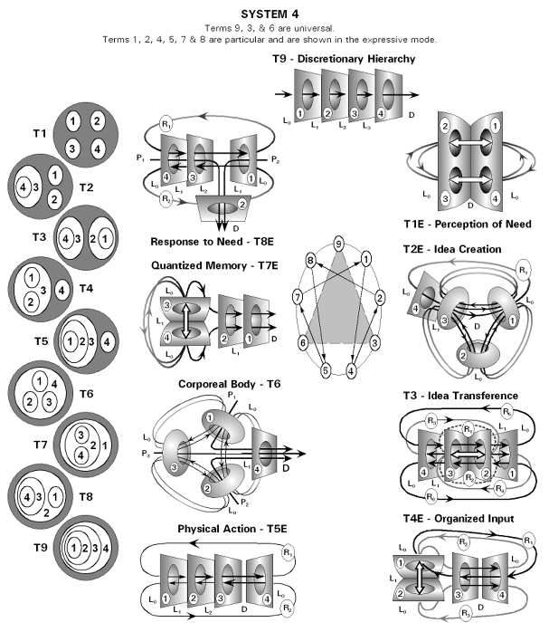

---

## Page 15

System 1 
 
9 
 
2 
 
 
System 2 
 
9 
-8 
 
3 
3 
3 
-2 
 
2 
2 
 
 
System 3 
 
9 
9 
-8 
 
3 
2 
3 
2 
4 
2 
-5 
 
2 
2 
7 
5 
8 
5 
1 
 
5 
7 
2 
2 
 
 
System 4 
 
9 
9 
-8 
-8 
 
3 
3 
3 
3 
3 
3 
3 
3 
3 
3 
3 
3 
3 
6 
6 
-2 
 
2 
3 
3 
2 
2 
3 
3 
2 
2 
3 
3 
2 
4 
2 
8 
-5 
 
5 
5 
7 
2 
2 
2 
2 
2 
11 
13 
17 
19 
-7 
-1 
-4 
-2 
 
2 
2 
2 
2 
11 
13 
17 
19 
5 
7 
7 
2 
8 
5 
7 
1 
 
8 
5 
7 
1 
7 
7 
5 
2 
2 
2 
2 
2 
 
 
System 5 
 
 
 
 
 
 
 
 
 
 
 
 
 
 
 
 
 
 
 
 
 
 
 
 
 
 
 
 
 
 
 
 
 
 
 
 
 
 
 
 
 
 
 
 
 
 
 
 
 
 
 
 
 
 
 
 
 
 
 
 
 
 
 
 
 
 
 
 
 
 
 
 
 
 
 
 
 
 
 
 
 
 
 
 
 
 
 
 
 
 
 
 
 
 
 
 
 
 
 
 
 
 
 
 
 
 
 
 
 
 
 
 
 
 
 
 
 
 
 
 
 
 
 
 
 
 
 
 
 
 
 
 
 
 
 
 
 
 
 
 
 
 
 
a 
a 
a 
b 
b 
a 
a 
a 
b 
b 
a 
a 
a 
b 
b 
a 
a 
a 
b 
b 
c 
d 
d 
d 
e 
c 
d 
d 
d 
e 
c 
d 
d 
d 
e 
c 
d 
d 
d 
e 
f 
f 
g 
g 
h 
f 
f 
g 
g 
h 
f 
f 
g 
g 
h 
f 
f 
g 
g 
h 
i 
i 
i 
i 
j 
k 
l 
l 
m 
n 
o 
p 
q 
r 
s 
t 
t 
t 
t 
t 
k 
l 
l 
m 
n 
o 
p 
q 
r 
s 
t 
t 
t 
t 
t 
i 
i 
i 
i 
j 
o 
p 
q 
r 
s 
t 
t 
t 
t 
t 
i 
i 
i 
i 
j 
k 
l 
l 
m 
n 
t 
t 
t 
t 
t 
i 
i 
i 
i 
j 
k 
l 
l 
m 
n 
o 
p 
q 
r 
s

---

## Page 16

System 1 
 
9 
 
 
 
 
System 2 
 
9 
-8 
 
 
 
3 
-2 
 
 
 
 
 
System 3 
 
9 
9 
-8 
 
 
 
 
 
 
 
4 
2 
-5 
 
 
 
 
 
 
 
8 
5 
1 
 
 
 
 
 
 
 
 
 
System 4 
 
9 
9 
-8 
-8 
 
 
 
 
 
 
 
 
 
 
 
 
 
3 
6 
6 
-2 
 
 
 
 
 
 
 
 
 
 
 
 
 
4 
2 
8 
-5 
 
 
 
 
 
 
 
 
 
 
 
 
 
-7 
-1 
-4 
-2 
 
 
 
 
 
 
 
 
 
 
 
 
 
8 
5 
7 
1 
 
 
 
 
 
 
 
 
 
 
 
 
 
 
 
System 5 
 
9 
9 
0 
8 
8 
 
 
 
 
 
 
 
 
 
 
 
 
 
 
 
 
3 
6 
6 
6 
2 
 
 
 
 
 
 
 
 
 
 
 
 
 
 
 
 
4 
2 
8 
5

---

## Page 17

System 5 
Passive Perspectives 
Objective Mode 
Subjective Mode 
T1-1: T1O – Need Perception 
T0-1: T1S – Need Perception 
 
 
T2-1: T2O – Idea Creation 
T1-2: T2S – Idea Creation 
 
 
T3-1: T3O – Idea Transfer 
T1-3: T3S – Idea Transfer 
 
 
T4-1: T4O – Organized Input 
T1-4: T4S – Organized Input 
 
 
T0-7: T07 – Goal Transfer

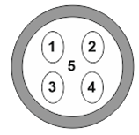
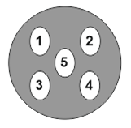
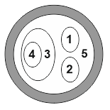
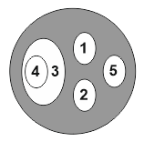
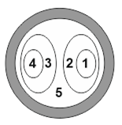
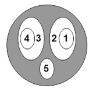
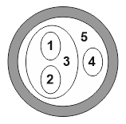
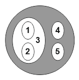
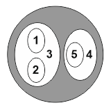

---

## Page 18

T0-5: T05 – Discretion Transfer 
 
T5-1: T5O – Physical Action 
T1-5: T5S – Physical Action 
 
 
T6-1: T6O – Corporeal Body 
T1-6: T6S – Corporeal Body 
 
 
T7-1: T7O – Quantized Memory 
T1-7: T7S – Quantized Memory 
 
 
T8-1: T8O – Balanced Response 
T1-8: T8S – Balanced Response 
 
 
T9-1: T9O – Universal Discretion 
T1-9: T9S – Universal Discretion

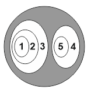
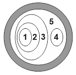
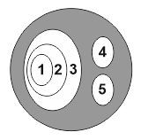
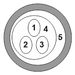
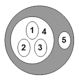
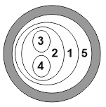
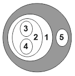
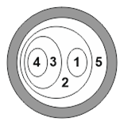
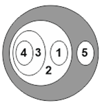
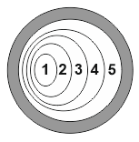
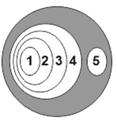

---

## Page 19

T0O – Unknown – Objective Mode 
Active Perspective 
 
 
T0S – Unknown – Subjective Mode 
Active Perspective

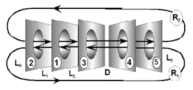
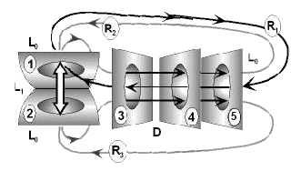

---

## Page 20

T1O – Need Perception – Objective Mode 
Active Perspective 
 
T1S – Need Perception – Subjective Mode 
Active Perspective

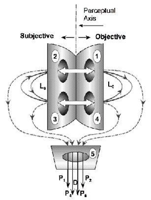
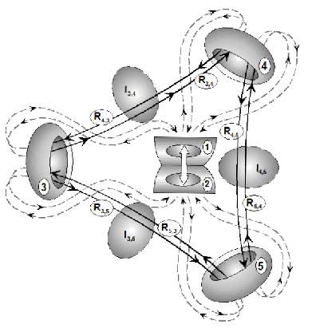

---

## Page 21

T2O – Idea Creation – Objective Mode 
Active Perspective 
 
 
T2S – Idea Creation – Subjective Mode 
Active Perspective

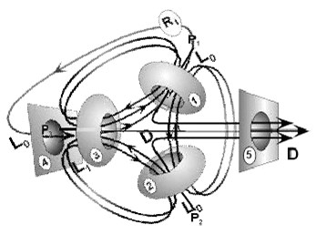
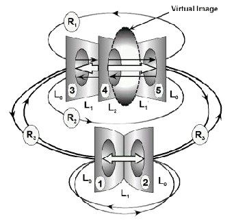

---

## Page 22

T3O – Idea Transfer – Objective Mode 
Active Perspective 
 
 
T3S – Idea Transfer – Subjective Mode 
Active Perspective

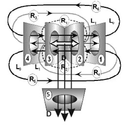
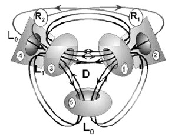

---

## Page 23

T4O – Organized Input – Objective Mode 
Active Perspective 
 
 
T4S – Organized Input – Subjective Mode 
Active Perspective

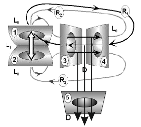
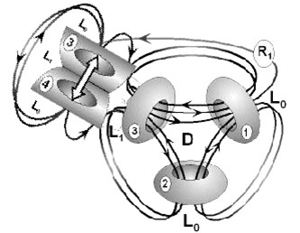
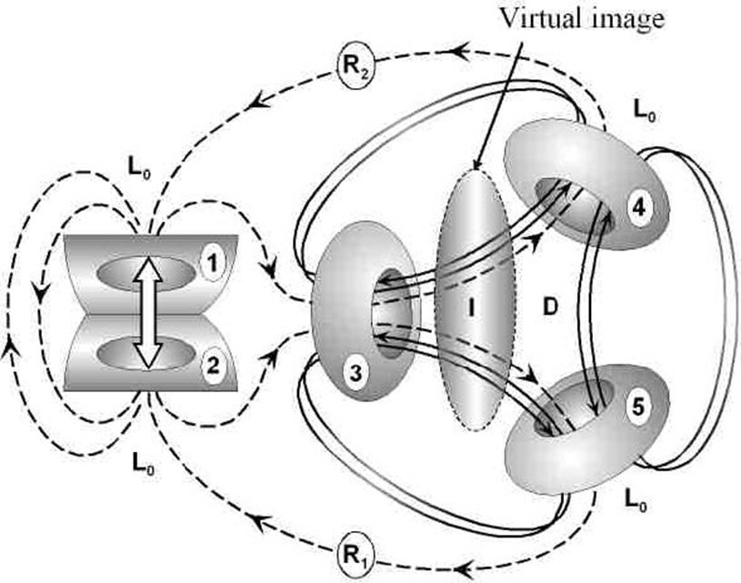

---

## Page 24

T5O – Physical Action – Objective Mode 
Active Perspective 
 
 
T5S – Physical Action – Subjective Mode 
Active Perspective

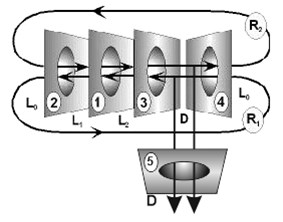
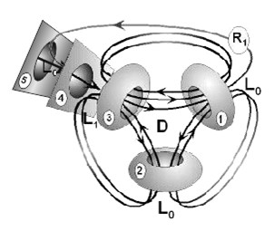

---

## Page 25

T6O – Corporeal Body – Objective Mode 
Active Perspective 
 
 
T6S – Corporeal Body – Subjective Mode 
Active Perspective

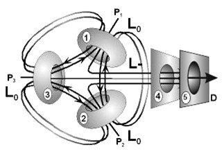
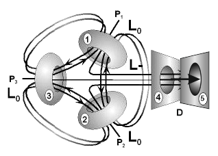

---

## Page 26

T7O – Quantized Memory – Objective Mode 
Active Perspective 
 
 
T7S – Quantized Memory – Subjective Mode 
Active Perspective

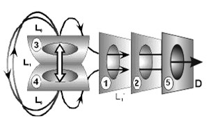
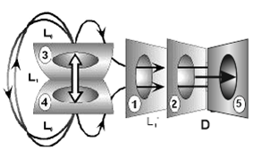

---

## Page 27

T8O – Balanced Response – Objective Mode 
Active Perspective 
 
 
T8S – Balanced Response – Subjective Mode 
Active Perspective

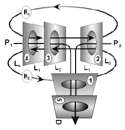
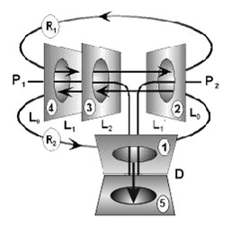

---

## Page 28

T9O – Universal Discretion – Objective Mode 
Active Perspective 
 
 
T9S – Universal Discretion – Subjective Mode 
Active Perspective

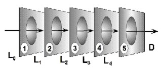
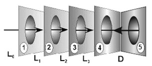

---

## Page 29

System 5 Passive & Active (To Add Detail) 
 
T0O – Unknown – Objective Mode 
Passive Perspective 
 
Active Perspective

---

## Page 30

T0S – Unknown – Subjective Mode 
Passive Perspective 
 
Active Perspective

---

## Page 31

T1O – Need Perception – Objective Mode 
Passive Perspective 
 
Active Perspective

---

## Page 32

T1S – Need Perception – Subjective Mode 
Passive Perspective 
 
Active Perspective

---

## Page 33

T2O – Idea Creation – Objective Mode 
Passive Perspective 
 
Active Perspective

---

## Page 34

T2S – Idea Creation – Subjective Mode 
Passive Perspective 
 
Active Perspective

---

## Page 35

T3O – Idea Transfer – Objective Mode 
Passive Perspective 
 
Active Perspective

---

## Page 36

T3S – Idea Transfer – Subjective Mode 
Passive Perspective 
 
Active Perspective

---

## Page 37

T4O – Organized Input – Objective Mode 
Passive Perspective 
 
Active Perspective

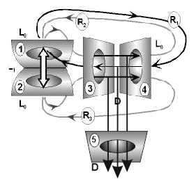

---

## Page 38

T4S – Organized Input – Subjective Mode 
Passive Perspective 
 
Active Perspective

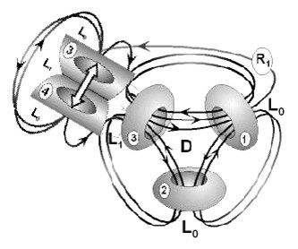

---

## Page 39

T5O – Physical Action – Objective Mode 
Passive Perspective 
 
Active Perspective

---

## Page 40

T5S – Physical Action – Subjective Mode 
Passive Perspective 
 
Active Perspective

---

## Page 41

T6O – Corporeal Body – Objective Mode 
Passive Perspective 
 
Active Perspective

---

## Page 42

T6S – Corporeal Body – Subjective Mode 
Passive Perspective 
 
Active Perspective

---

## Page 43

T7O – Quantized Memory – Objective Mode 
Passive Perspective 
 
Active Perspective

---

## Page 44

T7S – Quantized Memory – Subjective Mode 
Passive Perspective 
 
Active Perspective

---

## Page 45

T8O – Balanced Response – Objective Mode 
Passive Perspective 
 
Active Perspective

---

## Page 46

T8S – Balanced Response – Subjective Mode 
Passive Perspective 
 
Active Perspective

---

## Page 47

T9O – Universal Discretion – Objective Mode 
Passive Perspective 
 
Active Perspective

---

## Page 48

T9S – Universal Discretion – Subjective Mode 
Passive Perspective 
 
Active Perspective

---

## Page 49

To:bob@cosmic-mindreach.com 
Thu 2019-07-25 23:21 
Hi Bob 
  
On a quick note, I noticed the diagram in Fisherman’s Guide . In line with my view of the 
necessary global shift from long-chain economic flows to coherent networks of economic 
information systems embedded in cultural agency 
  
 
  
Dan

---

## Page 50

Hi Dan, 
  
Thank you very much for your very erudite and interesting email. You have obviously 
done a great deal of creative work related to the human dilemma. I will save and 
reread this more carefully when I return. 
  
I am attaching the other book I mentioned as my background is a bit unusual and 
may be relevant to how this whole thing came to me. It should emphasize to you that 
all of my work comes from cosmic insights that came over a period of about two 
decades until I thoroughly understood how it all works. I can take personal credit for 
not one idea. Nothing of how it works comes from my personal thoughts.  It was a 
huge chore to find words of any kind and the delineation of the System took years, 
even when it had been visually and experientially demonstrated. The book explains 
how the experiences relate to the System. Time and again I got off track despite 
myself dues to culturally indoctrinated concepts that you mention that I had to see 
through. The System itself is not dependent on language and not one word was used 
to communicate it, but it did relate to the visual and experiential phenomena that 
were explicitly orchestrated by the Supreme Being. I could see active interfaces 
generating the intense phenomena. So I agree that the cosmic order cannot be 
understood as an independent thing in itself, that it must relate to sensory 
experience in some direct way and to communicate it this must be in areas that we 
are familiar with. That is why it is a strict discipline of structure. The direct 
correspondence is exceedingly precise, completely exact, as demonstrated in the 
two advanced articles on Spinal Integration and Cerebellar Integration. I hope that 
the book will help you fully appreciate that none of System is a creation of mine. No 
one created it. It has always been and is subsumed by the Supreme Being as a 
nested elaboration of Universal Truth. 
  
The attachment is at the bottom. 
  
Thank you again and best wishes, 
Bob

---

## Page 51

Hi Dan, 
  
Thanks again for your comments. I have found time to convert three Terms of 
System 5 to PDF. They are attached. The T-9 Term transcends space and time but 
can be seen face to face  in spiritual experience described as the Suffering Face of 
Humanity at the end of the five days of organic union described in the last book on 
God Reveals the Cosmic Order. The Term T1-1 is Somatic and is probably related to 
ascending projections of the reticular system to the neocortex synchronous with 
visual and perhaps auditory inputs that project directly to the neocortex unlike the 
other senses that project to the brain stem. T1-2 is sympathetic and probably 
associated with parallel ascending projections from the reticular system to the limbic 
cortex. This has to be confirmed by the synaptic structure of the somatic and 
sympathetic nervous systems consistent with the structural interaction of the other 
17 Terms including their expressive and regenerative modes. This should help to 
give you some idea of the complexity of the problem and the breadth of intuitive 
grasp required to get hold of it all at once. Left brain language is little help in this 
regard. Three of the 20 Terms of System 5 have virtual images. Term T1-2 below is 
one of them. Just a little more to reflect on. 
  
I am away to the UK this evening. 
  
Best wishes, 
Bob

---

## Page 52

Hi Dan, 
  
Thank you very much for your very erudite and interesting email. You have obviously 
done a great deal of creative work related to the human dilemma. I will save and 
reread this more carefully when I return. 
  
I am attaching the other book I mentioned as my background is a bit unusual and 
may be relevant to how this whole thing came to me. It should emphasize to you that 
all of my work comes from cosmic insights that came over a period of about two 
decades until I thoroughly understood how it all works. I can take personal credit for 
not one idea. Nothing of how it works comes from my personal thoughts.  It was a 
huge chore to find words of any kind and the delineation of the System took years, 
even when it had been visually and experientially demonstrated. The book explains 
how the experiences relate to the System. Time and again I got off track despite 
myself dues to culturally indoctrinated concepts that you mention that I had to see 
through. The System itself is not dependent on language and not one word was used 
to communicate it, but it did relate to the visual and experiential phenomena that 
were explicitly orchestrated by the Supreme Being. I could see active interfaces 
generating the intense phenomena. So I agree that the cosmic order cannot be 
understood as an independent thing in itself, that it must relate to sensory 
experience in some direct way and to communicate it this must be in areas that we 
are familiar with. That is why it is a strict discipline of structure. The direct 
correspondence is exceedingly precise, completely exact, as demonstrated in the 
two advanced articles on Spinal Integration and Cerebellar Integration. I hope that 
the book will help you fully appreciate that none of System is a creation of mine. No 
one created it. It has always been and is subsumed by the Supreme Being as a 
nested elaboration of Universal Truth. 
  
The attachment is at the bottom. 
  
Thank you again and best wishes, 
Bob

---

## Page 53

Hi Dan, 
 
I am impressed and frankly befuddled at the numerical gyrations and manipulations 
that you are able to perform. Quite incredible! For whatever it is worth to you, as the 
cosmic order was demonstrated to me it relates to all possible ways that a specific 
number of active interface processes (constituting what I call a System) can mutually 
relate with respect to a common inside and outside. This number is fixed for each 
System if the meaning of each interface is not considered. In other words System 2 
has two alternating Terms, System 3 has 4 Terms that cohere in alternating pairs as 
a nested elaboration of System 2, System 4 has 9 Terms, 6 of which are Particular 
alternating Sets regulated by Primary and Secondary Universal Sets working in 
concert as a nested elaboration of System 3 and so on. System 5 has 20 possible 
Terms, System 6 has 48, System 7 has 115, System 8 has 296, and so on. A 
quantum physicist friend tells me there is a mathematical progression to it but I do 
not know what it is or how to compute the terms in higher Systems apart from 
drawing and counting them. You must know it too. It is apparent however that in 
order for the cosmic order to be a coherent whole, each higher System must be a 
nested elaboration of the lower Systems, such that each System is discrete and 
whole in itself. This indicates that System 4 with 9 Terms that define the enneagram 
has a certain relevance to a repeating pattern in higher Systems. For System 5 to be 
a nested elaboration of the lower Systems it must consist of two alternating or 
reciprocating enneagrams self-similar to System 2. Accordingly System 6 would 
have alternating Sets of enneagrams that integrate Universal and Particulars self-
similar to System 3. System 7 would be an enneagram of enneagrams self-similar to 
System 4. There is a pattern that seems to repeat every third System but the 
integrated complexity of it soon becomes unfathomable. 
 
Nor is it necessary to fathom the higher Systems because it is the lower Systems 
that are most fundamental to the integration of sensory experience. Because of the 
Rift in Universal Wholeness between Universals and Particulars associated with 
System 2 the cosmic order has no significance as a thing sufficient unto itself. The 
whole cosmic order as System 1 is another name for God. As Universal Wholeness 
He transcends and subsumes the whole universe of Particular phenomena as a 
nested elaboration of All Being. If there was ONLY God as Universal Wholeness 
there could be no phenomena in experience of any kind. There could be No God. So 
the Rift between the Universal and Particular aspects of experience is primary to the 
whole of creation as well as to God as the living manifestation of the cosmic order. 
All creation derives from the Rift and all creation seeks to mend the Rift between Self 
and Other than Self. This need to mend the Rift is the basis of Universal Values, of 
truth, mercy, compassion, love, harmony and justice. Without it there could be no 
moral issues in experience. This was explicitly demonstrated in the most awesome 
terms by the juxtaposed hemispheres held in balance by a singe filament of living 
light between their active interfaces. This is crudely represented in the attachment. 
 
So the active interface processes (or Centres as I call them) must each have a 
distinct sensory identity for the cosmic order to have specific meaning. This identity 
is defined by a Universal Hierarchy in each Higher System. In System 3 it is defined 
by the Primary Universal Discretion Term which indicates that Idea directs 
Routines that direct Form. The Idea of a portrait directs the Routines of applying 
paint to the canvas that results in the Form of the portrait until the Form matches the

---

## Page 54

Idea. In System 4 Knowledge is distinguished from Idea so that Idea->Knowledge-
>Routine->Form. The Idea of building a house requires Knowledge of many details 
that direct Routines that give Form to the house.           
 
The order of the active interfaces changes the meaning within each Term so that 
there can be variants to how Systems 3 and higher work. There are no variants 
structurally possible for Systems 1 and 2. In System 3 which defines the primary 
Hydrogen Atom and the atomic structure of the universe, if the Universal Set links up 
the three closed and intimately related Centres of the Particular Set in reverse 
direction it creates antimatter. In the fusion of hydrogen to create Helium and higher 
element there is a Regenerative Mode essential that is represented by the Neutron. 
The neutron is essentially a collapsed primary Hydrogen atom where the Routine 
interface of the Universal Set inverts. You can study how this works at the article link 
http://www.cosmic-mindreach.com/Atomic_structure.html. The regenerative mode of 
System 4 can be studied at the link http://www.cosmic-
mindreach.com/System4_Sequence_Steps.html . 
 
I have finalized a book detailing the cosmic experiences that came over a period of a 
couple of decades to assist communicating the cosmic order. If you are interested 
please Iet me know and I will send you a copy. I may publish it as a kindle book and 
would be very interested in any feedback you may wish to offer. 
All this is not easy to grasp. Your patient interest is admirable. I will try and 
understand what you are attempting to do. 
 
Best wishes, 
Bob 
 
PS: I am attaching an excerpt from the book that you may find of special interest.

---

## Page 55

Hi again Dan, 
 
 
 
I am not sure if I sent you a copy of my book Enlightened Management so I attaching 
it again. It is done in dialogue with the reader as the main actor so it reads like a 
novel. The first few short chapters cover our cultural evolution from the Hunter Clan, 
to the Swidden Tribe, then the Country Town, and the Nation City to The Civic 
Analogue (Chapter 7) which begins on page 45. The chapter is only 7 pages long but 
I think it covers what you want to do. It seems we have been thinking along similar 
lines at least so far as having a common objective in mind. I think you will find the 
chapter interesting. The book is set in Thailand. 
 
 
 
Best regards, 
Bob 
 
Reply 
Forward 
On Sunday, January 29, 2017 8:10 PM, "bob@cosmic-mindreach.com" wrote: 
 
 
Hi Dan, 
  
I forgot to mention a critical aspect of the cosmic order which is why you are having 
some difficulty grasping the structural dynamics of how it works as a universally 
recurring pattern in any context. My apologies for this oversight. There are sub-levels 
in the System 4 Hierarchy within the Form level at the bottom because of the way it 
elaborates within itself. This is because the hierarchy involves Infrastructure Cycles 
at the Knowledge level related to the context of the Idea, and Product Cycles at the 
Routine level, and Task cycles at the Form level. Task cycles in themselves are 
behaviorally functional as distinct from structural. There can be any number of 
functions or tasks involved. 
  
Task cycles are also structurally subsumed within each level of the management 
hierarchy in any business due to how it elaborates within itself. The CEO employs 
task cycles to physically function. He gives directives, receives feedback, scratches 
his nose and so on related to specific needs in order to creatively balance the three 
polarities of the Company Idea. In this sense he subsumes all 4 levels at the Idea 
level. He may even personally delegate some things to functional assistants at his 
level, such as a secretary to schedule his appointments or arrange travel. Likewise 
Vice Presidents in each domain do functional work in large companies such as in 
major manufacturing corporations. Their main concerns are with maintaining the 
infrastructure, the property, buildings, technology, equipment, communication 
methods, training, research and so on associated with the Knowledge level of work. 
So do Senior Supervisors do functional work at the Routine level in committing the 
resources available to them to various Product Cycles.

---

## Page 56

So at the Form level of work in the Production Domain there may be a General 
Foreman responsible for delegating specific task cycles to lesser working foremen 
who perform specific groups of tasks with common laborers who have the necessary 
skill sets. There may be a similar situation in the Sales Domain, the Financial 
Domain, the Organization Domain, the Engineering or Product Development 
Domain, and to some extent in the Marketing Domain. The various ways this can 
work is spelled out in my book Enlightened Management. The point is that a General 
Foreman and all his subordinates in this case are concerned with Functional Task 
Cycles at the overall Form level of work that Produces the final physical product of 
the company. It works in a self-similar way in the other domains with respect to their 
product output, such as an accountant paying bills, or a salesman making an actual 
sale. Furthermore the General Foreman although working at the functional level will 
probably be responsible in some more minor respect for subsumed sub-domains. 
This may include such things as a clerk to help Organize and monitor the distribution 
of work, a clerk to requisition needed tools and consumable materials that concern 
Financial matters and so on. In manufacturing companies the purchasing and 
warehousing functions should properly fall within the Production Domain although 
they are probably delegated at the Supervisory level that works in close association 
with a Production Foreman. Production must have control of the resources needed 
to be independently responsible.    
 
 
Perhaps you can see then that some of the distinctions that you are making are 
behavioral-functional ones at the bottom subsumed levels within the six domains of 
the overall Structure. This is implicit in the recurring nested structural nature of the 
cosmic order. 
 
 
For example IT has no universal structural significance to the cosmic order, whereas 
structural Organization associated with the HR department does. Because IT may 
be employed by all six domains and because it connects companies to the wider 
social Organization in which they function, I think it should generally fall as a 
functional responsibility under the umbrella of the HR department. This is where you 
have added it to my chart of how the human nervous system relates to business 
structure.  
 
I think the other two additions to the diagram can be misleading, namely "Interior 
Individual Zone" within the head brain in the top triad, and the "Exterior Collective 
Zone" in the bottom triad. This is a simplified diagram (of just part of System 5) and 
the bottom triad is really two triads because there is a Somatic triad (System 4) that 
parallels it anchored to a common Parasympathetic Polarity. The somatic triad 
projects via the thalamus in the Limbic polarity to the cerebral hemispheres in a 
manner distinct from the autonomic triad concerned with emotional (emotive) 
patterns of explicit expression and restraint. The polarity arrows relate Inside to 
Outside in each case but there is a different context in each case. If you draw a line 
from top to bottom through the center of the whole diagram then the left hand side 
relates the individual to the external physically sensory environment while the right 
hand side relates the individual to the integrating spiritually sensory environment.

---

## Page 57

Keep in mind that the sympathetic division of the autonomic nervous system fuels 
emotionally patterned energies to explicit somatic behavior. These are felt as 
archetypal immediate urges to behave in a certain way to the specific external 
sensory context (Many) and they need to be tailored as deemed behaviorally 
appropriate by rational language of the left brain that formulates techniques of 
explicit behavior. (There is intuition involved that is a subsumed elaboration confined 
to the left hemisphere by the secondary motor and sensory areas.) 
  
At the same time the parasympathetic division is concerned with the long term 
interests of the individual and the species as a whole (One). It too is archetypally 
patterned. This was powerfully demonstrated to me by the Suffering Face of 
Humanity. The human archetype or genotype is intuitively accessible in rare 
circumstances because the right brain functions in holistic accord with the archetypal 
spiritual patterns implicit in the parasympathetic division. Most of us sense our 
common humanity at least to some extent in dealing with one another. This sense of 
unity is especially apparent in romantic love and sexual union. It is curious that 
erection is a function of the parasympathetic division while ejaculation is a function of 
the sympathetic division. A man may find himself sexually aroused by various 
women that appear to him especially attractive even though he does not know them 
at all. Hollywood thrives on it. But actual sexual consummation works in accord with 
left brain social organization. A social context is required that in normal people is 
civilized. 
  
I think in your top diagram “Social Business Community Manager” that the activities 
you list are mostly functional. While mapping things in this way can be a helpful aid 
with heuristic value for behavioral training this is something distinct from direct 
intuitive insight into the structural dynamics of the cosmic order. Most of the functions 
listed fall into one of the six domains. For example Platform Management might be 
an Engineering or Product Development function. Community Management and Staff 
Development are HR functions that link the company to the Social Organizational 
context. Brand Management, Advertising & Marketing, and Customer Management 
are Sales functions if marketing is interpreted as assessing the market with respect 
to actual sales. Marketing as an overall Company Domain is properly concerned with 
the long term vision of the company, assessing market trends and opportunities for 
new products and so on which is partly consistent with Business Planning and 
Product Management. Each Domain has a subsumed Marketing domain concerned 
with assessing new techniques, attending trade functions, conferences and so on to 
keep abreast of long term developments, whether they be in Production, Sales, 
Finance, Product Development, Organization (HR), or Marketing itself. 
  
From this overall review I think your will begin to see that all of the eleven points 
listed in the chart that follows consolidate in some way into just the six domains. I 
don’t find it helpful to include outside stakeholders in the Business Structure because 
there are only three: namely Shareholder, Employee and Customer. Other 
companies that may be considered stakeholders in a behavioral sense, such as a 
tire manufacturer for automobile manufacturers, each have their own six domains 
that link them to their market environment.     
  
I hope this is helpful. I admire your patience.

---

## Page 58

Thanks for the info on Slack which I later discovered myself so I am embarrassed 
that I asked you for it. 
 
  
Best wishes, 
Bob 
On Saturday, January 28, 2017 7:12 PM, Daniel Faucitt wrote: 
 
 
Oh I forgot to send in previous communique, I made an attempt to apply the 3 polar dimensions 
to a Social Enterprise setting as I want to start such a project this year… Live Projects such as 
this could be a useful source of “living practice” examples to demonstrate thriving community 
owned applications and other social models conducive to right practice and balance.. 
Also I adapted the tensions and accords in another diagram to specify what I though may be 
constitutive factors in those dimensions… 
(excuse any obvious errors.. another first attempt)

---

## Page 59 (OCR)

Platform
Community
Project

Brand

Customer

Staff

Professional
Business

Advertising

Product
Content

Management
Management
Management

Management

Management

Development
Planning
Marketing

Management
Management

Equiv

IT Admin
Manage
Org Admin

Brand Mkt

Sales Super
HR Super
PR Dev
Fin Admin

Svc Mkt

Ops Super

RD Design

Type
Back End Support

Core Social Lead

Schedule & Docs

CRM & Sales
HR & Training
PR & Network Dev
Financial Planning

Service Marketing

Service Provider
Content Dev

Social Dimesnion

Commitment
Management

Commitment

Performance

Performance
Education
Potential
Potential

Performance

Commitment
Potential

Social Department

J.
| IT Maintenance

Moderation & Rule
Enforcement

Control /
Management
Priority & Schedule
Management

Community Leader

Organization Documentation

Situation
Management
Events

Brand Marketing Brand Support

Social CRM & Sales
Social HR & Training
Networking & PR
Resource Strategy

Outreach

Listen / Join

Social Listening Conversation

Marketing Analysis

UX Experience
Content Design

a |

Rewards &

Elicit Participation ‘
Incentives

Capture Brand
Feedback

Incentives Issues Management

Impact Reporting Ad Rotation

Social Community Leader

Business Decision Maker

Knowledge Content Producer

Tech System Supporter

Training Provider

Project Planner

Customer Service Provider

Social CRM

Sales & Events

Social Listening

Strategic Business Planning

Analytics & BI Insights

Community Leader

Business Decision Maker

Knowledge Content Producer

Tech System Supporter

ing Provider

Project Planner

Customer Service Provider

Social CRM

Sales & Events

Social Listening

Strategic Business Planning

Analytics & BI Insights

Sales Super CRM & Sales

ET] Advertising

Management

Marketing

Brand Mkt Super

Sevice Mkt Admin

Product Quality

Service Quality

Social Dimesnion
Management

Social Department

Platform
Project
Product

Management
Management
Management

IT Systems Super
Project Org Admin
User Exp Super

Network Mgmt
Project Mgmt
Experience Mgmt

Commitment

Professional

Content

Devel

Management

nt

PR Network Sus

Creative Dev Super

Network Dev

Content Dev

Staff

Development

HR Super

HR & Training

Education

---

## Page 60 (OCR)

Commitment Tension Potential
LEFT HEMISPHERE ' (Capacity) RIGHT HEMISPHERE
APPLIED TECHNIQUE (Attention) INTUITIVE VISION
Social Interior Memory
Organization Individual Resources
(HR & IT) Zone (Finance
Language Intuitive Treasury of
Formulates _Integrating Memory)
Behaviour Idea
(Production) (Development)
Accord . Accord
(Rezonance) Emotive In put & Feedback (Transparency)
(Marketing --Emotional Feedback)
LIMBIC SYSTEM Performance
EMOTIVE BALANCE
Emotive Output & Feedback
(Sales 4 Response to\Need)
Tension
SYMPATHETIC ‘ (Resistance) , PARASYMPATHETIC
PATTERNED EXPRESSION PATTERNED RESTRAINT
Urge Need

Commitment to Act to Be Potential
a Exterior Collective NN

Natural Heritage Zone Evolutionary Heritage

---

## Page 61

Introduction to The System 
 
Universal Term 1, Idea 
() 
1 
 
Universal Term 1, Idea->Form 
(()) 
1→2 
Particular Term 2, Idea=Form  
()() 
1═2 
 
Universal Term 1, Idea->Routine->Form 
((())) 
1→2→3 
Universal Term 2, Idea->Routine<->Form 
()(()) 
1→2↔3 
Particular Term 3, Idea=(Routine=Form)  
(()()) 
1═(2═3) 
Particular Term 4, Idea<=>Routine<=>Form<=>Idea 
()()() 
1⇔2⇔3⇔1 
 
▪ 
System 2 has two mutually related centres. Centre 1 is universal and unique. It is One. Centre 2 is many. 
▪ 
There are many Centres 2, just as there are many people, but we share universal characteristics. 
▪ 
Humans are both one and many. We share a universal Centre 1 associated with our species. 
▪ 
We sense our common humanity. We see a universal aspect of ourselves in others. 
▪ 
Human individuals are particular examples of our common humanity, each with diverse traits and talents. 
▪ 
Two Modes to System 2 come into play; one that is subjective and one that is objective. 
▪ 
We can sense our universal human aspect subjectively within us in our personal experience.   
▪ 
We can also sense our universal human aspect objectively in others. 
▪ 
Social values derive from the need to reconcile the two modes, in oneself in relation to others. 
▪ 
The two modes transcend and subsume events in space and time. They have spiritual characteristics. 
▪ 
System 3 is implied by System 2 as it relates to the projection of three-dimensional space and linear time. 
▪ 
System 3 is generated by two sets of three centres. One set is universal. One set is particular and many. 
▪ 
There are only four ways that three centres can relate to one another with respect to inside and outside. 
▪ 
The four ways define four Terms. Two are universal and unique. Two of them are particular and many. 
▪ 
They work in pairs that define two modes in the projection of a holographic movie. It is a cosmic movie. 
?????????? 
▪ 
System 1 is generated by 1 sets of 1 centres. 1 set is universal. 0 set is particular and many. 
▪ 
System 2 is generated by 1 sets of 2 centres. 1 set is universal. 1 set is particular and many. 
▪ 
System 3 is generated by 2 sets of 3 centres. 1 set is universal. 1 set is particular and many. 
▪ 
System 4 is generated by 5 sets of 4 centres. 2 set is universal. 3 set is particular and many. 
▪ 
System 5 is generated by 7 sets of 5 centres. 3 set is universal. 4 set is particular and many. 
▪ 
System 6 is generated by 11 sets of 6 centres. 4 set is universal. 7 set is particular and many. 
▪ 
There are only 1 ways that 1 centres can relate to one another with respect to inside and outside. 
▪ 
There are only 2 ways that 2 centres can relate to one another with respect to inside and outside. 
▪ 
There are only 4 ways that 3 centres can relate to one another with respect to inside and outside. 
▪ 
There are only 9 ways that 4 centres can relate to one another with respect to inside and outside. 
▪ 
There are only 20 ways that 5 centres can relate to one another with respect to inside and outside. 
▪ 
The 1 ways define 1 Terms. 1 are universal and unique. 0 of them are particular and many. 
▪ 
The 2 ways define 2 Terms. 1 are universal and unique. 1 of them are particular and many. 
▪ 
The 4 ways define 4 Terms. 2 are universal and unique. 2 of them are particular and many. 
▪ 
The 9 ways define 9 Terms. 3 are universal and unique. 6 of them are particular and many. 
▪ 
The 20 ways define 20 Terms. 5 are universal and unique. 15 of them are particular and many.

---

## Page 62

System 3: 
Robert Campbell 2005 
 
The following is an illustration taken from Fisherman's Guide and Science & Cosmic Order 
showing how System 3 works. (For simple basic information click on Introduction to The System 
above.)  For example the symmetries of the primary hydrogen atom are all represented. A 
description of how it works in relation to quantum atoms is given in Science & Cosmic Order: A 
New Prospectus. A very general overview is given in the website article Quantum Atoms & 
Cosmology. A more advanced description of how System 3 generates atomic structure, space 
and time is given in the website article Atoms, Space-Time & System 3. A description of how it 
works in relation to the human nervous system is given in Fisherman's Guide to the Cosmic 
Order. 
 
For more see the website articles Atoms, Space-Time & System 3 and Quantum Atoms and 
Cosmology. Those interested who have a good understanding of science are referred to 
Science & Cosmic Order: A New Prospectus. 
 
Note: 
The sole evidence for an expanding universe is the red shift of distant galaxies. Big Bang 
cosmology is erected on this single piece of observed fact, together with the relativistic 
assumption that space-time form a hypothetical continuum in four dimensions. But the very 
nature of Planck's universal quantum of action, and observed quantum events, clearly indicate a 
basic discontinuity in space and time, just as indicated by System 3. The red shift of distant 
galaxies may therefore be explained by relative synchronous distortions over the enormous 
spans of time that their light takes to reach us. A new cosmology thus emerges of galaxies 
eternally refluxing their stellar populations according to the way the cosmic order works. 
Otherwise, Big Bang theory remains based on empirical concepts and laws derived from the 
physical universe that are negated in the instant of creation. Science cannot address this basic 
contradiction in the theory. And the inconceivable instant of creation from absolutely nothing 
must forever remain without confirmation in experience. The theory divorces us from our own 
understanding. It erodes at the foundations of human values. These same objections do not arise 
with the way the System works as an expression of the cosmic order. And it offers new avenues 
to understand many perplexing phenomena including the background cosmic radiation, distant 
quasars, missing mass, the differential rotation of the sun, and other observations. 
 
 
(1) 
2 
() 
 
22, 
(2) 
4, 
3 
()(), 
(()) 
 
23, 
2·3, 
(22), 
(3) 
8, 
6, 
7, 
5 
()()(), 
()(()), 
(()()), 
((())) 
 
24, 
22·3, 
2·(22), 22·5, 
(2)(2), (23), 
(2·3), ((22)),  (5) 
16, 
12, 
14, 
10, 
9, 
17, 
13, 
19, 
11 
()()()(), ()()(()), ()(()()), ()((())), (())(()), (()()()), (()(())), ((()())), (((()))) 
 
██████████ 
█ █ █ █ █ █ █

---

## Page 63

How the Cosmic Order Proliferates: 
(A very brief summary up to System 3.) 
▪ 
System 1 is universal wholeness. There is a oneness to the universe. 
▪ 
Science seeks out universal laws to develop technologies that can be explicitly applied. 
▪ 
Religions seek universal truths in personal experience that can provide implicit guidance. 
▪ 
But undifferentiated oneness does not allow of multiplicity. There is both one and many. 
▪ 
Oneness thus implies twoness and multiplicity. Otherwise there can be no phenomena in experience. 
▪ 
There is a fundamental Rift in Wholeness. The Creative Process stems from the need to mend the Rift. 
▪ 
System 2 has two mutually related centres. Centre 1 is universal and unique. It is One. Centre 2 is many. 
▪ 
There are many Centres 2, just as there are many people, but we share universal characteristics. 
▪ 
Humans are both one and many. We share a universal Centre 1 associated with our species. 
▪ 
We sense our common humanity. We see a universal aspect of ourselves in others. 
▪ 
Human individuals are particular examples of our common humanity, each with diverse traits and talents. 
▪ 
Two Modes to System 2 come into play; one that is subjective and one that is objective. 
▪ 
We can sense our universal human aspect subjectively within us in our personal experience.   
▪ 
We can also sense our universal human aspect objectively in others. 
▪ 
Social values derive from the need to reconcile the two modes, in oneself in relation to others. 
▪ 
The two modes transcend and subsume events in space and time. They have spiritual characteristics. 
▪ 
System 3 is implied by System 2 as it relates to the projection of three-dimensional space and linear time. 
▪ 
System 3 is generated by two sets of three centres. One set is universal. One set is particular and many. 
▪ 
There are only four ways that three centres can relate to one another with respect to inside and outside. 
▪ 
The four ways define four Terms. Two are universal and unique. Two of them are particular and many. 
▪ 
They work in pairs that define two modes in the projection of a holographic movie. It is a cosmic movie. 
▪ 
The primary projection of space derives from System 3. It is the primary activity. 
▪ 
A single space frame is shown at the bottom of Figure 1. It represents a single atom, one of many. 
▪ 
The subjective universal set tunnels through the centres of each particle set within, linking them in pairs. 
▪ 
A quantum frame (top) shows one of many atoms as a timeless energy bundle inside the universal set. 
▪ 
The universal and particular sets in the quantum frame have a inverse relationship to the space frame. 
▪ 
All atoms are formless energy bundles in the quantum frame or Void, like the empty screen in the movie. 
▪ 
The primary projection of linear time derives from a series of recurring space frames just as in any movie. 
▪ 
The still particle frames alternate with timeless quantum frames in the synchronous movie projection. 
▪ 
Since light has a universal relationship to each atom, it integrates the fabric of space in each frame. 
▪ 
Relative motions cause the movie to get out of sync accounting for a variety of relativistic effects. 
▪ 
Relativistic balances occur in a variety of ways that maintain a preponderance of coherence in the movie. 
▪ 
The relative cyclic motions of galaxies is implicated in the regeneration of their stellar populations. 
▪ 
In this context Particular Centre 1 is the closed Photon energy shell. C2 is an electron. C3 is a proton.

---

## Page 64

System 3 
System 4 
 
System 4 Terms 
 
 
Atoms, Space-Time & System 3 
 
 
Universal Term 1, Idea->Routine->Form 
((())) 
1→2→3 
Universal Term 2, Idea->Routine<->Form 
()(()) 
1→2↔3 
Particular Term 3, Idea=(Routine=Form)  
(()()) 
1═(2═3) 
Particular Term 4, Idea<=>Routine<=>Form<=>Idea 
()()() 
1⇔2⇔3⇔1

---

## Page 65

Reminder Note: 
Active interfaces between a common inside and outside are represented by active surfaces 
consistent with System 1. They are called Centres (C1, C2, etc.) since each has an active centre 
designated by Light (L) that relates across one or more active interfaces to a common periphery 
represented by Darkness (D).  Everything that we perceive in phenomenal experience involves 
active interfaces. Everything from atoms and molecules to light itself consists of a form of 
electromagnetic energy and its derivatives relating to itself across active interfaces. Most active 
interfaces or Centres are represented by plane surfaces of indefinite extent. This generally 
indicates archetypal characteristics that are not necessarily bounded in themselves. For example 
in the human nervous system it may represent the processes of cells but not necessarily all the 
cells in one human body, only those affected, but it equally applies to all human bodies. Closed 
Centres are represented by a Triad of ellipses. Only triadic relationships are mutually closed and 
defined in spatial extent, in the way that System 3 defines one atom here in a Space Frame. An 
electron is spatially distinct from a proton and from the photon energy shell that defines the whole 
atom. In a biological context the triad relates to Cells, Organs and Host human being. The three 
are intimately related and mutually dependent yet each has a closed surface that can be 
identified in space and time. The Universal Set that links up the three Centres of the Particular 
Set has open Centres since they apply to all Particular Sets. In the Quantum Frame the 
Particular Centres are also open since they are integrated as the Universal Idea, Centre 1. 
 
((())) 
(((1)2)3) 
1->2->3 
(())() 
((1)2)(3) 
1->2<->3 
(()()) 
(1(2)(3)) 
1=(2=3) 
()()() 
(1)(2)(3) 
1231 
 
((())) 
(((1)2)3) 
1->2->3 
(())() 
((1)2)(3) 
1->2<->3 
(())(()) ((1)2)(3(4)) 
1->2<->3->4 
(()()) 
(1(2)(3)) 
1=(2=3) 
()()() 
(1)(2)(3) 
1231 
((())) 
(((1)2)3) 
1->2->3 
(())() 
((1)2)(3) 
1->2<->3 
(()()) 
(1(2)(3)) 
1=(2=3) 
()()() 
(1)(2)(3) 
1231

---

## Page 66

THE FOUR TERMS OF SYSTEM 3: 
The diagrams are reproduced from Fisherman's Guide. The descriptions are simplified. 
 
Universal Term 1, Idea->Routine->Form: Figure 2 
Ideas C1, direct Routines C2, which result in Form C3 consistent with the idea. 
This universal Term applies to all creative activity. 
It has discretionary characteristics. 
As such it can access relevant Particular Ideas represented by Term 3 below, for recall from the 
Void as illustrated in the Quantum Frame above. 
The centres are open and thus relate to all of a kind in context. 
 
 
 
Universal Term 2, Idea->Routine<->Form: Figure 4 
Two Relational Wholes are defined and designated as R1 and R2. 
In R1 the Idea C1 relates from inside out through the Routine interface C2 to the Form interface 
C3 which is perceptually transposed and facing back toward C2. 
C1 is subjective to C2. 
C3 is objective to C2. 
There is feedback via the counter-current Relational Whole R2. 
Idea gives Form via a Routine of activity and the Form feeds back via the Routine to find 
consistency in the Idea. 
This universal Term defines a subjective and objective aspect to the creation of all Particular 
things, from Atoms to TV sets. 
The Idea is realized in the Form via the Routine. 
The Universal Set does not itself exist as a thing in Space and Time. It is archetypal. 
It is confined within the Particular Sets. 
It is illustrated tunnelling through and linking up the Centres of the Particular Term 4 in the Space 
Frame of the System 3 diagram above. 
Each of the three Centres of each Particular Set in Term 4 below are intimately bound as one 
thing that exists in Space and Time. 
We recognize each Particular Thing as something that exists.

---

## Page 67

Particular Term 3, Idea=(Routine=Form): Figure 3 
The Routine C2 and Form C3 interfaces close face to face. 
They coalesce as One. 
Each relates inside the other thence outside through the Idea interface C1. 
They are C1. 
The Routine and Form are a coalesced element of technique that is the Idea. 
The three centres are intimately married as a quantized element of memory in the Void. 
C2 and C3 via C1 simultaneously realize the internal and external aspects of the creative process. 
It is an eternal relationship. It is formless and timeless. 
All such Particular Sets as quantized elements are holistically integrated in the Void and are 
synonymous with the Universal Centre 1 in Term 1 above.  
The Universal Idea is the integrated whole of all the Particular Ideas of the universe. 
This is represented in the Quantum Frame of the System 3 diagram. 
 
Particular Term 4, Idea<=>Routine<=>Form<=>Idea: Figure 5 
The three Particular Centres Idea C1, Routine C2, and Form C3 are mutually separate and thus 
spatially closed as Particular things that are nevertheless intimately bound together as One 
Particular Thing. 
Each intimately bound Particular Set is spatially separate from other Particular things of the same 
kind, just as all hydrogen atoms are mutually separate although each consists of an intimately 
bound photon, electron and proton. 
And each human being consists of an intimately bound mind, spirit, and body. 
Each of the three Particular Centres are mutually bounded as separate and distinct yet they are 
mutually related by counter-current identities as in the Universal Term 2 above. 
They are mutually identified as having an objective and subjective aspect by their mutual 
relationship, linked as it is by the Universal Set. 
The Universal Term 2 intimately links up each of the Particular Centres in pairs, one pair at a 
time from Idea to Routine, to Form and back to Idea, in that self-consistent order. 
In this way each of the three Particular Centres shares a common Universal Centre and a 
common Universal Periphery, consistent with System 1.

---

## Page 68

Quantum Mind - Brief Overview 
Gravity & Historic Coordinates 
Science Tests & Cosmic Order 
Quantum Entanglement & System 3 
Unified Theories, Fantasy, & Cosmic Order 
Human Values & Involution 
Atomic Theory Fundamentals 
 
Idea (Electronic) -> 
Knowledge 1 (Somatic infrastructure) -> 
Knowledge 2 (Autonomic infrastructure) -> 
Routine (Specific Cell interactions) -> 
Form (Change in the Molecular Form with respect to both thought 
and/or behavioral shape of the body with respect to the outside environment) 
 
The Term 9 Universal Hierarchy of System 4 is 
conscious Idea (1) which 
directs Knowledge (2) implicit in the infrastructure of the nervous system which 
directs conditioned behavioral Routines (3) of neuro-muscular activity which 
alters the physical Form (4) of the body in concert with the whole physical universe. 
All human actions conform to this universal hierarchy. 
In System 3 the hierarchy was Idea (1) directs Routines (2) which directs Forms (4). 
In System 4 a Knowledge level (2) is distinguished distinct from Idea (1). 
In System 5 there is a further distinction of 
Emotional Knowledge (3) from Conscious Knowledge (2). 
So the Host Idea (1) remains as one integrated whole that 
directs Conscious Knowledge (2) that 
directs Emotional Knowledge (3) that 
direct Routines (4), that 
directs the Form (5) of the body in concert with the Universe 
This is the primary Universal Hierarchy of System 5 that specifies the relationship of all five 
interfaces in all 20+ Terms including Expressive and Regenerative Modes. This implicates our 
autonomic nervous systems distinct from our somatic nervous system.

---

## Page 69

Just a note about your drawing of a System 5 Term. It cannot work with 5 double 
identities that way you have illustrated it. It is just not possible in experience of any 
kind, because each higher System must be a consistent elaboration of all the Lower 
Systems that precede it and yet still be a complete System with all 20 Terms 
involved in a meaningful matrix of transform sequences. As it happens only triadic 
relationships between three centres can have mutually closed interfaces that exhibit 
surfaces. That is why a primary atom has a photon energy shell, an electron and a 
proton. It is why we have three distinct functional brains that seek a mutual balance. 
So when the five interfaces are mutually separate three of them are mutually closed 
as in System 3 while the other two are open and mutually coalesce as in System 2. 
But the five interfaces although separate have a hierarchical relationship to one 
another that is defined by a primary Universal Term where all 5 interfaces are 
stacked together with interface (1) inside (2) inside (3) inside (4) inside (5). 
  
This hierarchical relationship must relate to the structure of human experience in this 
case as an elaboration of System 4. The Term 9 Universal Hierarchy of System 4 is 
conscious Idea (1) directs Knowledge (2) implicit in the infrastructure of the nervous 
system which directs conditioned behavioral Routines (3) of neuro-muscular activity 
which alters the physical Form (4) of the body in concert with the whole physical 
universe. All human actions conform to this universal hierarchy. In System 3 the 
hierarchy was Idea (1) directs Routines (2) which directs Forms (4). In System 4 a 
Knowledge level (2) is distinguished distinct from Idea (1).  In System 5 there is a 
further distinction of Emotional Knowledge (3) from Conscious Knowledge (2). So 
the Host Idea (1) remains as one integrated whole that directs Conscious 
Knowledge (2) that directs Emotional Knowledge (3) that direct Routines (4), that 
directs the Form (5) of the body in concert with the Universe. This is the primary 
Universal Hierarchy of System 5 that specifies the relationship of all five interfaces in 
all 20+ Terms including Expressive and Regenerative Modes. This implicates our 
autonomic nervous systems distinct from our somatic nervous system. 
  
So when the five interfaces are separate the only way that they can consistently 
relate is if (3), (4) and (5) form a mutually closed triad while (1) and (2) coalesce as 
one such that they relate from within each of the three closed interfaces. Because of 
the double identity relationships that are only possible in traids this generates three 
mutually closed virtual images relating emotional or spiritual virtual identity to virtual 
routines and virtual form. In other words a virtual reality is perceived distinct from the 
physical reality that we usually believe we are living in. But the fact remains that our 
sensory perception of the outside world is in fact a virtual reconstruction by our 
nervous system that mirrors the outside world from the unique perspective of each of 
us. This is a biological fact. 
  
To sum up System 5 is a major challenge because it must relate to the structure of 
the human nervous system as well as to our sensory experience of the world around 
us. This is a very sketchy outline. I will get back to you later on points in your email. 
  
This is a lot to think about so have patience. 
  
Best regards, 
Bob

