# System 1-8 - Genesis (Tentative Associations)

> Source: `sources/System 1-8 - Genesis (Tentative Associations).pdf` | Pages: 7 | Extraction: embedded text layer, with Tesseract OCR fallback for image-only pages.

---

## Page 1

System 1-8: Genesis (Tentative Associations) 
 
 
Monad 
Dyad 
Triad 
 
Creation 
Replication 
Activation 
 
System 1 
System 2 
System 3 
 
 
 
 
System 4 
System 5 
System 6 
 
 
 
 
System 7 
System 8 
System 9 
 
 
 
 
System 3n-2 
System 3n-1 
System 3n

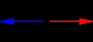
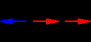
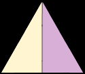
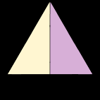
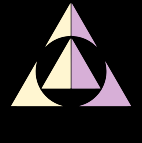
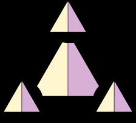
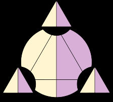
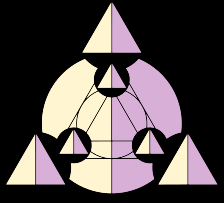
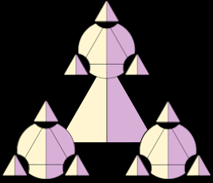

---

## Page 2

Day 0: System 1: Chaos (Primary Active Interface)  
  
Day 1: System 2: Cosmos (Complementary Modes)

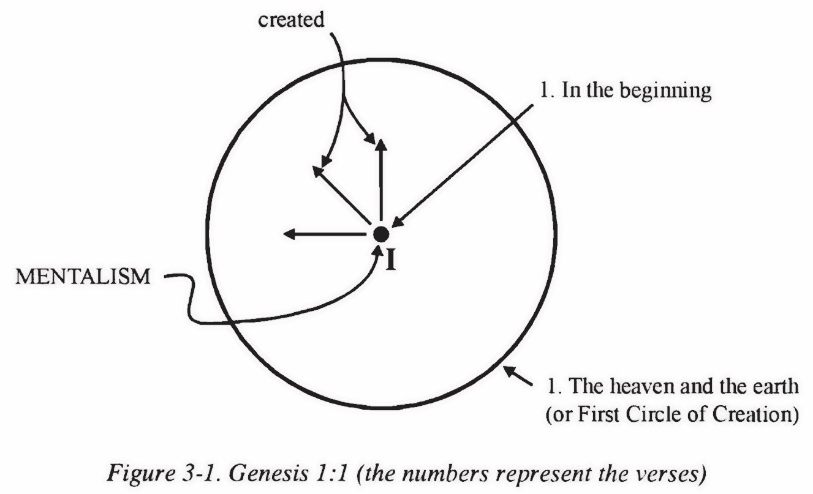
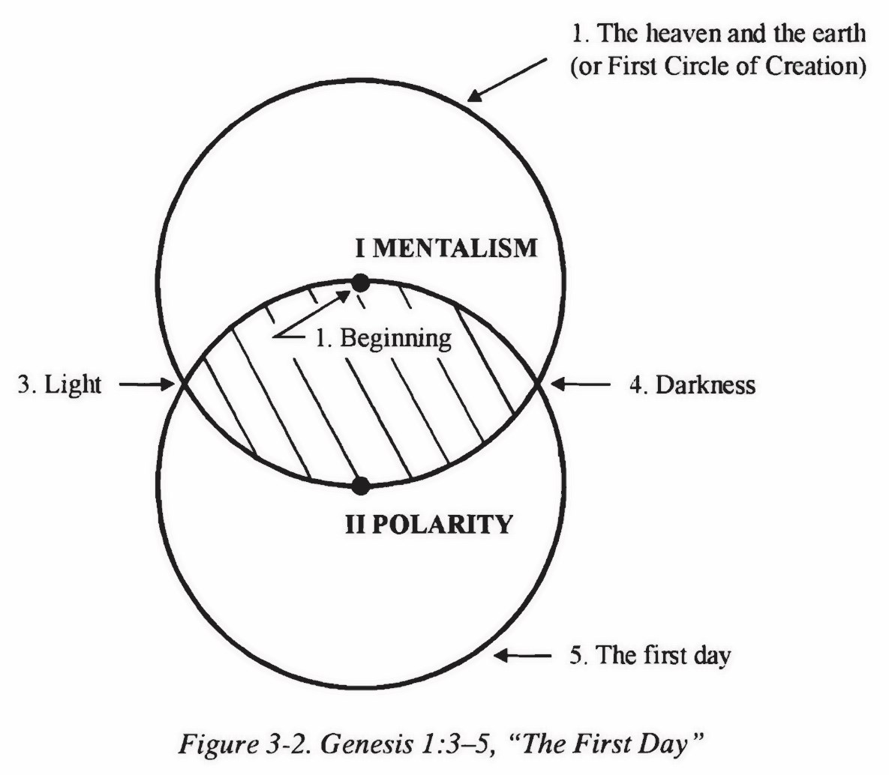

---

## Page 3

Day 2: System 3: Physis (Primary Activity)  
 
Day 3: System 4: Bios (Primary Creative Process)

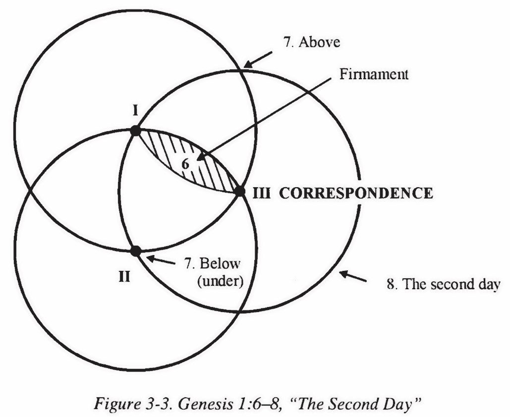
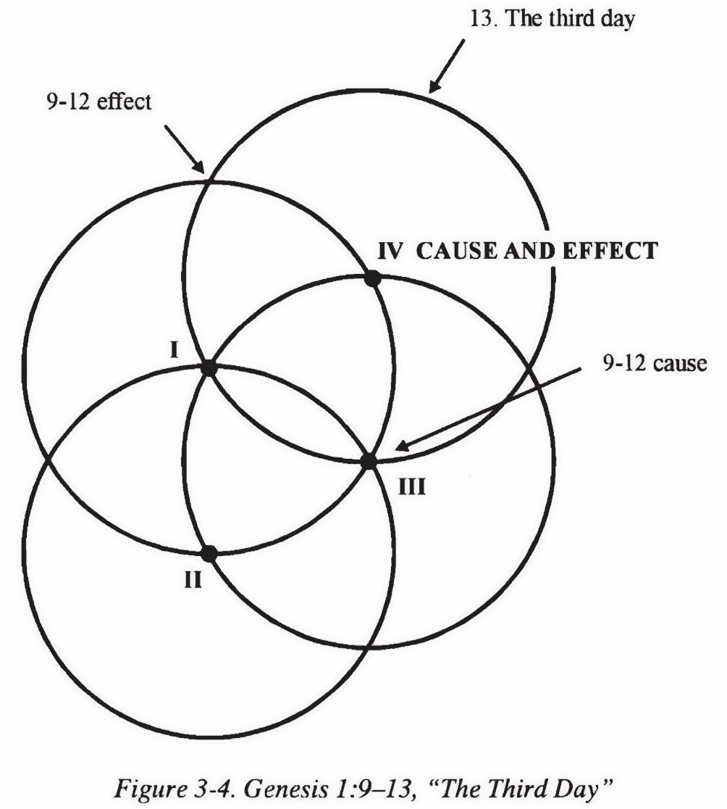

---

## Page 4

Day 4: System 5: Mythos (Complementary Modes)

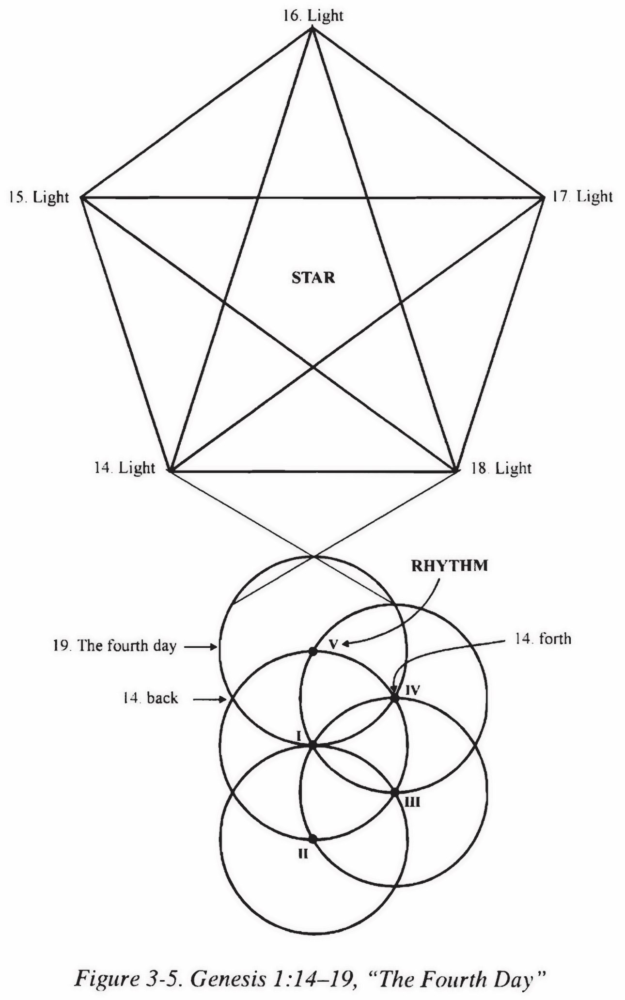

---

## Page 5

Day 5: System 6: Logos (Primary Activity)  
 
Day 6: System 7: Gnosis (Primary Creative Process)

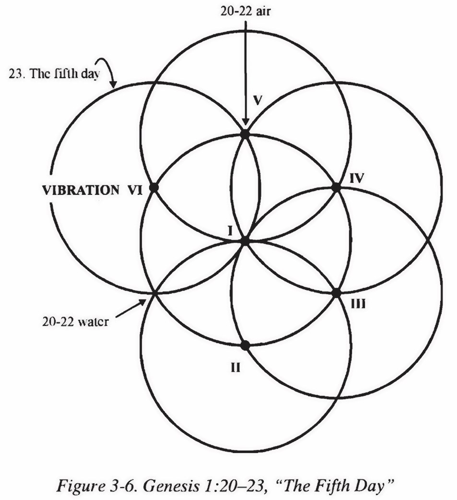
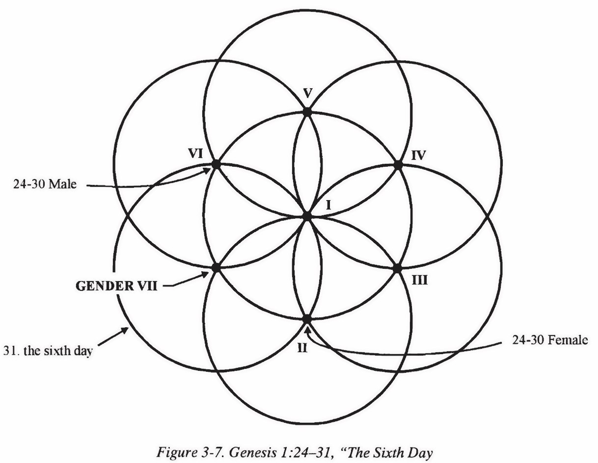

---

## Page 6

Day 7: System 8: Genesis (Complementary Modes)

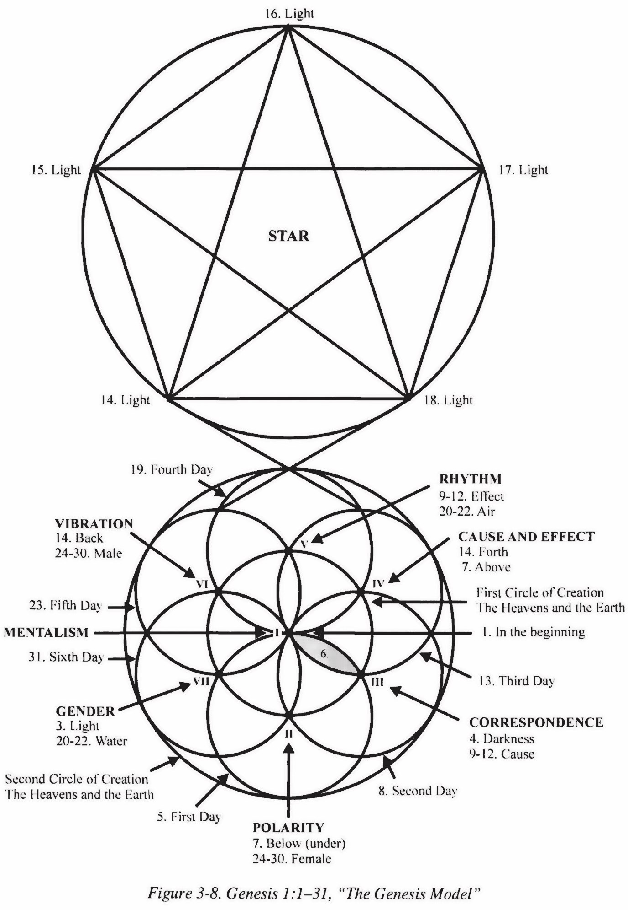

---

## Page 7

System 2 Dynamics (Active Orientation?) 
 
 
System 8 Dynamics (Active Orientation?)

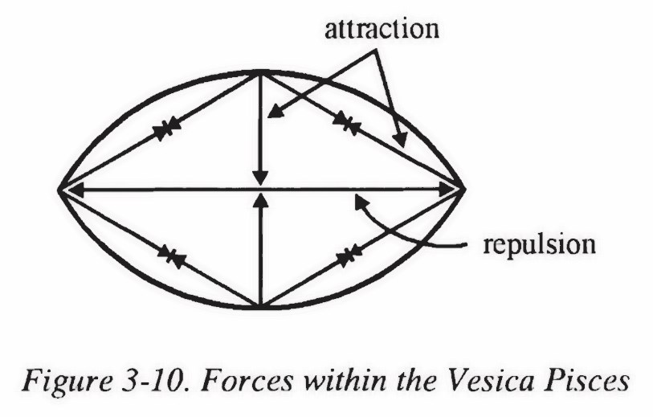
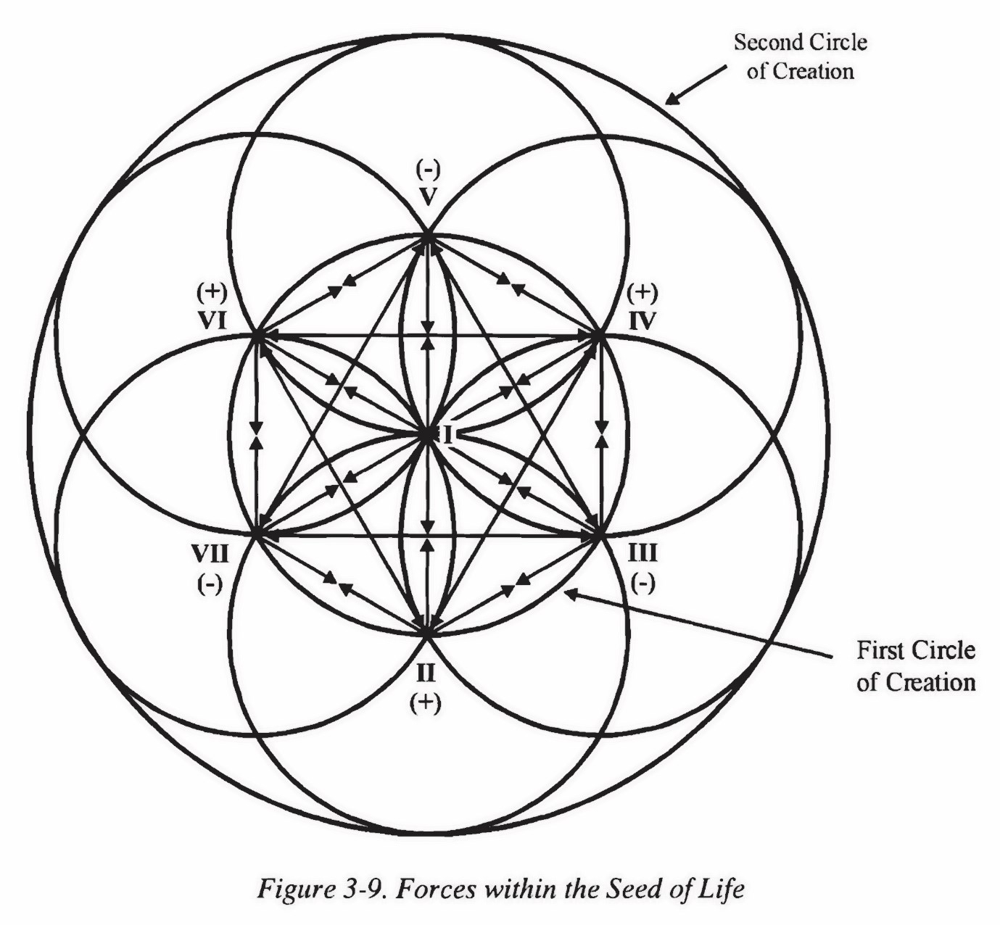

