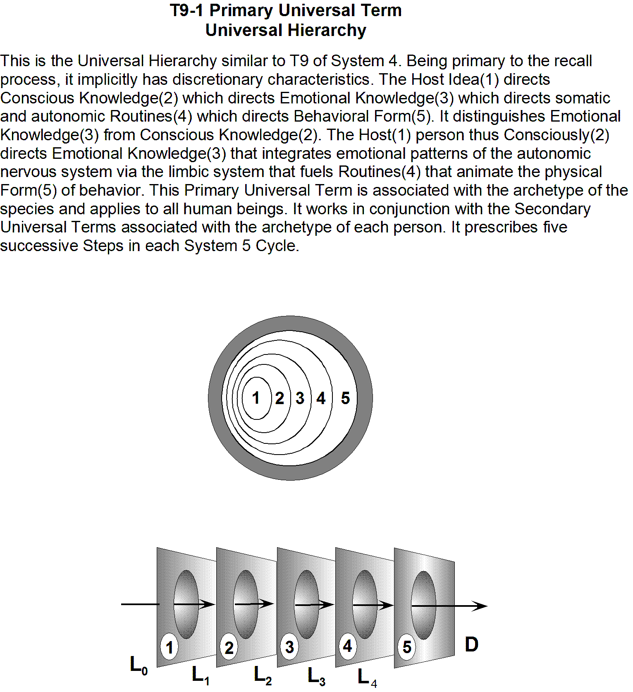

# T-9 Primary Universal Term

> Source: `sources/T-9 Primary Universal Term.pdf` | Pages: 1 | Extraction: embedded text layer, with Tesseract OCR fallback for image-only pages.

---

## Page 1 (OCR)

T9-1 Primary Universal Term
Universal Hierarchy

This is the Universal Hierarchy similar to T9 of System 4. Being primary to the recall
process, it implicitly has discretionary characteristics. The Host Idea(1) directs
Conscious Knowledge(2) which directs Emotional Knowledge(3) which directs somatic
and autonomic Routines(4) which directs Behavioral Form(5). It distinguishes Emotional
Knowledge(3) from Conscious Knowledge(2). The Host(1) person thus Consciously(2)
directs Emotional Knowledge(3) that integrates emotional patterns of the autonomic
nervous system via the limbic system that fuels Routines(4) that animate the physical
Form(5) of behavior. This Primary Universal Term is associated with the archetype of the

species and applies to all human beings. It works in conjunction with the Secondary
Universal Terms associated with the archetype of each person. It prescribes five
successive Steps in each System 5 Cycle.

