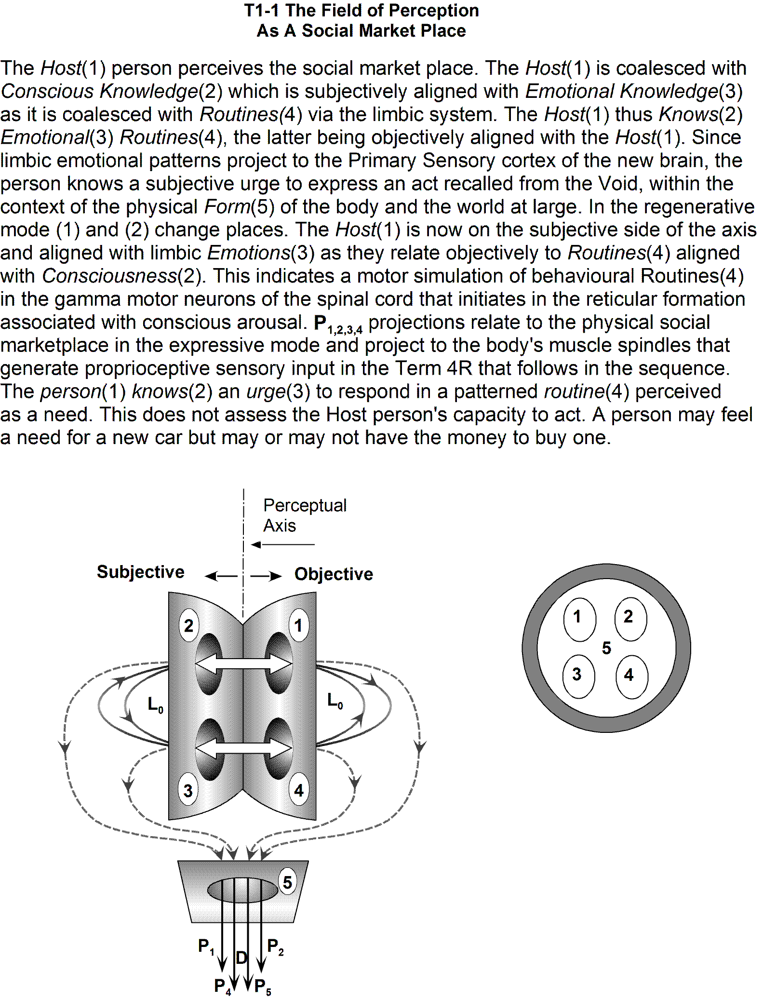

# T1-1 perception of need

> Source: `sources/T1-1 perception of need.pdf` | Pages: 1 | Extraction: embedded text layer, with Tesseract OCR fallback for image-only pages.

---

## Page 1 (OCR)

T1-1 The Field of Perception
As A Social Market Place

The Host(1) person perceives the social market place. The Host(1) is coalesced with
Conscious Knowledge(2) which is subjectively aligned with Emotional Knowledge(3)
as it is coalesced with Routines(4) via the limbic system. The Host(1) thus Knows(2)
Emotional(3) Routines(4), the latter being objectively aligned with the Host(1). Since
limbic emotional patterns project to the Primary Sensory cortex of the new brain, the
person knows a subjective urge to express an act recalled from the Void, within the
context of the physical Form(5) of the body and the world at large. In the regenerative
mode (1) and (2) change places. The Hostf(1) is now on the subjective side of the axis
and aligned with limbic Emotions(3) as they relate objectively to Routines(4) aligned
with Consciousness(2). This indicates a motor simulation of behavioural Routines(4)
in the gamma motor neurons of the spinal cord that initiates in the reticular formation
associated with conscious arousal. P,,,, projections relate to the physical social
marketplace in the expressive mode and project to the body's muscle spindles that
generate proprioceptive sensory input in the Term 4R that follows in the sequence.
The person(1) knows(2) an urge(3) to respond in a patterned routine(4) perceived

as a need. This does not assess the Host person's capacity to act. A person may feel
a need for a new car but may or may not have the money to buy one.

| Perceptual
| Axis

|<

|

Subjective <j—> Objective

