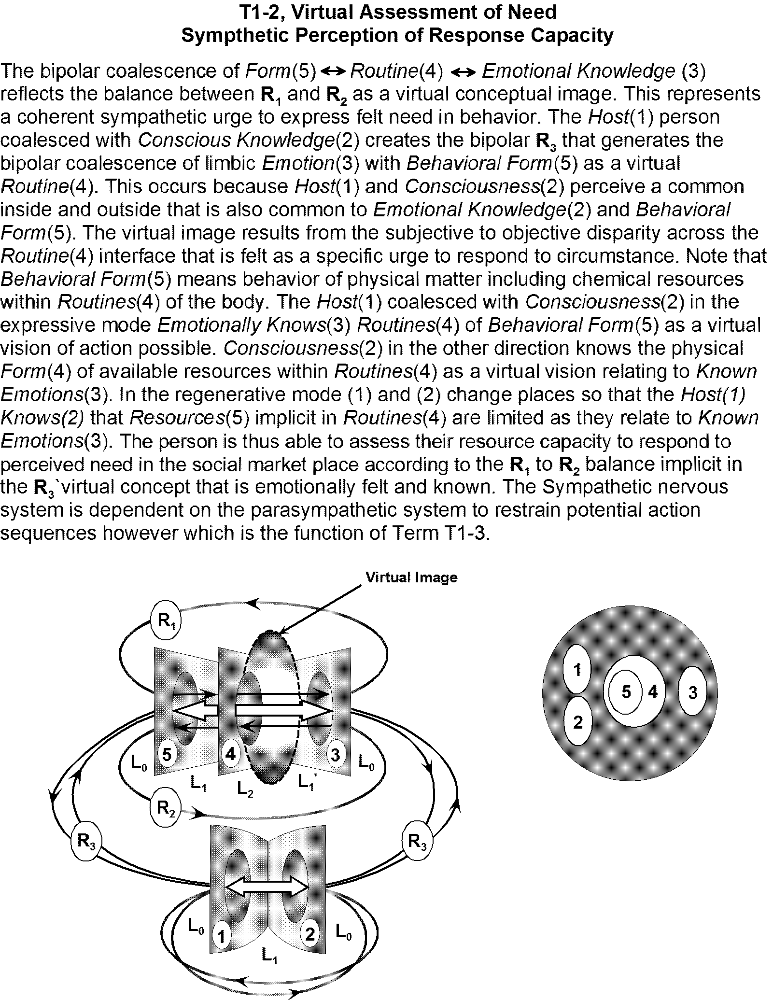

# T1-2 assessment of need

> Source: `sources/T1-2 assessment of need.pdf` | Pages: 1 | Extraction: embedded text layer, with Tesseract OCR fallback for image-only pages.

---

## Page 1 (OCR)

T1-2, Virtual Assessment of Need
Sympthetic Perception of Response Capacity

The bipolar coalescence of Form(5) <> Routine(4) <» Emotional Knowledge (3)
reflects the balance between R, and R, as a virtual conceptual image. This represents
a coherent sympathetic urge to express felt need in behavior. The Host(1) person
coalesced with Conscious Knowledge(2) creates the bipolar R, that generates the
bipolar coalescence of limbic Emotion(3) with Behavioral Form(5) as a virtual
Routine(4). This occurs because Host(1) and Consciousness(2) perceive a common
inside and outside that is also common to Emotional Knowledge(2) and Behavioral
Form(5). The virtual image results from the subjective to objective disparity across the
Routine(4) interface that is felt as a specific urge to respond to circumstance. Note that
Behavioral Form(5) means behavior of physical matter including chemical resources
within Routines(4) of the body. The Hosi(1) coalesced with Consciousness(2) in the
expressive mode Emotionally Knows(3) Routines(4) of Behavioral Form(5) as a virtual
vision of action possible. Consciousness(2) in the other direction knows the physical
Form(4) of available resources within Routines(4) as a virtual vision relating to Known
Emotions(3). in the regenerative mode (1) and (2) change places so that the Host(7)
Knows(2) that Resources(5) implicit in Routines(4) are limited as they relate to Known
Emotions(3). The person is thus able to assess their resource capacity to respond to
perceived need in the social market place according to the R, to R, balance implicit in
the R, virtual concept that is emotionally felt and known. The Sympathetic nervous
system is dependent on the parasympathetic system to restrain potential action
sequences however which is the function of Term 11-3.

Virtual Image

R,
_ 1
A F
Lio. A SIL,
L Lowy
R,
R, R,
L, 4 2 L,

