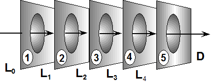
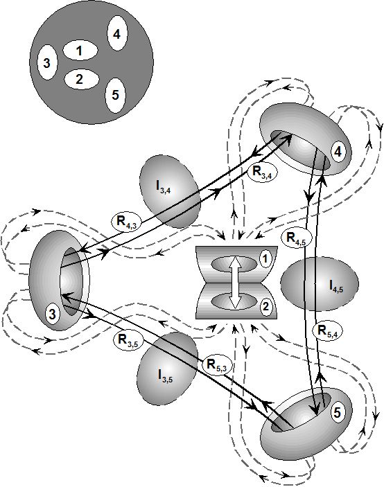
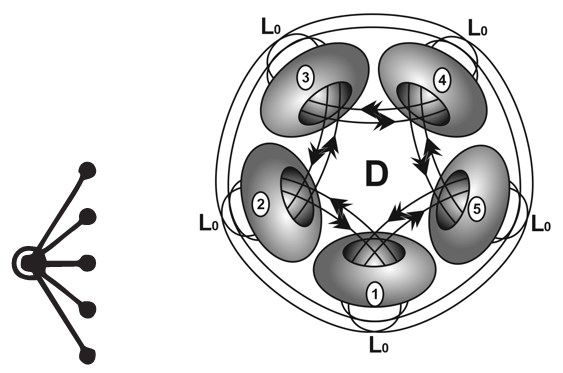

# T1-3 (Virtual Image Triad) - System 5 - Bob - Re_ Back in Thailand

> Source: `sources/T1-3 (Virtual Image Triad) - System 5 - Bob - Re_ Back in Thailand.pdf` | Pages: 3 | Extraction: embedded text layer, with Tesseract OCR fallback for image-only pages.

---

## Page 1

Just a note about your drawing of a System 5 Term. It cannot work with 5 double 
identities that way you have illustrated it. It is just not possible in experience of any 
kind, because each higher System must be a consistent elaboration of all the Lower 
Systems that precede it and yet still be a complete System with all 20 Terms involved 
in a meaningful matrix of transform sequences. As it happens only triadic relationships 
between three centers can have mutually closed interfaces that exhibit surfaces. That 
is why a primary atom has a photon energy shell, an electron and a proton. It is why 
we have three distinct functional brains that seek a mutual balance. So when the five 
interfaces are mutually separate three of them are mutually closed as in System 3 
while the other two are open and mutually coalesce as in System 2. But the five 
interfaces although separate have a hierarchical relationship to one another that is 
defined by a primary Universal Term where all 5 interfaces are stacked together with 
interface (1) inside (2) inside (3) inside (4) inside (5).  
 
 
 
This hierarchical relationship must relate to the structure of human experience in this 
case as an elaboration of System 4. The Term 9 Universal Hierarchy of System 4 is 
conscious Idea (1) directs Knowledge (2) implicit in the infrastructure of the nervous 
system which directs conditioned behavioral Routines (3) of neuro-muscular activity 
which alters the physical Form (4) of the body in concert with the whole physical 
universe. All human actions conform to this universal hierarchy. In System 3 the 
hierarchy was Idea (1) directs Routines (2) which directs Forms (4). In System 4 a 
Knowledge level (2) is distinguished distinct from Idea (1).  In System 5 there is a 
further distinction of Emotional Knowledge (3) from Conscious Knowledge (2). So 
the Host Idea (1) remains as one integrated whole that directs Conscious 
Knowledge (2) that directs Emotional Knowledge (3) that direct Routines (4), that 
directs the Form (5) of the body in concert with the Universe. This is the primary 
Universal Hierarchy of System 5 that specifies the relationship of all five interfaces in 
all 20+ Terms including Expressive and Regenerative Modes. This implicates our 
autonomic nervous systems distinct from our somatic nervous system.  
 
So when the five interfaces are separate the only way that they can consistently relate 
is if (3), (4) and (5) form a mutually closed triad while (1) and (2) coalesce as one such 
that they relate from within each of the three closed interfaces. Because of the double 
identity relationships that are only possible in traids this generates three mutually 
closed virtual images relating emotional or spiritual virtual identity to virtual routines 
and virtual form. In other words a virtual reality is perceived distinct from the physical 
reality that we usually believe we are living in. But the fact remains that our sensory 
perception of the outside world is in fact a virtual reconstruction by our nervous system 
that mirrors the outside world from the unique perspective of each of us. This is a 
biological fact.

---

## Page 2

To sum up System 5 is a major challenge because it must relate to the structure of the 
human nervous system as well as to our sensory experience of the world around us. 
This is a very sketchy outline. I will get back to you later on points in your email. 
 
 
 
 
This is a lot to think about so have patience. 
 
Best regards, 
Bob

---

## Page 3 (OCR)

(Incorrect Diagram)

|-Primary)

(Universa

rning Experience

As Integrated Lea

T9-2 Renewed Field of Perception

