# The Flame-Hand Letters of the Hebrew Alphabet

> Source: `sources/The Flame-Hand Letters of the Hebrew Alphabet.pdf` | Pages: 28 | Extraction: embedded text layer, with Tesseract OCR fallback for image-only pages.

---

## Page 1

12 
The Flame-Hand Letters of the Hebrew Alphabet 
In the beginning of heaven and earth there were no words, 
Words come out of the womb of matter. 
Lao-Tse 
12.1 Introduction 
In Part One, I presented several examples of ways in which numbers and 
geometry may have been used by ancient civilizations. I also described 
Kepler's attempt to create a planetary system from the music of the spheres 
and Theodor Schwenk's and Lawrence Edwards' work to find unifying 
principles that generate natural forms. Projective geometry, harmonic law, 
systems of proportion, the Megalithic stone circles, and the designs found 
in the pavements of the Laurentian Library can be thought of as symbolic 
languages in their ability to express relationships found in art, architecture, 
music, design, and patterns in nature. 
In Part Two I take a more formal approach to number and geometry 
and describe how certain systems evolve by continually feeding back 
information about themselves. I will show that the dynamics of such 
self-referential systems is governed once again by number and geometry. 
I ask the reader to ponder the question as to whether the patterns of 
number and geometry that we observe in the natural world are intrinsic to 
nature or do we subtly project aspects of our own thought processes onto 
the world? 
The ultimate self-referential system is written language. The biologist, 
Lewis Thomas, has commented that written language functions much like 
a genetic code; it serves as a carrier of meaning and culture across the 
261

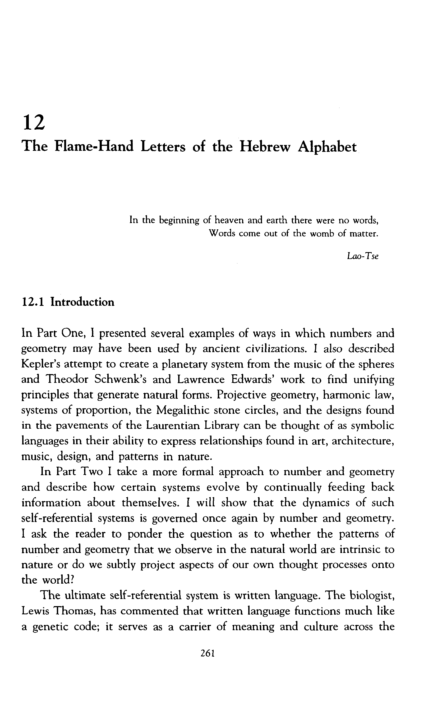

---

## Page 2

262 Beyond Measure 
generations. New meanings take the place of the old, yet remnants of the 
original meanings become part of the philological roots. In this chapter, I 
will present a hypothetical geometrical system developed proposed by Stan 
Tenen, an independent researcher, that attempts to shed light on the origin 
of the Hebrew alphabet and the meanings of its symbols [Tenl]. The letters 
are obtained by projecting a specially, meaningfully-shaped spiral, vortex 
form onto a flat surface from a variety of points of projection. The spiral 
vortex suggests a flame, and the projection source could be a flame, thus my 
reference to the letters as "flame letters". Likewise, this vortex form can 
also be seen as an idealized human hand. When this model hand is placed 
on one's hand, the wearer sees each letter when making particular gestures 
related to the meaning of the name of the letter, thus my reference to this 
model as a "flame-hand" model. 
Tenen's primary interest is in the recovery of what he takes to be an 
underlying geometric metaphor in Western traditions. My focus in this 
chapter is on the geometrical forms and mathematical content. Tenen's 
story and mine share a common interest in the importance of systems 
created from within themselves, or self - referential systems. In the next 
chapter, I will study the mathematics of self-referential systems. 
12.2 The Flame-Hand Letters of the Hebrew Alphabet 
The Hebrew alphabet, or aleph-beth, plays an important role in the 
historical evolution of written language. We attribute the first fully symbolic 
written language to the Semitic tribes dating to 1500 B.CE. Before this 
time written language took the form of pictorial systems such as Egyptian 
hieroglyphics (which first appeared in 3000 B.CE.) in which stylized images 
of humans and human implements were interspersed with those of plants, 
birds, and other animals. 
Although the Canaanite/Phoenician ("Old Hebrew") written language 
is entirely symbolic, (every sound-syllable had its own character or letter), 
it does retain remnants of its pictorial predecessors. For example, aleph 
2^ (the equivalent of the English "A") is the ancient word for ox (and the 
Canaanite Aleph looks like an ox-head on its side) while mem (the 
equivalent of "M") is the Hebrew word for water and is symbolized by a

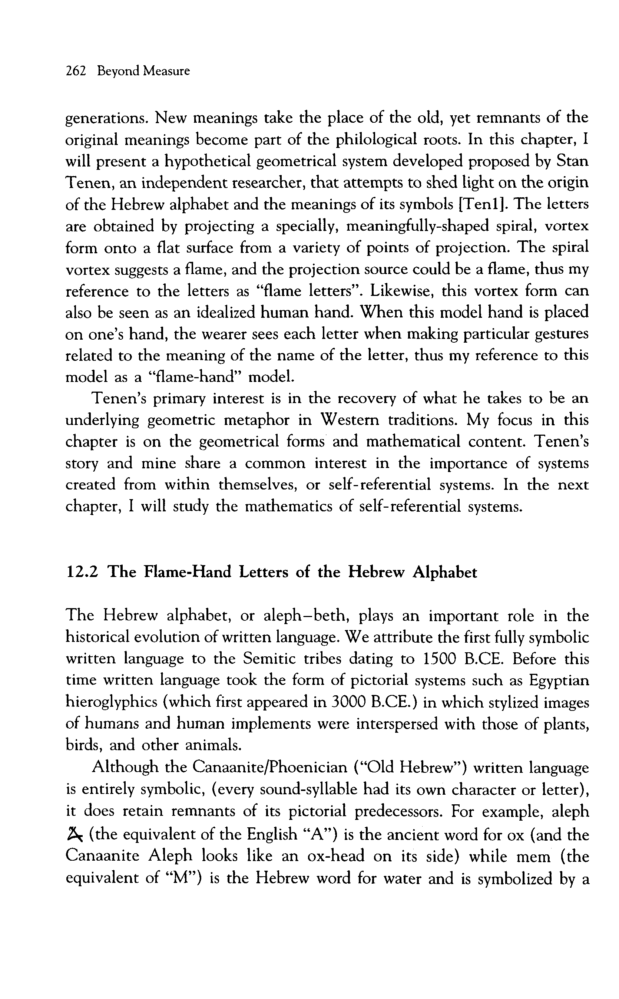

---

## Page 3

Chapter 12 The Flame-Hand Letters of the Hebrew Alphabet 263 
Table 12.1 Shadowgrams of the 27 Meruba Hebrew letters. 
They are all views of one physical system. 
8AMPLE ALPHABETS FBDH: "HEBREW ALPHABETS" 
c. 1950 REUBEN LEAF, BLOCK PUBLISHING 
10-11th century Spanish Rabbinic 
11 cant.'NACHHANIDES "HASHI" Prototype 
J
"RASHI"-etyle Typonraphy 
I 
First printed Hebrea, Lisbon 1489 
I 
I 
300 BCE, Elephentlne Papyrus 
I I I 
K 
4 
A 
~v 
n 
) 
r 
n 
0 
> 
.? 
htt 
3 3 
JJ 
n 
nn 
i ) 
r t 
no 
\3U 
* i 
op 
11 
f > l * 
3 J 
7 7 
DP 
1 1 
t r 
np 
1DD 
i 
i 
OD 
Vh] 
»p 
-N 
7 
r> 
) 
i 
fc> 
y 
t 
j) 
B E T 
GlMEL. 
DALETa 
HE 
an 
Z/STIN r 
cHET 
TET 
, 3 W 
Y O D 
K A F 
LAMED . 
MEM 
B*C 
1 
A 
B 
C 
D 
i 
!F 
1 
G 
H 
J 
i 
ii 
i 
L 
M 
FLAKE 
MODEL 
BHADOIr-
GRAHS 
I

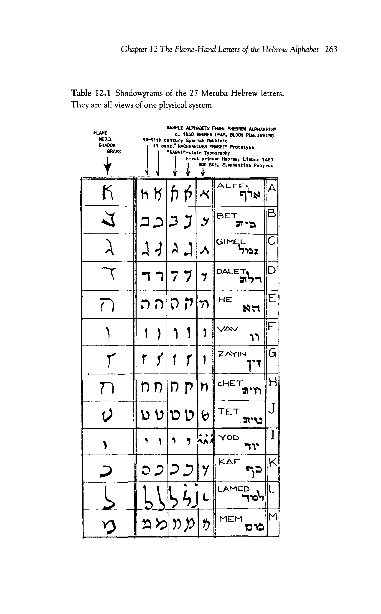

---

## Page 4

264 Beyond Measure 
Table 12.1 (Continued) 
FLAME 
MODEL 
SHADOX-
BRAMS 
4 
> 
r> 
J 
Z> 
J 
V 
I 
# 
r\ 
1 
D 
) 
") 
\ 
SAH>LE ALPHABETS FROM: "HEBREW ALPHABETS" 
e. 1S5Q REUBEN LEAF, BLOCH PUBLISHING 
10-11th century Spanish Rabbinic 
1 
11 eant,MNACHHANIDES "RASHI" Prototype 
I 
| 
•RASHI"-BtyU Typography 
I 
I 
First printed Hebrm, Lisbon 1489 
I
X 
1 
X 
30P B^t Elaphantlne Papyrua 
J J 
oo 
yy 
DS> 
2S 
H 
1 "1 
Dt> 
JT)/I 
TT 
D"0 
11 
n 
in 
; ; 
op 
DJ> 
9.3 
5 J 
pp 
") ? 
DP 
PJ) 
n 
ot> 
1 1 
11 
i r 
5) 
5 
0 
r 
*7 
* 
r 
5 
J 
\ 
N U N 
V
5 
S A M E K 
•7"tt"0 
A V I N 
7-y 
S 3 
Z A D I 
•"IS 
Q O F 
RETSh 
S H I N 
T A V 
KAr(Fiw4 
"BIO 
* p 
M C M t ~ ) 
•Bi© 
O S 
N U N f-«.y 
F El fr>»»i- »«l 
Z A D I <.-—•> 
•mo "15 
N 
$ 
0 
P 
z 
Q 
R 
S 
T 
\J 
W 
X 
V 
Y

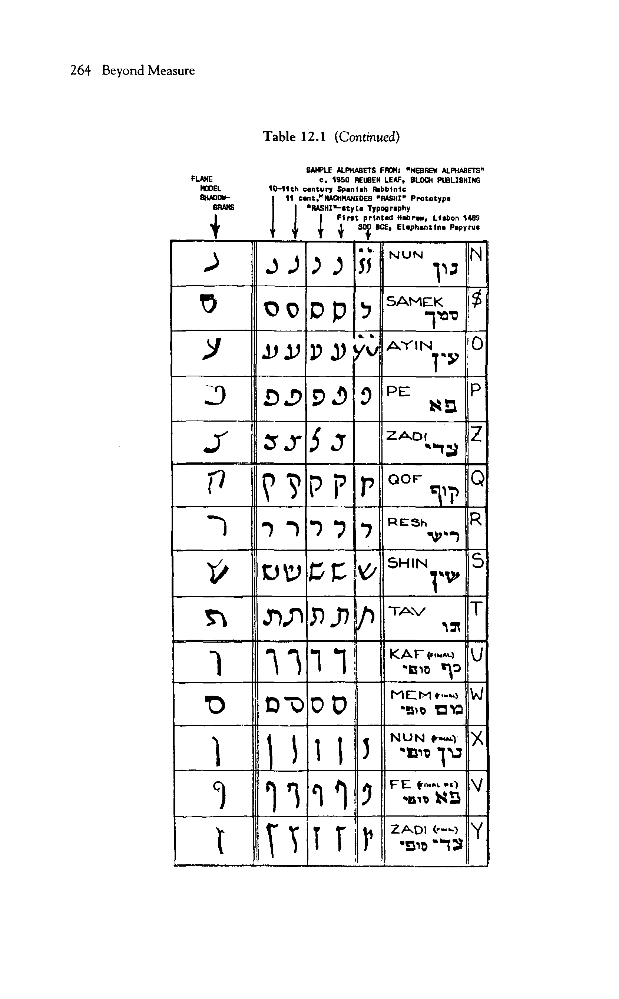

---

## Page 5

Chapter 12 The Flame-Hand Letters of the Hebrew Alphabet 265 
series of waves v v ) . Qof (the equivalent of "Q") is the word for skull and 
is drawn with a circular top (the "skull") and a vertical descender (the 
"spinal column") Q. 
It was only after the transfer of phonetic writing to Greece with the 
transformation of the aleph-beth into the Greek "alphabet", that progressive 
abstraction of linguistic meaning reached completion. In his book, The Spell 
of the Sensuous, David Abram [Abr] traces the origins of written language 
and the effect this has had on the way we see the world. 
The system proposed by Stan Tenen generates close facsimiles to the 
shapes of the 27 letters of the rabbinic form of the Meruba Hebrew alphabet 
shown in Table 12.1, while at the same time organizing them into a coherent 
pattern of meanings [Ten]. This system is also capable of generating the 
letters of particular forms of the Greek and Arabic alphabets. Tenen 
sees this as evidence of a common thread spanning many ancient systems 
of thought. The Hebrew letters in Table 12.1 are shown with English 
correspondences and correlations to the English alphabet (not all are 
phonetic equivalents). 
It should be stated that Tenen's proposal is historically controversial, 
and while it has begun to be presented for peer review, it would be premature 
to comment on its authenticity. There is little that scholars know for certain 
about the origins of Hebrew letters. Scholars have never been able to fully 
penetrate the meaning of particular sacred books of Jewish mysticism such 
as the Zohar, nor related ancient Sufi texts. Yet Tenen believes that these 
works become precise, unambiguous and meaningful when they are 
interpreted through their inherently geometrical metaphoric imagery. 
It is unlikely that our forefathers understood the geometrical concepts 
that we shall present in the manner in which we understand them. After 
all, they had their own symbolic languages. However, mathematical concepts 
are fundamental and can be understood in many different ways. I shall 
present Tenen's work as a kind of mathematical poem or metaphor. It will 
provide us with a model of a system generated from within itself. 
12.3 The Vortex Defining the Living Fruit 
Tenen first develops the concept of the life cycle of a living fruit. The 
idealized fruit is modeled by a "dimpled sphere" or torus (inner tube) whose

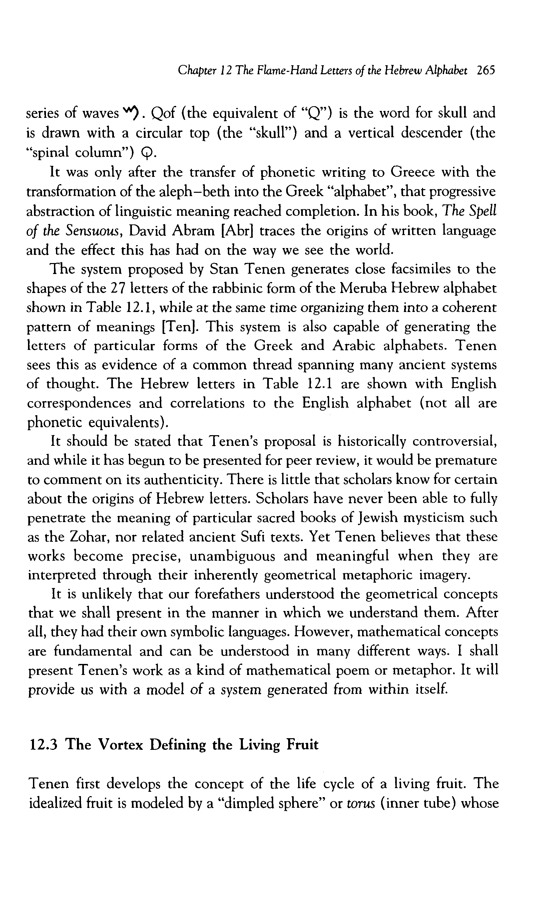

---

## Page 6

266 Beyond Measure 
"Fruit tree yielding fruit whose seed is inside itseff' Genesis 1,11 
2 TORUS 
IDEAL "APPLE" 
"8EED(Sr 
"STAR-OF-SEEDS" 
"WOMB" 
"SUN" 
IDEALIZED STAR 
"FLAT TORUS 
3-TURN VORTEX ON 
THE SURFACE OF AN "APPLE* 
Figure 12.1 Idealized fruit modeled as a dimpled sphere. 
inner radius shrinks to zero, as shown in Figure 12.1. The central sphere 
represents either the "seed-pod" of the current "fruit" or the next generation 
"fruit" nested within the current generation. 
In vertical (stem up, flower down) cross section, the "dimpled sphere" 
or "generic apple" appears as two quasi-ellipses nested against and 
surrounding the central sphere, which appears as a circle sitting over the 
"kissing" point of the two ellipses. The ring of five seeds of the "apple" are 
arranged in a five-pointed star (the seeds in the core of an apple form a 
pentagon). 
A seven-stage dynamic process through which the idealized fruit passes — 
the inherent propensity of the seed to grow — is modeled by considering 
the seed to be "containing" an internal increment (or quantum) of angular 
momentum. This is similar to the idea of spin in elementary particle physics, 
where the particle is considered to carry a quantum of spin in units of 
angular momentum. The seven-stage process unfolds as follows: 
1) The potential angular momentum locked into the idealized seed-pod is 
expressed as an "impulse" that ejects the "sprout" from the "seed" as the

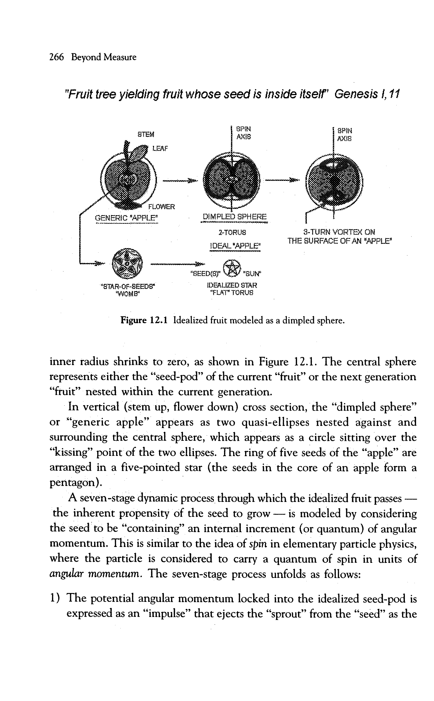

---

## Page 7

Chapter 12 The Flame-Hand Letters of the Hebrew Alphabet 267 
"fruit-tree" starts to grow. Initially all the angular momentum is expressed 
by the ejection of the "sprout" along its erupting "stem". 
2) Later in the life-cycle of the fruit-tree, when the stem or trunk of the tree 
has reached its maximum extent, the angular momentum — representing 
the life-force of the fruit-tree throughout its life-cycle — must be 
transferred into the unfurlment (around the tree-trunk) of the leaves 
and branches of the fruit-tree. 
3) The branches sprout buds. 
4) Which give rise to new fruit. 
5) From which emerge flowers. 
6) Still later, near the end of the life-cycle, the angular momentum in the 
volume of the mature fruit must be transferred to the next generation 
of seed (represented by the central sphere), as its flowers decay (and fall 
to the ground, now devoid of life-force and angular momentum), and as 
this new seed (containing the passed-on life-force and increment of 
angular momentum of the life-cycle) is thrown to the wind. 
7) The new seed falls to the ground to restart the next life-cycle. 
The Sefer Zohar, quoting Genesis, describes the entire living system as 
a "fruit-tree, yielding fruit, whose seed is in itself". Each generation of fruit, 
in turn, is seen as nested within the previous generation giving rising to the 
recursive sequence: ...-acorn-oak-acorn-oak-.... We have here the 
quintessential self-referential process in which fruit is both a vessel and 
its contents. (The vessel is modeled as a torus, which as with vortices 
(see Section 1.11), is a minimal closed system, the first requirement for 
self-reference.) For example, a smoke ring maintains its integrity in the 
form of a torus. 
The process of unfurlment and spin shown in Figure 12.2 is modeled by 
a ribbon with three turns. Since the original seed and the new seed within 
the new whole fruit are identical in their development, except for being a 
generation apart, they can be taken to be the ends of the developmental 
life-cycle strung between them. The ribbon represents the exchange and 
transformation of angular momentum that takes place during the 
seven-stage life cycle. This vortex form can also be taken to represent an 
individual. The living spirit of the individual is symbolized by his/her whirling 
motion as in Sufi or Dervish dancing. The philosopher, mathematician,

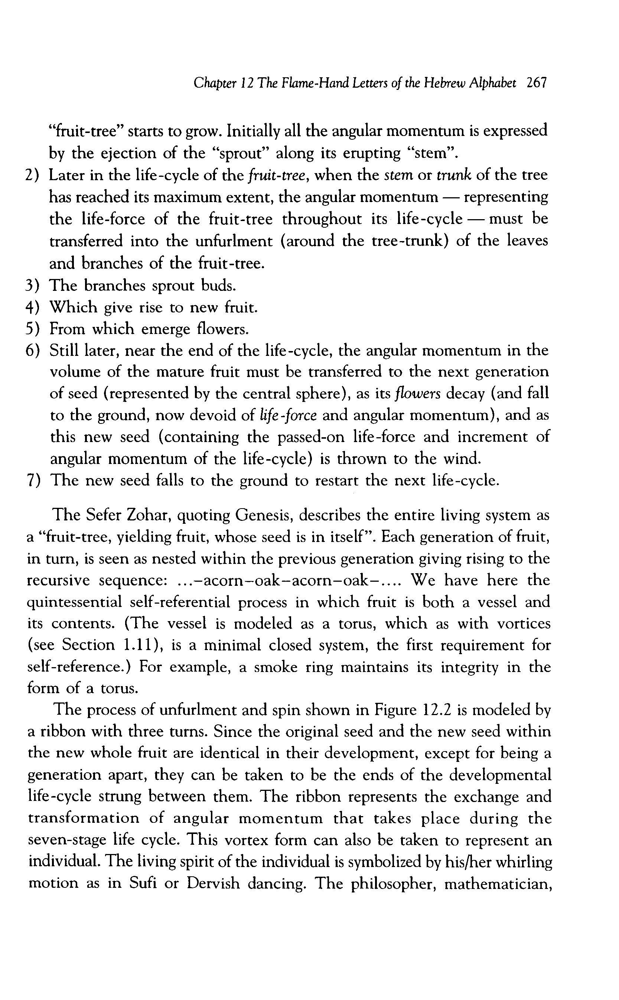

---

## Page 8

268 Beyond Measure 
3-TU'rss ere t e w M to tJeSmttw e^te 
ctMfax M. tele's aftgrat *$$evP 
r-Cste Mm m a 2-rmis. 
Computer mode! of an 
EMBRYONIC FRUiT 
IDEAU26D FRUIT 
Figure 12-2 Cycle of life of a living fruit. The idealized embryology of a fruit-tree is mapped 
onto an ideal fruit.' 
and engineer Arthur Young [Young] has written extensively in his book, 
The Reflexive Universe, about the seven-stage process under which all natural 
forms of the universe unfold. Tenen credits this system, and his fruit tree 
conforms well to it. 
12.4 The Torus 
The torus is the first structure of mathematical importance that we encounter 
in Tenen's proposal. What is a torus? Any circular (loop) cut made on the 
surface of a sphere divides the sphere into two pieces. However, Figure 12.3 
shows that two loop cuts leave the surface of a torus (inner tube) in one 
piece and opens the torus up to a period rectangle. Each side of the period 
rectangle is identified with its opposite, since they represent the two loop 
cuts. The two circles that characterize the torus are its meridian and longitude, 
shown in Figure 12.4*

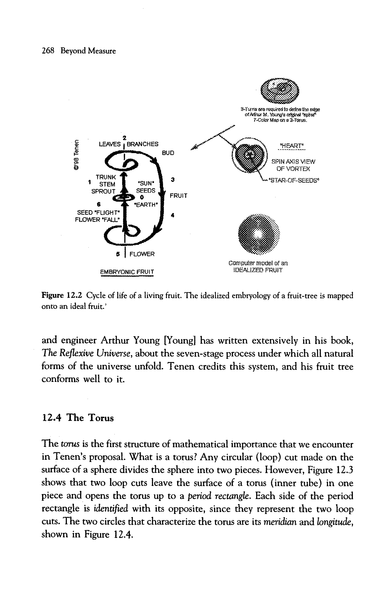

---

## Page 9

Chapter J 2 The Flame-Hand Letters of the Hebrew Alphabet 269 
iTinawilhlvrotoopcuBAand % 
I.!.-.... 
r T " " * ^ / 
' 1 
Figure 12.3 A torus is opened to a period 
rectangle by cutting two loops on its surface. 
Longitude 
Meridian 
Figure 12.4 A meridian and longitude on a torus. 
™r a * ™™v ^ . 
r 
V->"* 
° ' ^ w « « B M S S a O « p . V U 1 * - " " 
UMBiUC TOROID Showing 7-Coior Map an me 3-Turn Spiral Edge 
Arthur M. Vburtg*s Unique, 3-Turn Spiral vortex. ?-Coior Map Torus 
Figure 12.5 The surface of a torus divides itself naturally into seven regions.

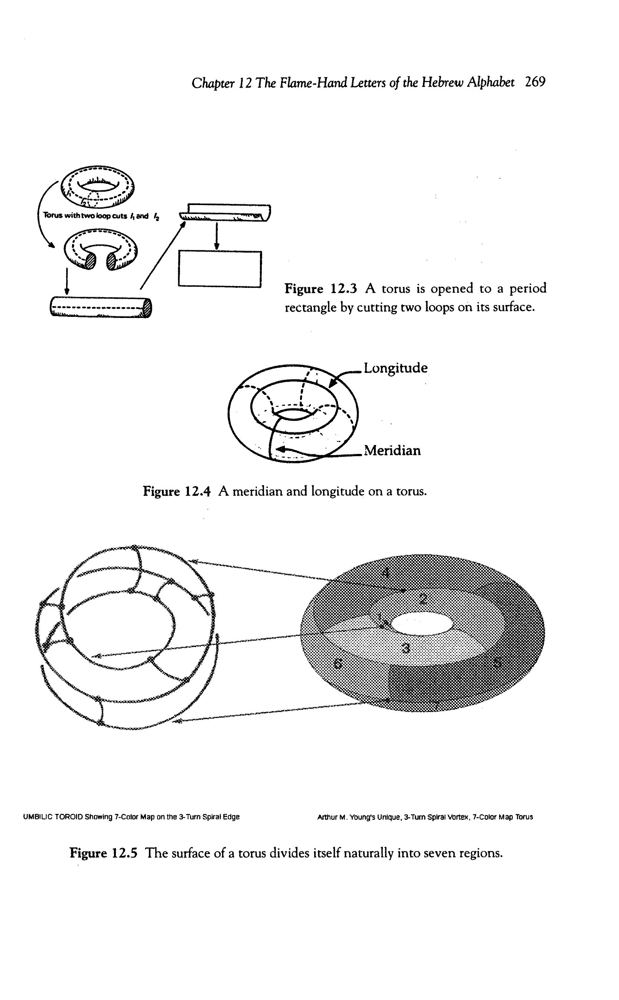

---

## Page 10

270 Beyond Measure 
In Figure 12.5, due to Arthur Young, we see that the ribbon of 
Figure 12.2 not only defines the structure of the torus but divides its surface 
in a natural way into seven regions. This is the seven-color map of the torus 
which states that a torus can be subdivided into seven regions, each region 
sharing an edge with the other six. If such a map were to be colored so that 
regions sharing an edge have different colors, clearly seven colors are needed. 
(It is well known that any map drawn on a sphere or the plane never 
requires more than four colors.) 
Figure 12.6a shows a seven-color map redrawn on a period rectangle. 
Notice how the seven regions continue from the left to the right edge, and 
A ^ ^ " ^ 
^ 5 ^ ^ 
c^^ 
D^^-^ 
E
^
^ 
F ^ 
G^^-
^^^ 
^3^ 
K^ 
^ B 
"^c 
^ D 
I 
*^~ ^ G 
(a) 
(b) 
(c) 
Figure 12.6 (a) and (b) seven-color map drawn 
as hexagons on a period rectangle; (c) hexagonal 
design on the shell of a turtle.

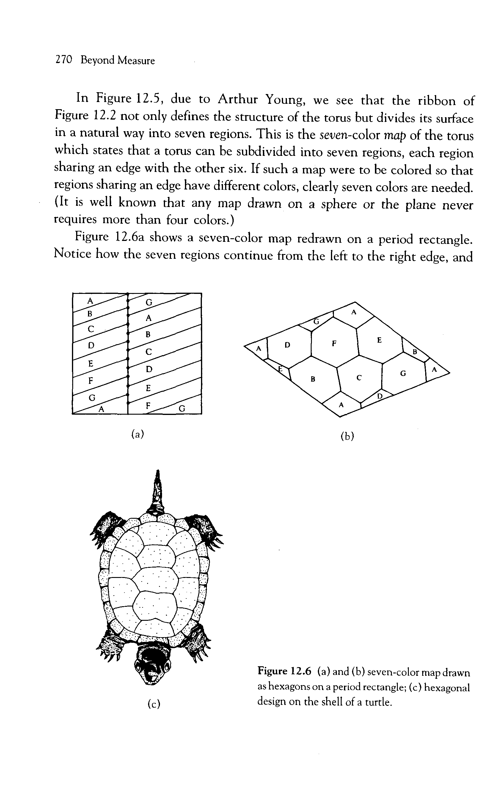

---

## Page 11

Chapter 12 The Flame-Hand Letters of the Hebrew Alphabet 111 
from the top to the bottom edge. Also notice that they are all hexagons 
(see Figure 12.6b). Tenen believes that this association of the torus with 
hexagons may lie at the basis of the ancient myths in which the world is 
brought into being on the back of a turtle whose shell is made of hexagons 
(see Figure 12.6c). 
12.5 The Tetrahelix 
A tetrahelix is a spiral column formed by combining a column of tetrahedra 
joined face to face, as shown in Figure 12.7. Three continuous spiraling ribs 
can be seen on the surface of the tetrahelix, forming a double helix. 
The tetrahelix can also be imagined to be formed by taking a triangular 
prism (see Figure 12.8) and giving it a ^-turn so that top face is rotated 
120 degrees with respect to the bottom face for each 11 -tetrahedra. Actually, 
no integral number of tetrahedra results in a top face oriented identical to 
Figure 12.7 A tetrahelix column.

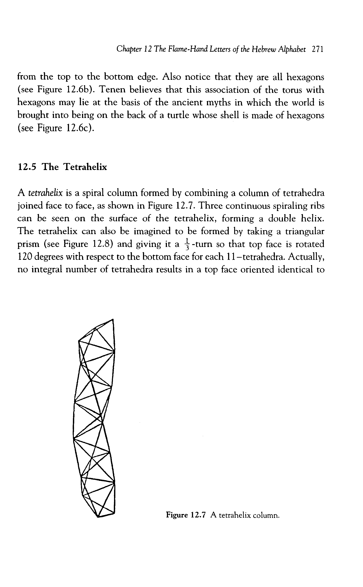

---

## Page 12

272 Beyond Measure 
22-FACE, 1/3-UNIT TETRAHELIX WHOSE 3-EDGE-RIBBONS TWIST-120° 
S~ 
TRANSFORMS INTO A 3-LOOP "PRE-KNOT". THE 3-LOOPS OF 
r 
THE "PRE-KNOT ARE THE EDGES OF AN UMBILIC TOROID.-—•*. 
Figure 12.8 A triangular prism is twisted into a tetrahelix and then rotated to form an umbilic 
toroid. Thirty three tetrahedra result in a column in which top and bottom faces are rotated 
approximately 360 degree. 
the bottom face. In other words, the tetrahelix is not a periodic structure 
and so the column must be slightly strained to enable the top and bottom 
faces to meet. A tetrahelix with 33 tetrahedra results in a column in which 
top and bottom faces are rotated approximately 360 degrees with respect to 
each other. Tenen has shown that the two ends of the -j -unit tetrahelix 
can then be bent around in a circular arc and joined together to form an 
"umbilic torus". Now the three disjoint spirals on the tetrahelix column 
form one continuous arc with three loops on the umbilic torus that precisely 
defines the edges of the seven color map on the torus (see Figure 12.5). A 
tetrahelix with 11-tetrahedra can be easily constructed by folding the 
triangular grid shown in Figure 12.9 up from the plane. 
Notice that the outline of this folding pattern is a hexagon which can 
also tile the plane, as shown in Figure 12.10a (see also Figure 12.6). Notice 
how the -j -unit of flattened tetrahelices form the six-around-one pattern 
of the seven-color map that characterizes the surface of a torus. Figure 
12.10b shows seven clusters of seven clusters of seven \ -unit tetrahelices.

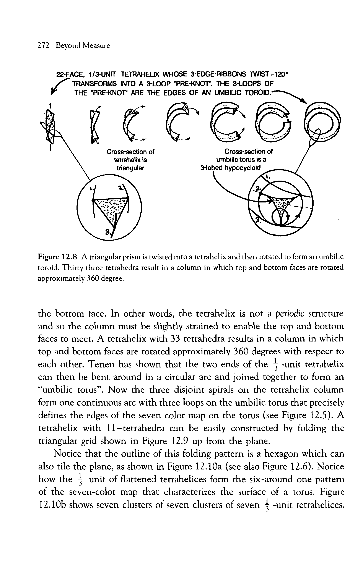

---

## Page 13

Chapter 12 The Flame-Hand Letters of the Hebrew Alphabet 273 
2MJETTER HEBREW ALPHABET COILED ON 
THE 22-FACES OF A1 /3-UNIT TETRA-HEUX 
22-LETTER HEBREW ALPHABET IN TETRA-HELIX ORDER 
Figure 12.9 Paper folding construction of a tetrahelix with 11 tetrahedra. 
We could make groups of seven at higher and higher levels indefinitely. 
The curve along the edge of this figure is called a "flowsnake" and is named 
after the "snowflake", or Koch curve, to which it is related (see Section 
18.5). The 22 letters of the Hebrew alphabet "seed" this hierarchy. 
When bent around and connected, the 11 tetrahedra exhibit 22 external 
faces (see Figure 12.9). Tenen has placed the sequence of 22 letters of the 
Hebrew alphabet (not counting the final letter forms) along these faces in 
alphabetical order. Notice that the letters of the Hebrew alphabet occur in 
sequential order on the hexagonal tiling of Figure 12.10b. In Figure 12.11, 
the edge of the umbilic torus has been isolated as a string, and Tenen has 
strung all 27 sletters of the Hebrew alphabet on the three turns of the string 
with nine letters for each of the three loops. In Figure 12.12 the second 
(bet) and last letter (tav) are merged to form the first letter (aleph) so that 
aleph is seen as both "head" and "tail" of the "Oroboros" or "snake that 
eats its tail".

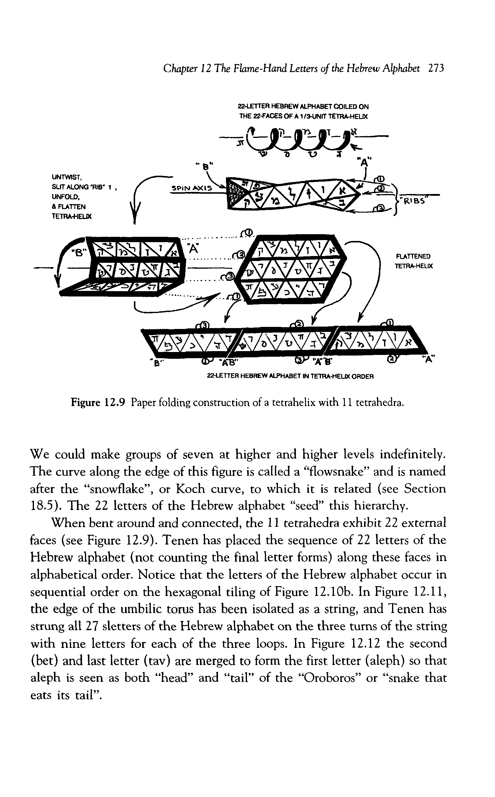

---

## Page 14

274 Beyond Measure 
«JitS£i^> 
« 
(a) 
(b) 
Figure 12.10 (a) Seven clusters of seven tetrahelices forming a fractal curve called the 
"flowsnake"; (b) the Hebrew letters superimposed on the hexagonal tiling.

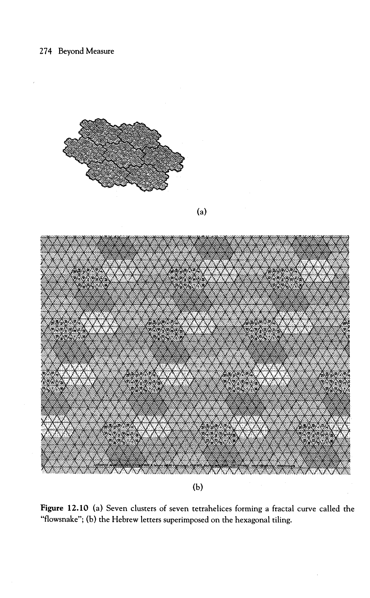

---

## Page 15

Chapter 12 The Flame-Hand Letters of the Hebrew Alphabet 275 
ENNEAGRAM VIEW Of the 3-LevelS If the HEBREW ALPHABET 
Bind 
to****1* 
J 
ProjECT 
£ x~~~^ Winter 
ConnECT# 
Notice the Left-Right symmetry on each level: 
£3 J Tet 
-Binding 
tl H cHet -EnClose 
T o Zaysn-ProjECT 
1 F Vav -Multiply 
vs. 
vs. 
vs. 
vs. 
He-ConnECT E 7T 
ALL-Aleph A 8 
Break OPEN- 
Bet B S 
ACT-8imel c 1 
Divide- Dalet D l 
Figure 12.11 The 27 letters of the Hebrew alphabet sequentially strung on the three loops of 
the umbilic torus form an enneagram (nine-sided) view of the three-levels of the Hebrew 
alphabet.

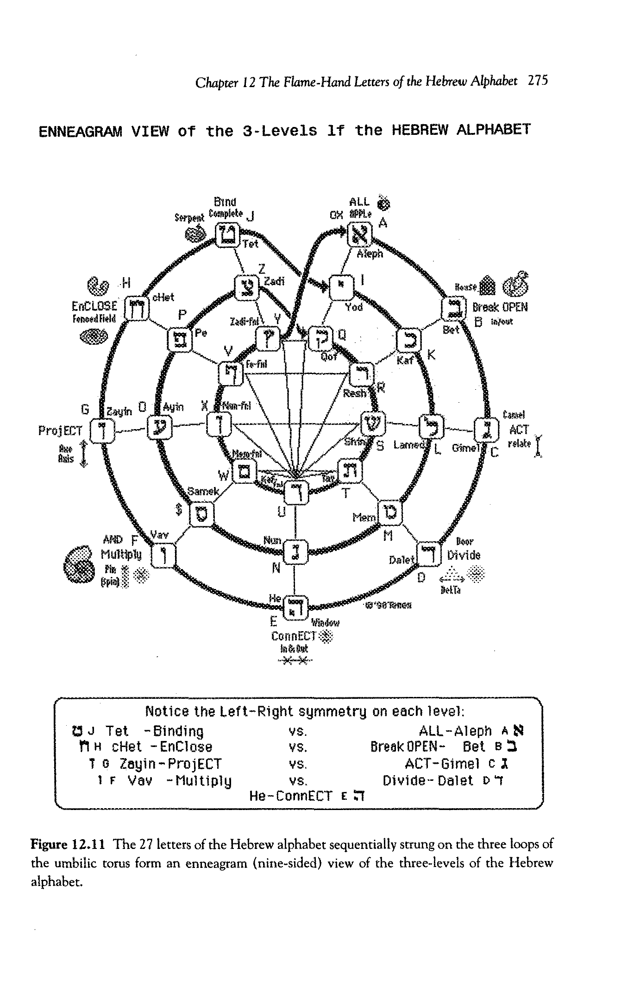

---

## Page 16

276 Beyond Measure 
V 
Inverted 
Final Zadi 
Figure 12.12 The second letter of the Hebrew 
alphabet (bet) combines with the last letter 
(tav) to form the first letter (aleph). 
12.6 The Meaning of the Letters 
The umbilic torus necklace divides the alphabet naturally into three parts, 
to form a connected enneagon (circular nine-pointed figure). Each triple of 
letters in the enneagon can be associated with a common meaning but on 
three different levels. The outer level, or level 1, is the archetypal meaning; 
level 2 is inner/spiritual, while level 3 is outer/physical. Also notice in 
Figure 12.11 the left-right symmetry at each level. Tenen sees this process 
of moving from "oneness" to "wholeness" as represented by the 27 letters 
of the Hebrew alphabet (including final forms); 
Oneness — Aleph, Yod, Qof; 
Distinction — Bet, Kaf, Resh; 
Action — Gimel, Lamed, Shin;

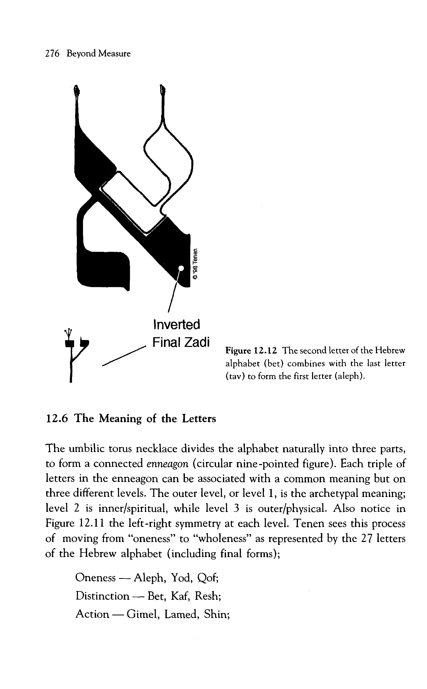

---

## Page 17

Chapter 12 The Flame-Hand Letters of the Hebrew Alphabet 277 
Division — Dalet, Mem, Tof; 
Connection — Heh, Nun, Kaf-final; 
Multiplication — Vav, Samek, Mem-final; 
Projection — Zayin, Ayin, Nun-final; 
Encompassment — Chet, Peh, Peh-final; 
Wholeness — Tet, Zadi, Zadi-final. 
So we have here the makings of a sacred alphabet, in which the letters 
are not merely abstract symbolic forms but also have meaning in and of 
themselves. Let's look in detail at the meaning of the first two letters of the 
alphabet at levels 1,2, and 3. 
12.6.1 
Oneness 
Level 1. Aleph Absolute, stands for All, Aloof, and Alp — a high point, 
a high mountain. It is All-One-Wisdom-Consciousness. Phela (Aleph in 
reverse) is a miracle and a mystery. Aleph as the singular is the sun-seed-
center (the primal point), the Source; Aleph as the Whole, is the idealized 
Fruit — the Apple. Aleph represents the strongest most coherent Archetype. 
That is why Aleph means Ox or Master. 
Level 2. Yod Our personal, individual consciousness is represented by the 
human hand, which projects our personal consciousness into the physical 
world. The Yod is the "seed" and is therefore associated with the male 
organ and with semen and it is a point (iota in Greek). Yod is an expression 
of our being (the psychologist's Id). That is why Yod means Consciousness, 
hand or point/pointer. 
Level 3. Qof This is our outer "mechanical" or Monkey consciousness. 
It is the shell or physical copy of our inner Yod consciousness. When we 
"ape", we Copy. That is why Qof means Monkey, Copy or Skull. 
Together Qia (Aleph-Yod-Qof) means Eruption. Qi is the name for the 
life-force in the Eastern traditions and "eruption" is what happens at the 
seed-center of Continuous creation — at the center of the torus.

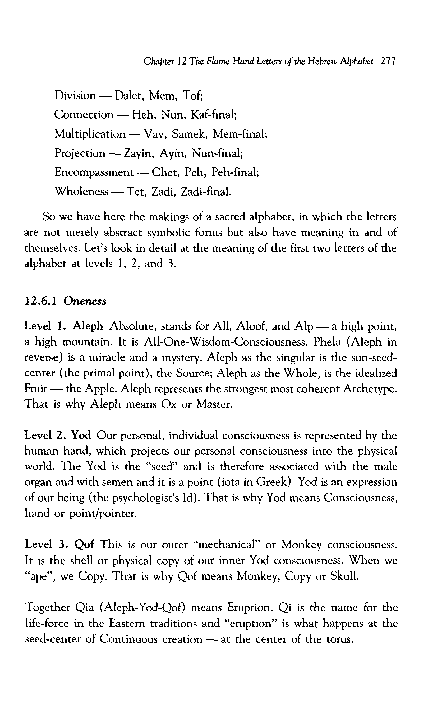

---

## Page 18

278 Beyond Measure 
12.6.2 
Distinction 
Level 1. Bet Partitions the Unity and Wholeness of Aleph. Aleph by itself 
is One. There is no opposition or polarity, and no need for action or 
change. Bet as the first possible distinction differentiates what is within 
from what is without. In his Laws of Form, G. Spencer-Brown [Spe-B] 
showed that a single mark of distinction separating inside from outside was 
capable of reproducing all of the laws of logic. From Bet on there is difference, 
complement, and contrast. There is spirit and matter, wave and particle. 
That is why Bet, two and duality is a "Housing" (which separates inside 
from outside). As a prefix, Bet means In or With. 
Level 2. Kaf As the inner aspect of Bet, represents holding in, as in cupping 
in the palm of the hand. Cupping shapes the palm like that which it holds. 
That is why Kaf means palm and why, as a prefix, it designates Likeness and 
Similarity. 
Level 3. Resh As the outer part of Bet, Resh represents the outer reaching 
of Bet. If Kaf is what is in the palm of the hand, then Resh is what radiates 
from the head. That is why Resh means Head, Reaching Rushing and 
Radiation. Together Buker (Bet-Kaf-Resh) means "first born son". These 
letters break open Unity and signify the birth of distinction at each of 
their levels. 
In a similar manner Tenen has shown that all of the letters of the 
Hebrew alphabet participate in this three level process that integrates the 
inner world of our consciousness with the outer physical world. Mastery of 
the inner world leads to wisdom, while mastery of the outer world leads to 
understanding. 
12.7 Generation of the Flame-Hand Letters 
Tenen proposes that the rabbinic form of the Meruba Hebrew letters can 
be generated from a knot drawn on a dimpled-sphere-shaped torus. In order 
to better understand this constmction, let us first consider the concept of 
a knot.

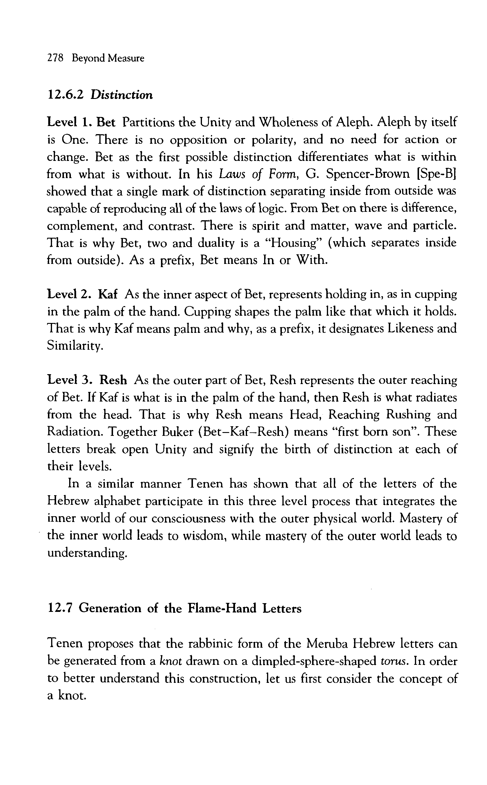

---

## Page 19

Chapter I2 The Flame-Hand Letters of the Hebrew Alphabet 279 
o © 
(a) 
(b) 
Figure 12.13 (a) Example of a trivial knot or "unknot"; (b) the unknot drawn with a single 
crossover. 
V 
y 
(a) 
The trefoil is a (3, 2)-torus knot. 
(b) 
Figure 12.14 (a) The trefoil knot, the simplest nontrivial knot, drawn as an under-over-
under pattern; (b) the trefoil knot on the surface of a torus. 
The simplest form of a knot is gotten by connecting the ends of a string 
together to form a loop or unknot 
(see Figure 12.13a) [AdamC]. In 
Figure 12.13b the unknot, or trivial knot as it is called, is redrawn with a 
single crossing. Since the crossing can be removed without cutting the 
string, it is considered to be structurally identical or isomorphic to the 
unknot. The edge of the umbilic torus is an unknot. 
The first nontrivial knot is the trefoil knot shown in Figure 12.14a with 
three crossings, none of which can be removed. The trefoil knot, as with

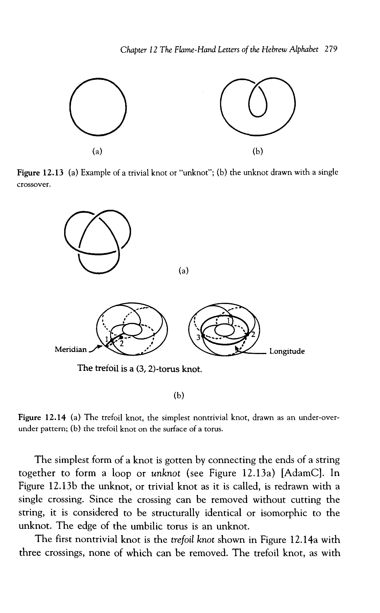

---

## Page 20

280 Beyond Measure 
all nontrivial knots, is basically three-dimensional. However, to represent 
it schematically, mathematicians generally draw its projection in 
two-dimensional space as an under-over-under pattern in which a broken 
line indicates that the string passes under the over-stretched arc (see 
Figure 12.14b). The trefoil map is redrawn around the surface of a torus in 
Figure 12.14c. Notice that in a torus knot there are no crossovers. The 
trefoil torus knot is called (3, 2), since every longitude of the torus intersects 
the knot three times while every meridian intersects it twice. A (5, 3) knot 
is shown in Figure 12.15. To draw this knot, place 5 evenly-spaced vertices 
around the inner circle of the torus and 5 vertices on the outer circle, 
directly opposite them. Connect any vertex on the inner circle with the 
vertex on the outer circle displaced by 3 from it in a counterclockwise 
direction. 
Marking points on the equators. 
Attach points by strands across the bottom of the torus. 
Constructing a (5,3)-torus knot. 
Figure 12.15 Steps to drawing a (5,3) knot on the torus.

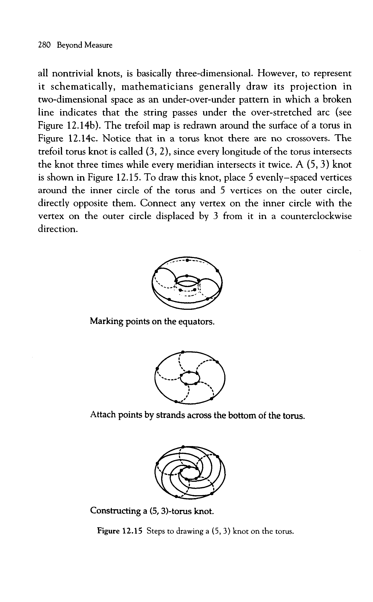

---

## Page 21

Chapter 12 The Flame-Hand Letters of the Hebrew Alphabet 281 
A torus knot can also be generated from a tetrahelix column by bending 
a column formed of multiples of 11 tetrahedra around to a torus, as we did 
for the umbilic torus. The spirals on the surface of the tetrahelix form 
continuous curves on the surface of the torus in the form of (n, 3) torus 
Break TORUS Rin« 
2 
and Pull Apart A, B4 aid C 
NOTE THE APPARENT 
LOSS OF WINDING "0" 
wteft LOOP X " FLIPS 
OVER as ths TORUS RING 
bMOIMS a DIMPLED SPHERE. 
4.4 
±11 
TRANSITION of the 5,10 TORUS KNOT 
from FSIN8 to DfHPLED SPHERE 
Iftis was 
/ 
WNDM8W 
3,10 KNOT W M m Pittern 
ASSEMBLY of * 99 - TETRAHEDRA 3-FULL TURK COLUMN 
99-TETKAHEDRA COLUMN 
connected ENO to END 
asttts 3,10 TORUS KNOT 
S,!0 TORUS KNOT on 
a DIMPLED SPHERE 
3-5-Teirah9dra Columns 
One FULL Turn saoh 
S-RBB0N8 OF 22-LETTER 
TMANQULAR FACES 
Figure 12.16 Transition from a (10, 3) and a 33-tetrahedra column to a dimpled sphere in 
the form of a braided structure.

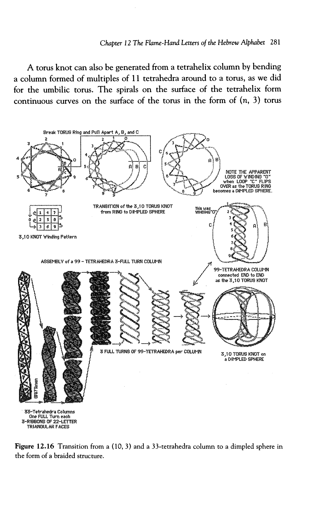

---

## Page 22

282 Beyond Measure 
TETRfH-iRIK 
COLUMN 
! ModriftfDNA 
Dcyb1e-4tel1x 
1 "99- Pearls™ 
i p - 1st 
"Un - Ending" 
SMOKE-RING 
WBHtB 
I 
Sword 
"Karri's Herri' 
33"Verfe?fera Spinal CoJyrrcn - Hwusknda 
m(, arrow 
HOfEB 
-EXCflLBUR 
STEN 
FOUNTAW 
F, 
! "rr-srTj-o 
iufi "BOUND MICE' 
Sofia 
n , ~ 
( r j 
STOPM-CUO^ 
"^ 
" ' 
COSMIC ESB 
SUFnii)/ 
^ / ^ 
DHPKICEGB 
/ 
j-Jj.: 
The "Brest S M " surrajmb 
' 
' 
A ' * k 
the EARTH PLANE 
\^QU>'H 
IBIflL FRUIT 
\ vtT^r™-™'"-
it*'Ays „v^' 
&4/S* 
"App?®" 
Tnilt traa yielding fhrit 
\ 
whoss and is tvtdta ifssir OtfTSP*F\ ;$*%)$£ 
QBI.Z.H ^ ^ ' ' 
V n%-
YirlG 
mratnj. 
Mad/tin's lamp 
m j t 
rst&tsler 
, 
JLJP 
!---"*«* 
:V 
Cnaraiii MOON — i 
s ' j " 
"WWHtWSKV" - j 
4-fWBEW 
m"m 
s 
ySerowMUK 
FLOWER 
BLGSSOM 
1 IOI1U"IJJ 
Figure 12.17 Creation of a hand-like structure emanating from the seed of the "fruit tree" 
knots for n, an integer greater than 2 and not divisible by 3, where n-1 
is the number of multiples of 11 tetrahedra that form the tetrahelix when 
n > 3 (the tetrahelix makes more than one complete turn). Two special 
cases are the tri-loop (1, 3) or umbilic torus formed from 11 tetrahedra, and 
the trefoil knot (2, 3) formed from 22 tetrahedra. 
The transition from a (10, 3) knot to a dimpled sphere in the form of 
a braided structure with three entwined strands is shown in Figure 12.16. 
The three strands of this braided structure span six hand-like structures that 
encompass the generic apple shown in Figure 12.17. Three hands around 
the top and three around the bottom of the apple surround the seed at the

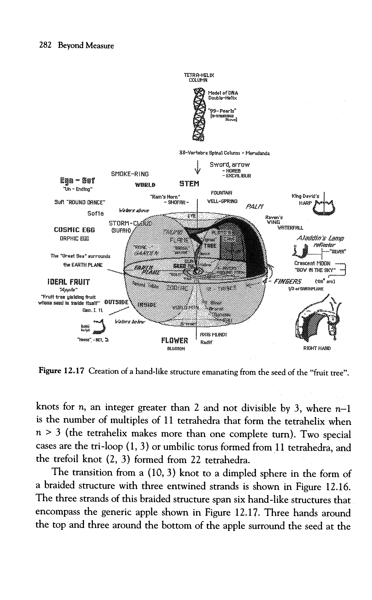

---

## Page 23

Chapter 12 The Flame-Hand Letters of the Hebrew Alphabet 283 
Figure 12,18 Image of a hypersphere. 
center. From one of the strands, Tenen creates the hand-like structure 
shown emanating from the "seed" of the "fruit tree" with a protruding 
spiral "thumb". It is beyond the scope of this book to describe the spiral 
component of the hand in detail. However, its projection onto the plane 
can be expressed when the spiral is properly truncated, by the simple equation 
r = j 
in polar coordinates. This is the same spiral curve illustrated in 
Figure 4.6 as part of the "eye of Horus". The reciprocal or hyperbolic spiral 
transitions smoothly from being asymptotic to a line, to being asymptotic 
to a circle. Unlike the common logarithmic spirals, the reciprocal spiral is 
completely asymmetrical — and this is essential to Tenen's proposal. Tenen 
also suggests that his "generic apple" or "dimpled sphere" is actually intended 
to represent the three dimensional projection of the surface of a four-
dimensional sphere or hypersphere an image of which is shown in Figure 
12.18. (This is also presented by Arthur M. Young in The Reflexive 
Universe.) 
This vortex-like structure forms the "flame-hand" from which Tenen 
projects all of the letters of the Hebrew alphabet. To get some idea as to 
the versatility of this asymmetric form, Tenen places it within a tetrahedron, 
the simplest embodiment of symmetry (see Figure 12.19), He likens this 
metaphorically to the Old Testament reference to the "light in the meeting 
tent" in which the light is sometimes referred to as a "flame", while the 
tent is referred to as a "coal". A projected image of the flame is taken in 
the direction of the tetrahedron's seven axes of rotational symmetry, giving 
rise to the seven distinctly different images shown in Figure 12.20.

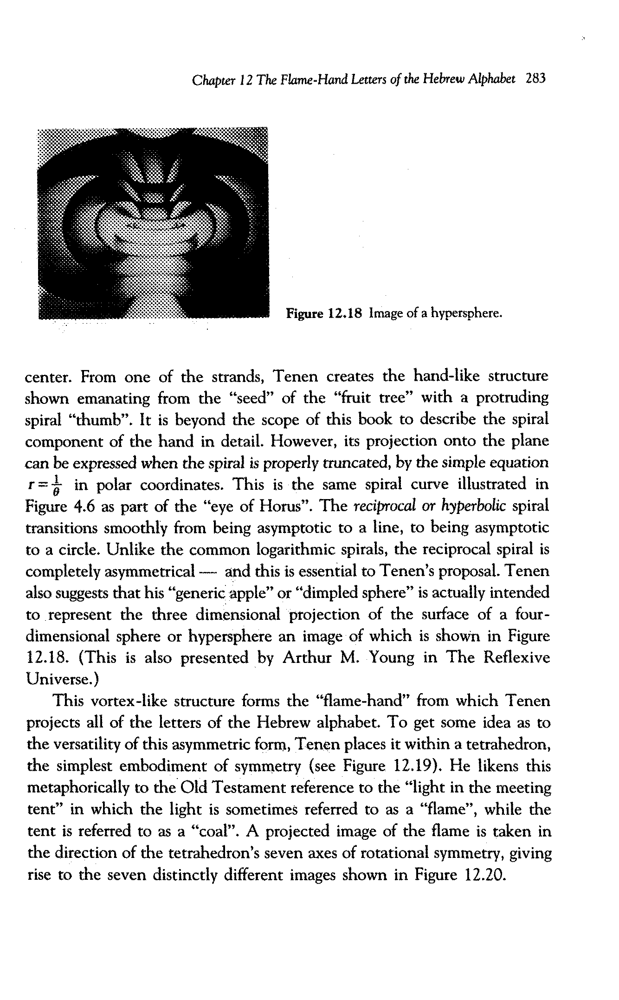

---

## Page 24

284 Beyond Measure 
The LIGHT in the TENT of MEETING 
T h e ETERNAL FLAME 
Vortex 
& 
VESSEL 
LIGHT 
X 
h 
Tetrahedron - TENT 
The BOW 
in the SKY 
PROCESS - INSIDE 
(a) 
STRUCTURE-OUTSIDE 
(b) 
V<1 -97 Tr^r J VCM 
TETRA-FLAME 
THE LIGHT IN THE MEETING TENT 
(c) 
Figure 12.19 (a) The hand model, or vortex, is referred to as the "flame"; (b) the tetrahedron 
is the "tent"; (c) the combination represents the "light in the meeting tent" from Exodus.

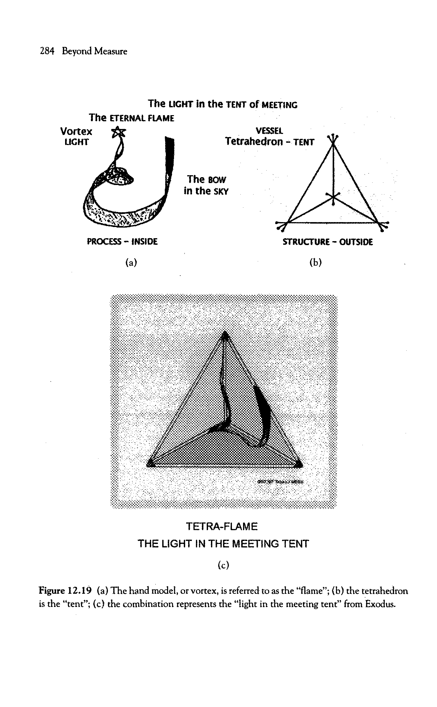

---

## Page 25

Chapter 12 The Flame-Hand Letters of the Hebrew Alphabet 285 
Figure 12.20 Flame images projected in the direction of the seven axes of a tetrahedron. 
According to some scholars, up until the Babylonian exile, the Old 
Hebrew alphabet — that is the proto-Siniatic/Canaanite alphabet — 
consisted of 22 pictograms. During the Babylonian exile, about 500 B.CE. 
a new square-form alphabet came into use. The Assyrian-Babylonian square-
form Meruba letters replaced the Old Hebrew letters in sacred usage. The 
new alphabet now had 27 letters, in which five additional final-form letters 
were added to the original 22. Early examples of the Meruba letters were 
found at Elephantine (circa 300 B.C.E.). These letters were also very similar 
to examples of the Rashi-Nachmanides style of rabbinic handwriting in use 
in Islamic Spain, but somewhat different from the formalized "squared-off" 
forms of the Hebrew letters used on modern Torah scrolls to reduce the 
possibility of ambiguous readings. The letters in the first column of Table 
12.1 were created from projections of Tenen's hand form. Notice the 
similarity to the Spanish-era rabbinic forms of the letters, and even the 
somewhat distant relationship to the Elephantine script. 
Tenen has gone another step with his proposal. He has found that the 
names of the letters give information as to a series of hand positions in

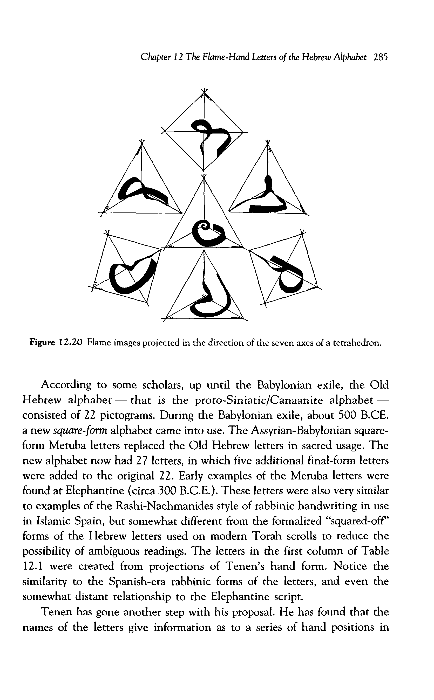

---

## Page 26

286 Beyond Measure 
which the eye projects his letter generator to the form of that letter. For 
example when the position of the hand is in the area of the mouth, its 
projection creates the letter "peh" (PAY) which means mouth. He has also 
used his models to discover letter-level coding in the Hebrew text of Genesis 
in the Bible, and he feels that the sequence of letters in the Torah may 
have served, through his hand gestures, as a kind of sacred meditation. He 
feels that it is the hand that projects consciousness from the inner to the 
outer worlds. However these ideas take us beyond the scope of this book 
and my own personal knowledge base. 
12.8 Some Commentary on Tenen's Proposal 
As one would do for poetry, Tenen's proposal of flame-hand letters should 
be evaluated not only on its literal meanings but on its ability to ring true 
at the level of metaphor. How well does it explain sacred texts and how 
does it speak to our desire to make sense out of our present world? 
Although Tenen has found no explicit evidence for the use of the 
hand-gesture system fot generating the letters, he has found references 
that point to the use of the reciprocal spiral (circle into line) in forming 
the letters, and he has found allusions to this in the so-called "Credo" of 
Judaism, the Sh'ma, from Deuteronomy, and elsewhere in ancient texts and 
practices. It is well known that Orthodox Jews wear two small cubical 
leather boxes with passages from the Hebrew Bible on their arms and 
foreheads during morning prayers. This is described immediately after the 
opening lines of the Sh'ma, and the descriptive text is what is placed in the 
two boxes. 
The arm-tefillin (box with scripture) is held onto the upper arm by a 
leather strap, which is wound on the arm seven times, and then wrapped 
on the hand to form the outline shapes of some Hebrew letters, usually 
Shin, Dalet, and Yud, which spell the Hebrew word "Almighty" (a God-
name). The letter Shin also appears on the tefillin-box worn on the forehead, 
and additional letters are sometimes found in the knot on the strap holding 
the tefillin-box on the forehead. So, in effect, Tenen is proposing an 
underlying source for the tefillin-hand-alphabet tradition, which is retained 
in the way tefillin are used by observant Jews today.

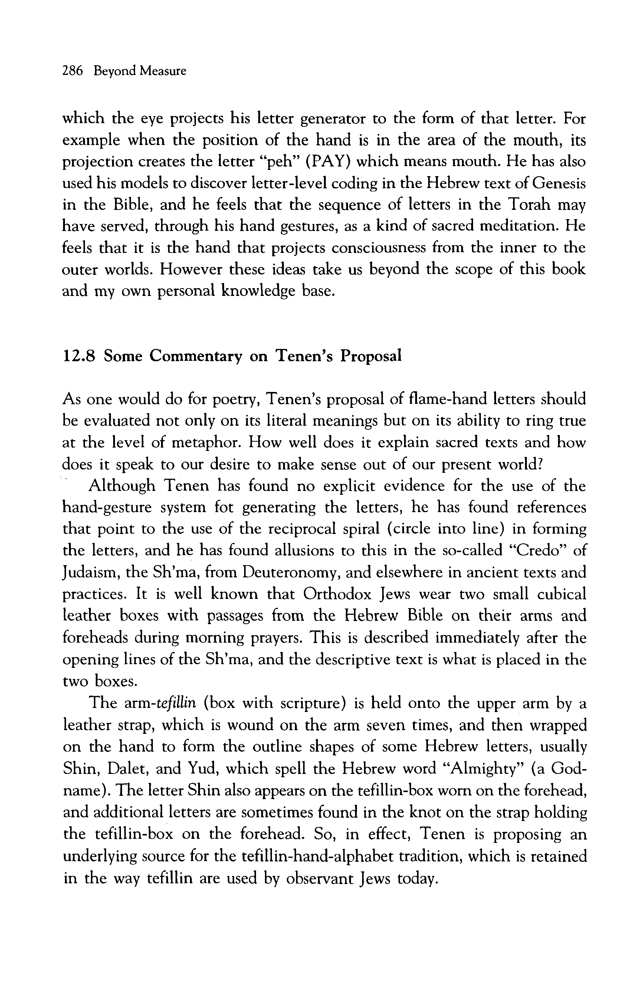

---

## Page 27

Chapter 12 The Flame-Hand Letters of the Hebrew Alphabet 287 
Sufi "ROUND DANCE" 
Sofia 
STORM-CLOUD 
(SUFRH) 
Axis Pole 
K'ABA 
(3-Souls: # ) 
The RADIF" 
Figure 12.21 Tenen's hand figure captures the imagery of Rumi's verse. 
There is also much imagery in the poetry of the medieval Islamic poet 
Rumi that could refer to a structure akin to Tenen's hand model. Some 
excerpts of Rumi's verse follow, correlated with the geometrical images in 
Figure 12.21: 
Come, Come! Let us whirl about in the rose-garden. — 
Let us now whirl about the grain 
which no granary comprehends. — 
I am like a goblet 
in the circle of dancers, 
turning from one hand to the other 
with my story. — 
Come, come, O thou, who are the soul 
of the soul of the soul of the round dance. 
Come thou who are the walking cypress 
in the garden of the round dance. 
Come thou, under whose feet is the fountain of light. 
The roof of the seventh sky — 
does not reach where reaches the ladder of the round-dance.

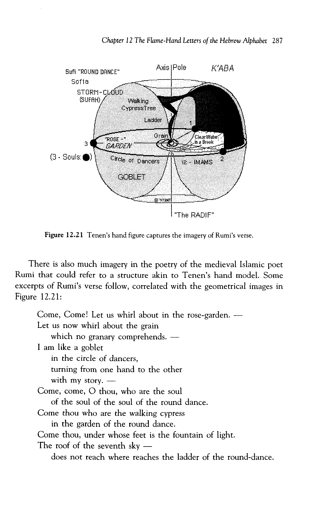

---

## Page 28

288 Beyond Measure 
12.9 Conclusion 
Tenen's metaphor relating the genesis of the Hebrew letters to the creation 
story relates, at least on the surface, to modern theories of consciousness 
and self-referential systems. In the next chapter knots will be used to 
mathematically characterize self-referential systems. Similar mathematical 
structures to the ones that Tenen has chosen to use for his proposal arise 
in other systems related to recent research into the nature of consciousness 
that is the subject of the next chapter. 
Tenen's suggestion that the ancients made use of a torus knot ("basket-
weaving") is also suggestive of modern theories of plant growth or phyllotaxis 
that we shall present in Chapter 24. The human heart is also toroidal, 
wound with microscopic tubular muscles [Pes].

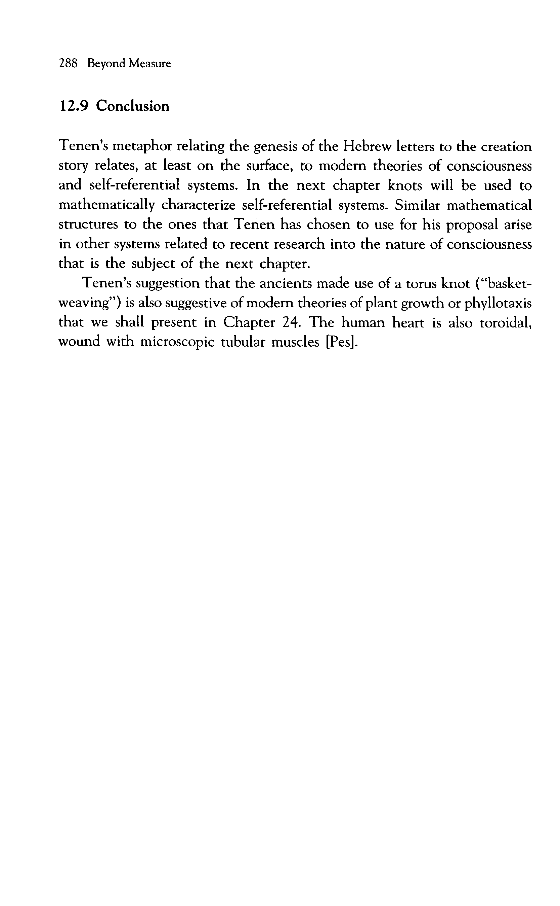

