# The Unicorns Horn

> Source: `sources/The Unicorns Horn.pdf` | Pages: 30 | Extraction: embedded text layer, with Tesseract OCR fallback for image-only pages.

---

## Page 1

The Unicorn’s Horn
The Sense of Sight
from The Lady and the Unicorn 
tapestry collection
A passage out of Fisherman’s Guide to the Cosmic Order that has always stood out
to me ever since I first read the book is the following section on page 41 in 
Chapter 4 - Clouds:
...This time a tunnel-like hole opened in front of me down into 
the void, like looking into another bottomless well that had access
into and through the energies of the void. There was again a 
powerful polarization throughout my body as I saw a very rapid 
zigzag streak of light projected down inside the tunnel to inscribe 
what appeared to be an irregular six-pointed figure that vanished
as quickly as it was formed.
Of course, the “six-pointed figure” seems to be the hexad of The Enneagram, or to
relate it to Projective Geometry, Pascal’s “Hexagrammum Mysticum”.
Moreover, what intrigued me most was the fact that a Center is connected to The 
Universal Periphery by means of a vortex that is accessed through a particular 
geometric pattern. This has also been the case within some of my own spiritual 
experiences.
I wanted to take a moment to meander through the forest of thought together to 
look for a few of the things that I find special. Hopefully it doesn’t seem rambling 
or strange. You are probably already familiar with a lot of this already. Like most 
of the things that I send, there are many links. A small number of them are 
repeats from past letters. Some of the new ones are there for quick reference, 
while others are for later perusal at your leisure. I think you’ll enjoy some of them.
To begin...

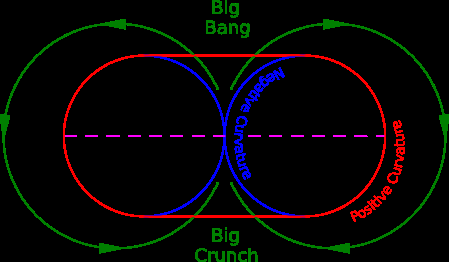
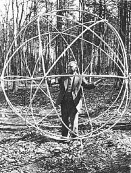
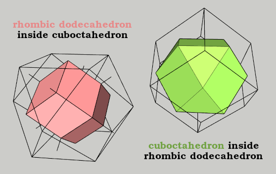
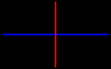
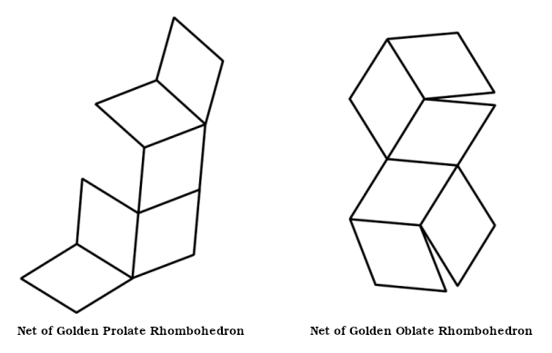
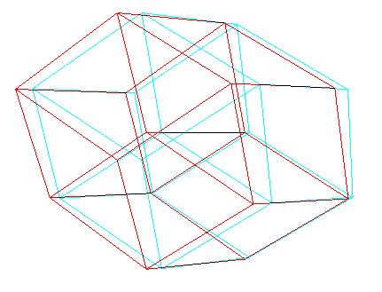
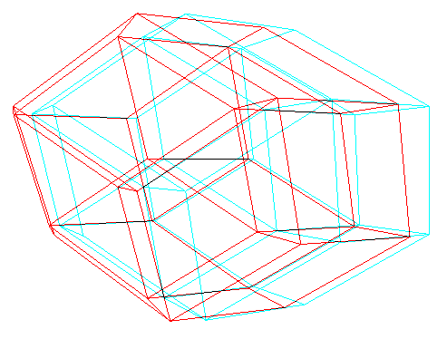
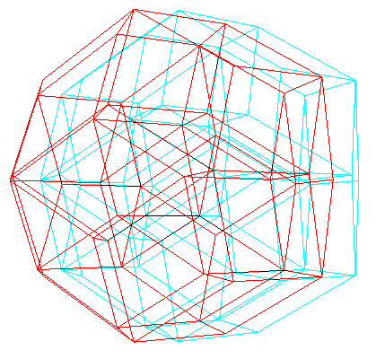
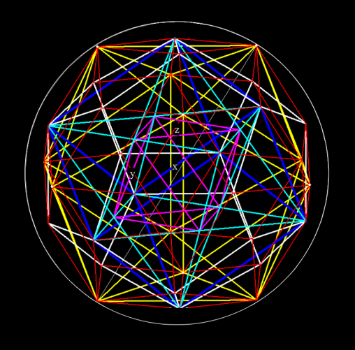
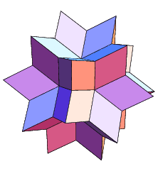
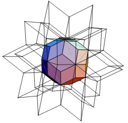
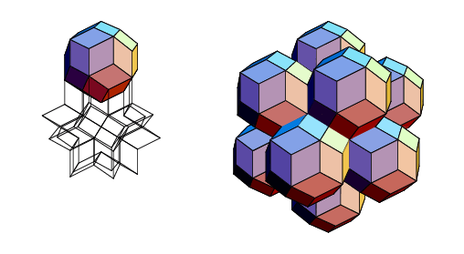
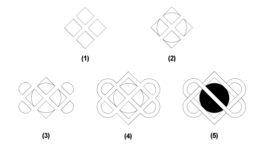
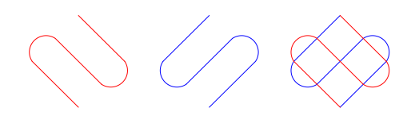
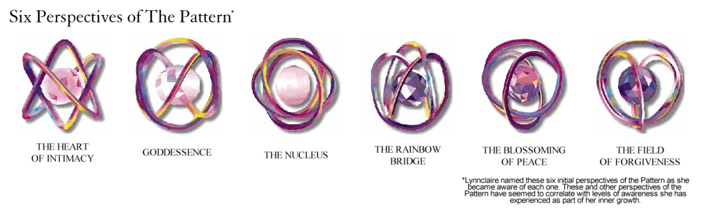
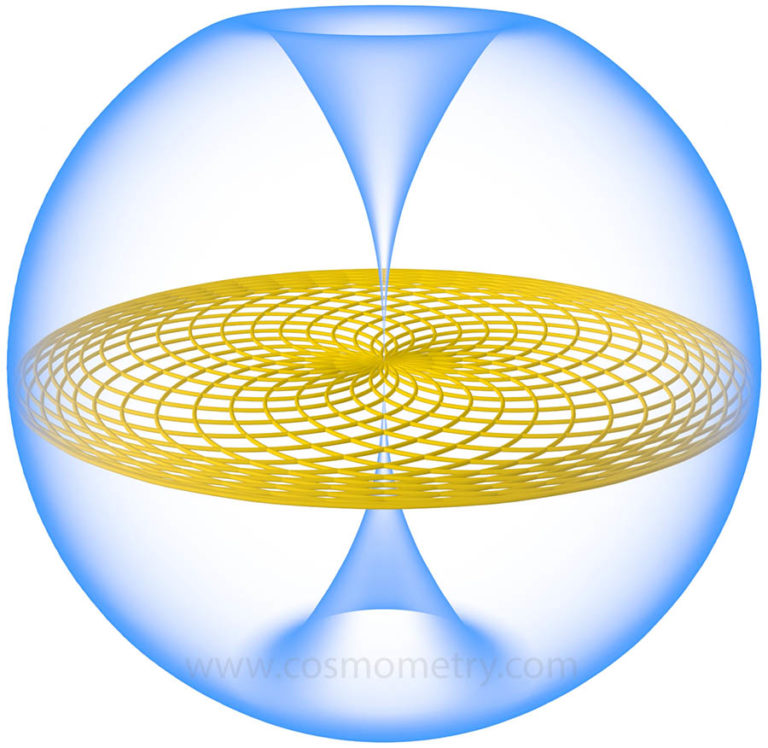
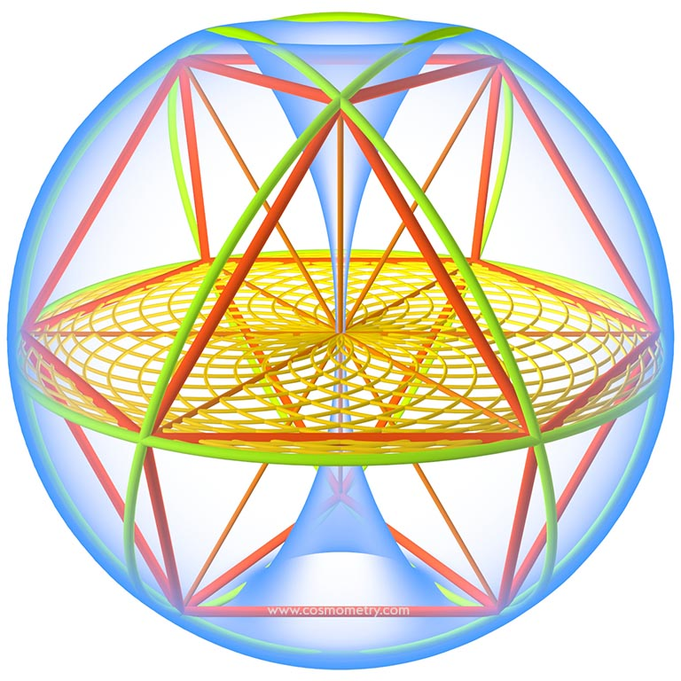
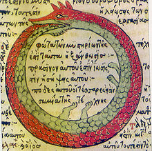
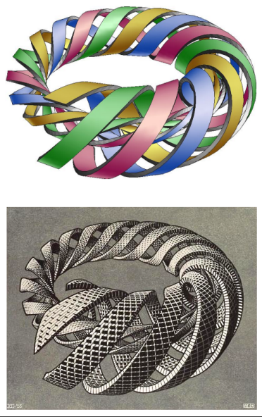
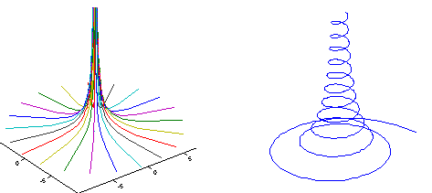
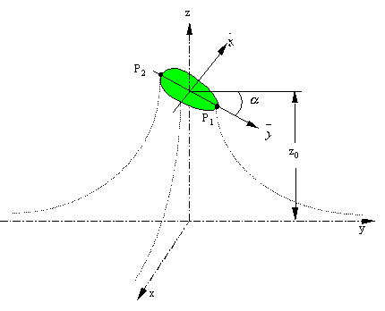
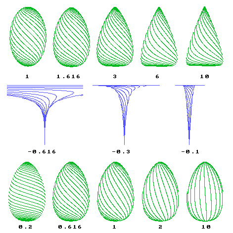
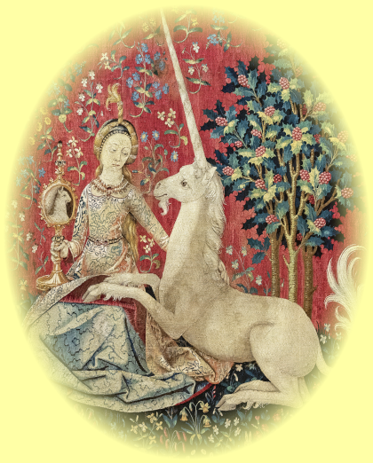
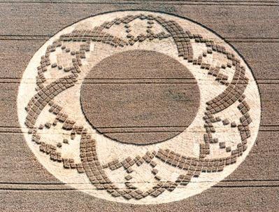
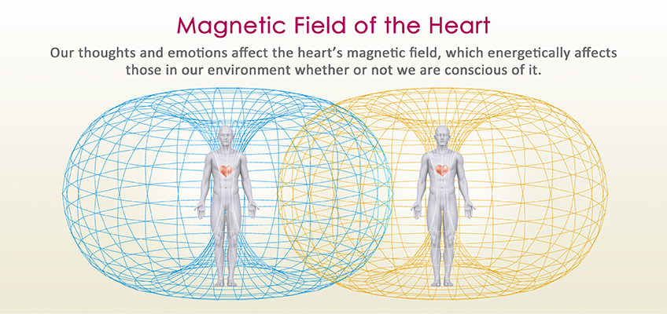
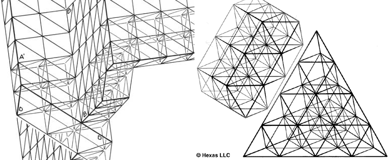
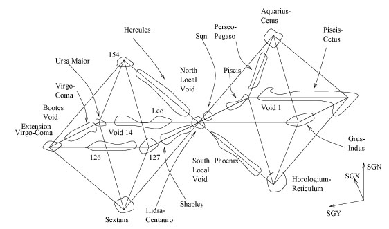
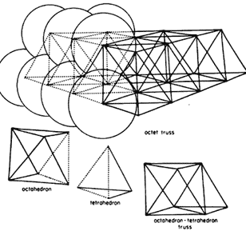
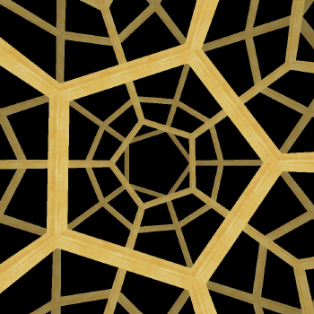
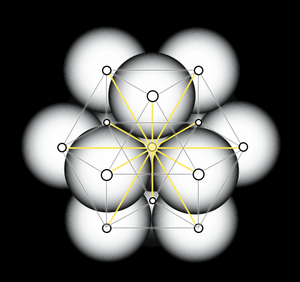
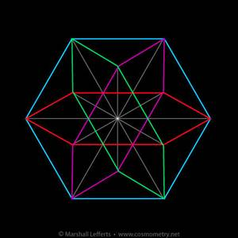
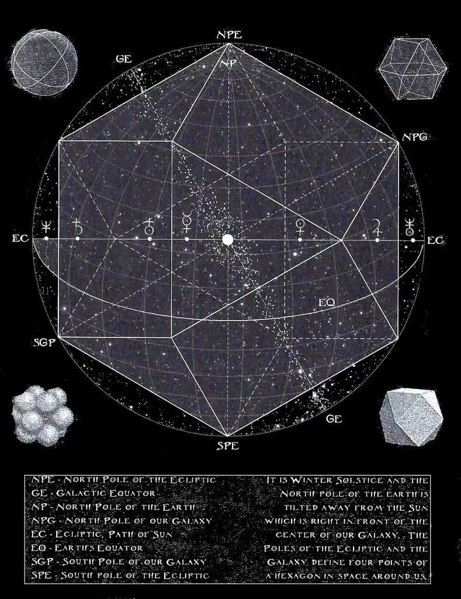
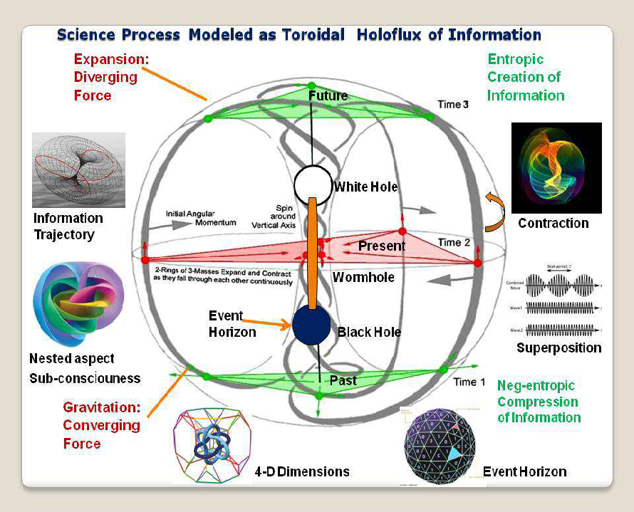
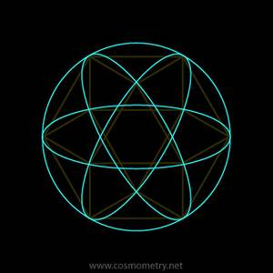
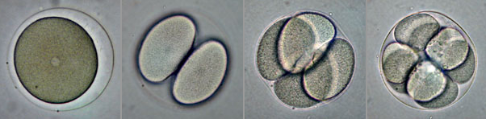
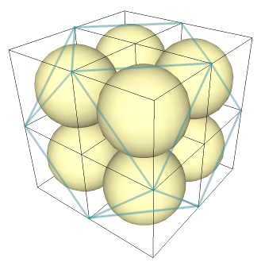

---

## Page 2

I was thrilled with how you related Dirac’s continuous creation cosmology to a 
black hole-white hole pair and to T-symmetry:
I look at it in exactly the same way:
Of course, we both know that the spiral vortex is “the horn of the unicorn”. ☺
In Part 4: The Unified Field of It's Vortices! Vortices All The Way Down!, I cover one 
way of deriving the shape of the horn. It seems Euclidean in that I rotate a 
rectangular hyperbola around an axis within a regular Cartesian coordinate 
system, but a kind of Projective Geometry is implied. I assume that the two ends 
of the hyperbola, the asymptotes, eventually meet at infinity to form a horn torus,
like the one depicted in cross-section within the above image. I also noted a 
musical pattern within the rectangular hyperbola based on the work of Viktor

---

## Page 3

Schauberger. Quite some time ago, I had come across an article by Christian 
Lange that highlights this same relationship:
Kepler’s Laws of Planetary Motion, which describe how the velocities of planets 
change throughout their orbit around the Sun, are often approximated with an 
ellipse. One way of deriving an ellipse is through a conic section. But what do we 
get when we take a section of a hyperbolic cone like the one above?
We end up with an egg shape. To quote [with some editing]:
...Kepler used the elliptic equations only for simplifying the 
calculations, obtaining an approximation, and telling everybody 
that, in reality, planets are following egg-curves. Today, most 
scientists think that the planets move on elliptic curves, even if it
is well known that the gravitational potential of the sun is 
hyperbolic.
An egg has one focus, unlike an ellipse with two foci. If the sun is one of these 
foci, then what is the other one? It is a solar system of nested golden eggs.

---

## Page 4

Christian Lange goes on to mention some other interesting correspondences 
within the rest of the article, but I simply want to highlight this relationship 
between vortices, eggs, and Non-Euclidean Geometry.
As Non-Euclidean Geometry developed throughout the 1800s and early 1900s, 
several spiritual interpretations started to form around the idea of “higher 
dimensions”. A famous example is the work of Charles Hinton. Perhaps less well-
known is the work of Rudolf Steiner, a German mystic who founded The 
Anthroposophical Society.
In his lectures on "The Fourth Dimension", he claims that mathematical 
reasoning can help one to experience more subtle aspects of reality, like the so-
called “Astral world”. He even mentions the importance of learning to perceive of 
things 
 
 in reverse
 
  because time seems to move backwards within these other 
“planes of existence”!
It is interesting to note the relation of the term “astral” to “star” (and thus, to 
“heaven”). Likewise, many mystics speak of an “astral body” that can be sensed as
a layer within the “aura” around someone’s physical body. Impressions are said to
appear within the aura before they become manifest within or through the 
person. There’s that time-reversal again! In this case, we are looking at it within 
the spiritual domain rather than the scientific (like the examples that I shared 
before on the measurement of L-fields with vacuum tube voltmeters, pre-stimuli 
responses within the nervous system, a “law of syntropy” derived from the 
negative solutions of the energy-momentum equation, etc.)...Science and 
spirituality are often two complementary halves of One whole...
Of particular importance to Steiner in honing this subtle sense was the study of 
Projective Geometry. Many mathematicians built upon these concepts (such as 
George Adams, Olive Whicher, Louis Locher-Ernst, Lawrence Edwards, Nick 
Thomas, et al.). They also tried to apply it to biology and to physics. Sadly, much 
of their work remains obscure.
There used to be a wonderful website that provided a summary of some aspects of
this form of mathematics, but it seems to be long gone. Someone has made a 
  PDF
 
 
backup of it though.
One prevailing theme is the idea of geometry taking place within two distinct 
“spaces” simultaneously. One is the traditional Euclidean Space that seems to 
expand infinitely outward towards a Universal Periphery. The other is a Projective 
“Counterspace” that seems to contract infinitely inward towards a Universal 
Center.
George Adams tried to connect these two spaces with a particular construction 
referred to as a “Path Curve”. Then, Lawrence Edwards used these to model the 
curvature of organic forms, particularly the buds of various plants and vortices 
within air and water. [As an alchemical aside, he also noted a very interesting 
correlation between plant growth and planetary conjunctions.] Clopper Almon 
gives an algebraic treatment of this work, and Douglas Baker uses it to describe 
bird’s eggs. Again, we encounter the vortex and egg…

---

## Page 5

Lawrence Edwards formulated an equation with two parameters symbolized by the Greek letters
lambda and epsilon. When lambda is positive, it generates an egg shape that becomes
progressively more conical as lambda increases (like in the top row of the above image). When
lambda is negative, it generates a vortex (like in the middle row). Meanwhile, the value of epsilon
controls the degree of the spiral along the surface of either shape (like in the bottom row).
Eric Dollard has fruitfully applied the concepts of Counterspace and Reverse Time
to electrical engineering. In general, these become very important when trying to 
understand how electricity appears throughout Nature. Most of modern physics 
has a tendency to approach these same phenomena through somewhat abstruse 
mathematical models instead of direct experimentation and physical analogies, 
but they are still there. Meanwhile, Projective Geometry is nearly synonymous 
with the history of architectural painting and the Subjective experience of our 
own visual system. Some have gone a step further and suggested a fundamental 
relationship to consciousness itself, as in The Projective Consciousness Model.
So, if individual humans are part of a larger holon, does the Earth also have an 
“aura”? Bob sometimes mentions The Planet Mind. Similar to how the L-field is 
akin to the Host of the human being, an electrical pattern that serves as the 
physical manifestation of the “organization of an organism”, the fields that 
envelope the Earth act in the same way on a larger scale. It has been referred to 
as the “Noosphere”. One of the best summaries that I’ve come across is from the 
introduction to José Argüelles’ book Manifesto for the Noosphere - The Next Stage 
in the Evolution of Human Consciousness. To quote [with some extra links and 
highlighting added by me]:

---

## Page 6

We must enlarge our approach to encompass the formation 
taking place before our eyes … of a particular biological entity 
such as has never existed on earth - the growth, outside and 
above the biosphere, of an added planetary layer, an envelope of
thinking substance, to which, for the sake of convenience and 
symmetry, I have given the name of the Noosphere. – Pierre 
Teilhard de Chardin, The Future of Man
Manifesto for the Noosphere is the result of forty years of study, 
contemplation, investigation, and synthesis. While the noosphere
may be beyond the grasp of conventional science, it is a deep and
pervasive intuition that has gripped the minds of scientists, 
philosophers, poets, and artists since the concept first emerged 
in 1926. It is an evolutionary concept posited by studies in both 
biogeochemistry and paleontology. It is a whole-systems 
paradigm that melds prophecy and analysis of current world 
trends. It is a perception that the transformation of the biosphere
is inevitably leading to a new geological epoch and evolutionary 
cycle, and it is due to the impact of human thought on the 
environment that this new era - the Noosphere - is dawning.
The term “noosphere,” referring to the mental sheath or envelope 
of thought that encompasses the Earth, is derived from nous, the
Greek word for “mind.” The presentiment of the noosphere fully 
awakened in me in 1969 upon seeing the whole Earth from space
on the television. Soon after, I organized the First Whole Earth 
Festival, and together with my students at the University of 
California, Davis, we transformed the central quadrangle of the 
campus into the “global village” - all in anticipation of the first 
Earth Day set to occur a month later, on April 22, 1970.
Around the same time I had a fruitful correspondence with R. 
Buckminster Fuller, who first suggested to me the presence of an 
information storage and retrieval system existing as some kind of 
psychic field or thought belt around the planet. It was by this 
means, Bucky wrote me, that he could converse with the pre-
Socratic philosophers as he strolled down the beach.
The First Whole Earth Festival roused the interest of planetary 
philosopher and astrologer Dane Rudhyar, whose book The
 
  
Planetarization of Consciousness (1970) had just been
published. A warm friendship immediately ensued, and among 
other things, Rudhyar exposed me to the work of University of 
Pittsburgh physicist Oliver Reiser. In his monumental volume, 
Cosmic Humanism
 
  (1966), Reiser proposes a vision of the 
noosphere as consisting of a psi field between and in resonance 
with the two radiation belts defining Earth’s electromagnetic 
field. The psi field, a DNA-informed “World Sensorium,” Reiser 
further hypothesizes, consists of two halves - an Eastern 
(intuitive) and a Western (analytical) - which function

---

## Page 7

holonomically like the two hemispheres of the human brain.
I amplified Reiser’s notion in my book The Transformative Vision 
(1975), where I link the two principles governing the history of 
human consciousness - psyche and techne - to the two sides
of the human and planetary brain. While acknowledging the 
vision of Teilhard de Chardin, among many others, this book was
also influenced in its perspective by Hopi, Hindu, Mexican, and 
Mayan prophetic traditions. But it is with the notion of the Earth
and its hemispheres - Eastern and Western as well as Northern 
and Southern - that The Transformative Vision builds on the idea 
of a higher unifying principle of planetary consciousness 
governing the progression of history and the world ages in 
general.
In Earth Ascending (1984), elaborating greatly on Teilhard de 
Chardin’s notion of “planets with noosphere,” I put forward the 
existence of a psi bank - the noosphere’s coded information 
storage and retrieval system and DNA timing program, located
between and in resonance with (as Reiser had proposed) the two 
radiation belts of Earth’s electromagnetic field. The psi bank has 
been key to my later work, including The Mayan Factor (1987), 
The Call of Pacal Votan: Time Is the Fourth Dimension (1996), and 
Time and the Technosphere (2002).
My studies of the mathematics of the Mayan calendar and 
subsequent discovery of the Law of Time as the universal
principle of synchronization, as well as exposure to the work of 
Vladimir I. Vernadsky, further deepened my comprehension of 
the noosphere. Through a number of visits to Russia and my 
dialogue with leading-edge Russian scientists, I saw how 
widespread the concept of the noosphere is in Russian 
intellectual life. By 2003 I had become an acting member of the 
Moscow-based Noosphere Spiritual Ecological World Assembly. 
Having already convened the First and Second Planetary 
Congresses of Biospheric Rights in Brasilia (1996, 2006), I 
proposed the First Noosphere World Congress to occur in Bali, 
2009. This event evolved into a number of synchronized 
bioregional Noosphere Congresses convened on July
22, 2009. From this experience came my website.
All this would not have been if a Jesuit priest, Pierre Teilhard de 
Chardin, had not coined the concept and word in a burst of 
inspiration while serving as a stretcher-bearer in the front-line
trenches of the First World War. As a noted paleontologist, 
Teilhard de Chardin went on to write extensively of the noosphere
in books like The Future of Man (1959) and Man’s Place in Nature 
(1956). In 1926 he and his Jesuit colleague and fellow 
philosopher Edouard Le Roy met with a Soviet geochemist, 
Vladimir I. Vernadsky, to jointly agree on the meaning of the

---

## Page 8

concept noosphere. This meaning is spelled out very simply and 
clearly by Vernadsky, who wrote at the end of World War II:
The historic process is changing dramatically before our eyes … 
Mankind taken as a whole is becoming a powerful geological force.
Humanity’s mind and work face the problem of reconstructing the 
biosphere in the interests of freely thinking mankind as a single 
entity. This new state of the world we are approaching without 
noticing it is the “Noosphere.”
Just as the biosphere is the unified field of life and its support 
systems - the region for the transformation of cosmic energy on 
Earth, to use Vernadsky’s phrase - so the noosphere is the 
unified field of the mind, the psychic reflection of the biosphere. 
Because we as a species, the aggregate of consciousness-bearing 
cells of the evolving Earth, are not yet awake to our role as a 
planetary organism, so too the noosphere is not yet fully 
conscious. When humanity becomes conscious of itself as a 
single organism and unites to activate the noosphere, we will find
the collective resolve and will to reconstruct the biosphere and 
divert the energy of the human race from a path of destruction 
based on a mechanized abstraction from nature to a new 
harmonic order of super-organic reality based on an entirely 
different state of consciousness than has yet existed on Earth...
Several others have posited the existence of similar ideas under different names 
(e.g.: the biologist Lyall Watson’s notion of a “Lifetide”, based on Carl Jung’s 
“Collective Unconscious”). I’ve been wanting to write an article on The Planet 
Mind that goes into these topics with more depth, but it only contains a brief note
that relates it to System 3 at the moment.
There is a lot that can be said about all of this, but I will focus in on only one 
aspect for now: Bob has repeatedly demonstrated the concept of Biospheric 
Resonance, giving examples of many seemingly different animals evolving in 
parallel, converging and diverging in expression throughout the Biosphere. José 
Argüelles attempted to do a similar study with human history. In Earth 
Ascending, he makes reference to what he calls “Seven Pristine Streams”, ancient 
cultures that were geographically isolated from one another, yet share certain 
fundamental characteristics, like reoccurring “cultural universals” appearing at 
the beginning of every civilization. This is probably not too surprising as the 
expression of human culture has roots in our own biological development.
In contradistinction to Bob’s logical and scientific approach in Downsizing Darwin
though, a large portion of Earth Ascending is made up of artistic diagrams with 
intuitive descriptions revolving around the topics of geomancy, magic squares, the
I Ching, the Mayan calendar, and so on. It is fertile ground for contemplation.
However, a lot of research has also been compiled that points to measurable 
aspects of the “Noosphere”. There are various mechanisms by which long-distance
biological communication could possibly occur (such as Biophotons, Fröhlich

---

## Page 9

frequencies, etc.). If one is willing to delve into the “fringe” and the “alternative”, 
there are many others. I will offer one hypothesis here. First, we will approach it 
through the symbolic…
To quote the now defunct website sacred-geometry.com [with some slight editing 
and extra links added by me]:
The Crooked Soley Crop Circle appeared at night on August 27, 
2002. It was the very last major formation of the 2002 season.
[…]
The Crooked Soley formation measured about 300 feet across, 
and the pattern was made up of 1296 ‘curved squares’. In 504 of 
these squares the crop was left standing, and they depicted the 
double helix DNA spiral. The other 792 curved squares were 
flattened crop that enabled the DNA pattern to stand out in relief.
These are the numbers of sacred geometry. If you multiply the 
number of standing crop squares 504 by 10, you get 5040, the 
number used by Plato for the planning of his ideal city. The 
recommended number of citizens for the ideal city is 5040, and 
all the institutions in the city are based on that number, as is the
physical radius of the city as well. Plato took this number to be 
the key for a divinely ordered Creation.
In the fascinating book, Crooked Soley: A Crop Circle Revelation, 
the authors point out that 5040 is also a most significant and

---

## Page 10

auspicious number in numerology and arithmetic. It is factorial 7
(7!), which is the product of 1 × 2 × 3 × 4 × 5 × 6 × 7. It is also 
the result of 7 × 8 × 9 × 10. It therefore occupies a pivotal 
position in systems based on real numbers that impact every 
facet of life. The number Seven has unique qualities that make it 
the natural symbol of the universal soul. Philosophers call it the 
Virgin and the eternal feminine in nature.
[…]
On the lower plane, where numbers multiply, grow, and 
elaborate, the archetypal Seven is represented by its factorial, 
5040. St. John, as well, in his vision of the Heavenly City, 
describes its radius as 5040, the same number that Plato 
adopted as the key to a divinely ordered Creation, the ‘heavenly 
pattern.’
(And by the way, if you multiply the number of curved squares of 
the flattened crop 792 by 10, you get 7920, which is the result of 
8 × 9 × 10 × 11...
These numbers have repeatedly shown up within my studies. For example, in 
Vortex-Based Mathematics (VBM), much of it revolves around an archetypal 
pattern known as “The ABHA Torus”. [In more “traditional” mathematics, it is 
related to the family of “Clifford Tori”.] The word “ABHA” is a term used within the
Baha’i religion. We might think of it as synonymous with “The Kingdom of 
Heaven”, whereas its inverse, “BAHA”, is the earthly realm. The surface of this 
torus is often treated as a tessellation made up of 1296 diamond-shaped tiles, 
just like the number of squares within the crop circle. Similarly, in Syndex 
Number Dynamics, there is a spiral figure called “Holotome E” that is based on 
2520, which is the first number divisible by all of the Base-Ten numerals and half
of 5040. The connections that VBM and Syndex make between the different 
branches of mathematics are akin to byways into Langland's Program.
Why does the crop circle use these specific numerical resonances to depict a 
supercoil of DNA though? And further, how do they relate to the organism? I am 
again reminded of the relationship between triplets and turns described within 
Reading the Green Language of Light. There is an underlying geometry to DNA's 
structure and these numbers are somehow key in its link to the environment.
...Now, let’s look at some biophysics. To quote the article The Soul in Crooked 
Soley by Bradley York Bartholomew [with an extra link added by me]:
In their book, Crooked Soley: A Crop Circle Revelation Allan Brown
and John Michell develop an argument that this particular crop 
circle represents direct communication from a divine intelligence. 
Not just any superior intelligence, they say it is the divine 
intelligence that created the Universe. We are not talking here 
about UFOs or aliens, nor about a superior intelligence that

---

## Page 11

exists elsewhere in the Universe. We are talking about the 
Goddess of all Creation. This is a revelation indeed. In the 
Crooked Soley crop circle that went down in the wheat fields of 
Crooked Solely towards the end of August 2002, we find the 
direct affirmation not only that there is a God, a Universal 
Creator, but we will find when we take their argument to its 
logical conclusion, that we are also told specifically what this God
is and where it is to be found.
[…]
There is now a great deal of research material that indicates a 
divine or creative intelligence in the DNA. There are the findings 
of the Russian molecular biologists, Dr. Pjotr P. Garjajev and Dr. 
Vladimir Popinin, that the DNA has a mysterious resonance that 
continues to manifest even after the DNA sample has been 
physically removed. This has been termed the DNA Phantom 
Effect. These same researchers have found that the DNA reacts to
voice activated laser light provided the correct frequency is found.
Using these methods it is possible to actually communicate with 
the DNA, as well as change the information patterns in the DNA. 
The Russian researchers have concluded that the DNA acts as a 
solitonic/holographic computer, and that it acts as a 
superconductor at body temperature. In addition it is known that
the DNA is emitting light photons, and it has been concluded 
that this resonance and these emissions of the DNA are capable 
of interacting with conventional electromagnetic forces, the 
natural magnetic resonance of the Earth, as well as the brain 
waves of living creatures.
In support of these findings, the Finnish physicist, Matti 
Pitkänen, has constructed a physical theory that treats the 
external material world as synonymous with the consciousness 
of the observer. Fluctuating magnetic wormholes in the DNA are 
capable of creating a seamless connection with the conventional 
electromagnetic forces in the external world thus presenting a 
physical theory of life as a unified magnetic force field. Grazyna 
Fosar and Franz Bludorf in their book Vernetzte Intelligenz 
describe the findings of the Russian molecular biologists, as well 
as the theories of Matti Pitkänen, and they conclude that at the 
level of the DNA there is hypercommunication amongst all 
sentient beings, a hypercommunication that effectively sets up a 
networked intelligence that underpins all life in the Universe. By 
hypercommunication is meant instantaneous communication - 
zero time lag. At the level of the DNA, in this intelligence network,
the concepts of time and space are meaningless, and there can 
be an instantaneous exchange of information throughout the 
entire universe. The substratum of the physical universe is 
simply hypercommunicating information contained and 
transported via fluctuating magnetic wormholes in the DNA.

---

## Page 12

Needless to say, by virtue of these theories, all life and all events 
and phenomena in the external world are merely composites of a 
global consciousness that is the Universe.
Matti Pitkänen does research into Geometrodynamics. His website has many of 
his books 
 
 available for free
 
 . Grazyna Fosar and Franz Bludorf’s book Vernetzte 
Intelligenz (or Networked Intelligence) is readily available in German, but I haven’t 
read it yet. There are English translations of some sections floating around on the
Internet though, and I’ve come across similar concepts throughout my research. 
For example, VBM suggests that the sugar phosphates that make up the 
backbone of the DNA generate electromagnetic vortices within the major groove 
that function like miniature wormholes according to the Kerr-Newman metric. It 
is interesting to note the relationship of this to the Hopf Fibration through Taub-
NUT space. To quote:
When Roy Kerr developed the Kerr metric for spinning black 
holes in 1963, he ended up with a four-parameter solution, one 
of which was the mass and another the angular momentum of 
the central body. One of the two other parameters was the NUT-
parameter, which he threw out of his solution because he found 
it to be nonphysical since it caused the metric to be not 
asymptotically flat, while other sources interpret it either as a 
gravomagnetic monopole parameter of the central mass, or a 
twisting property of the surrounding spacetime.
I imagine that these micro-wormholes can function as points where time-reversed
information “inverts” and starts to become physically manifest. I wonder if 
something similar happens within the helical channels of microtubules, not to 
mention within many other places at various levels of scale. "Superradiance" 
occurring within networks of tryptophan? I feel as if we are getting very close to 
the biological basis for how information is drawn out of the Quantum Sensorium.
ER = EPR is like the theoretical physics equivalent of saying, “Form is Void, and 
Void is Form.” If there is both a Universal Center and Universal Periphery that are
intimately connected, then ultimately, there is no separation. There is just 
Oneness. System 1.
Even the most basic use of language seems to point to every Particular Form 
being continually connected to Universal Ideas. Bob states this in reference to our
ability to generalize into archetypes, and this was well understood by ancient 
peoples. To quote pages 21-22 of The Trivium by Miriam Joseph:
The intellect through abstraction produces the concept. The 
imagination is the meeting ground between the senses and the 
intellect. From the phantasms in the imagination, the intellect 
abstracts that which is common and necessary to all the 
phantasms of similar objects (for example, trees or chairs); this is
the essence (that which makes a tree a tree or that which makes

---

## Page 13

a chair a chair). The intellectual apprehension of this essence is 
the general or universal concept (of a tree or a chair).
A general concept is a universal idea existing only in the mind 
but having its foundation outside the mind in the essence which 
exists in the individual and makes it the kind of thing it is. 
Therefore, a concept is not arbitrary although the word is. Truth 
has an objective norm in the real.
A general concept is universal because it is the knowledge of the
essence present equally in every member of the class, regardless 
of time, place, or individual differences. For example, the concept 
“chair” is the knowledge of the essence “chair,” which must be in 
every chair at all times and in all places, regardless of size, 
weight, color, material, and other individual differences.
The real object (a tree or a chair) and likewise the corresponding
percept and phantasm, is individual, material, limited to a 
particular place and time; the concept is universal, immaterial, 
not limited to a particular place and time.
Only human beings have the power of intellectual abstraction; 
therefore, only human beings can form a general or universal 
concept. Irrational animals have the external and internal senses,
which are sometimes keener than those of humans. But because 
they lack the rational powers (intellect, intellectual memory, and 
free will), they are incapable of progress or of culture. Despite 
their remarkable instinct, their productions, intricate though 
they may be, remain the same through the centuries, for 
example: beaver dams, bird nests, anthills, beehives.
One can find examples from philosophy that capture a deep awareness of this 
connection, to the point of fully understanding the
 
  telos of Creation
 
 . The work of 
Wynand de Beer looks particularly promising in elucidating some of those 
connections, but there are many others. The “Third Way” and “Third Evolutionary
Synthesis” of modern science are generally headed within the same direction.
Information creates a lattice in the mind for something to become manifest. I once
tried to explain it to a friend like this:
I interpret the mind as using sensory data and feelings as the 
"substance" for the formulation of our mental conceptions 
(whether they be memories, dreams, etc.). This is part of the 
reason why I study so much. By taking in lots of information, it 
gives a lot of "substance" for intuition to play with and 
connections start to become apparent that would take a long 
time to uncover otherwise. The more subtle aspects of reality 
become "visible" to "the Mind's eye" when both the "idea" and the 
"material" are taken together.

---

## Page 14

The same is true collectively. We manifest circumstances, or entire civilizations, 
through the ideas that we entertain as a group. Kayla is right on it, and your 
description of the unicorn is brilliant: “a sort of principality with a subtle body like
an idea, that simultaneously coordinated learning in parallel over great distances”.
What is being made through this coordination? Bob had mentioned how specific 
human thoughts were helping to shape a sort of “New Jerusalem” within the 
Void. Again, from page 43 in Chapter 4 - Clouds of Fisherman’s Guide to the 
Cosmic Order:
Suddenly there appeared in the void a city of light in brilliant 
color. It was suspended in the void in such a way that the 
underside of the city along its nearest edge was at first visible, 
and there were dark tendrils of energy reaching down into the 
void, like roots from which it drew its sustenance. The city was 
recreated from the energies of the void, its variety selected and 
assimilated at will by the Being behind me.
Then my perspective rose to provide a clear view across the city 
and down into the streets on the nearest side below me. It was a 
beautiful city, immaculately clean, with cobblestone streets and 
mostly masonry-type buildings in a variety of pastel shades, none
of which were over a few stories high. There were both peaked 
and flat roofs, an old English style house on a corner, domed 
structures, and varied shaped buildings extending over quite an 
area, but it was not modern or as large as many cities are today. 
It tended to have a Mediterranean character, sort of like a new 
Jerusalem, although it had no specific resemblance to 
Jerusalem, and no churches, temples or mosques were noticed. It
was brilliantly illuminated in a rich mosaic of colors, with no 
people or vehicles apparent. The city appeared to be empty.
Awhile back, I had mentioned that I wanted to form online communities for 
collaborative creative problem-solving of world issues, and for the building of 
ecological makerspaces to implement the solutions that are generated through 
them…They would probably be something like “unicorn forests”. ☺ 
This is one aspect of a larger plan. Many aspects of that plan are proceeding in 
parallel, but in different forms and at different rates, so that if any one fails, 
hopefully they are diverse enough to persist through time.
On the software-side, I am trying to develop a tool that I call RNDTBL (although 
much of the planning behind it is missing from that page). On the hardware-side, 
I am trying to find ways to simplify the production of 
 
 computers
 
  to put them 
within the reach of home experimenters. This includes not only chip fabrication, 
but also the tools for networking.
An adjacent goal was to compile databases with the DIY information necessary to 
rebuild society from scratch in ways that truly are sustainable. Then, this would 
be shared through a worldwide mesh network formed of packet radio transmitters

---

## Page 15

and receivers...It was intended to be something like a “second Internet” that is not
dependent upon the backbone, something that would be fault-tolerant, disaster-
proof, and work with very little underlying infrastructure. No cables, all air. It 
would be comprised of homemade devices that can be created and powered in a 
multitude of different ways. This would give everyone access to it.
The bottleneck is the limitation of data transfer speeds in packet radio. However, 
one can twist light and radio waves to be able to hold more data (e.g.: experiments
have accomplished up to 2Tb/sec. with light and 32Gb/sec. with radio waves). 
Therefore, is it possible to create a relatively cheap vortex-shaped antenna or 
waveguide that would make every packet radio user into their very own ISP? I feel 
that the incredible breakthroughs that arose from amateur radio and home 
computing are far from over, especially when we get back to their DIY roots and 
conviviality.
But despite the wonder that I feel about our ultimate home, I am also extremely 
cautious about how we get there. Our “tool systems” have to amplify the 
constructive within our “human systems” in order for the transition to be as 
smooth as possible. As it now stands, they are not doing that. Building a bridge to
heaven is less about the technology that we wield, and more about the 
compassion that we express towards All things.
Through Agape, The Logos is made manifest.
The Infinite Light appears within the Heart of a human being.
image from The HeartMath Institute
Upon your first mention of the unicorn, I was struck by how you said that you 
were: “trying to map at least 5 complementary perspectives onto the helical rings 
that cycle through the 4D polytope of the 120-Cell”. Can you elaborate on this?
Immediately, I had thought of some research that I had heard about long ago, The
Poincaré Dodecahedral Space 
 
 M
  odel 
 
 G  ains 
 
 S  upport to 
 
 E  xplain the 
 
 S  hape of 
 
 S  pace
 
  
by Jean-Pierre Luminet, Jeffrey R. Weeks, et al.

---

## Page 16

I had first come across this in an article from a (now sadly defunct) website, 
MIQEL. I will quote it here [with some slight editing and extra links by me]:
Amazingly, recent galaxy-cluster mapping has shown geometry!
The local voids outline Close-packed Octahedra!!!
This seems stunning, but is probably due to gravitational / expansive forces finding equilibrium in minimum-
energy vectors. If we have 2 octahedrons (and presumably more in a 3-D grid) then we also have tetrahedral
voids, because octahedrons don't fill-space (like stacking cubes). It requires alternating Octa-Tetra
combination to fill space in this type matrix. More on the surprising geometry of this pattern below …
Below: 
This is the full pattern implied by the supercluster geometry, 
it's what is called a 'Space Frame' trusswork. 
It was discovered by visionary genius Buckminster Fuller and patented in 1961. One amazing feature is that
in examining the matrix you can find all the other platonic solids outlined except those with 5-
symmetry. Look at these different angles of the oct-tet matrix and notice you can see outlines of octahedra,
tetrahedra, truncated tetrahedra, nested tetrahedra, cubes, cubes with tetrahedra inside, rhomboids, and
more …

---

## Page 17

It was later discovered that Alexander G. Bell has come upon the same structure in 1903, but Bell was
looking to build a practical lightweight platform & didn't notice the deeply fundamental nature of the
spaceframe as the maximum self-reinforcing structure possible in platonic 3-D geometry. 
The most amazing thing is this arrangement happens anytime spheres are packed together. It's the
most economical, space/energy conserving arrangement of equal size spheres. Spheres pack 12 around 1 -
each sphere in the matrix is touching 12 other spheres and connecting grid-lines (force vectors) from the
center of each sphere creates our space-frame trusswork. 
Microwave data gathered by the WMAP satellite indicates the 
Universe may be in the shape of a 'chiral' Dodecahedron -
a twelve sided polyhedron with pentagonal symmetry. 
So ... My first question is how does the 6-symmetry space-frame superclusters matrix
relate to the 5-symmetry dodecahedral universe 'shape' (not proven ... still hotly debated)!
hmmm ... the spheres pack 12-around-1 and the Dodeca has 12 faces.
Just an observation ... 
More about the possibly dodecahedral universe here - 
http://news.nationalgeographic.com/news/2003/10/1008_031008_finiteuniverse_2.html

---

## Page 18

The “12-around-1” archetype is important. To reiterate, by taking a cluster of 13 
close-packed spheres and connecting their centers, we get a cuboctahedron:
image from Cosmometry
Buckminster Fuller did not interpret geometric forms as immutable “solids”. 
Instead, he treated them as dynamic networks of forces, so every edge is a vector. 
He refers to the cuboctahedron as a “Vector Equilibrium” because he saw the 12 
vectors raying out of the center of the central sphere (shown in yellow within the 
above image) as being constrained by those around them, holding all of the forces
that it describes in equilibrium.
He would also make models of the cuboctahedron out of sticks connected by 
flexible rubber connectors so that the whole structure was compressible. This led 
to his concept of the “Jitterbug”, where the 24 edges of the cuboctahedron twist 
and collapse to form other geometries as it is compressed.
An interesting property of the cuboctahedron is that its edges can be thought of 
as four hexagons 60-degrees away from one another in space:
image from Cosmometry
This is “Nature’s Coordinate System”, four axes at 60-degrees, rather than three 
axes at 90-degrees like the traditional Cartesian coordinates. Indeed, there seems 
to be an underlying cosmic logic to it. To paraphrase A Little Book of Coincidence 
by John Martineau [also on pg. 356 of Quadrivium by Wooden Books]:

---

## Page 19

“One of the most obvious symmetries of modern cosmology occurs in that the 
Milky Way, i.e. the plane of our own galaxy, is tilted at almost exactly 60° to the 
ecliptic or plane of our solar system (the horizontal line in the image below) [99.7 %]. 
What is more, every year the Sun crosses the galaxy through the galactic center, 
and being alive in these times means this happens on midwinter’s day.”

---

## Page 20

If we turn these four hexagons into great circles on the surrounding sphere, then 
we end up with a spherical cuboctahedron. A little known plant geneticist by the 
name of Derald Langham refers to this figure as a “Genesa Crystal”:
image from Cosmometry
He derived it from his observations of embryoes and the fact that the first three 
cell divisions of every multicellular creature seem to be the same:
image from Cool Science
It is the familiar doubling of dimensions: One cell (point) divides into two. Two 
cells (line) divides into four. Four cells (square) divides into eight. Three divisions.
The first eight cells (cube) create a structure that he calls “4-over-4” from which 
the cuboctahedron can be extracted:
I tried to give an idea of the presence of the cuboctahedron in blue.

---

## Page 21

Since the cells only start to differentiate after that point, he thought that this 
figure was symbolic of infinite potential. Notice that we’ve used this geometry on 
two vastly different levels of scale (i.e.: embryonic and solar-galactic).
Please keep in mind that, in the same way that we spoke of The Planet Mind, the 
Solar System is also an organism. And so on up “The Great Chain of Being”, until 
we get all the way back to The Supreme Intelligence, in whose image we are made.
We exist inside of The Eternally Self-Existent One,
always have and always will.
Derald Langham was an interesting character. He would make giant spherical 
cuboctahedrons, take them out into the forest, and then meditate within them:
image from Genesa
From this, he was inspired to write books with seemingly enigmatic titles, such 
as Genesa: A Conceptual Model to Synthesize, Synchronize, and Vitalize Man's 
Interpretation of Universal Phenomena and 13-Dimensional Genetics: Tomorrow's 
Thinking Today. I encourage you to make a small paper model and tell me if you 
notice anything different about the interior space in contrast to the surrounding 
environment.
Now, let’s see if we can extend the geometry…

---

## Page 22

If we take the dual of the cuboctahedron (i.e.: turn its faces to vertices, or vice 
versa), then we get a space-filling polyhedron known as a rhombic dodecahedron:
VBM considers the fundamental structure of the Universe as made up of rhombic
dodecahedra, and there is at least one other model that I know of that approaches
it in a similar way. The same concepts can be connected to other models through 
various geometric transformations.
It seems likely that The Golden Mean Proportion was sacred to the Pythagoreans 
because it was evidence of the psyche of the Cosmos, a transcendent pattern that
united All things in Harmonia.
Let’s turn each of the rhombic faces of the rhombic dodecahedron into a golden 
rhombus whose diagonals are in a Golden Mean Proportion:
Self-similarity along twelve axes simultaneously! The polyhedron that we end up 
with is sometimes referred to as a “rhombic dodecahedron of the second kind” or 
a “Bilinski dodecahedron”. It is part of a whole set of golden polyhedra, each of 
which can be derived from two of them:
* A skinny one referred to as a golden prolate or acute rhombohedron
* A flat one referred to as a golden oblate or obtuse rhombohedron

---

## Page 23

These fill space like a three-dimensional Penrose tiling, and can be combined in 
various ways to give us the different “isozonohedra”. To demonstrate...
* two golden prolate rhombohedra + two golden oblate rhombohedra = one 
rhombic dodecahedron of the second kind (12 faces)
anaglyph from Robert Inventor

---

## Page 24

* five golden prolate rhombohedra + five golden oblate rhombohedra = one golden 
rhombic icosahedron (20 faces)
anaglyph from Robert Inventor
* ten golden prolate rhombohedra + ten golden oblate rhombohedra = one rhombic
triacontahedron (30 faces)
anaglyph from Robert Inventor

---

## Page 25

Similarly, we can recursively nest the Platonic solids so that their edge lengths 
repeatedly make Golden Mean Proportions. Part of this pattern shows up within a
sacred geometry figure known as “The 
 
 Lesser and Greater Mazes
 
 ”, but all of the 
Platonic solids are nested in this way inside of the rhombic triacontahedron!
This image (from K.J. MacLean) shows all five Platonic solids nested within the rhombic
triacontahedron simultaneously. An octahedron is in magenta, a star tetrahedron in cyan, a cube
in blue, a dodecahedron in cream, an icosahedron in yellow, a rhombic triacontahedron in red,
and an outer sphere in white.
Finally, if we take twenty golden prolate rhombohedra, we can combine them to 
make a rhombic hexecontahedron (60 faces):

---

## Page 26

We can think of the interior of the rhombic hexecontahedron as containing a 
rhombic triacontahedron:
image from Wolfram MathWorld
The concave surface of the rhombic hexecontahedron matches the convex surface 
of the rhombic triacontahedron, so they fit like hand in glove...
image from Izidor Hafner
...and they pack 12 around 1!
To quote Exodus 33:19-20:
And יְּהוָָֹֹה  said, “I will cause all my goodness to pass in front of 
you, and I will proclaim my name, יְּהוָָֹֹה  , in your presence. I will 
have mercy on whom I will have mercy, and I will have 
compassion on whom I will have compassion. But,” he said, “you 
cannot see my face, for no one may see me and live.”
In 1987, Lynnclaire Dennis died from a lack of oxygen due to a hot-air balloon 
ride that went up too high. At the apex of her near-death experience she, quote:

---

## Page 27

I arrived at the pinnacle and, standing at the entrance to the 
Light, took a single step, leaving my right footprint embedded in 
Eternity. I entered a sacred space - a place where I knew I had 
returned to my most essential nature, where I felt wholly and 
consciously united with all things and Source, where a soothing 
balm of peace was poured on my spirit by an unseen hand, an 
emollient so rich in love that to this day I cannot fully absorb or 
comprehend it.
And then, in one ephemeral glimpse, I saw the Pattern, the single
strand of the tapestry I knew was the essence woven through 
matter in every reality. Its design was so complexly simple that I 
knew it could only have been fashioned in the exalted intricacy of
infinity.
Seeing the Pattern, I knew I was looking at life itself. It was light; 
it was time and space. It was the energy of all matter, the heart of
all that mattered. It was the very essence of all being. It emanated
from Source, illuminated to my mind by "the Source behind the 
sun" as it moved in perfect harmony with all the universe. As I 
prepared to meld into the Source of Light and absolute Love, I 
knew with all my being that the Pattern was the core of all 
substance. I knew that the MUSIC emanating from the Pattern 
was the song of my heart, a testament of unconditional Love. The
single step I had taken was the first in a dance that would take 
me into the single point of Infinite Light, which contained the 
power of Love that would forever illuminate my mind and heart...
Interestingly, after repeated experiences, she eventually brought back an 
understanding of the “Pattern” that is mathematical in nature. 
To give a very simplified description, it is a specific nesting of polyhedra 
surrounded by a type of trefoil knot. The polyhedron is related to the rhombic 
triacontahedron, whereas the knot is related to a torus.

---

## Page 28

The above images are adapted from the book The Pattern (pgs. 99, 122, and inner cover)
A helpful visualization of how the two interact is to imagine the cuboctahedron 
inside of a torus, something like this:
images from Cosmometry
We’ve been guided to a path back to the very heart of The One.

---

## Page 29

Addenda:
Thank you for The Initiates of the Flame booklet. Manly P. Hall is always a delight 
to listen to or read.
The alchemical symbolism of the ouroboros has always stood out to me. I was 
given the interpretation of the snake eating itself as a symbol of a self-sustaining 
cycle, of nourishment being channeled towards ever increasing levels of 
nourishment. And it was represented mathematically as a torus of constantly 
increasing diameters, like M.C. Escher’s “Spirals”:

---

## Page 30

Things can be eternally regenerated, on the individual level...
...It was a recognition that possibilities need not be confined
in any way, that the range of possibility is unlimited. I seemed 
able to see forever into the depths of the shining void. This was 
followed by a few examples, most of which I cannot find words to 
describe. One of them, a little frightening in its implications, was 
the possibility of unlimited lifespan. This brought with it a trace 
of anxiety about how to relate to an indefinite lifespan when our 
thoughts are so conditioned to a brief lifetime of striving ending 
in death… (from page 35 of Chapter 4 - Clouds in Fisherman’s 
Guide to the Cosmic Order):
...and on the collective level...
...Are you saying then that we can function indefinitely, with 
complete security and stability, without accumulating any profit 
whatever?...(from page 66, Chapter 8 - Profit Distribution for 
Survival Advantage in Enlightened Management)
God willing, the next document will try to apply Systems 4 and 5 to the human 
body and the biosphere to do exactly that.
The above geometric explorations are related. The fundamental levels of space and
time can be reduced to patterns in whole numbers. Likewise, there is a whole 
parallel history of chemistry that is connected to its alchemical roots. Biological 
transmutations are ubiquitous (e.g.: within the mitochondria). Unfortunately, the 
Involutionary Variant keeps driving people towards applying this sacred science 
towards self-destruction (e.g.: the production of atomic weapons).
However, I remain steadfast in my hopefulness. Love transforms everything.
I hope you are doing well!
-Sage

